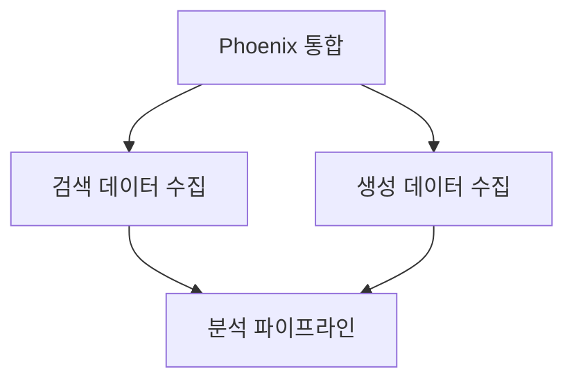

# AI Agent Memory System

> **Version**: 1.0.0
> **Last Updated**: 2026-01-01
> **Purpose**: AI 에이전트의 작업 기억 영속화 및 병렬 협업 지원

---

## Overview

이 메모리 시스템은 AI 에이전트들이 **장기 기억**을 유지하고, **병렬 작업** 시 컨텍스트를 공유하며, **Coordinator Agent**가 전체 작업을 통합할 수 있도록 설계되었습니다.

### 핵심 원칙

1. **영속성 (Persistence)**: 세션이 종료되어도 작업 기록 유지
2. **격리 (Isolation)**: 에이전트별 독립적인 메모리 공간
3. **공유 (Sharing)**: 필요한 컨텍스트는 shared/ 통해 공유
4. **추적 (Traceability)**: 모든 결정과 변경에 대한 이력 관리

---

## Directory Structure

```
agent/memory/
├── README.md                    # 이 문서
├── templates/                   # 문서 템플릿
│   ├── work_log_template.md     # 작업 로그 템플릿
│   └── session_summary.md       # 세션 요약 템플릿
├── agents/                      # 에이전트별 메모리 공간
│   ├── architecture/            # 아키텍처 에이전트
│   ├── performance/             # 성능 최적화 에이전트
│   ├── observability/           # Observability (Phoenix) 에이전트
│   ├── testing/                 # 테스트 에이전트
│   ├── documentation/           # 문서화 에이전트
│   └── rag-data/                # RAG 데이터 수집 에이전트
└── shared/                      # 공유 컨텍스트
    ├── decisions.md             # 중요 결정 기록
    └── dependencies.md          # 작업 간 의존성
```

---

## Agent Types

### 1. Worker Agents (병렬 실행)

| Agent | 담당 영역 | 독립성 |
|-------|----------|--------|
| `architecture` | 코드 구조, 의존성 역전, 포트/어댑터 | 높음 |
| `performance` | 캐싱, 배치 처리, 비동기 최적화 | 높음 |
| `observability` | Phoenix, OpenTelemetry, 메트릭 수집 | 중간 |
| `testing` | 테스트 커버리지, Mock, 성능 테스트 | 중간 |
| `documentation` | 문서화, 튜토리얼, API 문서 | 높음 |
| `rag-data` | RAG 데이터 수집, 검색/생성 추적 | 중간 |

### 2. Coordinator Agent (통합 관리)

- 전체 진행 상황 모니터링
- 작업 간 의존성 해결
- 병합 충돌 조정
- 최종 품질 검증

---

## Memory File Types

### 1. Work Log (`YYYY-MM-DD_task-name.md`)

각 작업 세션마다 생성되는 상세 로그:

```markdown
# [Task Name] Work Log

## Session Info
- **Agent**: architecture
- **Date**: 2026-01-01
- **Duration**: 2h 30m
- **Status**: completed | in_progress | blocked

## Objective
작업의 목적과 목표 기술

## Approach
선택한 방법론과 이유

## Progress
### Step 1: [단계명]
- 수행 내용
- 결과
- 발생 이슈

## Artifacts
생성/수정된 파일 목록

## Decisions
중요 결정 사항 (shared/decisions.md에도 기록)

## Next Steps
다음 작업 항목

## Dependencies
다른 에이전트 작업과의 의존성
```

### 2. Session Summary (`session_YYYYMMDD.md`)

하루 작업의 요약:

```markdown
# Session Summary - 2026-01-01

## Completed Tasks
- [x] Task 1
- [x] Task 2

## In Progress
- [ ] Task 3 (70%)

## Blocked
- [ ] Task 4 (대기: architecture 에이전트)

## Key Decisions
주요 결정 사항 요약

## Handoff Notes
다음 세션을 위한 인수인계 사항
```

### 3. Shared Documents

#### `decisions.md`
```markdown
# Architecture Decisions

## [날짜] [결정 제목]
- **Context**: 배경
- **Decision**: 결정 내용
- **Rationale**: 이유
- **Consequences**: 영향
- **Stakeholders**: 관련 에이전트
```

#### `dependencies.md`
```markdown
# Task Dependencies

## Dependency Graph


## Blocking Issues
현재 블로킹 이슈 목록
```

---

## Usage Guide

### For Worker Agents

#### 1. 작업 시작 시
```bash
# 1. 이전 세션 컨텍스트 로드
cat agent/memory/agents/{agent-name}/session_*.md | tail -1

# 2. 의존성 확인
cat agent/memory/shared/dependencies.md

# 3. 새 작업 로그 생성
cp agent/memory/templates/work_log_template.md \
   agent/memory/agents/{agent-name}/$(date +%Y-%m-%d)_task-name.md
```

#### 2. 작업 중
- 주요 진행 상황을 work log에 기록
- 중요 결정은 `shared/decisions.md`에도 추가
- 다른 에이전트에 영향 주는 변경은 `shared/dependencies.md` 업데이트

#### 3. 작업 종료 시
- work log의 Status 업데이트
- Next Steps 작성
- 필요시 session summary 생성

### For Coordinator Agent

#### 1. 상태 파악
```bash
# 전체 에이전트 상태 확인
for agent in architecture performance observability testing documentation rag-data; do
    echo "=== $agent ==="
    ls -la agent/memory/agents/$agent/*.md 2>/dev/null | tail -3
done
```

#### 2. 의존성 해결
- `shared/dependencies.md`의 블로킹 이슈 확인
- 필요시 작업 순서 조정
- 병합 충돌 조정

#### 3. 통합 보고
- 각 에이전트의 session summary 수집
- 전체 진행률 계산
- 다음 우선순위 결정

---

## Best Practices

### 1. 컨텍스트 최소화
- 필요한 정보만 기록 (토큰 절약)
- 코드는 경로만 기록, 전체 복사 X
- 결정의 이유만 간략히

### 2. 구조화된 기록
- 템플릿 활용
- 일관된 형식 유지
- 검색 가능한 키워드 사용

### 3. 적시 업데이트
- 작업 완료 즉시 기록
- 블로킹 이슈는 바로 공유
- 세션 종료 전 반드시 저장

### 4. 크로스 레퍼런스
- 관련 파일 경로 명시
- 결정 ID로 참조 (`DEC-2026-001`)
- 의존성 그래프 업데이트

---

## Integration with EvalVault

### 메모리 → 코드베이스 동기화

```python
# 에이전트가 수정한 파일 추적
artifacts = [
    "src/evalvault/adapters/outbound/tracker/phoenix_adapter.py",
    "src/evalvault/domain/entities/retrieval.py",
]

# work log에 자동 기록
work_log.add_artifacts(artifacts)
```

### 코드베이스 → 메모리 동기화

```python
# git diff로 변경사항 추적
changes = git.diff("HEAD~1")

# 자동으로 work log 업데이트
work_log.update_from_diff(changes)
```

---

## Retention Policy

| 문서 유형 | 보존 기간 | 압축 |
|----------|----------|------|
| Work Logs | 30일 | 7일 후 요약본으로 |
| Session Summaries | 90일 | 30일 후 월간 요약 |
| Decisions | 영구 | N/A |
| Dependencies | 현재 상태만 | N/A |

---

## Troubleshooting

### Q: 이전 컨텍스트가 너무 길어요
→ 최신 session summary만 로드하고, 필요시 상세 로그 참조

### Q: 여러 에이전트가 같은 파일 수정해요
→ `shared/dependencies.md`에 충돌 영역 명시, Coordinator가 순서 조정

### Q: 결정을 번복해야 해요
→ `shared/decisions.md`에 새 결정 추가 + 이전 결정 deprecated 표시

---

**Last Updated**: 2026-01-01
**Maintainer**: Coordinator Agent
