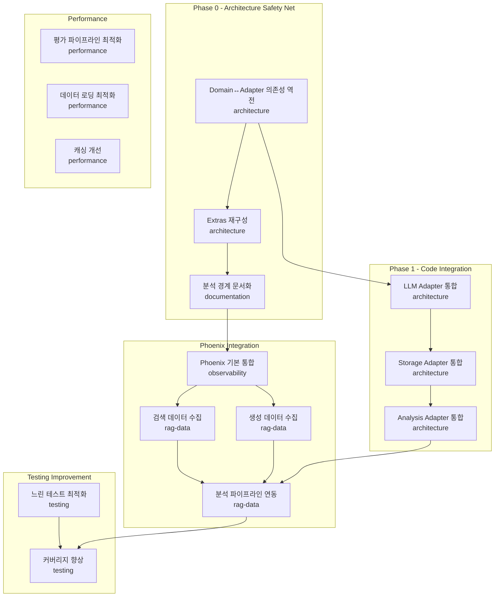

# Task Dependencies & Coordination

> 이 문서는 에이전트 간 작업 의존성과 조율 정보를 관리합니다.
> Coordinator Agent가 주로 업데이트하며, Worker Agent도 블로킹 이슈 발생 시 업데이트합니다.

## 🔗 관련 문서

| 문서 | 용도 |
|------|------|
| [docs/INDEX.md](../../../docs/INDEX.md) | 프로젝트 문서 허브(최신 링크) |
| [Handbook](../../../docs/handbook/INDEX.md) | 설계/운영/품질 기준(SSoT) |
| [agent/README.md](../../README.md) | 에이전트 시스템 사용법 |

---

## Dependency Graph



---

## Current Status

### Active Tasks

| Agent | Task | Progress | Blocking | ETA |
|-------|------|----------|----------|-----|
| `architecture` | 의존성 역전 고정 | 100% | - | Done |
| `architecture` | Extras 재구성 | 100% | - | Done |
| `architecture` | 분석 경계 문서화 | 100% | - | Done |
| `architecture` | P1.1 LLM Adapter 통합 | 100% | - | Done |
| `architecture` | P1.2 Storage Adapter 통합 | 100% | - | Done |
| `architecture` | P1.3 Analysis Adapter 통합 | 100% | - | Done |
| `observability` | Phoenix 기본 통합 | 100% | - | Done |
| `rag-data` | 검색 데이터 수집 | 0% | - | Week 4 |
| `performance` | 평가 파이프라인 최적화 | 0% | - | Week 6 |
| `testing` | 느린 테스트 최적화 | 0% | - | Week 8 |

### Blocking Issues

| ID | Description | Blocking Agent | Blocked Agent | Status |
|----|-------------|----------------|---------------|--------|
| BLK-001 | Phoenix 설치 필요 | `observability` | `rag-data` | `closed` |
| - | - | - | - | - |

---

## Parallel Execution Groups

### Group A: 독립 실행 가능 (병렬)
동시에 실행 가능한 작업들:

```
┌─────────────────┐  ┌─────────────────┐  ┌─────────────────┐
│   performance   │  │     testing     │  │  documentation  │
│                 │  │                 │  │                 │
│ - 캐싱 개선     │  │ - Mock 개선     │  │ - 튜토리얼      │
│ - 배치 처리     │  │ - 테스트 분리   │  │ - API 문서      │
└─────────────────┘  └─────────────────┘  └─────────────────┘
```

### Group B: 순차 실행 필요
의존성이 있는 작업들:

```
observability (Phoenix 통합)
        ↓
   rag-data (데이터 수집)
        ↓
architecture (분석 파이프라인)
```

### Group C: 부분 병렬
일부만 병렬 가능:

```
architecture (LLM Adapter) ──┬──→ architecture (Analysis Adapter)
                             │
architecture (Storage Adapter)┘
```

---

## Shared Resources

### 파일 소유권 규칙

| 에이전트 | 수정 가능 영역 | 수정 금지 영역 |
|----------|----------------|----------------|
| `architecture` | `domain/`, `adapters/outbound/llm/`, `adapters/outbound/storage/` | `adapters/inbound/web/` |
| `observability` | `adapters/outbound/tracker/` | `domain/services/` |
| `performance` | `adapters/outbound/cache/` | `domain/entities/` |
| `testing` | `tests/` | `src/evalvault/` (직접 수정 금지) |
| `documentation` | `docs/` | `src/` |
| `rag-data` | `domain/entities/` (신규 파일만) | 기존 코드 수정 금지 |

### Critical Files (동시 수정 금지)

| File | Primary Owner | Secondary | 변경 시 필수 조치 |
|------|---------------|-----------|-------------------|
| `pyproject.toml` | `architecture` | - | Coordinator 승인 필요 |
| `src/evalvault/__init__.py` | `architecture` | - | Coordinator 승인 필요 |
| `src/evalvault/config/settings.py` | `architecture` | - | 모든 에이전트 영향 |
| `src/evalvault/ports/outbound/tracker_port.py` | `observability` | `rag-data` | 스키마 변경 공유 |
| `src/evalvault/domain/entities/result.py` | `architecture` | - | 테스트 영향 체크 |
| `docs/INDEX.md` | `coordinator` | All | 문서 구조/링크 변경 시 동기화 |
| `docs/handbook/INDEX.md` | `coordinator` | All | 설계/운영 기준 변경 시 동기화 |
| `agent/memory/shared/decisions.md` | All | - | ADR 형식 준수 |

### Shared Namespaces

| Namespace | Owners | Coordination |
|-----------|--------|--------------|
| `src/evalvault/adapters/outbound/tracker/` | `observability`, `rag-data` | PR 리뷰 필수 |
| `src/evalvault/domain/entities/` | `architecture`, `rag-data` | 스키마 변경 시 공유 |
| `tests/unit/` | All | 파일명 충돌 주의 |
| `agent/prompts/` | All | 프롬프트 변경 시 테스트 필요 |

---

## Coordination Protocol

### 1. 새 작업 시작 시

```markdown
1. 이 문서의 Blocking Issues 확인
2. 의존하는 작업이 완료되었는지 확인
3. Active Tasks에 자신의 작업 추가
4. Shared Resources 충돌 여부 확인
```

### 2. 작업 완료 시

```markdown
1. Active Tasks 상태 업데이트 (100%, Done)
2. Blocking Issues에서 관련 이슈 close
3. Blocked Agent에게 알림 (Handoff Notes)
```

### 3. 블로킹 발생 시

```markdown
1. Blocking Issues에 이슈 추가
2. 작업 로그에 블로킹 상태 기록
3. 다른 작업으로 전환 (가능한 경우)
```

---

## Merge Conflict Resolution

### Priority Order
1. `architecture` > `observability` > `rag-data` > `performance` > `testing` > `documentation`

### Resolution Process
1. Coordinator가 충돌 감지
2. 우선순위 높은 에이전트의 변경 우선 적용
3. 낮은 에이전트는 rebase 후 재작업
4. 양쪽 변경 모두 필요하면 Coordinator가 수동 병합

---

## Communication Channels

### Async (비동기)
- `shared/decisions.md`: 중요 결정
- `shared/dependencies.md`: 의존성/블로킹
- 각 에이전트 `session_*.md`: 인수인계

### Sync (동기) - Coordinator 호출 시
- 긴급 블로킹 이슈
- 설계 결정 필요
- 병합 충돌

---

## Metrics

### Current Sprint Velocity

| Agent | Completed | In Progress | Blocked |
|-------|-----------|-------------|---------|
| `architecture` | 8 | 0 | 0 |
| `observability` | 1 | 0 | 0 |
| `rag-data` | 0 | 0 | 0 |
| `performance` | 0 | 0 | 0 |
| `testing` | 0 | 0 | 0 |
| `documentation` | 0 | 0 | 0 |

### Bottleneck Analysis

```
Current Bottleneck: None
Impact: N/A
Recommendation: rag-data 검색 데이터 수집 시작 가능
```

---

**Last Updated**: 2026-01-01
**Last Modified By**: observability (Phoenix 기본 통합 완료)
**Maintainer**: Coordinator Agent
