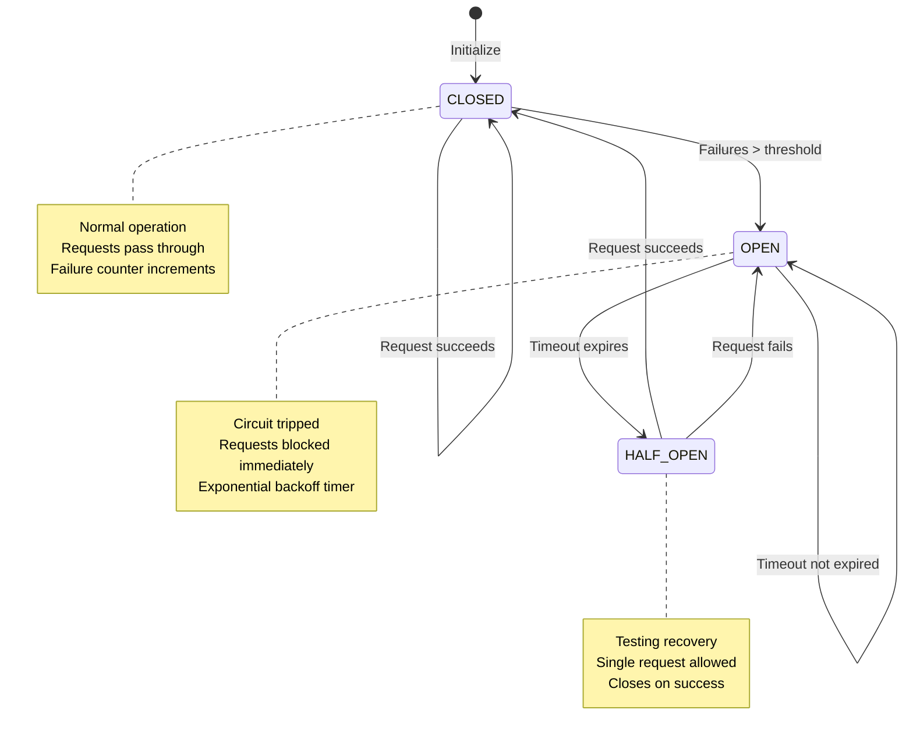

# CLAUDE.md

This file provides guidance to Claude Code (claude.ai/code) when working with code in this repository.

## Project Overview

This is a dual-language MCP (Model Context Protocol) server for Excalidraw that enables AI agents to create and manipulate diagrams in real-time on a live canvas. The system uses a hybrid architecture:

1. **Python FastMCP Server** (`excalidraw_mcp/server.py`) - Handles MCP protocol communication and tool registration
1. **TypeScript Canvas Server** (`src/server.ts`) - Manages canvas state, WebSocket connections, and HTTP API
1. **React Frontend** (`frontend/src/App.tsx`) - Provides the live Excalidraw canvas interface

The Python server automatically manages the TypeScript server lifecycle, including health monitoring, auto-start, and graceful shutdown.

## Architecture

```
┌─────────────────┐    ┌──────────────────┐    ┌─────────────────┐
│   AI Agent      │───▶│   MCP Server     │───▶│  Canvas Server  │
│   (Claude)      │    │    (Python)      │    │ (Express.js)    │
└─────────────────┘    └──────────────────┘    └─────────────────┘
                                                         │
                                                         ▼
                                               ┌─────────────────┐
                                               │  Frontend       │
                                               │  (React + WS)   │
                                               └─────────────────┘
```

**Data Flow Architecture:**

- **MCP Tools** (Python) → **HTTP API** (TypeScript) → **WebSocket** → **Canvas** (React)
- Canvas server maintains in-memory element storage with versioning and timestamp tracking
- Real-time synchronization via WebSocket broadcasts to all connected clients
- Python server monitors canvas server health and automatically restarts if needed
- **Type Safety**: Comprehensive TypeScript definitions in `src/types.ts` ensure type consistency across the entire stack

## Development Commands

### Setup

```bash
# Install Python dependencies
uv sync

# Install Node.js dependencies
npm install

# Build TypeScript canvas server
npm run build

# Start canvas server
npm run canvas

# MCP server runs automatically via uvx when Claude Code connects
```

### Build and Development Commands

```bash
# Build project (frontend + canvas server)
npm run build

# Build individual components
npm run build:frontend  # Vite build for React frontend
npm run build:server    # TypeScript compilation for Express server

# Development modes
npm run dev             # TypeScript watch + Vite dev server (concurrent)
npm run canvas          # Start production canvas server on port 3031
npm run production      # Full build + start canvas server

# Quality assurance
npm run type-check      # TypeScript type checking without compilation
```

### Process Management Commands

```bash
# Python MCP server (auto-manages canvas server)
uv run python excalidraw_mcp/server.py

# Manual canvas server control
npm run canvas          # Start canvas server independently
```

## Environment Configuration

Key environment variables:

### Server Configuration

- `EXPRESS_SERVER_URL`: Canvas server URL (default: `http://localhost:3031`)
- `ENABLE_CANVAS_SYNC`: Enable/disable canvas synchronization (default: `true`)
- `CANVAS_AUTO_START`: Enable/disable automatic canvas server startup (default: `true`)
- `PORT`: Canvas server port (default: `3031`)
- `HOST`: Canvas server host (default: `localhost`)

### Monitoring Configuration

- `MONITORING_ENABLED`: Enable/disable monitoring system (default: `true`)
- `HEALTH_CHECK_INTERVAL`: Health check interval in seconds (default: `10`)
- `CPU_THRESHOLD`: CPU usage alert threshold percentage (default: `80`)
- `MEMORY_THRESHOLD`: Memory usage alert threshold percentage (default: `85`)
- `CIRCUIT_BREAKER_ENABLED`: Enable circuit breaker protection (default: `true`)
- `METRICS_ENABLED`: Enable Prometheus-compatible metrics collection (default: `true`)
- `ALERTING_ENABLED`: Enable alert notifications (default: `true`)

## MCP Tools Available

The system provides these MCP tools for diagram creation:

### Element Management

- `create_element`: Create rectangles, ellipses, diamonds, arrows, text, lines
- `update_element`: Modify existing elements
- `delete_element`: Remove elements
- `query_elements`: Search elements with filters

### Batch Operations

- `batch_create_elements`: Create multiple elements in one call

### Element Organization

- `group_elements` / `ungroup_elements`: Group/ungroup elements
- `align_elements`: Align elements (left, center, right, top, middle, bottom)
- `distribute_elements`: Distribute elements evenly
- `lock_elements` / `unlock_elements`: Lock/unlock elements

### Resource Access

- `get_resource`: Access scene, library, theme, or elements data

## Critical Architecture Components

### Python MCP Server (`excalidraw_mcp/server.py`)

- **FastMCP Integration**: Uses `fastmcp` library for MCP protocol handling
- **Process Management**: Automatically starts/stops/monitors canvas server via subprocess
- **Health Monitoring**: Continuous monitoring with MonitoringSupervisor and automatic recovery
- **HTTP Client**: Uses `httpx.AsyncClient` with connection pooling and request tracing
- **Element Validation**: Pydantic models for request/response validation
- **Production Monitoring**: Full observability stack with metrics, alerts, and circuit breakers

### TypeScript Canvas Server (`src/server.ts`)

- **Express.js API**: REST endpoints for CRUD operations on elements
- **WebSocket Server**: Real-time broadcasting using `ws` library
- **In-Memory Storage**: `Map<string, ServerElement>` for element persistence
- **Element Versioning**: Automatic version increment and timestamp tracking
- **CORS Enabled**: Cross-origin requests supported for development

### React Frontend (`frontend/src/App.tsx`)

- **Excalidraw Integration**: Official `@excalidraw/excalidraw` package
- **WebSocket Client**: Auto-reconnecting WebSocket for real-time updates
- **Element Conversion**: Server elements converted to Excalidraw format
- **Dual Loading**: Initial HTTP fetch + ongoing WebSocket updates

### Type System (`src/types.ts`)

- **Element Interfaces**: Complete Excalidraw element type definitions
- **WebSocket Messages**: Typed message interfaces for real-time communication
- **Server Extensions**: Additional fields for versioning and metadata
- **Zod Validation**: Runtime type validation for API requests

## Development Workflow

### Standard Development Cycle

1. **Initial Setup**: `uv sync && npm install && npm run build`
1. **Development**: `npm run dev` (starts TypeScript watch + Vite dev server)
1. **MCP Testing**: Python server runs automatically via Claude Code's `.mcp.json` configuration
1. **Canvas Access**: Navigate to `http://localhost:3031` to see live diagram updates

### Process Lifecycle Management


**Lifecycle Features:**

- **Auto-start**: Python MCP server automatically launches canvas server on first tool use
- **Continuous Monitoring**: MonitoringSupervisor provides background health monitoring with configurable intervals
- **Multi-Point Health Checks**: Validates `/health` and `/api/elements` endpoints plus resource usage
- **Automatic Recovery**: Failed canvas server is automatically restarted after consecutive failure threshold
- **Circuit Breaker Protection**: Prevents cascading failures during prolonged outages
- **Graceful Shutdown**: Canvas server is terminated when Python MCP server exits
- **Process Isolation**: Canvas server runs in separate process group for clean termination
- **Event Hooks**: Process lifecycle events trigger monitoring callbacks for observability

### Element Synchronization Flow


**Flow Steps:**

1. **MCP Tool Call** → Python server validates and processes request
1. **HTTP API Call** → Python server sends element data to TypeScript server
1. **Element Storage** → TypeScript server stores element with version/timestamp metadata
1. **WebSocket Broadcast** → All connected clients receive real-time updates
1. **Canvas Update** → React frontend converts and renders elements in Excalidraw

## Important Implementation Details

- **No Persistence**: Elements exist only in canvas server memory (restart = data loss)
- **Element Versioning**: Each element update increments version number and updates timestamp
- **Type Conversion**: Text elements automatically converted to Excalidraw's label format
- **CORS Support**: Development-friendly CORS configuration for cross-origin requests
- **Error Handling**: Failed MCP operations include detailed error messages and suggestions
- **Concurrent Safety**: In-memory storage uses JavaScript Map for thread-safe operations
- **Request Tracing**: All HTTP requests include correlation IDs for debugging and monitoring
- **Circuit Protection**: Automatic circuit breaker prevents cascading failures during outages
- **Automatic Recovery**: Failed canvas server automatically restarts after consecutive failures
- **Resource Monitoring**: CPU and memory usage tracked with configurable alert thresholds

## Testing Infrastructure

### Test Execution Commands

```bash
# Python tests with pytest
pytest                              # Run all Python tests
pytest --cov=excalidraw_mcp         # With coverage report
pytest --cov-report=html            # HTML coverage report
pytest tests/unit/                  # Unit tests only
pytest tests/integration/           # Integration tests only
pytest -m "not slow"               # Skip slow performance tests
pytest -m security                 # Security tests only
pytest -m performance              # Performance benchmarks

# Monitoring-specific tests
pytest tests/unit/test_monitoring_supervisor.py     # Monitoring supervisor tests (16 cases)
pytest tests/unit/test_health_checker.py           # Health checker tests (15 cases)
pytest tests/unit/test_circuit_breaker.py          # Circuit breaker tests (17 cases)
pytest tests/integration/test_monitoring_integration.py # Full monitoring integration (15 cases)

# TypeScript tests with Jest
npm test                           # Run all TypeScript tests
npm run test:coverage              # With coverage report
npm run test:unit                  # Unit tests only
npm run test:integration           # Integration tests only

# Type checking
npm run type-check                 # TypeScript type validation
```

### Test Categories and Structure

- **Unit Tests** (`tests/unit/`, `test/unit/`) - Component isolation testing
- **Integration Tests** (`tests/integration/`) - MCP tools and HTTP client integration
- **Security Tests** (`tests/security/`) - Input validation, XSS prevention, injection attacks
- **Performance Tests** (`tests/performance/`) - Load testing, memory profiling, benchmarks
- **End-to-End Tests** - Full system integration with real canvas server

### Test Infrastructure Features

- **85% Python coverage requirement** (enforced by pyproject.toml) with comprehensive fixtures and mocking
- **70% TypeScript coverage requirement** (enforced by jest.config.cjs) with jsdom environment for DOM testing
- **Performance monitoring** with memory usage tracking and execution time assertions
- **Security testing** including prototype pollution, overflow, and injection prevention
- **Mock infrastructure** for HTTP clients, WebSocket connections, and canvas server simulation

## Configuration Architecture

### Centralized Configuration System (`excalidraw_mcp/config.py`)

- **Environment-based configuration** with validation and type conversion
- **Security settings**: JWT authentication, CORS policies, rate limiting
- **Server settings**: Health check timeouts, auto-start behavior, graceful shutdown
- **Performance settings**: Connection pooling, caching, WebSocket batching
- **Logging configuration**: Audit trails, sensitive field filtering, file rotation

### Modular Python Architecture

- **Element Factory** (`excalidraw_mcp/element_factory.py`) - Standardized element creation with validation
- **HTTP Client** (`excalidraw_mcp/http_client.py`) - Connection pooling, async HTTP management, and request tracing
- **Process Manager** (`excalidraw_mcp/process_manager.py`) - Canvas server lifecycle management with event hooks
- **MCP Tools** (`excalidraw_mcp/mcp_tools.py`) - Tool implementations with error handling
- **Monitoring System** (`excalidraw_mcp/monitoring/`) - Production-ready monitoring infrastructure

## Production Monitoring System

The system includes a comprehensive monitoring infrastructure with automatic recovery, metrics collection, and alerting.

### Monitoring Architecture


**Monitoring Components:**

### Core Components

#### MonitoringSupervisor (`excalidraw_mcp/monitoring/supervisor.py`)

- **Continuous Health Monitoring**: Background monitoring loop with configurable intervals
- **Automatic Recovery**: Restarts canvas server after consecutive failures
- **Process Lifecycle Integration**: Hooks into process start/stop/restart events
- **Circuit Breaker Integration**: Prevents cascading failures during outages

#### HealthChecker (`excalidraw_mcp/monitoring/health_checker.py`)


**HealthChecker Features:**

- **Multi-Endpoint Validation**: Checks `/health` and `/api/elements` endpoints
- **Resource Monitoring**: CPU, memory, and thread usage tracking via psutil
- **Health Status Levels**: HEALTHY, DEGRADED, UNHEALTHY, RECOVERING states
- **Failure Count Tracking**: Progressive failure detection with reset capability

#### Circuit Breaker (`excalidraw_mcp/monitoring/circuit_breaker.py`)



**Circuit Breaker Features:**

- **Three States**: CLOSED (normal), OPEN (failing), HALF_OPEN (recovery testing)
- **Exponential Backoff**: Progressive timeout increases during failures
- **Automatic Recovery**: Attempts to restore service after timeout periods
- **Request Protection**: Prevents system overload during outages

#### Metrics Collection (`excalidraw_mcp/monitoring/metrics.py`)

- **Prometheus Compatibility**: Standard Counter, Gauge, and Histogram metrics
- **15+ Built-in Metrics**: Request rates, response times, error rates, resource usage
- **Real-time Tracking**: Automatic metric updates for all HTTP operations
- **Export Ready**: Formatted for Prometheus scraping or logging

#### Alert Management (`excalidraw_mcp/monitoring/alerts.py`)

- **6 Built-in Alert Rules**: Health failures, high resource usage, circuit breaker trips
- **Multiple Channels**: Log, webhook, email notification support
- **Deduplication**: Prevents alert spam with configurable windows
- **Throttling**: Rate limiting to prevent notification overload

### Monitoring Development Commands

```bash
# View monitoring system status
python -c "from excalidraw_mcp.monitoring.supervisor import MonitoringSupervisor; import asyncio; asyncio.run(MonitoringSupervisor().get_status())"

# Test circuit breaker functionality
python -c "from excalidraw_mcp.monitoring.circuit_breaker import CircuitBreaker; cb = CircuitBreaker('test', 3, 30); print(cb.call(lambda: 1/0))"

# Check health status manually
python -c "from excalidraw_mcp.monitoring.health_checker import HealthChecker; import asyncio; hc = HealthChecker(); asyncio.run(hc.check_health())"

# View current metrics
python -c "from excalidraw_mcp.monitoring.metrics import MetricsCollector; mc = MetricsCollector(); print(mc.get_all_metrics())"
```

## Testing and Debugging

### Development Testing

- Canvas server health check: `GET /health`
- API endpoints: `GET /api/elements`, `POST /api/elements`, etc.
- WebSocket connection: `ws://localhost:3031`
- Debug mode: Set `DEBUG=true` environment variable
- Canvas access: `http://localhost:3031` (after running canvas server)

### Test Data and Fixtures

- **Element factory fixtures** for consistent test element creation
- **Mock HTTP clients** with async context manager support
- **Security test data** for XSS, injection, and overflow testing
- **Performance monitoring** with memory and execution time tracking
- **WebSocket mocks** with message queue simulation for real-time testing

<!-- CRACKERJACK INTEGRATION START -->

This project uses crackerjack for Python project management and quality assurance.

For optimal development experience with this crackerjack - enabled project, use these specialized agents:

- **🏗️ crackerjack-architect**: Expert in crackerjack's modular architecture and Python project management patterns. **Use PROACTIVELY** for all feature development, architectural decisions, and ensuring code follows crackerjack standards from the start.

- **🐍 python-pro**: Modern Python development with type hints, async/await patterns, and clean architecture

- **🧪 pytest-hypothesis-specialist**: Advanced testing patterns, property-based testing, and test optimization

- **🧪 crackerjack-test-specialist**: Advanced testing specialist for complex testing scenarios and coverage optimization

- **🏗️ backend-architect**: System design, API architecture, and service integration patterns

- **🔒 security-auditor**: Security analysis, vulnerability detection, and secure coding practices

```bash

Task tool with subagent_type ="crackerjack-architect" for feature planning


Task tool with subagent_type ="python-pro" for code implementation


Task tool with subagent_type ="pytest-hypothesis-specialist" for test development


Task tool with subagent_type ="security-auditor" for security analysis
```

**💡 Pro Tip**: The crackerjack-architect agent automatically ensures code follows crackerjack patterns from the start, eliminating the need for retrofitting and quality fixes.

This project follows crackerjack's clean code philosophy:

- **EVERY LINE OF CODE IS A LIABILITY**: The best code is no code

- **DRY (Don't Repeat Yourself)**: If you write it twice, you're doing it wrong

- **YAGNI (You Ain't Gonna Need It)**: Build only what's needed NOW

- **KISS (Keep It Simple, Stupid)**: Complexity is the enemy of maintainability

- \*\*Cognitive complexity ≤15 \*\*per function (automatically enforced)

- **Coverage ratchet system**: Never decrease coverage, always improve toward 100%

- **Type annotations required**: All functions must have return type hints

- **Security patterns**: No hardcoded paths, proper temp file handling

- **Python 3.13+ modern patterns**: Use `|` unions, pathlib over os.path

```bash

python -m crackerjack


python -m crackerjack - t


python -m crackerjack - - ai - agent - t


python -m crackerjack - a patch
```

1. **Plan with crackerjack-architect**: Ensure proper architecture from the start
1. **Implement with python-pro**: Follow modern Python patterns
1. **Test comprehensively**: Use pytest-hypothesis-specialist for robust testing
1. **Run quality checks**: `python -m crackerjack -t` before committing
1. **Security review**: Use security-auditor for final validation

- **Use crackerjack-architect agent proactively** for all significant code changes
- **Never reduce test coverage** - the ratchet system only allows improvements
- **Follow crackerjack patterns** - the tools will enforce quality automatically
- **Leverage AI agent auto-fixing** - `python -m crackerjack --ai-agent -t` for autonomous quality fixes

______________________________________________________________________

- This project is enhanced by crackerjack's intelligent Python project management.\*

<!-- CRACKERJACK INTEGRATION END -->
