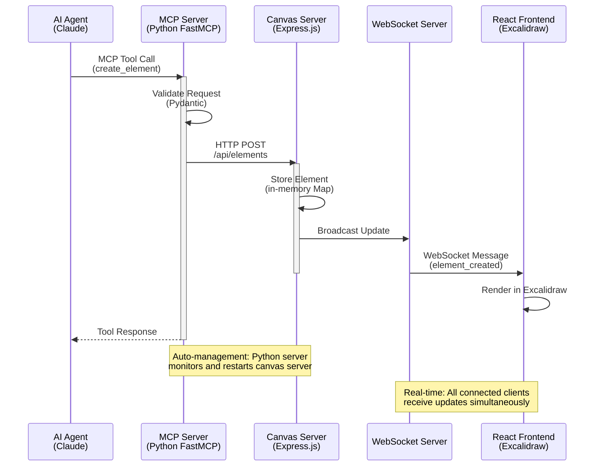
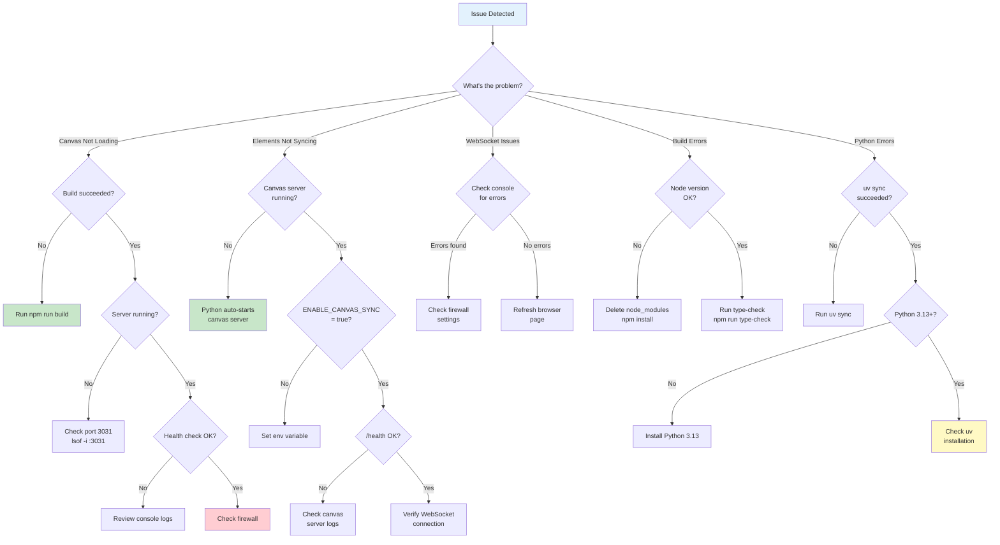

# Excalidraw MCP Server: AI-Powered Live Visual Diagramming

[](https://github.com/lesleslie/crackerjack)
[](https://www.python.org/downloads/)


> **🙏 Acknowledgments**
> This project is based on and extends the excellent work from [yctimlin/mcp_excalidraw](https://github.com/yctimlin/mcp_excalidraw).
> Special thanks to the original contributors for creating the foundation that made this enhanced version possible.

A **dual-language MCP (Model Context Protocol) server** that combines **Excalidraw's powerful drawing capabilities** with AI integration, enabling AI agents like Claude to create and manipulate diagrams in real-time on a live canvas.

**Features Python FastMCP server with TypeScript canvas server for optimal performance and maintainability.**

## 🚀 What This System Does

- **🎨 Live Canvas**: Real-time Excalidraw canvas accessible via web browser
- **🤖 AI Integration**: MCP server allows AI agents (like Claude) to create visual diagrams
- **⚡ Real-time Sync**: Elements created via MCP API appear instantly on the canvas
- **🔄 WebSocket Updates**: Live synchronization across multiple connected clients
- **🏗️ Production Ready**: Clean, minimal UI suitable for end users

## 🎥 Demo Video

> **See MCP Excalidraw in Action!**

[](https://youtu.be/RRN7AF7QIew)

*Watch how AI agents create and manipulate diagrams in real-time on the live canvas*

## 🏛️ Architecture Overview



**Hybrid Architecture Benefits:**

- **Python FastMCP**: Handles MCP protocol, tool registration, and auto-manages canvas server
- **TypeScript Canvas**: Express.js API + WebSocket for real-time canvas synchronization
- **Auto-Management**: Python server monitors and restarts canvas server as needed
- **Type Safety**: Comprehensive TypeScript definitions ensure consistency across the stack

## 🌟 Key Features

### **Modern TypeScript Architecture**

- **Full TypeScript Migration**: Complete type safety for backend and frontend
- **Comprehensive Type Definitions**: Excalidraw elements, API responses, WebSocket messages
- **Strict Type Checking**: Enhanced development experience and compile-time error detection
- **Type-Safe React Components**: TSX components with proper props typing

### **Real-time Canvas Integration**

- Elements created via MCP appear instantly on the live canvas
- WebSocket-based real-time synchronization
- Multi-client support with live updates

### **Production-Ready Interface**

- Clean, minimal UI with connection status
- Simple "Clear Canvas" functionality
- No development clutter or debug information

### **Comprehensive MCP API**

- **Element Creation**: rectangles, ellipses, diamonds, arrows, text, lines
- **Element Management**: update, delete, query with filters
- **Batch Operations**: create multiple elements in one call
- **Advanced Features**: grouping, alignment, distribution, locking

### **Robust Architecture**

- TypeScript-based Express.js backend with REST API + WebSocket
- React frontend with official Excalidraw package and TypeScript
- Dual-path element loading for reliability
- Auto-reconnection and error handling

## 📦 Installation & Setup

### **✅ Quick Start (Recommended)**

#### **1. Clone and Setup**

```bash
git clone https://github.com/lesleslie/excalidraw-mcp.git
cd excalidraw-mcp

# Install Python dependencies
uv sync

# Install Node.js dependencies and build
npm install
npm run build
```

#### **2. Start the System**

```bash
# The Python MCP server auto-starts the canvas server
uv run python excalidraw_mcp/server.py

# Or manually start canvas server (optional)
npm run canvas
```

#### **3. Access the Canvas**

Open your browser and navigate to:

```
http://localhost:3031
```

### **📋 Development Setup**

```bash
# Development mode (TypeScript watch + Vite dev server)
npm run dev

# Or production mode
npm run production
```

**Development Workflow:**

1. **Setup** → `uv sync && npm install && npm run build`
1. **Development** → `npm run dev` (TypeScript watch + Vite dev server)
1. **Testing** → `pytest` (Python) + `npm test` (TypeScript)
1. **Quality Checks** → `uv run ruff check` + `npm run type-check`
1. **Iterate** → Make changes, tests auto-reload
1. **Commit** → All quality checks pass

**Development Modes:**

| Mode | Command | Use Case |
|------|---------|----------|
| **Dev** | `npm run dev` | Active development with hot-reload |
| **Build** | `npm run build` | Compile TypeScript + React |
| **Canvas** | `npm run canvas` | Start canvas server only |
| **Production** | `npm run production` | Full build + start |

## 🔧 Available Scripts

| Script | Description |
|--------|-------------|
| `npm start` | Build and start MCP server (`dist/index.js`) |
| `npm run canvas` | Build and start canvas server (`dist/server.js`) |
| `npm run canvas-bg` | Build and start canvas server in background |
| `npm run start-canvas` | Build and start canvas server |
| `npm run canvas-for-npx` | Special script for npx usage |
| `npm run start-all` | Start both servers together |
| `npm run build` | Build both frontend and TypeScript backend |
| `npm run build:frontend` | Build React frontend only |
| `npm run build:server` | Compile TypeScript backend to JavaScript |
| `npm run build:types` | Generate TypeScript declaration files only |
| `npm run dev` | Start TypeScript watch mode + Vite dev server |
| `npm run dev:server` | Start TypeScript in watch mode only |
| `npm run type-check` | Run TypeScript type checking without compilation |
| `npm run production` | Build + start in production mode |
| `npm test` | Run all tests |
| `npm run test:watch` | Run tests in watch mode |
| `npm run test:coverage` | Run tests with coverage report |
| `npm run test:unit` | Run unit tests only |
| `npm run test:integration` | Run integration tests only |

## 🎯 Usage Guide

### **For End Users**

1. Open the canvas at `http://localhost:3031`
1. Check connection status (should show "Connected")
1. AI agents can now create diagrams that appear in real-time
1. Use "Clear Canvas" to remove all elements

### **For AI Agents (via MCP)**

The MCP server provides these tools for creating visual diagrams:

#### **Basic Element Creation**

```javascript
// Create a rectangle
{
  "type": "rectangle",
  "x": 100,
  "y": 100,
  "width": 200,
  "height": 100,
  "backgroundColor": "#e3f2fd",
  "strokeColor": "#1976d2",
  "strokeWidth": 2
}
```

#### **Create Text Elements**

```javascript
{
  "type": "text",
  "x": 150,
  "y": 125,
  "text": "Process Step",
  "fontSize": 16,
  "strokeColor": "#333333"
}
```

#### **Create Arrows & Lines**

```javascript
{
  "type": "arrow",
  "x": 300,
  "y": 130,
  "width": 100,
  "height": 0,
  "strokeColor": "#666666",
  "strokeWidth": 2
}
```

#### **Batch Creation for Complex Diagrams**

```javascript
{
  "elements": [
    {
      "type": "rectangle",
      "x": 100,
      "y": 100,
      "width": 120,
      "height": 60,
      "backgroundColor": "#fff3e0",
      "strokeColor": "#ff9800"
    },
    {
      "type": "text",
      "x": 130,
      "y": 125,
      "text": "Start",
      "fontSize": 16
    }
  ]
}
```

## 🔌 Integration with Claude Code

### **✅ Recommended: uvx Configuration**

Add this configuration to your Claude Code `.mcp.json`:

```json
{
  "mcpServers": {
    "excalidraw": {
      "command": "uvx",
      "args": ["excalidraw-mcp"],
      "env": {
        "EXPRESS_SERVER_URL": "http://localhost:3031",
        "ENABLE_CANVAS_SYNC": "true"
      }
    }
  }
}
```

### **Alternative: Local Development Configuration**

For local development, use:

```json
{
  "mcpServers": {
    "excalidraw": {
      "command": "uv",
      "args": ["run", "python", "excalidraw_mcp/server.py"],
      "cwd": "/absolute/path/to/excalidraw-mcp"
    }
  }
}
```

**Important**: Replace `/absolute/path/to/excalidraw-mcp` with the actual absolute path to your cloned repository.

## 🔧 Integration with Other Tools

### **Cursor IDE**

Add to your `.cursor/mcp.json`:

```json
{
  "mcpServers": {
    "excalidraw": {
      "command": "uvx",
      "args": ["excalidraw-mcp"],
      "env": {
        "EXPRESS_SERVER_URL": "http://localhost:3031"
      }
    }
  }
}
```

### **VS Code MCP Extension**

For VS Code MCP extension, add to your settings:

```json
{
  "mcp": {
    "servers": {
      "excalidraw": {
        "command": "uvx",
        "args": ["excalidraw-mcp"],
        "env": {
          "EXPRESS_SERVER_URL": "http://localhost:3031"
        }
      }
    }
  }
}
```

## 🛠️ Environment Variables

| Variable | Default | Description |
|----------|---------|-------------|
| `EXPRESS_SERVER_URL` | `http://localhost:3031` | Canvas server URL for MCP sync |
| `ENABLE_CANVAS_SYNC` | `true` | Enable/disable canvas synchronization |
| `CANVAS_AUTO_START` | `true` | Auto-start canvas server with MCP server |
| `SYNC_RETRY_ATTEMPTS` | `3` | Number of retry attempts for failed operations |
| `SYNC_RETRY_DELAY_SECONDS` | `1.0` | Base delay between retry attempts (seconds) |
| `SYNC_RETRY_MAX_DELAY_SECONDS` | `30.0` | Maximum delay between retry attempts (seconds) |
| `SYNC_RETRY_EXPONENTIAL_BASE` | `2.0` | Exponential base for backoff calculation |
| `SYNC_RETRY_JITTER` | `true` | Enable/disable jitter for retry delays |
| `PORT` | `3031` | Canvas server port |
| `HOST` | `localhost` | Canvas server host |
| `DEBUG` | `false` | Enable debug logging |

## 📊 API Endpoints

The canvas server provides these REST endpoints:

| Method | Endpoint | Description |
|--------|----------|-------------|
| `GET` | `/api/elements` | Get all elements |
| `POST` | `/api/elements` | Create new element |
| `PUT` | `/api/elements/:id` | Update element |
| `DELETE` | `/api/elements/:id` | Delete element |
| `POST` | `/api/elements/batch` | Create multiple elements |
| `GET` | `/health` | Server health check |

## 🎨 MCP Tools Available

### **Element Management**

- `create_element` - Create any type of Excalidraw element
- `update_element` - Modify existing elements
- `delete_element` - Remove elements
- `query_elements` - Search elements with filters

### **Batch Operations**

- `batch_create_elements` - Create complex diagrams in one call

### **Element Organization**

- `group_elements` - Group multiple elements
- `ungroup_elements` - Ungroup element groups
- `align_elements` - Align elements (left, center, right, top, middle, bottom)
- `distribute_elements` - Distribute elements evenly
- `lock_elements` / `unlock_elements` - Lock/unlock elements

### **Resource Access**

- `get_resource` - Access scene, library, theme, or elements data

## 🏗️ Development Architecture

### **Frontend** (`frontend/src/`)

- **React + TypeScript**: Modern TSX components with full type safety
- **Vite Build System**: Fast development and optimized production builds
- **Official Excalidraw**: `@excalidraw/excalidraw` package with TypeScript types
- **WebSocket Client**: Type-safe real-time element synchronization
- **Clean UI**: Production-ready interface with proper TypeScript typing

### **Canvas Server** (`src/server.ts` → `dist/server.js`)

- **TypeScript + Express.js**: Fully typed REST API + static file serving
- **WebSocket**: Type-safe real-time client communication
- **Element Storage**: In-memory with comprehensive type definitions
- **CORS**: Cross-origin support with proper typing
- **Middleware**: Custom Express middleware components
- **Storage**: Element storage implementations
- **WebSocket**: Dedicated WebSocket server components
- **Utils**: Utility functions for various operations

### **MCP Server** (`excalidraw_mcp/server.py`)

- **Python FastMCP**: Python-based Model Context Protocol implementation
- **Canvas Sync**: HTTP requests to canvas server for element synchronization
- **Element Management**: Full CRUD operations for Excalidraw elements
- **Batch Support**: Complex diagram creation through batch operations
- **Process Management**: Canvas server lifecycle management
- **HTTP Client**: Async HTTP client with retry mechanisms
- **Configuration**: Centralized configuration management

### **Type System** (`src/types.ts`)

- **Excalidraw Element Types**: Complete type definitions for all element types
- **API Response Types**: Strongly typed REST API interfaces
- **WebSocket Message Types**: Type-safe real-time communication
- **Server Element Types**: Enhanced element types with metadata

## 🐛 Troubleshooting



### **Canvas Not Loading**

- Ensure `npm run build` completed successfully
- Verify canvas server is running on port 3031
- Python MCP server auto-starts canvas server - check console for errors

### **Elements Not Syncing**

- Python server automatically manages canvas server
- Check `ENABLE_CANVAS_SYNC=true` in environment
- Verify canvas server health at `http://localhost:3031/health`

### **WebSocket Connection Issues**

- Check browser console for WebSocket errors
- Ensure no firewall blocking WebSocket connections
- Try refreshing the browser page

### **Build Errors**

- Delete `node_modules` and run `npm install`
- Check Node.js version (requires 16+)
- Run `npm run type-check` to identify TypeScript issues
- Run `uv sync` to update Python dependencies

### **Python Dependencies**

- Use `uv sync` to install/update Python dependencies
- Ensure Python 3.13+ is installed
- Check `uv --version` to verify uv installation

## 📋 Project Structure

```
excalidraw-mcp/
├── examples/                 # Usage examples
├── excalidraw_mcp/           # Python FastMCP server
│   ├── monitoring/           # Monitoring and health check utilities
│   ├── server.py             # Main MCP server (Python)
│   ├── config.py             # Configuration management
│   ├── element_factory.py    # Element creation utilities
│   ├── http_client.py        # HTTP client for canvas server
│   ├── process_manager.py    # Canvas server lifecycle management
│   ├── retry_utils.py        # Retry mechanisms for failed operations
│   ├── cli.py                # Command-line interface
│   ├── mcp_tools.py          # MCP tool implementations
│   ├── __init__.py           # Package initialization
│   └── __main__.py           # Main entry point
├── frontend/                 # React frontend
│   ├── src/
│   │   ├── App.tsx           # Main React component (TypeScript)
│   │   └── main.tsx          # React entry point (TypeScript)
│   └── index.html            # HTML template
├── src/                      # TypeScript canvas server
│   ├── middleware/           # Express middleware components
│   ├── storage/              # Element storage implementations
│   ├── utils/                # Utility functions
│   ├── websocket/            # WebSocket server components
│   ├── config.ts             # Server configuration
│   ├── server.ts             # Express server + WebSocket (TypeScript)
│   └── types.ts              # Type definitions
├── dist/                     # Compiled TypeScript output
│   ├── server.js             # Compiled canvas server
│   ├── server.d.ts           # Server type definitions
│   ├── server.js.map         # Server source maps
│   ├── types.js              # Compiled type definitions
│   ├── types.d.ts            # Type definition files
│   ├── types.js.map          # Type definition source maps
│   ├── utils/                # Compiled utilities
│   ├── assets/               # Frontend assets
│   └── frontend/             # Built React frontend
├── tests/                    # Python test suite
│   ├── unit/                 # Unit tests
│   ├── integration/         # Integration tests
│   ├── security/             # Security tests
│   ├── performance/         # Performance tests
│   └── e2e/                  # End-to-end tests
├── .github/                  # GitHub configurations
├── pyproject.toml            # Python project configuration
├── package.json             # Node.js dependencies and scripts
├── tsconfig.json             # TypeScript configuration
└── README.md                 # This file
```

## 📦 Package Naming

This project uses consistent naming across different contexts:

- **Python Package**: `excalidraw_mcp` (underscore) - used in imports and Python module references
- **PyPI Distribution**: `excalidraw-mcp` (hyphen) - used for `uvx excalidraw-mcp` and pip installation
- **npm Package**: `excalidraw-mcp` (hyphen) - used for Node.js dependencies
- **MCP Server Name**: `excalidraw` - used in .mcp.json configuration

**Example Usage:**

```python
# Python imports (underscore)
from excalidraw_mcp.server import main

# Shell commands (hyphen)
uvx excalidraw-mcp
pip install excalidraw-mcp
```

## 🧪 Testing & Quality Assurance

### Coverage Requirements

- **Python**: 85% minimum test coverage (enforced by pytest)
- **TypeScript**: 70% minimum test coverage (enforced by Jest)

### Running Tests

```bash
# Python tests with coverage
pytest --cov=excalidraw_mcp --cov-report=html
pytest --cov=excalidraw_mcp --cov-report=term-missing

# TypeScript tests with coverage
npm run test:coverage

# Run all tests
pytest && npm test

# Specific test categories
pytest tests/unit/                  # Python unit tests
pytest tests/integration/           # Python integration tests
pytest -m security                 # Security tests
pytest -m performance              # Performance benchmarks

npm run test:unit                   # TypeScript unit tests
npm run test:integration            # TypeScript integration tests
```

### Quality Standards

This project enforces strict quality standards:

- All code must pass type checking (Pyright for Python, TSC for TypeScript)
- Security scanning with Bandit for Python
- Linting and formatting with Ruff (Python) and built-in TypeScript rules
- Comprehensive test coverage as specified above

## 📦 Publishing & Distribution

### PyPI Distribution

The Python package is published to PyPI as `excalidraw-mcp`:

```bash
# Install from PyPI
pip install excalidraw-mcp

# Use with uvx (recommended)
uvx excalidraw-mcp
```

### Local Development

For local development and testing:

```bash
# Install in editable mode
pip install -e .

# Or use UV for development
uv sync
uv run python excalidraw_mcp/server.py
```

### Version Management

- Semantic versioning (SemVer) is used
- Version is managed in both `pyproject.toml` and `package.json`
- Releases are tagged in git with version numbers

## 🔮 Development Roadmap

- ✅ **Python FastMCP Architecture**: Modern hybrid implementation with auto-management
- ✅ **TypeScript Canvas Server**: Complete type safety for enhanced development experience
- ✅ **Comprehensive Testing**: Security, performance, and integration test suites
- 🔧 **Enhanced Features**: Additional MCP tools and canvas capabilities
- 🔧 **Performance Optimization**: Real-time sync improvements
- 🔧 **Docker Deployment**: Containerized deployment options

## 🤝 Contributing

We welcome contributions! Please:

1. Fork the repository
1. Create a feature branch (`git checkout -b feature/amazing-feature`)
1. Commit your changes (`git commit -m 'Add amazing feature'`)
1. Push to the branch (`git push origin feature/amazing-feature`)
1. Open a Pull Request

## 📝 License

This project is licensed under the MIT License - see the [LICENSE](LICENSE) file for details.

## 🙏 Acknowledgments

- **Excalidraw Team** - For the amazing drawing library
- **MCP Community** - For the Model Context Protocol specification
