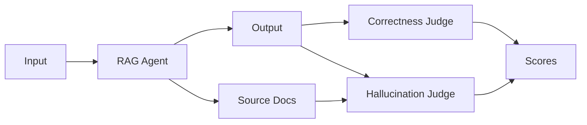

# RAG Agent Evaluation

This example shows a common pattern: evaluating a RAG agent across a dataset of question-answer pairs, checking for both hallucination and correctness.

## The Setup

You have a RAG agent that:
1. Takes a user question
2. Retrieves relevant documents
3. Generates an answer grounded in those documents

You want to evaluate:
- **Hallucination** — Is the answer grounded in the retrieved documents?
- **Correctness** — Does the answer match the expected reference?



## The Eval

```python
from ezvals import eval, EvalContext

async def run_agent(ctx: EvalContext):
    results = await run_rag_agent(ctx.input)
    ctx.output = results.response
    ctx.metadata["source_docs"] = results.metadata["source_docs"]


@eval(
    target=run_agent,
    dataset="rag_qa",
    cases=[
        {"input": "What is our refund policy?", "reference": "30-day money-back guarantee"},
        {"input": "How do I reset my password?", "reference": "Click 'Forgot Password' on the login page"},
        {"input": "What payment methods do you accept?", "reference": "Visa, Mastercard, and PayPal"},
        {"input": "How long does shipping take?", "reference": "3-5 business days for standard shipping"},
        {"input": "Can I change my order after placing it?", "reference": "Within 1 hour of placing the order"},
        # ... hundreds more rows
    ],
)
async def test_rag_agent(ctx: EvalContext):
    """Evaluate a RAG Agent for correctness and hallucinations"""
    # LLM-as-a-Judge for hallucination
    score, reasoning = await hallucination_judge(
        answer=ctx.output,
        sources=ctx.metadata["source_docs"]
    )
    ctx.store(scores={"value": score, "key": "hallucination", "notes": reasoning})

    # Check correctness against reference
    correctness_result = await correctness_judge(
        answer=ctx.output,
        reference=ctx.reference
    )
    assert correctness_result.is_correct, correctness_result.explanation
```

## What's Happening

**Case dataset** — `cases=` creates one eval run per row. Each row sets `ctx.input` and `ctx.reference` automatically.

**Target function** — The `run_agent` target runs before the eval body, populating `ctx.output` and storing source docs in metadata.

**Storing context for analysis** — We save the retrieved documents to `ctx.metadata`. This shows up in the results JSON and Web UI, so you can debug retrieval issues.

**Multiple scoring criteria** — We use `ctx.store(scores=...)` for hallucination (a named score) and `assert` for correctness (the default score). Both appear in your results.

**LLM-as-judge** — The `hallucination_judge` and `correctness_judge` are placeholder functions representing whatever LLM judge you're using (OpenAI, Anthropic, your own prompts, etc.).

## Running It

```bash
# Run headlessly
ezvals run evals/rag_agent.py

# Start the web UI
ezvals serve evals/rag_agent.py

# Run verbosely to see each result
ezvals run evals/rag_agent.py --verbose
```

## Example Results

After running, you'll have a JSON file with structured results:

```json
{
  "dataset": "rag_qa",
  "results": [
    {
      "input": "What is our refund policy?",
      "output": "We offer a 30-day money-back guarantee on all purchases.",
      "reference": "30-day money-back guarantee",
      "metadata": {
        "retrieved_docs": ["policy.md: section 4.2..."],
        "sources": ["policy.md"]
      },
      "scores": {
        "hallucination": {
          "passed": true,
          "message": "Answer is fully grounded in retrieved documents"
        },
        "default": {
          "passed": true,
          "message": null
        }
      }
    }
  ]
}
```

Your coding agent can read this JSON, analyze patterns, identify which questions have retrieval issues, and suggest improvements—all without leaving the terminal.
