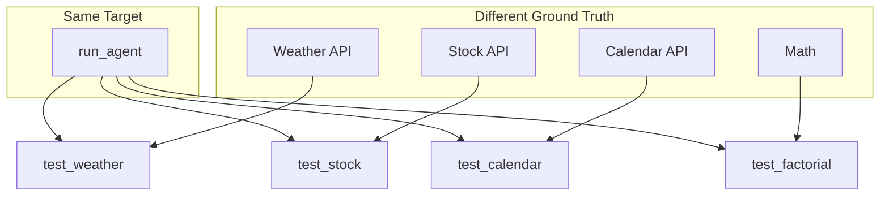

# Granular Evals

Sometimes you can't use cases. Each test case has unique logic—different ways of deriving ground truth, different validation. EZVals handles this naturally.

## The Problem

You're evaluating an agent that handles diverse tasks. Each test case:
- Derives ground truth from a different source
- Has custom validation logic

With most frameworks, you'd need a separate dataset for each. With EZVals, you just write functions.



## The Eval

```python
from ezvals import eval, EvalContext

async def run_agent(ctx: EvalContext):
    """Shared target function for all evals"""
    ctx.output = await agent.run(ctx.input)


@eval(input="What's the weather in Tokyo?", target=run_agent, dataset="agent_tasks")
async def test_weather_lookup(ctx: EvalContext):
    # Get ground truth from the actual weather API
    actual_weather = await weather_api.get_current("Tokyo")
    ctx.reference = f"{actual_weather.temp}°F, {actual_weather.condition}"

    assert str(actual_weather.temp) in ctx.output, "Should mention temperature"
    assert actual_weather.condition.lower() in ctx.output.lower(), "Should mention conditions"


@eval(input="What's Apple's stock price?", target=run_agent, dataset="agent_tasks")
async def test_stock_price(ctx: EvalContext):
    # Get ground truth from the stock API
    actual_price = await stock_api.get_price("AAPL")
    ctx.reference = f"${actual_price:.2f}"

    # Allow some tolerance since prices change
    mentioned_price = extract_price_from_text(ctx.output)
    diff = abs(mentioned_price - actual_price)
    assert diff < 5, f"Price ${mentioned_price} too far from actual ${actual_price}"


@eval(input="Book a meeting with John tomorrow at 2pm", target=run_agent, dataset="agent_tasks")
async def test_calendar_booking(ctx: EvalContext):
    # Check the calendar API to verify the booking was made
    bookings = await calendar_api.get_bookings(date="tomorrow")
    john_booking = next((b for b in bookings if "john" in b.attendees.lower()), None)

    ctx.reference = "Meeting booked with John at 2:00 PM"
    ctx.metadata["booking_details"] = john_booking  # Store for debugging

    assert john_booking is not None, "Booking should exist in calendar"
    assert john_booking.time == "14:00", f"Wrong time: {john_booking.time}"


@eval(input="Calculate the factorial of 10", target=run_agent, dataset="agent_tasks")
async def test_factorial(ctx: EvalContext):
    import math
    ctx.reference = str(math.factorial(10))  # 3628800
    assert ctx.reference in ctx.output, f"Should contain {ctx.reference}"
```

## What's Happening

**Same target, different validation** — All evals share `run_agent` but each derives ground truth differently: weather API, stock API, calendar check, or pure computation.

**Same dataset** — All four evals write to `"agent_tasks"`. You get one unified result set.

**Input in decorator** — Each eval declares its input upfront in the `@eval` decorator.

**Custom validation per test** — Weather checks temperature mentions, stock allows tolerance, calendar verifies side effects. Each test validates what matters.

## Running It

```bash
# Start the web UI
ezvals serve evals/agent_tasks.py

# Run a specific test
ezvals serve evals/agent_tasks.py::test_weather_lookup

# Run with session/run names for tracking
ezvals serve evals/agent_tasks.py --session model-upgrade --run-name baseline
```

## When to Use This Pattern

Use granular evals when:
- Each test needs different external data sources for ground truth
- Validation logic varies significantly per test
- You're testing diverse agent capabilities in one suite

Use case-based evals when:
- All test cases share the same logic
- You have a large dataset of input/output pairs
- Ground truth is known upfront
