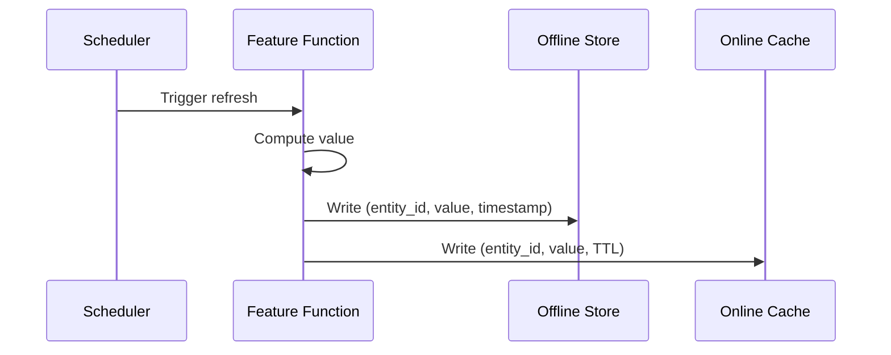
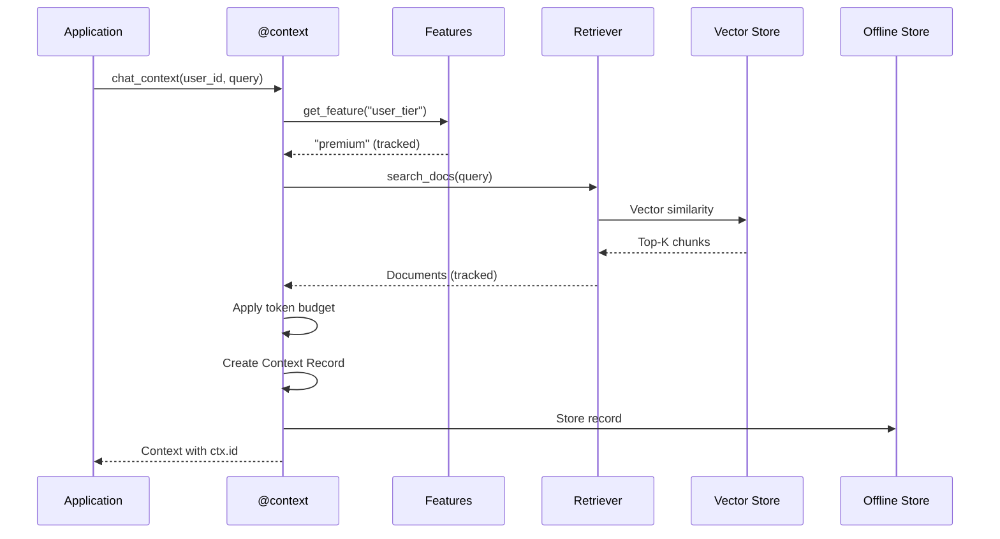

# Architecture

> **TL;DR:** Fabra creates a **Context Record** for every AI decision — an immutable snapshot of what data was used, where it came from, and what got dropped. DuckDB for local, Postgres + Redis + pgvector for production.

## The Context Record

Everything in Fabra flows through the **Context Record** — the atomic unit of AI accountability.

```json
{
  "context_id": "ctx_018f3a2b-...",
  "created_at": "2025-02-14T18:42:31.221Z",
  "content": "You are a helpful assistant...",
  "token_count": 3847,

  "features": [
    {"name": "user_tier", "value": "premium", "freshness_ms": 1200},
    {"name": "support_tickets", "value": 3, "freshness_ms": 45000}
  ],

  "retrieved_items": [
    {"chunk_id": "doc_123_chunk_2", "similarity": 0.89, "tokens": 512},
    {"chunk_id": "doc_456_chunk_1", "similarity": 0.84, "tokens": 384}
  ],

  "assembly": {
    "max_tokens": 4000,
    "tokens_used": 3847,
    "items_dropped": [
      {"chunk_id": "doc_789_chunk_3", "reason": "budget_exceeded", "tokens": 256}
    ]
  },

  "integrity": {
    "record_hash": "sha256:a1b2c3d4..."
  }
}
```

This record answers every question about an AI decision:
- **What features?** → `features[]` with exact values and freshness
- **What documents?** → `retrieved_items[]` with similarity scores
- **What got dropped?** → `assembly.items_dropped[]` with reasons
- **Can we verify it?** → `integrity.record_hash` for tamper detection

## System Overview

```
┌─────────────────────────────────────────────────────────────────┐
│                         Your Application                         │
└─────────────────────────────────────────────────────────────────┘
                                  │
                                  ▼
┌─────────────────────────────────────────────────────────────────┐
│                         Fabra Server                             │
│  ┌─────────────┐  ┌─────────────┐  ┌─────────────────────────┐  │
│  │  @feature   │  │  @retriever │  │       @context          │  │
│  │  decorator  │  │  decorator  │  │       decorator         │  │
│  └──────┬──────┘  └──────┬──────┘  └───────────┬─────────────┘  │
│         │                │                     │                 │
│         └────────────────┴─────────────────────┘                 │
│                          │                                       │
│                          ▼                                       │
│              ┌───────────────────────┐                          │
│              │    Context Record     │  ← Created on every call │
│              │    (immutable)        │                          │
│              └───────────┬───────────┘                          │
└──────────────────────────┼──────────────────────────────────────┘
                           │
           ┌───────────────┼───────────────┐
           ▼               ▼               ▼
    ┌────────────┐  ┌────────────┐  ┌────────────┐
    │   Online   │  │  Offline   │  │   Vector   │
    │   Store    │  │   Store    │  │   Store    │
    │  (Redis)   │  │ (Postgres) │  │ (pgvector) │
    └────────────┘  └────────────┘  └────────────┘
```

## The Stack

### Local Development

| Component | Technology | Purpose |
|:----------|:-----------|:--------|
| Offline Store | DuckDB (embedded) | Feature history, Context Records |
| Online Store | Python dict | Feature cache |
| Vector Store | In-memory | Document embeddings |
| Scheduler | APScheduler | Background refresh |

**Infrastructure required:** None. Just `pip install fabra-ai`.

### Production

| Component | Technology | Purpose |
|:----------|:-----------|:--------|
| Offline Store | Postgres 13+ | Feature history, Context Records |
| Online Store | Redis 6+ | Feature cache, sub-ms reads |
| Vector Store | pgvector | Semantic search |
| Scheduler | Distributed workers | Redis-locked refresh |

**Infrastructure required:** 1x Postgres (with pgvector), 1x Redis, Nx API pods.

## How Context Records Are Created

### 1. Feature Resolution

When you access a feature, Fabra tracks it:

```python
@feature(entity=User, refresh=timedelta(hours=1))
def user_tier(user_id: str) -> str:
    return db.query("SELECT tier FROM users WHERE id = ?", user_id)
```

Every feature access is logged with:
- **Value** at access time
- **Freshness** (how old the cached value is)
- **Source** (cache hit vs computed)

### 2. Document Retrieval

When you retrieve documents, Fabra tracks them:

```python
@retriever(index="support_docs", top_k=5)
async def search_docs(query: str) -> list[str]:
    pass  # Fabra handles the vector search
```

Every retrieval is logged with:
- **Chunk IDs** and document sources
- **Similarity scores**
- **Token counts**
- **Freshness** (when indexed)

### 3. Context Assembly

When you assemble context, Fabra creates the record:

```python
@context(store, max_tokens=4000)
async def chat_context(user_id: str, query: str) -> list[ContextItem]:
    docs = await search_docs(query)
    tier = await store.get_feature("user_tier", user_id)

    return [
        ContextItem(content="You are helpful.", priority=0, required=True),
        ContextItem(content=f"User tier: {tier}", priority=1),
        ContextItem(content=str(docs), priority=2),
    ]
```

The `@context` decorator:
1. Executes your function
2. Tracks all feature accesses and retrievals
3. Applies token budget (drops low-priority items if needed)
4. Creates immutable Context Record with hash
5. Stores record in Offline Store

## Token Budget Management

Context assembly uses priority-based truncation:

```python
@context(store, max_tokens=4000)
async def chat_context(...):
    return [
        ContextItem(content=system, priority=0, required=True),   # Never dropped
        ContextItem(content=user_data, priority=1, required=True), # Never dropped
        ContextItem(content=docs, priority=2),                     # Dropped if needed
        ContextItem(content=suggestions, priority=3),              # Dropped first
    ]
```

When budget is exceeded:
1. Consider only optional items (`required=False`)
2. Drop lowest-importance items first (higher `priority` values)
3. Record every dropped item with a reason
4. If required items still exceed budget, return the context and set `meta["budget_exceeded"]=true`

The Context Record captures **what was dropped and why** — critical for debugging "why didn't the AI know about X?"

## Data Flow Diagrams

### Feature Materialization



### Context Assembly



## Point-in-Time Correctness

Training/serving skew kills ML models. Fabra ensures consistency:

### The Problem

Your model trains on Monday's features but serves Tuesday's features. The model learned patterns that no longer exist.

### The Solution

Fabra's `get_training_data()` uses "as-of" joins:

```python
# Get features AS THEY WERE at each event time
training_df = await store.get_training_data(
    entity_df=events,  # DataFrame with entity_id + timestamp
    features=["user_tier", "purchase_count"],
)
```

**DuckDB (local):**
```sql
SELECT e.*, f.value
FROM entity_df e
ASOF LEFT JOIN feature_table f
ON e.entity_id = f.entity_id AND e.timestamp >= f.timestamp
```

**Postgres (production):**
```sql
LEFT JOIN LATERAL (
    SELECT value FROM feature_table f
    WHERE f.entity_id = e.entity_id AND f.timestamp <= e.timestamp
    ORDER BY f.timestamp DESC LIMIT 1
) f ON TRUE
```

Same logic offline (training) and online (serving). No skew.

## Design Decisions

### Why Redis-Only Caching?

Most feature stores use L1 (in-memory) + L2 (Redis). This creates cache coherence bugs — different pods see different values.

Fabra uses Redis-only:
- 1ms localhost latency (fast enough)
- Strong consistency (all pods see same value)
- Simpler debugging (one source of truth)

For fraud detection and financial decisions, **correctness > micro-optimization**.

### Why No Leader Election?

Distributed schedulers typically use leader election or consistent hashing. Complex, fragile, hard to debug.

Fabra uses randomized work selection + Redis SETNX locks:
- Any worker can pick up any job
- Redis lock prevents double-execution
- Self-healing, no topology awareness needed
- "Even enough" distribution statistically

### Why Explicit Over Magic?

No auto-caching hot features. No query optimization. No hidden materialization.

You write `materialize=True`, we cache. That's it.

**Predictability > cleverness** when debugging production issues.

## Integrity and Verification

Every Context Record includes cryptographic integrity:

```python
# Verify a record hasn't been tampered with
fabra context verify ctx_018f3a2b-...
# ✓ Record integrity verified (hash matches)
```

The `record_hash` is computed from canonical JSON of all fields (excluding the hash itself). Any modification — even a single character — produces a different hash.

This matters for:
- **Compliance:** Prove records haven't been altered
- **Debugging:** Trust that replays show real data
- **Audits:** Evidence, not assertions

<script type="application/ld+json">
{
  "@context": "https://schema.org",
  "@type": "TechArticle",
  "headline": "Fabra Architecture: How Context Records Work",
  "description": "Technical deep-dive into Fabra's architecture. Learn how Context Records are created, stored, and replayed.",
  "author": {"@type": "Organization", "name": "Fabra Team"},
  "keywords": "context record, fabra architecture, ai audit trail, duckdb, postgres, redis",
  "articleSection": "Software Architecture"
}
</script>
