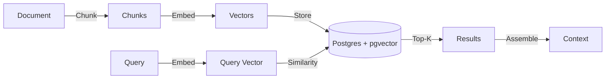

# Context Store for LLMs

> **TL;DR:** Fabra's Context Store is the **Inference Context Ledger** — we own the write path, ingesting, indexing, and serving context data. Every context assembly becomes an immutable **Context Record** with full lineage, cryptographic integrity, and replay capability.

## Why Context Store?

Building LLM applications requires more than just features. You need:

1. **Document Indexing:** Store and chunk documents for retrieval.
2. **Vector Search:** Find semantically relevant content.
3. **Context Assembly:** Combine retrieved docs with user data under token limits.
4. **Freshness:** Update context when documents change.
5. **Auditability:** Know exactly what your AI knew when it decided.

Most teams cobble together Pinecone + LangChain + custom glue code. These are read-only wrappers — they query external stores but don't own the data lifecycle. Fabra owns the write path, enabling lineage, replay, and compliance that read-only tools cannot provide.

## Quick Example

```python
from fabra.core import FeatureStore
from fabra.context import context, Context, ContextItem
from fabra.retrieval import retriever

store = FeatureStore()
# For vector search/indexing, configure a Postgres offline store (pgvector):
# export FABRA_ENV=production
# export FABRA_POSTGRES_URL=postgresql+asyncpg://...

	# 1. Define a retriever for semantic search
	@retriever(index="knowledge_base", top_k=5)
	async def search_docs(query: str):
	    # Magic: Automatically searches "knowledge_base" index using
	    # the configured offline store (Postgres + pgvector).
	    pass

	store.register_retriever(search_docs)  # Enables magic wiring + caching

# 2. Define context assembly with token budget
@context(store, max_tokens=4000)
async def chat_context(user_id: str, query: str) -> list[ContextItem]:
    docs = await search_docs(query)
    # Access store instance via global or closure if needed
    user_prefs = await store.get_feature("user_preferences", user_id)

    return [
        ContextItem(content="You are a helpful assistant.", priority=0, required=True),
        ContextItem(content=str(docs), priority=1, required=True),
        ContextItem(content=f"User preferences: {user_prefs}", priority=2),
    ]
```

## Core Concepts

### 1. Indexes

An **Index** is a collection of documents stored with vector embeddings for semantic search.

```python
# Index documents via API
await store.index(
    index_name="knowledge_base",
    entity_id="doc_123",
    text="Fabra is a feature store and context store...",
    metadata={"source": "docs", "version": "1.2.0"}
)
```

*Note:* Vector indexing requires a Postgres offline store with `pgvector` enabled (production mode) plus an embeddings provider (e.g. `OPENAI_API_KEY`). The current MVP does not expose a dedicated HTTP “index documents” endpoint; call `store.index(...)` from your application code.

**Automatic Features:**
- **Chunking:** Documents are split using tiktoken (default: 512 tokens per chunk).
- **Embedding:** Chunks are embedded using OpenAI or Cohere (configurable).
- **Storage:** Embeddings stored in Postgres with pgvector extension.

**Management via CLI:**
```bash
# Manually create an index
fabra index create knowledge_base --dimension 1536

# Check index status
fabra index status knowledge_base
# Output: Index: knowledge_base | Rows: 1542
```

### 2. Retrievers

A **Retriever** performs vector search and returns relevant documents.

```python
from fabra.retrieval import retriever
from datetime import timedelta

@retriever(index="knowledge_base", cache_ttl=timedelta(seconds=300))
async def search_docs(query: str):
    # "Magic Wiring": Setting `index` connects this function directly
    # to the vector store. No body implementation needed!
    pass
```

**Parameters:**
- `cache_ttl`: Optional `timedelta` to cache results (omit to disable caching).

[Learn more about Retrievers →](retrievers.md)

### 3. Context Assembly

A **Context** combines multiple sources under a token budget.

```python
from fabra.context import context, ContextItem

@context(store, max_tokens=4000)
async def chat_context(user_id: str, query: str) -> list[ContextItem]:
    # Fetch from multiple sources
    docs = await search_docs(query)
    history = await get_chat_history(user_id)

    return [
        ContextItem(content=system_prompt, priority=0, required=True),
        ContextItem(content=str(docs), priority=1, required=True),
        ContextItem(content=history, priority=2),  # Truncated first if over budget
    ]
```

**Example: Multiple Retrievers**

```python
@retriever(name="products_search")
async def search_products(query: str) -> list[str]:
    # Implement product search logic here
    return []

@retriever(name="tickets_search")
async def search_tickets(query: str) -> list[str]:
    # Implement ticket search logic here
    return []

# Combine in context assembly
@context(store, max_tokens=4000)
async def support_context(query: str) -> list[ContextItem]:
    products = await search_products(query)
    tickets = await search_tickets(query)
    return [
        ContextItem(content=str(products), priority=1),
        ContextItem(content=str(tickets), priority=2),
    ]
```

**Priority-Based Truncation:**
- Items sorted by priority (0 = highest priority, kept first).
- Lower-priority items truncated when budget exceeded.
- `required=True` items are never dropped. If required items exceed the budget, the context is returned and `meta["budget_exceeded"]` is set.

[Learn more about Context Assembly →](context-assembly.md)

### 4. Context Records (CRS-001)

Every context assembly creates an immutable **Context Record** — a cryptographically verifiable snapshot of everything the AI knew at decision time.

```python
# Get the Context Record
ctx = await chat_context("user_123", "how do I reset password?")
record = ctx.to_record()

print(record.context_id)           # ctx_018f3a2b-... (stable ID)
print(record.integrity.content_hash)  # sha256:abc123... (tamper-evident)
print(record.assembly.dropped_items)  # Items that didn't fit token budget
```

**What's in a Context Record:**

| Field | Description |
|:------|:------------|
| `context_id` | Stable ID (`ctx_` prefix + UUIDv7) |
| `features` | Structured features with freshness timestamps |
| `retrieved_items` | Documents/chunks with content hashes |
| `assembly` | Token budget decisions (what was included vs dropped) |
| `lineage` | Full provenance (sources, versions, latencies) |
| `integrity` | Cryptographic hashes for tamper detection |

**CLI Commands:**

```bash
# Show a Context Record
fabra context show ctx_018f3a2b-7def-7abc-8901-234567890abc

# Verify cryptographic integrity (detect tampering)
fabra context verify ctx_018f3a2b-7def-7abc-8901-234567890abc

# Compare two Context Records
fabra context diff ctx_abc123 ctx_def456
```

**Why This Matters:**

- **Compliance:** Prove exactly what data informed an AI decision
- **Debugging:** Replay any historical context with exact inputs
- **Auditing:** Tamper-evident records for regulatory requirements

<script type="application/ld+json">
{
  "@context": "https://schema.org",
  "@type": "TechArticle",
  "headline": "Fabra Context Store: RAG Infrastructure for Developers",
  "description": "Complete guide to the Fabra Context Store. Manage vector embeddings, token budgets, and context assembly for Large Language Models.",
  "articleSection": "Context Store",
  "keywords": "context store, rag, vector database, pgvector, llm token management, context assembly",
  "author": {
    "@type": "Person",
    "name": "David Ahmann"
  }
}
</script>

### 4. Event-Driven Updates

Keep context fresh by triggering updates on events.

```python
from fabra.core import feature

@feature(entity=Document, trigger="document_updated")
async def doc_summary(doc_id: str, event: AxiomEvent) -> str:
    # Re-compute summary when document changes
    return summarize(event.payload["content"])
```

Events are published via Redis Streams and consumed by `AxiomWorker`.

**Monitor Events:**
```bash
# Tail the event stream in real-time
fabra events listen --stream document_updated
```

[Learn more about Event-Driven Features →](event-driven-features.md)

## Configuration

| Variable | Description | Default |
| :--- | :--- | :--- |
| `OPENAI_API_KEY` | API key for OpenAI embeddings | Required for embeddings |
| `COHERE_API_KEY` | API key for Cohere embeddings (alternative) | Optional |
| `FABRA_EMBEDDING_MODEL` | Embedding model to use | `text-embedding-3-small` |
| `FABRA_CHUNK_SIZE` | Tokens per chunk | `512` |

### Production Tuning

| Variable | Description | Recommendation |
| :--- | :--- | :--- |
| `FABRA_EMBEDDING_CONCURRENCY` | Max concurrent embedding requests | Set to `20+` if you have high Tier limits. Default `10`. |
| `FABRA_PG_POOL_SIZE` | Postgres Connection Pool Size | Set to `10-20` for high-throughput API pods. Default `5`. |
| `FABRA_PG_MAX_OVERFLOW` | Postgres Connection Pool Overflow | Set to `20+` to handle spikes. Default `10`. |

## Architecture



## When to Use Context Store

**Use Context Store when:**
- Building RAG chatbots or Q&A systems
- Need semantic search over documents
- Want unified infrastructure for features + context
- Need token budget management for LLM prompts

**Use Feature Store alone when:**
- Building traditional ML models
- Only need numerical/categorical features
- No document retrieval required

## Next Steps

- [Retrievers](retrievers.md): Deep dive into vector search
- [Context Assembly](context-assembly.md): Token budgets and priority
- [Event-Driven Features](event-driven-features.md): Real-time updates
- [Use Case: RAG Chatbot](use-cases/rag-chatbot.md): End-to-end example

---

## Also Need ML Features?

Fabra includes a Feature Store for serving ML features — user personalization, risk scores, recommendations. Same infrastructure, same deployment.

[Feature Store →](feature-store-without-kubernetes.md) | [Feast vs Fabra →](feast-alternative.md)

## 🐛 Debugging & Tracing

Fabra provides built-in observability for your context assembly. Because context is often assembled from multiple stochastic sources (vector search, cached features), understanding *why* a specific prompt was built is crucial.

### The `fabra context explain` Command

You can trace any context request by its ID:

```bash
fabra context explain ctx_12345
```

**Output:**
```json
{
  "context_id": "ctx_12345",
  "created_at": "2025-12-08T21:00:00Z",
  "latency_ms": 45.2,
  "token_usage": 3450,
  "cost_usd": 0.002,
  "freshness_status": "guaranteed",
  "source_ids": ["doc_123", "user_prefs_456"],
  "stale_sources": [],
  "cache_hit": false,
  "meta": {
    "dropped_items": 1,
    "budget_exceeded": false
  }
}
```

## FAQ

**Q: How do I audit what data my LLM used for a decision?**
A: Fabra automatically tracks lineage for every context assembly. Access via `ctx.lineage` after calling your `@context` function, or use `store.get_context_at(context_id)` to replay any historical context. See [Context Accountability](context-accountability.md).

**Q: Can I replay exactly what my AI knew at a specific time?**
A: Yes. Every context gets a UUIDv7 ID. Use `store.get_context_at(id)` to retrieve the exact content, features, and retriever results that were assembled — critical for debugging and compliance.

**Q: How is Fabra different from LangChain for RAG?**
A: LangChain is a framework (orchestration layer). Fabra is infrastructure (storage + serving). LangChain queries external stores; Fabra owns the write path with freshness tracking, lineage, and audit trails. You can use both together.

**Q: What vector database does Fabra use?**
A: pgvector (Postgres extension). Your vectors live alongside your relational data — no separate vector database required. This simplifies ops and enables transactional consistency.

**Q: How do I ensure my RAG context is fresh?**
A: Use Fabra's [Freshness SLAs](freshness-sla.md). Configure `max_staleness` on features and contexts. Fabra tracks when data was last updated and can fail-safe or degrade gracefully when data is stale.

**Q: Do I need separate infrastructure for features and RAG?**
A: No. Fabra unifies ML features (`@feature`) and RAG context (`@retriever` + `@context`) in one infrastructure layer. Same Postgres + Redis stack, same deployment.

---

## You Might Also Search For

- "context store for llm"
- "rag token budget management"
- "what did ai know"
- "vector search pgvector"
- "llm context assembly"

<script type="application/ld+json">
{
  "@context": "https://schema.org",
  "@type": "TechArticle",
  "headline": "Context Store for LLMs: RAG Infrastructure",
  "description": "Build production RAG applications with Fabra's Context Store. Vector search with pgvector, automatic chunking, token budgets, and priority-based context assembly.",
  "author": {"@type": "Organization", "name": "Fabra Team"},
  "keywords": "context store, rag, llm, pgvector, vector search",
  "articleSection": "Documentation"
}
</script>
