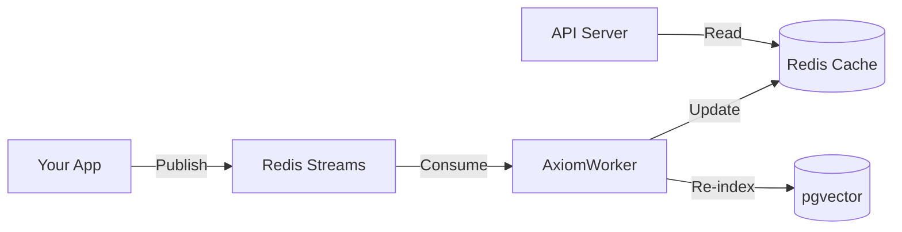

# Event-Driven Features

> **TL;DR:** Use `trigger="event_name"` to update features when events occur. Fabra handles Redis Streams, workers, and caching automatically.

## Why Event-Driven?

Traditional features are computed on-demand or scheduled. But some features need immediate updates:

- **User clicks a product** → Update `last_viewed_category`
- **Document is edited** → Re-index for search
- **Transaction completes** → Update `total_spend`

Event-driven features react to changes in real-time.

## Architecture



## Quick Example

```python
from fabra.core import FeatureStore, entity, feature
from fabra.events import AxiomEvent

store = FeatureStore()

@entity(store)
class User:
    user_id: str

# Feature triggered by "purchase" events
@feature(entity=User, trigger="purchase")
async def last_purchase_amount(user_id: str, event: AxiomEvent) -> float:
    return event.payload["amount"]

@feature(entity=User, trigger="purchase")
async def total_purchases(user_id: str, event: AxiomEvent) -> int:
    current = await store.get_feature("total_purchases", user_id) or 0
    return current + 1
```

## Publishing Events

### From Python

```python
from fabra.bus import RedisEventBus
from fabra.events import AxiomEvent

bus = RedisEventBus()

await bus.publish(AxiomEvent(
    event_type="purchase",
    entity_id="user_123",
    payload={"amount": 99.99, "product_id": "prod_456"},
    timestamp=datetime.utcnow()
))
```

### Via HTTP

```bash
curl -X POST http://localhost:8000/ingest/purchase \
  -H "Content-Type: application/json" \
  -d '{
    "entity_id": "user_123",
    "payload": {"amount": 99.99, "product_id": "prod_456"}
  }'
```

## AxiomEvent Model

```python
@dataclass
class AxiomEvent:
    event_type: str       # Event name (matches trigger)
    entity_id: str        # Entity this event relates to
    payload: dict         # Event data
    timestamp: datetime   # When event occurred
    event_id: str         # Unique ID (auto-generated)
```

## AxiomWorker

The worker consumes events from Redis Streams and triggers feature updates:

```bash
# Start worker (via CLI)
fabra worker my_features.py

# Or programmatically
from fabra.worker import AxiomWorker

worker = AxiomWorker(store)
await worker.run()
```

### Worker Configuration

| Variable | Description | Default |
| :--- | :--- | :--- |
| `FABRA_WORKER_BATCH_SIZE` | Events per batch | `100` |
| `FABRA_WORKER_POLL_INTERVAL` | Seconds between polls | `1.0` |
| `FABRA_WORKER_CONSUMER_GROUP` | Redis consumer group | `fabra_workers` |

## Trigger Patterns

### Single Trigger

```python
@feature(entity=User, trigger="login")
async def last_login(user_id: str, event: AxiomEvent) -> datetime:
    return event.timestamp
```

### Multiple Triggers

```python
@feature(entity=User, trigger=["purchase", "refund"])
async def transaction_count(user_id: str, event: AxiomEvent) -> int:
    current = await store.get_feature("transaction_count", user_id) or 0
    return current + 1
```

### Conditional Logic

```python
@feature(entity=User, trigger="transaction")
async def balance(user_id: str, event: AxiomEvent) -> float:
    current = await store.get_feature("balance", user_id) or 0.0

    if event.payload["type"] == "credit":
        return current + event.payload["amount"]
    else:
        return current - event.payload["amount"]
```

## Event-Driven Indexing

Re-index documents when they change:

*Note:* This requires a Postgres offline store with `pgvector` enabled plus an embeddings provider (e.g. `OPENAI_API_KEY`).

```python
@feature(entity=Document, trigger="document_updated")
async def doc_content(doc_id: str, event: AxiomEvent) -> str:
    content = event.payload["content"]

    # Re-index in vector store
    await store.index(
        index_name="documents",
        entity_id=doc_id,
        text=content
    )

    return content
```

## Combining with Scheduled Features

Use both triggers and schedules:

```python
# Real-time: updated immediately on events
@feature(entity=User, trigger="purchase")
async def last_purchase(user_id: str, event: AxiomEvent) -> dict:
    return event.payload

# Batch: aggregated every 5 minutes
@feature(entity=User, refresh=timedelta(minutes=5), materialize=True)
async def purchase_stats(user_id: str) -> dict:
    # Compute from offline store
    return await compute_stats(user_id)
```

## Error Handling

### Retry on Failure

Events are retried on failure:

```python
@feature(entity=User, trigger="risky_event", max_retries=3)
async def risky_feature(user_id: str, event: AxiomEvent) -> str:
    # Will retry up to 3 times on exception
    return await external_api_call(event.payload)
```

### Dead Letter Queue

Failed events after retries go to DLQ:

```bash
# View failed events
redis-cli XRANGE fabra:dlq - +
```

### Idempotency

Features should be idempotent (same result if processed twice):

```python
@feature(entity=User, trigger="purchase")
async def idempotent_total(user_id: str, event: AxiomEvent) -> float:
    # Use event_id to prevent double-counting
    processed = await store.get_feature(f"processed_{event.event_id}", user_id)
    if processed:
        return await store.get_feature("total", user_id)

    await store.set_feature(f"processed_{event.event_id}", user_id, True)
    current = await store.get_feature("total", user_id) or 0
    return current + event.payload["amount"]
```

## Observability

### Metrics

Prometheus metrics are exposed automatically:

- `fabra_events_processed_total{event_type="purchase"}` - Events processed
- `fabra_events_failed_total{event_type="purchase"}` - Failed events
- `fabra_event_processing_seconds` - Processing latency

### Logging

Structured logs for each event:

```json
{
  "level": "info",
  "event_type": "purchase",
  "entity_id": "user_123",
  "event_id": "evt_abc",
  "duration_ms": 12,
  "features_updated": ["last_purchase", "total_purchases"]
}
```

## Best Practices

1. **Keep handlers fast** - Offload heavy work to background jobs.
2. **Make handlers idempotent** - Events may be processed twice.
3. **Use appropriate triggers** - Don't over-trigger features.
4. **Monitor DLQ** - Set up alerts for failed events.
5. **Test event flow** - Unit test handlers with mock events.

## Next Steps

- [Context Store Overview](context-store.md): Full RAG infrastructure
- [Retrievers](retrievers.md): Semantic search
- [Architecture](architecture.md): System design

<script type="application/ld+json">
{
  "@context": "https://schema.org",
  "@type": "TechArticle",
  "headline": "Event-Driven Features: Real-Time Updates via Redis Streams",
  "description": "Build real-time features with Fabra's event-driven architecture. Trigger updates via Redis Streams, process with AxiomWorker, and keep context fresh.",
  "author": {"@type": "Organization", "name": "Fabra Team"},
  "keywords": "event-driven, redis streams, real-time features, streaming",
  "articleSection": "Documentation"
}
</script>
