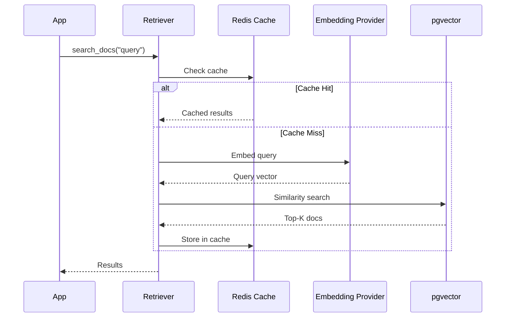

# Retrievers

> **TL;DR:** Use `@retriever` to define semantic search functions, then register them on your `FeatureStore` to enable magic wiring and (optional) Redis caching.

## At a Glance

| | |
|:---|:---|
| **Decorator** | `@retriever(index="docs", top_k=5)` |
| **Vector DB** | pgvector (Postgres extension) |
| **Embedding** | OpenAI, Cohere, Anthropic |
| **Caching** | `cache_ttl=timedelta(seconds=300)` stores in Redis |
| **Magic Wiring** | Empty function body auto-searches the index (after `store.register_retriever(...)`) |
| **Template Wiring** | Use `{feature}` templates in retriever kwargs (pass `entity_id`) |

## What is a Retriever?

A **Retriever** is a function that searches an index and returns relevant documents. The `@retriever` decorator transforms a simple function into a full vector search pipeline.

```python
from fabra.core import FeatureStore
from fabra.retrieval import retriever

store = FeatureStore()

@retriever(index="knowledge_base", top_k=5)
async def search_docs(query: str):
    # Magic Wiring: Automatically searches `knowledge_base` index.
    pass

store.register_retriever(search_docs)
```

## Basic Usage

### Define a Retriever

```python
from fabra.core import FeatureStore
from fabra.retrieval import retriever

store = FeatureStore()

@retriever(index="knowledge_base", top_k=5)
async def search_knowledge(query: str):
    # Pass 'query' argument automatically to vector search
    pass

store.register_retriever(search_knowledge)
```

### Call the Retriever

```python
# In async context
results = await search_knowledge("How do I configure Redis?")
# Returns: [{"content": "...", "metadata": {...}, "score": 0.87}, ...]
```

## Parameters

| Parameter | Type | Description | Default |
| :--- | :--- | :--- | :--- |
| `name` | `str` | Name of the retriever (defaults to function name) | Optional |
| `index` | `str` | Name of vector index to search (activates Magic Wiring) | Optional |
| `top_k` | `int` | Number of results to return (used with `index`) | `5` |
| `backend` | `str` | Backend type ("custom" or "postgres") | "custom" |
| `cache_ttl` | `timedelta` | Cache TTL for results (requires Redis) | Optional |

## Caching

Enable caching to reduce vector search latency for repeated queries:

```python
from datetime import timedelta
from fabra.core import FeatureStore
from fabra.retrieval import retriever

store = FeatureStore()

@retriever(index="docs", top_k=5, cache_ttl=timedelta(seconds=300))
async def cached_search(query: str):
    pass

store.register_retriever(cached_search)
```

**How it works:**
1. Query is hashed to create cache key.
2. If cached, return immediately from Redis.
3. If not cached, perform vector search and cache results.

**Cache key format:** `fabra:retriever:{name}:{args_hash}`

## Similarity Threshold

Filter out low-relevance results:

Filter out low-confidence results in your application code:

```python
results = await search_docs("How do I configure Redis?")
high_confidence = [r for r in results if r.get("score", 0.0) >= 0.7]
```

## Template Wiring

Retriever kwargs can reference feature values via template strings. Pass `entity_id` so Fabra can resolve templates before calling your retriever.

```python
@retriever(name="doc_search")
async def doc_search(query: str, tier: str):
    ...

store.register_retriever(doc_search)

results = await doc_search(
    query="How do I configure Redis?",
    tier="{user_tier}",
    entity_id="user_123",
)
```

## Custom Embedding

Override the default embedding provider:

```python
@retriever(index="docs", top_k=5)
async def cohere_search(query: str) -> list[str]:
    # Embedding provider is configured globally via FABRA_EMBEDDING_PROVIDER
    # or COHERE_API_KEY environment variable
    pass

store.register_retriever(cohere_search)
```

## Multiple Indexes

Search across different document collections:

```python
@retriever(index="product_docs", top_k=3)
async def search_products(query: str) -> list[str]:
    pass

@retriever(index="support_tickets", top_k=3)
async def search_tickets(query: str) -> list[str]:
    pass

store.register_retriever(search_products)
store.register_retriever(search_tickets)

# Combine in context assembly
@context(store, max_tokens=4000)
async def support_context(query: str) -> list[ContextItem]:
    products = await search_products(query)
    tickets = await search_tickets(query)
    return [
        ContextItem(content=str(products), priority=1),
        ContextItem(content=str(tickets), priority=2),
    ]
```

## Metadata Filtering

Filter results by document metadata:

```python
@retriever(index="docs", top_k=20)
async def search_docs(query: str) -> list[dict]:
    pass

store.register_retriever(search_docs)

# Usage (filter on the returned metadata)
results = await search_docs("How to configure?")
filtered = [r for r in results if r.get("metadata", {}).get("version") == "1.2.0"]
```

## Error Handling

Retrievers handle errors gracefully:

```python
@retriever(index="docs", top_k=5)
async def safe_search(query: str) -> list[str]:
    return []  # Optional fallback if magic wiring isn't configured

# If index doesn't exist or search fails:
# - Returns empty list []
# - Logs warning with details
# - Does not raise exception
```

## Performance Tips

1. **Use caching** for repeated queries: `cache_ttl=timedelta(seconds=300)`
2. **Filter low-quality results** by `score` in your app code
3. **Limit top_k** to what you need: smaller is faster
4. **Pre-warm cache** for common queries at startup

## Under the Hood

When you call a retriever:



## FAQ

**Q: How do I implement semantic search in Python?**
A: Use Fabra's `@retriever` decorator: `@retriever(index="docs", top_k=5)`. Define an async function with a query parameter. Fabra handles embedding and pgvector search automatically.

**Q: What vector database does Fabra use?**
A: Fabra uses **pgvector** (Postgres extension) for vector search. No separate vector database required—your vectors live alongside your relational data.

**Q: How do I cache retriever results?**
A: Add `cache_ttl` to the decorator: `@retriever(index="docs", top_k=5, cache_ttl=timedelta(seconds=300))`. Results are cached in Redis using a hash of the query.

**Q: Can I use multiple vector indexes?**
A: Yes. Define separate retrievers for each index: `@retriever(index="product_docs")` and `@retriever(index="support_tickets")`. Combine results in context assembly.

**Q: What embedding providers are supported?**
A: OpenAI (default), Cohere, and Anthropic. Configure via `FABRA_EMBEDDING_PROVIDER` environment variable or API key detection.

**Q: How do I filter retriever results by metadata?**
A: Add filter parameters to your retriever function: `async def search(query: str, version: str = None)`. Filters are applied automatically during vector search.

---

## Next Steps

- [Context Assembly](context-assembly.md): Combine retrievers with token budgets
- [Event-Driven Features](event-driven-features.md): Update retrievers on events
- [Context Store Overview](context-store.md): Full context infrastructure

<script type="application/ld+json">
{
  "@context": "https://schema.org",
  "@type": "TechArticle",
  "headline": "Retrievers: Semantic Search with @retriever",
  "description": "Define semantic search functions with Fabra's @retriever decorator. Automatic embedding, pgvector search, result caching, and DAG wiring.",
  "author": {"@type": "Organization", "name": "Fabra Team"},
  "keywords": "retriever, semantic search, vector search, pgvector, rag",
  "articleSection": "Documentation"
}
</script>
