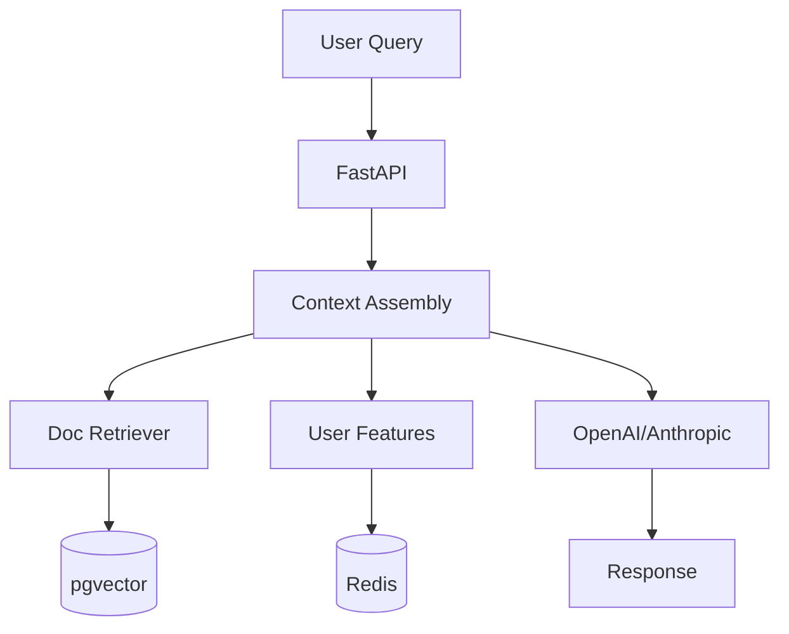

# Use Case: Production RAG Chatbot

> **TL;DR:** Build a production-ready RAG chatbot that combines document retrieval with user personalization—all in ~100 lines of Python.

## The Goal

Build a customer support chatbot that:
1. **Searches knowledge base** for relevant docs
2. **Personalizes responses** based on user tier and history
3. **Updates in real-time** when docs change
4. **Stays within token limits** for cost control

## Architecture Overview



## Step 1: Define Entities and Features

```python
# chatbot.py
from fabra.core import FeatureStore, entity, feature
from datetime import timedelta

store = FeatureStore()

@entity(store)
class User:
    user_id: str

@entity(store)
class Document:
    doc_id: str

# User features for personalization
@feature(entity=User, materialize=True, refresh=timedelta(hours=1))
def user_tier(user_id: str) -> str:
    # From your database
    # return db.get_user_tier(user_id)
    return "premium"

@feature(entity=User, materialize=True)
def support_history(user_id: str) -> list[str]:
    # Last 5 support tickets
    return ["Ticket #101", "Ticket #102"]

@feature(entity=User, trigger="message_sent")
def message_count(user_id: str, event) -> int:
    return 1 # Simplified for example
```

## Step 2: Index Your Knowledge Base

```python
# index_docs.py
import asyncio
from chatbot import store

async def index_knowledge_base():
    docs = [
        {"id": "doc_1", "text": "To reset your password...", "category": "account"},
    ]

    for doc in docs:
        await store.index(
            index_name="knowledge_base",
            entity_id=doc["id"],
            text=doc["text"],
            metadata={"category": doc["category"]}
        )
    print(f"Indexed {len(docs)} documents")

if __name__ == "__main__":
    asyncio.run(index_knowledge_base())
```

## Step 3: Define Retrievers

```python
# chatbot.py (continued)
from fabra.retrieval import retriever
from datetime import timedelta

@retriever(name="knowledge_base", cache_ttl=timedelta(seconds=300))
async def search_docs(query: str) -> list[str]:
    # Logic to search pgvector
    # Example: return [r["content"] for r in await store.search("knowledge_base", query, top_k=5)]
    return ["Fabra.simplifies RAG.", "Context Store manages tokens."]
```

## Step 4: Assemble Context

```python
# chatbot.py (continued)
from fabra.context import context, Context, ContextItem

@context(store, max_tokens=4000)
async def chat_context(user_id: str, query: str) -> Context:
    # Fetch all components
    docs = await search_docs(query)
    # Get features (returns dict)
    user_features = await store.get_online_features("User", user_id, ["user_tier", "support_history"])
    tier = user_features.get("user_tier")
    history = user_features.get("support_history", [])

    items = [
        ContextItem(content="You are a helpful assistant.", priority=0, required=True),
        ContextItem(content=f"User tier: {tier}", priority=1, required=True),
        ContextItem(content="Docs:\n" + "\n".join(docs), priority=2, required=True),
    ]

    # Add history for premium users
    if tier == "premium" and history:
        items.append(ContextItem(
            content=f"History:\n" + "\n".join(history),
            priority=3,
            required=False # Drop if budget exceeded
        ))

    return items # Returned list is automatically wrapped in Context
```

## Step 5: Create the API

```python
# chatbot.py (continued)
from fastapi import FastAPI
from pydantic import BaseModel
import openai

app = FastAPI()

class ChatRequest(BaseModel):
    user_id: str
    message: str

class ChatResponse(BaseModel):
    response: str
    context_used: str

@app.post("/chat", response_model=ChatResponse)
async def chat(request: ChatRequest):
    # Get assembled context
    ctx = await chat_context(request.user_id, request.message)

    # Call LLM
    from openai import AsyncOpenAI
    client = AsyncOpenAI()

    response = await client.chat.completions.create(
        model="gpt-4",
        messages=[
            {"role": "system", "content": ctx.content}, # Access final string content
            {"role": "user", "content": request.message}
        ]
    )

    return ChatResponse(
        response=response.choices[0].message.content,
        context_used=ctx.content
    )
```

## Step 6: Real-Time Doc Updates

Keep context fresh when documents change:

```python
# chatbot.py (continued)
from fabra.events import AxiomEvent

@feature(entity=Document, trigger="doc_updated")
async def doc_content(doc_id: str, event: AxiomEvent) -> str:
    content = event.payload["content"]

    # Re-index in vector store
    await store.index(
        index_name="knowledge_base",
        entity_id=doc_id,
        text=content,
        metadata=event.payload.get("metadata", {})
    )

    return content
```

Publish updates from your CMS:

```python
# cms_webhook.py
from fabra.bus import RedisEventBus
from fabra.events import AxiomEvent

bus = RedisEventBus()

async def on_doc_save(doc_id: str, content: str, metadata: dict):
    await bus.publish(AxiomEvent(
        event_type="doc_updated",
        entity_id=doc_id,
        payload={"content": content, "metadata": metadata}
    ))
```

## Step 7: Run It

```bash
# Terminal 1: Start your API
uvicorn chatbot:app --reload --host 127.0.0.1 --port 8000

# Terminal 2: Start worker (for event processing)
fabra worker chatbot.py

# Terminal 3: Test it
curl -X POST http://localhost:8000/chat \
  -H "Content-Type: application/json" \
  -d '{"user_id": "user_123", "message": "How do I reset my password?"}'
```

## Production Considerations

### Token Budget by Tier

```python
@context(store, name="chat_context_free", max_tokens=4000)
async def chat_context_free(user_id: str, query: str) -> Context:
    tier = await store.get_feature("user_tier", user_id)

    top_k = 3
    docs = await store.search("knowledge_base", query, top_k=top_k)

    return [
        ContextItem(content="You are a helpful assistant.", priority=0, required=True),
        ContextItem(content=f"User tier: {tier}", priority=1, required=True),
        ContextItem(
            content="Docs:\n" + "\n".join(d["content"] for d in docs),
            priority=2,
            required=True,
        ),
    ]

@context(store, name="chat_context_premium", max_tokens=8000)
async def chat_context_premium(user_id: str, query: str) -> Context:
    tier = await store.get_feature("user_tier", user_id)

    top_k = 5
    docs = await store.search("knowledge_base", query, top_k=top_k)

    return [
        ContextItem(content="You are a helpful assistant.", priority=0, required=True),
        ContextItem(content=f"User tier: {tier}", priority=1, required=True),
        ContextItem(
            content="Docs:\n" + "\n".join(d["content"] for d in docs),
            priority=2,
            required=True,
        ),
        ContextItem(content="(Premium) Add more history/tools here.", priority=3),
    ]

async def chat_context(user_id: str, query: str) -> Context:
    tier = await store.get_feature("user_tier", user_id)
    ctx_func = chat_context_premium if tier == "premium" else chat_context_free
    return await ctx_func(user_id=user_id, query=query)
```

### Rate Limiting

```python
@app.post("/chat")
async def chat(request: ChatRequest):
    count = await store.get_feature("message_count", request.user_id) or 0
    tier = await store.get_feature("user_tier", request.user_id)

    limit = 100 if tier == "premium" else 20
    if count >= limit:
        raise HTTPException(429, "Rate limit exceeded")

    # Continue with chat...
```

### Observability

```python
# Debug context assembly
@app.get("/debug/context/{user_id}")
async def debug_context(user_id: str, query: str):
    import json

    ctx = await chat_context(user_id, query)

    raw_trace = await store.online_store.get(f"trace:{ctx.id}")
    if not raw_trace:
        return {"context_id": ctx.id, "trace": None}

    if isinstance(raw_trace, bytes):
        raw_trace = raw_trace.decode()

    return json.loads(raw_trace) if isinstance(raw_trace, str) else raw_trace
```

## Full Code

See the complete example at: `examples/rag_chatbot.py`

## Metrics

With this setup, you get:

| Metric | Value |
| :--- | :--- |
| Context assembly latency | ~50ms |
| Vector search latency | ~20ms (cached: ~2ms) |
| Feature retrieval | ~5ms (Redis) |
| Total overhead | ~75ms |

## Next Steps

- [Context Store Overview](../context-store.md): Deep dive into RAG infrastructure
- [Retrievers](../retrievers.md): Advanced search patterns
- [Event-Driven Features](../event-driven-features.md): Real-time updates
- [Architecture](../architecture.md): System design

<script type="application/ld+json">
{
  "@context": "https://schema.org",
  "@type": "HowTo",
  "name": "Build a Production RAG Chatbot with Fabra",
  "description": "Step-by-step guide to building a production RAG chatbot with vector search, context assembly, and real-time updates.",
  "totalTime": "PT30M",
  "tool": [{"@type": "HowToTool", "name": "Fabra"}, {"@type": "HowToTool", "name": "OpenAI API"}],
  "step": [
    {"@type": "HowToStep", "name": "Define entities and features", "text": "Create User and Document entities with personalization features."},
    {"@type": "HowToStep", "name": "Index knowledge base", "text": "Use store.index() to add documents with embeddings."},
    {"@type": "HowToStep", "name": "Define retrievers", "text": "Create @retriever functions for semantic search."},
    {"@type": "HowToStep", "name": "Assemble context", "text": "Use @context to combine docs, features with token budgets."},
    {"@type": "HowToStep", "name": "Create API", "text": "Build FastAPI endpoint that calls LLM with context."},
    {"@type": "HowToStep", "name": "Enable real-time updates", "text": "Use event triggers to re-index when docs change."}
  ]
}
</script>
