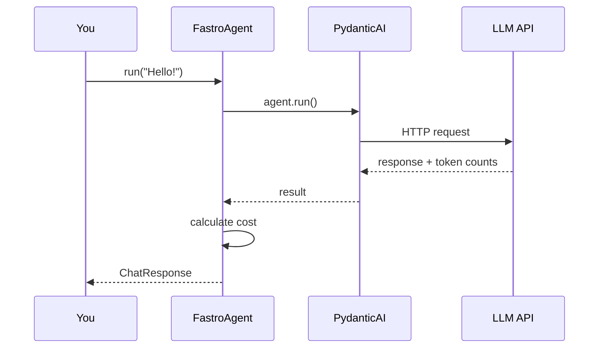

# FastroAgent

FastroAgent wraps PydanticAI's `Agent` with automatic cost calculation, optional distributed tracing, and a consistent response format. Every response includes token counts and cost in microcents (exact integer math, no floating-point drift) so you can track usage, set budgets, and debug cost issues in production.

## How It Works



When you call `agent.run()`, FastroAgent passes your message to the underlying PydanticAI agent, which handles the actual LLM call. When the response comes back, FastroAgent extracts token counts, calculates cost using genai-prices (or your custom pricing), and packages everything into a `ChatResponse` with usage data.

The agent itself is stateless. Conversation history, user context, and retry logic are your responsibility. This keeps FastroAgent simple and predictable.

## Creating an Agent

The simplest agent uses defaults for everything:

```python
from fastroai import FastroAgent

agent = FastroAgent(model="openai:gpt-4o")
```

Add a system prompt and tweak parameters as needed:

```python
agent = FastroAgent(
    model="openai:gpt-4o",
    system_prompt="You are a helpful financial advisor.",
    temperature=0.3,  # More consistent responses
    max_tokens=4096,
)
```

If you're passing configuration around (from environment variables, user settings, or a config file), use `AgentConfig`:

```python
from fastroai import FastroAgent, AgentConfig

config = AgentConfig(
    model="anthropic:claude-3-5-sonnet",
    system_prompt="You are a code reviewer.",
    temperature=0.2,
)

agent = FastroAgent(config=config)
```

### Configuration Reference

| Parameter | Default | Description |
|-----------|---------|-------------|
| `model` | `openai:gpt-4o` | Model identifier with provider prefix |
| `system_prompt` | `"You are a helpful AI assistant."` | Instructions for the model |
| `temperature` | `0.7` | Sampling temperature (0.0-2.0) |
| `max_tokens` | `4096` | Maximum response tokens |
| `timeout_seconds` | `120` | Request timeout |
| `max_retries` | `3` | Retry attempts on failure |

Model names use PydanticAI's provider prefix format: `openai:gpt-4o`, `anthropic:claude-3-5-sonnet`, `google:gemini-1.5-pro`. The prefix tells PydanticAI which API client to use.

## Running Queries

Use `run()` to send a message and get a response:

```python
response = await agent.run("What is the capital of France?")

print(response.output)  # "The capital of France is Paris."
print(response.cost_dollars)  # 0.000234
```

The response includes everything you need for billing and debugging:

```python
print(f"Model: {response.model}")
print(f"Input tokens: {response.input_tokens}")
print(f"Output tokens: {response.output_tokens}")
print(f"Cost: ${response.cost_dollars:.6f}")
print(f"Time: {response.processing_time_ms}ms")
```

### What's in a Response

| Field | Type | What It's For |
|-------|------|---------------|
| `content` | `str` | The response text |
| `output` | `OutputT` | Typed output (same as content for string agents) |
| `model` | `str` | Model that generated the response |
| `input_tokens` | `int` | Prompt tokens consumed |
| `output_tokens` | `int` | Completion tokens generated |
| `cache_read_tokens` | `int` | Tokens read from prompt cache (typically 90% cheaper) |
| `cache_write_tokens` | `int` | Tokens written to prompt cache |
| `cost_microcents` | `int` | Cost in 1/1,000,000 of a dollar (for calculations) |
| `cost_dollars` | `float` | Cost in dollars (for display) |
| `processing_time_ms` | `int` | Wall-clock time |
| `tool_calls` | `list` | Tools invoked during generation |
| `tool_call_count` | `int` | Number of tool invocations |
| `request_count` | `int` | Number of API requests (increases with tool use) |
| `trace_id` | `str` | Tracing correlation ID |
| `usage_details` | `dict` | Provider-specific details (e.g., reasoning tokens) |

Use `cost_microcents` when you need to aggregate costs across many calls - integer math won't drift. Use `cost_dollars` when displaying to users.

When prompt caching is enabled (Anthropic, OpenAI with long prompts), `cache_read_tokens` shows how many tokens came from cache at a 90% discount. This is automatically factored into `cost_microcents`.

## Structured Output

Getting strings back means you have to parse them. For anything structured - extracting entities, classifying content, generating schemas - use Pydantic models instead:

```python
from pydantic import BaseModel
from fastroai import FastroAgent

class MovieReview(BaseModel):
    title: str
    rating: int
    summary: str

agent = FastroAgent(
    model="openai:gpt-4o",
    output_type=MovieReview,
)

response = await agent.run("Review the movie Inception")

# response.output is a MovieReview instance, not a string
print(response.output.title)   # "Inception"
print(response.output.rating)  # 9
print(response.output.summary) # "A mind-bending thriller..."
```

PydanticAI handles the structured output extraction and validation. If the LLM output doesn't match your schema, it retries automatically. You pay for those retry tokens, so keep your schemas reasonable - don't ask for 50 required fields in one call.

## Conversation History

FastroAgent doesn't store conversation history. This sounds annoying until you realize how many ways there are to mess up conversation storage, and how much your storage requirements differ from everyone else's.

You load history from your storage, pass it in, and save new messages yourself:

```python
from pydantic_ai.messages import ModelMessage

# Load from your storage (database, Redis, files, whatever)
history: list[ModelMessage] = await my_storage.load(user_id)

# Pass to the agent
response = await agent.run(
    "Continue our conversation",
    message_history=history,
)

# Save the new user message and response
# You manage how messages are stored - FastroAgent doesn't dictate the format
await my_storage.append(user_id, "Continue our conversation", response.content)
```

This gives you full control. Store history in a database table, Redis with a TTL, or flat files - whatever fits your architecture. Keep conversations forever or clear them after each session. Store complete messages or compress them into summaries. FastroAI doesn't care; it just takes whatever history you pass in.

## Streaming

For long responses, stream chunks as they arrive so users don't stare at a loading spinner:

```python
async for chunk in agent.run_stream("Write a short story"):
    if chunk.is_final:
        # Last chunk has complete usage data
        print(f"\nCost: ${chunk.usage_data.cost_dollars:.6f}")
    else:
        # Print content as it arrives
        print(chunk.content, end="", flush=True)
```

Cost tracking still works - you just get it at the end instead of upfront. The final chunk has `is_final=True` and includes the complete `usage_data` with token counts and cost.

One gotcha: if your connection drops mid-stream, you lose both the partial response and the usage data. Consider logging partial streams if you need that level of tracking.

## Adding Tools

Give agents capabilities by passing toolsets. Here's a simple weather tool:

```python
from pydantic_ai.toolsets import FunctionToolset

def get_weather(city: str) -> str:
    """Get current weather for a city."""
    # Your weather API call here
    return f"Sunny, 72°F in {city}"

toolset = FunctionToolset(tools=[get_weather])

agent = FastroAgent(
    model="openai:gpt-4o",
    system_prompt="You can check the weather.",
    toolsets=[toolset],
)

response = await agent.run("What's the weather in Paris?")
# Agent calls get_weather("Paris") and uses the result
```

Tool calls are tracked in the response:

```python
for call in response.tool_calls:
    print(f"Called: {call['tool_name']}")
    print(f"Args: {call['args']}")
```

In production, tools fail. APIs time out. External services go down. Regular tools crash the whole request when that happens. The [Safe Tools](safe-tools.md) guide covers `@safe_tool`, which wraps tools with timeout, retry, and graceful error handling so failures become messages the LLM can work with instead of exceptions that kill your request.

## Dependencies

Pass runtime dependencies to your tools - database connections, API clients, user context:

```python
class MyDeps:
    def __init__(self, api_key: str, user_id: str):
        self.api_key = api_key
        self.user_id = user_id

response = await agent.run(
    "Search for news about AI",
    deps=MyDeps(api_key="sk-...", user_id="user_123"),
)
```

Your tools receive these deps as their first argument. This keeps tools testable (inject mock deps) and avoids global state.

## Tracing

In production, you need to correlate AI calls with the rest of your request flow. Pass a tracer:

```python
from fastroai import SimpleTracer

tracer = SimpleTracer()
response = await agent.run("Hello", tracer=tracer)

print(response.trace_id)  # "trace_abc123..."
```

`SimpleTracer` logs to Python's logging module - good for development. For production, implement the `Tracer` protocol to send spans to your observability platform (Datadog, Honeycomb, Logfire, etc.). The [Tracing](tracing.md) guide has examples for common platforms.

## Using Existing PydanticAI Agents

Already have a configured PydanticAI agent with custom output types, validators, or complex tooling? Wrap it with FastroAgent to add cost tracking without changing anything else:

```python
from pydantic_ai import Agent
from fastroai import FastroAgent

# Your existing PydanticAI agent
pydantic_agent = Agent(
    model="openai:gpt-4o",
    output_type=MyCustomType,
    # ... your configuration
)

# Wrap it with FastroAgent
fastro_agent = FastroAgent(agent=pydantic_agent)

# Now you get cost tracking on your existing agent
response = await fastro_agent.run("Hello")
print(response.cost_dollars)
```

The underlying agent is always accessible if you need it:

```python
pydantic_agent = fastro_agent.agent
```

## Key Files

| Component | Location |
|-----------|----------|
| FastroAgent | `fastroai/agent/agent.py` |
| AgentConfig | `fastroai/agent/schemas.py` |
| ChatResponse | `fastroai/agent/schemas.py` |
| StreamChunk | `fastroai/agent/schemas.py` |

---

[← Guides Overview](index.md){ .md-button } [Cost Calculator →](cost-calculator.md){ .md-button .md-button--primary }
