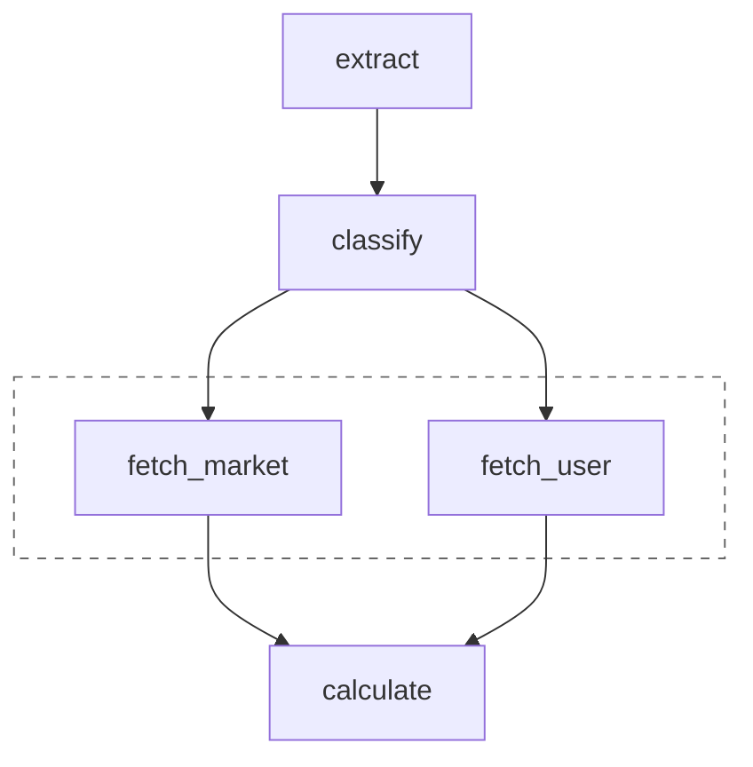
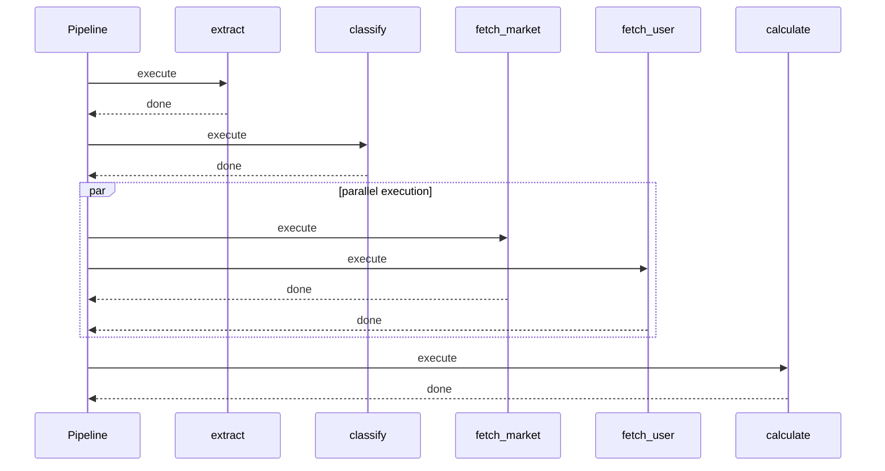

# Pipelines

A single agent call is one thing. Real applications chain multiple calls: extract entities, classify them, look up related data, generate a response. Each step might need different models, different prompts, different retry behavior. And you want to track costs across the whole flow, not just individual calls.

Pipelines orchestrate multi-step AI workflows. You declare your steps and their dependencies. FastroAI figures out what can run in parallel, executes everything in the right order, and aggregates costs and timing across the whole pipeline.

## When to Use Pipelines

Pipelines make sense when you're chaining multiple AI steps - extract entities, then classify them, then summarize. Or when you have independent steps that should run in parallel, like fetching data from multiple sources at once. They're also useful when you need cost tracking across an entire workflow rather than individual calls, or when you want to enforce cost budgets that stop execution before you blow through money.

For a single agent call, use `FastroAgent` directly. The pipeline machinery isn't worth it for one step.

## How Pipelines Work

You define steps and declare which steps depend on which other steps. FastroAI builds a dependency graph, topologically sorts it, and runs steps level by level. Steps at the same level run concurrently.



In this example, `fetch_market` and `fetch_user` both depend on `classify`, so they run in parallel once `classify` completes. The `calculate` step waits for both to finish.

Each step gets a `StepContext` with access to pipeline inputs, outputs from dependency steps, your application deps, and a usage tracker. When you call agents through `ctx.run()`, costs accumulate automatically.

## A Basic Pipeline

Here's a two-step pipeline that extracts entities and then classifies them:

```python
from fastroai import Pipeline, BaseStep, StepContext, FastroAgent

class ExtractStep(BaseStep[None, str]):
    def __init__(self):
        self.agent = FastroAgent(
            model="openai:gpt-4o-mini",
            system_prompt="Extract key entities from text.",
        )

    async def execute(self, ctx: StepContext[None]) -> str:
        document = ctx.get_input("document")
        response = await ctx.run(self.agent, f"Extract entities: {document}")
        return response.output

class ClassifyStep(BaseStep[None, str]):
    def __init__(self):
        self.agent = FastroAgent(
            model="openai:gpt-4o-mini",
            system_prompt="Classify documents.",
        )

    async def execute(self, ctx: StepContext[None]) -> str:
        entities = ctx.get_dependency("extract")
        response = await ctx.run(self.agent, f"Classify based on: {entities}")
        return response.output

pipeline = Pipeline(
    name="document_processor",
    steps={
        "extract": ExtractStep(),
        "classify": ClassifyStep(),
    },
    dependencies={
        "classify": ["extract"],  # classify waits for extract
    },
)

result = await pipeline.execute({"document": "Apple announced..."}, deps=None)
print(result.output)  # Classification result
print(f"Total cost: ${result.usage.total_cost_dollars:.6f}")
```

The `dependencies` dict says "classify depends on extract". FastroAI runs extract first, then classify. If extract fails, classify never runs.

## Three Ways to Define Steps

FastroAI offers three approaches, from simplest to most flexible. Use whichever fits your situation.

### 1. The `@step` Decorator

For steps that don't need initialization or complex state:

```python
from fastroai import step, StepContext

@step
async def transform(ctx: StepContext[None]) -> str:
    text = ctx.get_input("text")
    return text.upper()

@step(timeout=30.0, retries=2)
async def classify(ctx: StepContext[None]) -> str:
    text = ctx.get_dependency("transform")
    response = await ctx.run(classifier_agent, f"Classify: {text}")
    return response.output

pipeline = Pipeline(
    name="processor",
    steps={"transform": transform, "classify": classify},
    dependencies={"classify": ["transform"]},
)
```

The decorator accepts `timeout`, `retries`, `retry_delay`, and `cost_budget` parameters.

### 2. `agent.as_step()`

When a step is just a single agent call with no other logic:

```python
from fastroai import FastroAgent, Pipeline

summarizer = FastroAgent(
    model="openai:gpt-4o-mini",
    system_prompt="Summarize text concisely.",
)

pipeline = Pipeline(
    name="summarizer",
    steps={
        "summarize": summarizer.as_step(
            lambda ctx: f"Summarize: {ctx.get_input('text')}"
        ),
    },
)

result = await pipeline.execute({"text": "Long article..."}, deps=None)
```

The prompt can be a static string or a function that builds it from context.

### 3. `BaseStep` Class

For complex steps with multiple agents, conditional logic, or state:

```python
from fastroai import BaseStep, StepContext, FastroAgent

class ResearchStep(BaseStep[MyDeps, dict]):
    def __init__(self):
        self.classifier = FastroAgent(model="gpt-4o-mini", system_prompt="Classify.")
        self.writer = FastroAgent(model="gpt-4o", system_prompt="Write reports.")

    async def execute(self, ctx: StepContext[MyDeps]) -> dict:
        topic = ctx.get_input("topic")

        # Multiple agent calls with branching logic
        category = await ctx.run(self.classifier, f"Classify: {topic}")

        if "technical" in category.output.lower():
            report = await ctx.run(self.writer, f"Technical report on: {topic}")
        else:
            report = await ctx.run(self.writer, f"General summary of: {topic}")

        return {"category": category.output, "report": report.output}
```

## The `ctx.run()` Method

Always call agents through `ctx.run()` rather than `agent.run()` directly. This is how FastroAI tracks costs and enforces budgets.

```python
response = await ctx.run(agent, "Your message")
```

`ctx.run()` handles the integration work for you. It passes your deps to the agent, forwards the tracer for distributed tracing, and accumulates usage in `ctx.usage` so pipeline-level cost tracking works. It also enforces timeout and retry settings from your config, and checks cost budgets - raising `CostBudgetExceededError` if you've exceeded your limit.

You can override config per-call when one step needs different behavior:

```python
response = await ctx.run(agent, "message", timeout=60.0, retries=5)
```

## Parallel Execution

Steps with different dependencies run in parallel automatically. You don't need to manage asyncio.gather or thread pools.

```python
dependencies = {
    "classify": ["extract"],
    "fetch_market": ["classify"],
    "fetch_user": ["classify"],     # Same dependency as fetch_market
    "calculate": ["fetch_market", "fetch_user"],
}
```

Here's how that executes over time:



FastroAI groups steps by their maximum dependency depth and runs each level concurrently. If a step fails, downstream steps that depend on it won't run, but unrelated steps continue normally.

## Configuration

### Pipeline-Level Defaults

Set defaults that apply to all steps:

```python
from fastroai import Pipeline, PipelineConfig

pipeline = Pipeline(
    name="processor",
    steps={...},
    config=PipelineConfig(
        timeout=30.0,         # Default timeout for all steps
        retries=2,            # Default retry count
        cost_budget=100_000,  # $0.10 total budget (in microcents)
    ),
)
```

### Per-Step Overrides

Override configuration for specific steps:

```python
from fastroai import Pipeline, PipelineConfig, StepConfig

pipeline = Pipeline(
    name="processor",
    steps={...},
    config=PipelineConfig(timeout=30.0),
    step_configs={
        "slow_step": StepConfig(timeout=120.0),
        "expensive_step": StepConfig(cost_budget=50_000),
    },
)
```

### Config Resolution Order

Most specific wins:

1. `PipelineConfig` defaults (lowest priority)
2. Step class `.config` attribute
3. `step_configs[step_id]` override
4. Per-call `ctx.run(timeout=..., retries=...)` override (highest priority)

## Accessing Data

### Pipeline Inputs

Get data passed to `pipeline.execute()`:

```python
async def execute(self, ctx: StepContext[MyDeps]) -> str:
    # Required input - raises KeyError if missing
    document = ctx.get_input("document")

    # Optional input with default
    format_type = ctx.get_input("format", "json")
```

### Dependency Outputs

Get outputs from steps this step depends on:

```python
async def execute(self, ctx: StepContext[MyDeps]) -> str:
    # Get output from extract step
    entities = ctx.get_dependency("extract")

    # With type hint for IDE support
    entities = ctx.get_dependency("extract", ExtractionResult)

    # Optional dependency (might not exist in the graph)
    metadata = ctx.get_dependency_or_none("fetch_metadata", dict)
```

### Application Dependencies

Access your deps object (database connections, user context, API clients):

```python
async def execute(self, ctx: StepContext[MyDeps]) -> str:
    db = ctx.deps.session
    user_id = ctx.deps.user_id
    api_client = ctx.deps.external_api
```

## Error Handling

When a step fails, the pipeline raises `StepExecutionError`. You can catch this and handle it:

```python
from fastroai import StepExecutionError

try:
    result = await pipeline.execute(inputs, deps)
except StepExecutionError as e:
    print(f"Step '{e.step_id}' failed: {e.original_error}")
```

For cost budget violations specifically, the step raises `CostBudgetExceededError`:

```python
from fastroai import CostBudgetExceededError

try:
    result = await pipeline.execute(inputs, deps)
except CostBudgetExceededError as e:
    print(f"Budget exceeded: spent {e.actual_microcents} of {e.budget_microcents}")
```

## Early Termination

For multi-turn conversations or workflows that need user input, steps can signal that more information is needed:

```python
from fastroai import BaseStep, ConversationState, ConversationStatus

class GatherInfoStep(BaseStep[None, ConversationState[dict]]):
    async def execute(self, ctx) -> ConversationState[dict]:
        message = ctx.get_input("message")
        current_data = ctx.get_input("current_data") or {}

        # Extract info from message
        if "email" in message.lower():
            current_data["email"] = extract_email(message)

        # Check if we have everything we need
        required = {"name", "email"}
        missing = required - set(current_data.keys())

        if not missing:
            return ConversationState(
                status=ConversationStatus.COMPLETE,
                data=current_data,
            )

        return ConversationState(
            status=ConversationStatus.INCOMPLETE,
            data=current_data,
            context={"missing": list(missing)},
        )
```

When a step returns `INCOMPLETE`, the pipeline stops early:

```python
result = await pipeline.execute(inputs, deps)

if result.stopped_early:
    missing = result.conversation_state.context["missing"]
    return {"status": "incomplete", "need": missing}

return {"status": "complete", "output": result.output}
```

This lets you build conversational flows where the pipeline pauses to ask the user for more information, then resumes when they respond.

## Usage Tracking

The result includes aggregated usage across all steps:

```python
result = await pipeline.execute(inputs, deps)

if result.usage:
    print(f"Input tokens: {result.usage.total_input_tokens}")
    print(f"Output tokens: {result.usage.total_output_tokens}")
    print(f"Total cost: ${result.usage.total_cost_dollars:.6f}")
```

This is the sum of all agent calls across all steps. If you need per-step breakdowns, log them from within your step implementations.

## Routing Between Pipelines

When different inputs need different processing paths, use `BasePipeline` to route between multiple pipelines.

```python
from fastroai import BasePipeline, Pipeline

class DocumentRouter(BasePipeline[MyDeps, dict, str]):
    def __init__(self):
        super().__init__("document_router")
        self.register_pipeline("simple", simple_pipeline)
        self.register_pipeline("complex", complex_pipeline)

    async def route(self, input_data: dict, deps: MyDeps) -> str:
        word_count = len(input_data["text"].split())
        if word_count < 500:
            return "simple"
        return "complex"

router = DocumentRouter()
result = await router.execute({"text": document}, deps)
```

The `route` method examines the input and returns the name of a registered pipeline. The router then executes that pipeline and returns its result.

### LLM-Based Routing

You can use an LLM to help classify inputs for routing. Your code still controls what happens with that classification:

```python
class SmartRouter(BasePipeline[MyDeps, dict, str]):
    def __init__(self):
        super().__init__("smart_router")
        self.classifier = FastroAgent(
            model="openai:gpt-4o-mini",
            system_prompt="Classify as 'simple' or 'complex'.",
            output_type=Literal["simple", "complex"],
        )
        self.register_pipeline("simple", simple_pipeline)
        self.register_pipeline("complex", complex_pipeline)

    async def route(self, input_data: dict, deps: MyDeps) -> str:
        try:
            result = await self.classifier.run(input_data["text"])
            return result.output
        except Exception:
            # Classification failed - fall back to simple
            return "simple"
```

The LLM handles classification (what it's good at), but your code handles failures and makes the final routing decision.

### Common Use Cases

- **Complexity-based routing**: Simple inputs get fast processing, complex ones get thorough analysis
- **A/B testing**: Route a percentage of requests to an experimental pipeline
- **Fallback chains**: Try the primary pipeline, fall back to a simpler one on failure

The router has the same interface as a regular pipeline - it takes inputs and deps, returns a `PipelineResult`. Calling code doesn't need to know routing is happening.

## Key Files

| Component | Location |
|-----------|----------|
| Pipeline | `fastroai/pipelines/pipeline.py` |
| BasePipeline | `fastroai/pipelines/router.py` |
| BaseStep | `fastroai/pipelines/base.py` |
| StepContext | `fastroai/pipelines/base.py` |
| @step decorator | `fastroai/pipelines/decorators.py` |
| StepConfig | `fastroai/pipelines/config.py` |
| PipelineConfig | `fastroai/pipelines/config.py` |
| ConversationState | `fastroai/pipelines/base.py` |

---

[← Cost Calculator](cost-calculator.md){ .md-button } [Safe Tools →](safe-tools.md){ .md-button .md-button--primary }
