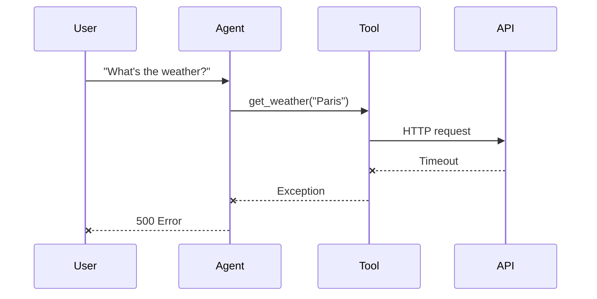
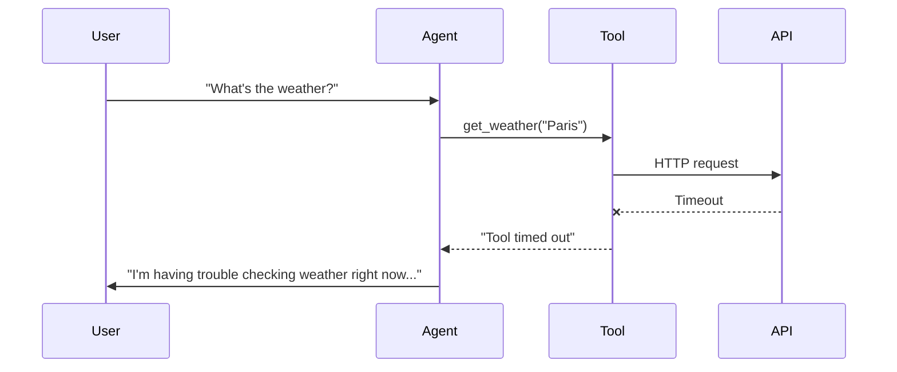

# Safe Tools

Tools that call external services can fail. APIs time out, return errors, or hang indefinitely. When a regular tool fails, the whole agent request crashes and the user sees an error. The AI never gets a chance to respond gracefully.

`@safe_tool` wraps tools with timeout, retry, and graceful error handling. When something goes wrong, the AI receives an error message instead of an exception. It can then respond appropriately - apologize, suggest alternatives, or try a different approach.

## How It Works

```python
from fastroai import safe_tool

@safe_tool(timeout=10, max_retries=2)
async def fetch_weather(location: str) -> str:
    """Get weather for a location."""
    async with httpx.AsyncClient() as client:
        response = await client.get(f"https://api.weather.com/{location}")
        return response.text
```

When the API is slow or fails:

1. The wrapper waits up to 10 seconds for the first attempt
2. If it times out or errors, it retries (up to 2 more attempts)
3. Retries use exponential backoff (0.1s, 0.2s, 0.4s...)
4. If all attempts fail, it returns an error message string

The AI sees "Tool timed out after 2 attempts" and can respond: "I'm having trouble getting weather data right now. Would you like me to try again, or is there something else I can help with?"

Your request doesn't crash. You don't lose the prompt tokens. The user gets a response.

## Decorator Options

```python
@safe_tool(
    timeout=30,          # Seconds per attempt (default: 30)
    max_retries=3,       # Total attempts (default: 3)
    on_timeout="...",    # Custom timeout message
    on_error="...",      # Custom error message
)
```

| Parameter | Default | Description |
|-----------|---------|-------------|
| `timeout` | `30` | Maximum seconds per attempt |
| `max_retries` | `3` | Total attempts before giving up |
| `on_timeout` | `"Tool timed out after {max_retries} attempts"` | Message on timeout |
| `on_error` | `"Tool failed: {error}"` | Message on error (use `{error}` placeholder) |

## Custom Error Messages

Generic error messages are fine for development, but in production you want messages that help the AI respond well:

```python
@safe_tool(
    timeout=30,
    on_timeout="Web search is taking too long. Suggest the user try a simpler query.",
    on_error="Web search is currently unavailable: {error}. Apologize and offer alternatives.",
)
async def web_search(query: str) -> str:
    """Search the web."""
    ...
```

The AI receives these messages as tool output and incorporates them into its response. Clearer error messages lead to better AI responses.

## Retry Behavior

Retries use exponential backoff to avoid hammering a struggling service:

| Attempt | Delay Before |
|---------|--------------|
| 1 | immediate |
| 2 | 0.1s |
| 3 | 0.2s |
| 4 | 0.4s |
| 5 | 0.8s |

The delays are short because you're holding a user request. If a service needs multiple seconds to recover, three quick retries aren't going to help anyway.

For services that need longer recovery time, reduce `max_retries` and increase `timeout` instead.

## Organizing Tools with Toolsets

When you have multiple tools, group them:

```python
from fastroai import safe_tool, SafeToolset

@safe_tool(timeout=10)
async def get_weather(location: str) -> str:
    """Get current weather."""
    ...

@safe_tool(timeout=30)
async def web_search(query: str) -> str:
    """Search the web."""
    ...

class WebToolset(SafeToolset):
    def __init__(self):
        super().__init__(
            tools=[get_weather, web_search],
            name="web",
        )
```

Then pass the toolset to your agent:

```python
from fastroai import FastroAgent

agent = FastroAgent(
    model="openai:gpt-4o",
    system_prompt="You can check weather and search the web.",
    toolsets=[WebToolset()],
)
```

`SafeToolset` is a marker class that indicates all tools in the set have proper timeout and error handling. It extends PydanticAI's `FunctionToolset` with a name for logging and debugging.

## When to Use Safe Tools

Use `@safe_tool` for anything that touches the outside world. Network requests to APIs that might be slow or down. Database queries that could timeout. File system operations on paths that might not exist. Third-party services with rate limits or auth that expires. Basically, if something outside your process can make the tool fail or hang, wrap it.

You can skip it for pure computation - math, string manipulation, data transformation. These either work or they don't, and if they don't, something's fundamentally broken anyway. Same for simple lookups in local data structures or cached values.

## What Happens When Tools Fail

With regular tools, a timeout or error crashes the whole request:



With safe tools, failures become messages the AI can work with:



The AI incorporates the failure into its response and the user gets a helpful answer instead of an error page.

## Testing Safe Tools

In tests, you probably want errors to propagate so you can verify your error handling. Mock the underlying service rather than the safe_tool wrapper:

```python
@pytest.fixture
def mock_weather_api(monkeypatch):
    async def mock_get(*args, **kwargs):
        raise httpx.TimeoutException("test timeout")
    monkeypatch.setattr(httpx.AsyncClient, "get", mock_get)

async def test_weather_timeout(mock_weather_api):
    result = await fetch_weather("London")
    assert "timed out" in result.lower()
```

The safe_tool wrapper returns the error message, so your test can verify the AI receives appropriate feedback.

## Complete Example

```python
from fastroai import FastroAgent, safe_tool, SafeToolset

@safe_tool(timeout=10, max_retries=2)
async def get_stock_price(symbol: str) -> str:
    """Get current stock price."""
    async with httpx.AsyncClient() as client:
        resp = await client.get(f"https://api.stocks.com/{symbol}")
        data = resp.json()
        return f"${data['price']}"

@safe_tool(
    timeout=5,
    on_error="Could not get exchange rate: {error}. Suggest using approximate rates.",
)
async def get_exchange_rate(from_currency: str, to_currency: str) -> str:
    """Get exchange rate between currencies."""
    async with httpx.AsyncClient() as client:
        resp = await client.get(
            f"https://api.exchange.com/rate?from={from_currency}&to={to_currency}"
        )
        return resp.json()["rate"]

class FinanceToolset(SafeToolset):
    def __init__(self):
        super().__init__(
            tools=[get_stock_price, get_exchange_rate],
            name="finance",
        )

agent = FastroAgent(
    model="openai:gpt-4o",
    system_prompt="You are a financial assistant with access to stock prices and exchange rates.",
    toolsets=[FinanceToolset()],
)

response = await agent.run("What's the current price of AAPL in euros?")
```

If the stock API is down, the agent might respond: "I'm having trouble getting stock prices right now. Based on recent data, AAPL was trading around $180. Would you like me to try again in a moment?"

That's a much better experience than a 500 error.

## Key Files

| Component | Location |
|-----------|----------|
| @safe_tool | `fastroai/tools/decorators.py` |
| SafeToolset | `fastroai/tools/toolsets.py` |
| FunctionToolsetBase | `fastroai/tools/toolsets.py` |

---

[← Pipelines](pipelines.md){ .md-button } [Tracing →](tracing.md){ .md-button .md-button--primary }
