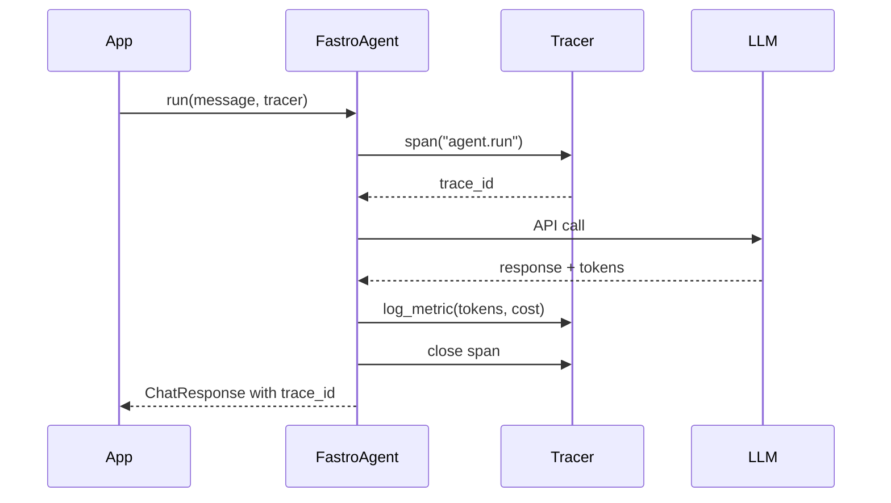

# Tracing

AI calls are part of larger request flows. Without tracing, you know a request was slow or expensive, but not which AI call caused it.

FastroAI provides a protocol-based tracing interface that integrates with any observability backend. Pass a tracer to correlate AI calls with the rest of your application - each response includes a trace ID you can search for in your observability platform.

## How Tracing Works



When you pass a tracer to `agent.run()`, FastroAgent creates a span with a unique trace ID, makes the LLM call, records token usage and cost as metrics, then closes the span. The trace ID comes back in the response so you can correlate it with your logs.

## Quick Start

`SimpleTracer` logs to Python's logging module. Good for development and debugging:

```python
from fastroai import FastroAgent, SimpleTracer

tracer = SimpleTracer()
agent = FastroAgent(model="openai:gpt-4o")

response = await agent.run("Hello!", tracer=tracer)
print(response.trace_id)  # "abc12345-..."
```

Logs output:

```
INFO [abc12345] Starting fastroai.agent.run
INFO [abc12345] Metric input_tokens=12
INFO [abc12345] Metric output_tokens=8
INFO [abc12345] Metric cost_microcents=250
INFO [abc12345] Completed fastroai.agent.run in 0.847s
```

When something fails:

```
ERROR [abc12345] FAILED fastroai.agent.run after 0.456s: Connection timeout
```

## Built-in Tracers

### SimpleTracer

Logs to Python's logging module. Use for development, debugging, or when you just need basic visibility:

```python
from fastroai import SimpleTracer
import logging

# Use default logger
tracer = SimpleTracer()

# Or use your own logger
logger = logging.getLogger("my_app.ai")
tracer = SimpleTracer(logger=logger)
```

The trace ID appears in every log line, so you can grep for it:

```bash
grep "abc12345" app.log
```

### LogfireTracer

Integrates with [Pydantic Logfire](https://logfire.pydantic.dev/), a modern observability platform built by the Pydantic team. Install with:

```bash
pip install fastroai[logfire]
```

Usage:

```python
import logfire
from fastroai import FastroAgent, LogfireTracer

# Configure logfire once at startup
logfire.configure()

tracer = LogfireTracer()
agent = FastroAgent(model="openai:gpt-4o")
response = await agent.run("Hello!", tracer=tracer)
```

View your traces in the Logfire dashboard at [logfire.pydantic.dev](https://logfire.pydantic.dev).

### NoOpTracer

Does nothing. Use when tracing is disabled, in tests, or when you need trace IDs for compatibility but don't want actual tracing:

```python
from fastroai import NoOpTracer

tracer = NoOpTracer()

# Still generates trace IDs for compatibility
async with tracer.span("operation") as trace_id:
    result = await do_something()
    # trace_id exists, but no logging happens
```

FastroAI uses `NoOpTracer` internally when you don't pass a tracer. Your code doesn't crash, you just don't get observability.

## The Tracer Protocol

To integrate with your observability platform, implement this protocol:

```python
from typing import Protocol, Any
from contextlib import AbstractAsyncContextManager

class Tracer(Protocol):
    def span(self, name: str, **attributes: Any) -> AbstractAsyncContextManager[str]:
        """Create a traced span. Yields a unique trace ID."""
        ...

    def log_metric(self, trace_id: str, name: str, value: Any) -> None:
        """Log a metric associated with a trace."""
        ...

    def log_error(self, trace_id: str, error: Exception, context: dict | None = None) -> None:
        """Log an error associated with a trace."""
        ...
```

Three methods. That's it. `span()` creates a context manager that yields a trace ID. `log_metric()` records values during the span. `log_error()` records failures.

## Platform Integrations

### Logfire

FastroAI includes a built-in `LogfireTracer`. See the [LogfireTracer](#logfiretracer) section above for usage.

Logfire gives you a nice UI to explore traces, and the Pydantic team maintains it, so it plays well with PydanticAI.

### OpenTelemetry

OpenTelemetry is the standard for distributed tracing. Most observability platforms (Datadog, Honeycomb, Jaeger, etc.) support OTLP export:

```python
import uuid
from contextlib import asynccontextmanager
from opentelemetry import trace as otel_trace

class OTelTracer:
    def __init__(self):
        self.tracer = otel_trace.get_tracer("fastroai")

    @asynccontextmanager
    async def span(self, name: str, **attrs):
        trace_id = str(uuid.uuid4())
        with self.tracer.start_as_current_span(name) as span:
            span.set_attribute("trace_id", trace_id)
            for key, value in attrs.items():
                span.set_attribute(key, value)
            yield trace_id

    def log_metric(self, trace_id: str, name: str, value):
        span = otel_trace.get_current_span()
        span.set_attribute(f"metric.{name}", value)

    def log_error(self, trace_id: str, error: Exception, context=None):
        span = otel_trace.get_current_span()
        span.record_exception(error)
        span.set_status(otel_trace.Status(otel_trace.StatusCode.ERROR))
```

Configure your OTLP exporter separately, then spans show up in your platform.

## Using Tracers

### With Agents

```python
response = await agent.run("Hello!", tracer=tracer)
print(response.trace_id)
```

### With Pipelines

```python
result = await pipeline.execute(
    {"document": doc},
    deps=my_deps,
    tracer=tracer,
)
```

The tracer flows through to all steps. Each step's agent calls share the same trace context.

### Custom Spans

Create your own spans within step execution for operations you want to trace:

```python
class MyStep(BaseStep[MyDeps, str]):
    async def execute(self, ctx: StepContext[MyDeps]) -> str:
        if ctx.tracer:
            async with ctx.tracer.span("custom_operation", user_id=ctx.deps.user_id) as trace_id:
                result = await self.do_something()
                ctx.tracer.log_metric(trace_id, "result_size", len(result))
                return result

        # Fallback when no tracer
        return await self.do_something()
```

## What Gets Traced

FastroAI automatically creates spans for agent runs (`fastroai.agent.run`, `fastroai.agent.run_stream`) and pipeline execution (`pipeline.{name}`). Within those spans, it logs token usage metrics: `input_tokens`, `output_tokens`, and `cost_microcents`.

The trace ID is included in every `ChatResponse`:

```python
response = await agent.run("Hello!")
print(response.trace_id)  # Use this to correlate with your logs
```

Log the trace ID in your application code, and you can trace from "user clicked button" all the way to "AI returned 347 tokens".

## Trace Correlation

The real value of tracing is correlation. Here's how to connect AI calls with your request handling:

```python
from fastroai import LogfireTracer

async def handle_request(request):
    tracer = LogfireTracer()

    # Your business logic span
    async with tracer.span("handle_request", user_id=request.user_id) as parent_trace:
        # AI call is nested under your span
        response = await agent.run(request.message, tracer=tracer)

        # Log business metrics
        tracer.log_metric(response.trace_id, "response_length", len(response.content))

        return response.output
```

When something goes wrong, search your observability platform by trace ID to see:

1. The HTTP request came in
2. You authenticated the user
3. The AI call started
4. Token usage and cost
5. Where it failed or how long it took
6. The response went out

Without tracing, you're debugging blind.

## Production Considerations

**Sampling**: In high-volume production, you might not want to trace every request. Most observability platforms support sampling - trace 10% of requests, or always trace errors.

**Costs**: Tracing adds some overhead. The overhead is small (microseconds), but the data you send to your observability platform costs money. Consider what you actually need.

**Sensitive data**: Don't log prompts or responses in production traces. They might contain PII or sensitive business data. Log token counts and costs, not content.

## Key Files

| Component | Location |
|-----------|----------|
| Tracer protocol | `fastroai/tracing/tracer.py` |
| SimpleTracer | `fastroai/tracing/tracer.py` |
| LogfireTracer | `fastroai/tracing/tracer.py` |
| NoOpTracer | `fastroai/tracing/tracer.py` |

---

[← Safe Tools](safe-tools.md){ .md-button } [Recipes →](../recipes/index.md){ .md-button .md-button--primary }
