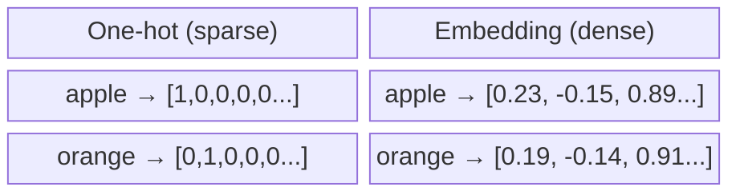
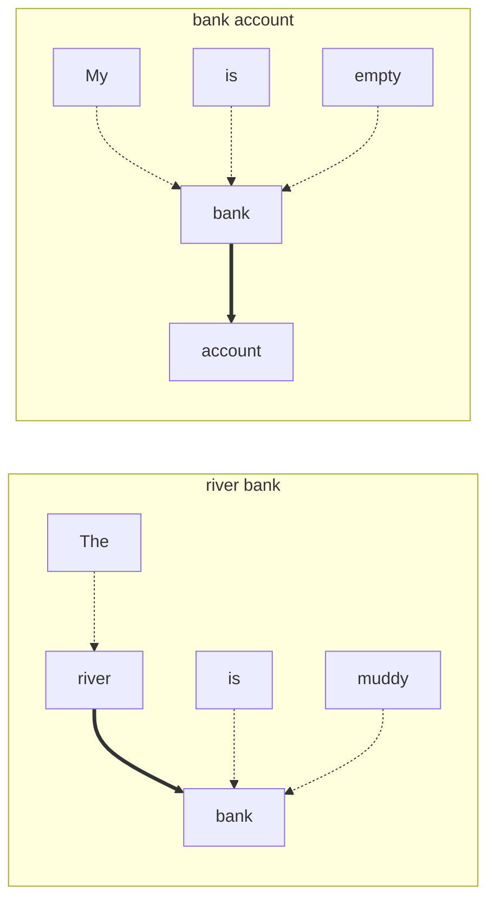
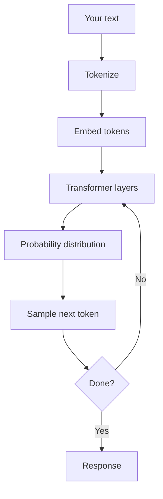

# How Language Models Work

**Understanding what happens between your code and the AI response.**

When you call an LLM API, something happens between your text and the response. Hopefully understanding what's actually happening will help you build better applications and debug problems when things go wrong. Either way it's a really cool thing to learn.

You don't need to understand all of the math, but you do need to understand the mechanics well enough to know why prompts work the way they do, why costs scale with tokens, and why models sometimes produce nonsense.

## The Challenge: Computers and Text

Computers have been working with text since the beginning. Early systems stored characters as numbers (ASCII gave us 'A' = 65, 'B' = 66, and so on), and we could search for exact strings, count word frequencies, and match patterns with regular expressions.

This worked fine for many tasks. Database queries, log parsing, form validation - if you know exactly what you're looking for, exact string matching is fast and reliable.

But language is messy. Someone reports their app is "broken" when your error logs say "connection timeout." A user asks about "cheap options" when your pricing page says "affordable plans." Exact string matching doesn't understand that these refer to the same things.

The field of Natural Language Processing (NLP) spent decades trying to solve this. Early approaches used rules and dictionaries - manually curated synonym lists, grammar parsers, sentiment lexicons. These worked for narrow domains but getting nuance right is hard. You can't anticipate every way someone might phrase a question.

What we actually need is a system that understands meaning, not just matches characters. But there's a fundamental constraint: computers work with numbers. They can add, compare, and transform numbers easily. They're terrible at understanding that "I'm furious" and "I'm angry" mean roughly the same thing, or that "bank" means something different in "river bank" versus "bank account."

If we want computers to work with language meaningfully, we need to turn text into numbers somehow. But how?

## Representing Text as Numbers

If we want to find text that's semantically similar (not just string-matching), we need some way to measure how "close" two pieces of text are. We need a distance metric.

Let's start simple. The words "king" and "queen" are related - both are royalty. Maybe we can use letter patterns? Compare characters, count letters, look at structure.

But then "king" and "ring" share three out of four letters. Structurally they're almost identical. Yet semantically, "king" and "queen" are far more related than "king" and "ring."

Letter structure doesn't capture meaning. The only thing computers can measure distance between is numbers. So we have two problems:

1. How do we turn words into numbers?
2. How do we make the distance between those numbers represent semantic similarity?

---

The most obvious approach to turn words into numbers is giving each word a unique identifier. "Apples" is word #1, "oranges" is word #2, "trucks" is word #3. We can represent this as a vector where only one position is "hot" (set to 1):

|     | I | like | apples | oranges | trucks |
|-----|---|------|--------|---------|--------|
| I like apples | 1 | 1 | 1 | 0 | 0 |
| I like oranges | 1 | 1 | 0 | 1 | 0 |
| I like trucks | 1 | 1 | 0 | 0 | 1 |

Now we have text as numbers. But if you have 50,000 words in your vocabulary, each word becomes a vector of 50,000 numbers with a single 1 and 49,999 zeros. These vectors are huge and mostly empty - we call them "sparse."

Also, the representation tells us nothing about meaning (the second problem we need to tackle). The distance between "apples" and "oranges" might be exactly the same as the distance between "apples" and "trucks." We've turned text into numbers, but those numbers don't capture any semantic information.

---

Think about your phone's autocomplete. When you type "I had a delicious," it suggests "meal," "dinner," or "breakfast" - not "quantum" or "democracy." It learned that certain words follow "delicious" more often than others by analyzing lots of text.

This next-word prediction has been around for years, and it partially solves our problem. If a model can predict that "meal" is likely after "I had a delicious," it must have learned something about what "delicious" means and what things can be delicious.

Word embeddings exploit this: **words that appear in similar contexts have similar meanings.**

"Apple" and "orange" both show up near words like "fruit," "eat," "juice," "fresh." They appear in similar sentence structures: "I ate an ___," "The ___ was ripe," "A fresh ______." So if you train a model to predict words from their surrounding context, words that fit the same contexts will develop similar internal representations. Process billions of sentences, and the model learns number patterns where semantically similar words end up close together.

---

The training works like this: start with random real numbers for each word's vector. Read millions of sentences and try to predict words from context. When the model sees "I bought some ___ at the market," it should predict "apples" or "oranges" are likely, while "trucks" is not.

Each wrong prediction adjusts the vectors slightly. After processing billions of sentences, words that appear in similar contexts end up with similar number patterns. Instead of sparse vectors with mostly zeros, you get dense vectors - maybe 768 or 1536 dimensions - where every number carries some meaning.



The word "apple" might become `[0.23, -0.15, 0.89, ...]` while "orange" becomes `[0.19, -0.14, 0.91, ...]`. The numbers are similar because these words appeared in similar contexts. A word like "democracy" would have completely different numbers - it shows up near "vote," "government," "freedom."

We don't interpret individual dimensions - what does dimension 347 represent? We don't know and don't need to. What matters is that similar concepts end up pointing in similar directions in this high-dimensional space.

These vectors capture nuanced relationships. The famous example: `king - man + woman ≈ queen`. Vector arithmetic works because the model "learned" gender relationships from context.

## Tokenization

Before a model can work with your text, it needs to break it into pieces. Each piece gets an embedding, and those embeddings flow through the model. But how do we split text?

The obvious approach: split on spaces. "The cat sat" becomes ["The", "cat", "sat"]. Simple.

But this creates problems. English has hundreds of thousands of words. Add technical terms, names, typos, and other languages - the vocabulary would be enormous. Every word needs its own embedding vector. And what happens when you encounter a word you've never seen? "Cryptocurrency" probably wasn't in any training data from 2005.

What about the opposite extreme? Split into individual characters. The vocabulary shrinks to maybe 100 characters - letters, digits, punctuation. No out-of-vocabulary problem. Every possible word can be spelled.

But now "cat" becomes ["c", "a", "t"]. Three tokens instead of one. A sentence becomes dozens of tokens. The model has to learn that "c-a-t" means a furry animal - the relationship between characters and meaning isn't obvious. Sequences get very long, and longer sequences are slower and more expensive to process.

Subword tokenization finds a middle ground. Instead of words or characters, you learn a vocabulary of useful pieces. Common words like "the" stay whole. Rare words get split into recognizable chunks:

```
"Hello, world!" → ["Hello", ",", " world", "!"]
"unhappiness" → ["un", "happiness"]
"cryptocurrency" → ["crypt", "ocur", "rency"]
```

The model learns embeddings for these subwords. Linguists call these meaningful units "morphemes" - "un" often means negation, "ness" turns adjectives into nouns, "ed" marks past tense. Subword tokenization rediscovers this structure from data. The model can handle words it's never seen by combining pieces it knows.

This is important for you in two ways (beyond the fact that it's cool):

**Costs are per-token, not per-word.** A short message with unusual words might cost more than a longer message with common words. "Supercalifragilisticexpialidocious" is 7 tokens, while "the cat sat on the mat" is 6.

**Context windows are measured in tokens.** When a model has a "128K context window," that's tokens, not words. A document with lots of code, technical terms, or non-English text uses more tokens than you might expect.

You can experiment with this using OpenAI's tiktoken library or their online tokenizer to see exactly how your text gets split.

## How Language Models Work

We now have a way to turn text into meaningful numbers. But embeddings alone just give us word vectors - they don't generate text.

The next step was predicting not just similar words, but the actual next word in a sequence. This is the core insight behind modern LLMs: **predict the next token.**

Given "The cat sat on the," what comes next? Probably "mat" or "floor" or "couch." Almost certainly not "democracy" or "quantum."

Training a language model means showing it billions of sentences and asking it to predict what comes next. When it guesses wrong, it adjusts its internal weights slightly. After seeing enough text, the model becomes very good at predicting likely continuations.

This sounds almost too simple. But predicting the next token requires a lot of implicit knowledge:

- Grammar: "The cat sat on the ___" needs a noun
- Semantics: The noun should be something a cat can sit on
- World knowledge: Cats sit on mats, floors, laps, keyboards
- Context: If earlier text mentioned a garden, "bench" becomes more likely

When you prompt a model with "Write a poem about the ocean," you're not giving it a special instruction. You're giving it tokens, and it's predicting what tokens would likely follow. Text that starts with "Write a poem" is usually followed by... a poem. So it generates one.

---

Early language models processed text sequentially, one word at a time, carrying forward a compressed representation. They struggled with long-range dependencies. In "The book that the student borrowed was overdue," which word does "was" refer to? The book, not the student. Sequential models often got confused.

Attention mechanisms changed this. Instead of processing tokens in order, attention lets the model look at all tokens simultaneously and decide which ones are relevant to each other.

When processing "was" in our example, the model learns to pay attention to "book" (the subject) while mostly ignoring "student" (inside a relative clause). This attention pattern is learned from data, not programmed.

"Bank" in "river bank" attends strongly to "river." "Bank" in "bank account" attends to "account." Same word, different attention patterns, different meanings.



The thick arrows show where "bank" pays the most attention - it looks at "river" in one context and "account" in the other to figure out its meaning.

---

The Transformer architecture (2017's "Attention Is All You Need" paper) stacks many layers of attention. Each layer refines the representation, building increasingly abstract understanding of the text.

The key advantage is parallelization. Unlike sequential models that process one token at a time, transformers process all tokens simultaneously. This made it possible to train on vastly more data than before.

GPT models are transformers trained on internet-scale text. GPT-3 was trained on hundreds of billions of tokens. GPT-4 and Claude on even more. The architecture is conceptually simple: stack attention layers, train on lots of text, predict the next token.

What's interesting is that this simple objective leads to emergent capabilities. Models trained this way learn to answer questions (because Q&A exists in training data), write code (because code exists), reason through problems (because step-by-step reasoning exists), and follow instructions (because instructional text exists).

Nobody explicitly programmed these capabilities. They emerged from scale and the training process.

## The Full Pipeline

When you call `agent.run("What's the weather in Paris?")`, this is the sequence:



Your text gets split into tokens, each token becomes an embedding vector, those vectors pass through transformer layers with attention refining the representation at each layer. The final layer produces a probability distribution over all possible next tokens, the model samples one (with randomness controlled by temperature), and then it repeats until a stop condition.

The response is built token by token, left to right. The model doesn't plan the whole response and then write it. It generates each token based on everything before it - your prompt plus whatever it has generated so far.

This explains why streaming works: each token can be sent as it's generated. It also explains why models sometimes contradict themselves or forget constraints - they're predicting locally, one token at a time, without a global plan.

## Practical Implications

Understanding this architecture changes how you think about building with LLMs:

**Prompts aren't instructions in a special language.** You're providing context that makes certain continuations more likely. "You are a helpful assistant" works because text written by helpful assistants looks different from text written by unhelpful ones.

**Token limits are fundamental, not artificial.** The model can only attend to tokens in its context window. If your conversation exceeds the limit, older messages get cut. This isn't a bug - it's how transformers work.

**Cost scales with tokens.** Longer prompts, longer responses, more money. Every token matters when you're paying for millions of them.

**Temperature controls randomness.** At temperature 0, the model always picks the most likely next token. Higher temperatures make less likely tokens more probable - more creative, or more chaotic.

**Models don't remember between calls.** Each API call is independent. What seems like memory is you sending previous messages as part of the current prompt.

These aren't arbitrary API limitations, they're direct consequences of how language models work, their architecture.

---

You now understand what happens between your code and the response. But knowing how models work doesn't tell you when to use them. In the next section, we'll look at what LLMs are actually good at - and more importantly, where they fail.

[What LLMs Can and Can't Do →](1-what-llms-can-and-cant-do.md){ .md-button .md-button--primary }
