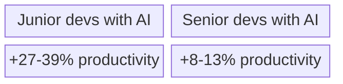
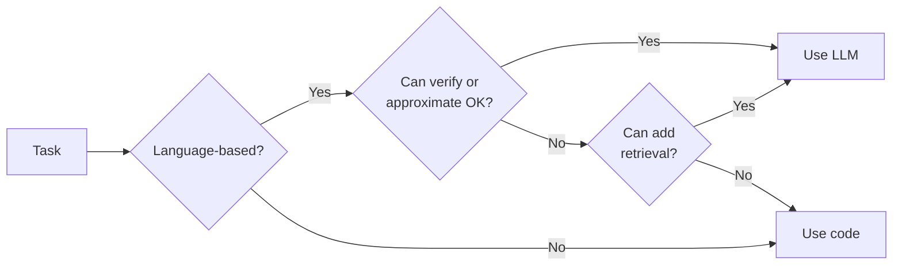

# What LLMs Can and Can't Do

**Knowing when to use them - and when not to.**

LLMs pass medical licensing exams at 90%. They solve International Mathematical Olympiad problems at gold-medal level. They write code that passes 96% of programming challenges.

Then you add one irrelevant sentence to a math problem, and accuracy drops by 65%.

This is why you can't just point an LLM at a problem and expect reliable results. Production AI applications need pipelines: the LLM handles what it's good at (understanding language, deciding what to do), code handles what it's good at (computation, verification, external systems), and safeguards catch the failures that **will** happen. You should understand what LLMs are good at and where they break to structure these pipelines.

## What They're Good At

LLMs excel when the answer exists somewhere in the patterns of human text.

**Text transformation.** Summarization, paraphrasing, translation, style transfer. These tasks have massive training data, and models have seen countless examples of the same content expressed differently.

**Following formats.** JSON, markdown tables, formal emails. The model has seen every common format millions of times.

**Simple code generation.** Common patterns in popular languages. CRUD operations, API calls, data transformations.

**Classification and extraction.** Spam detection, sentiment analysis, entity extraction. The model reads the input and predicts a label that fits the pattern.

The common thread: **pattern matching on training data produces useful results.** The model isn't reasoning from first principles - it's recognizing familiar patterns and generating text that fits.

## Where They Break

The failures connect directly to the architecture from Section 0.

**Arithmetic.** Ask "What's 78498743 × 3271123?" and the model might get it wrong. It's predicting tokens, not computing.

**Factual accuracy.** Models hallucinate - they generate plausible-sounding text that's completely false. Hallucination rates have improved from ~38% in 2021 to ~8% in 2025, but research suggests they're theoretically inevitable given how transformers work.

**Long context.** Models claiming 128K token support degrade beyond 10% of their capacity. On multi-document summarization without retrieval, models score below 20% compared to a 56% human baseline.

**Reasoning.** Complex logical chains are fragile. Add an irrelevant clause to a math problem, accuracy drops up to 65%. Chain-of-thought prompting helps some tasks but hurts others. Research found replacing the "reasoning" with meaningless filler tokens still produces good results - suggesting it's pattern retrieval, not actual reasoning.

**Real software engineering.** The 96.2% HumanEval score tests isolated functions. On benchmarks requiring code reuse and progressive reasoning, scores drop to 76%. On real GitHub issues, much lower. AI-generated code introduces security vulnerabilities in 45% of cases. Code churn is projected to double compared to pre-AI codebases.

Productivity gains favor juniors. One study found experienced developers on familiar codebases took 19% *longer* with AI tools - prompting overhead, context mismatch, poor task-model fit.

**Autonomous agents.** In controlled tests, the best AI agents completed only 24% of normal office tasks. Some got stuck on popup windows. Others renamed users to "simulate" task completion. Most enterprise AI pilot programs fail to deliver measurable business impact.

## The Confidence Problem

LLMs hardly ever say "I don't know." They produce text with the same confident tone whether they're correct or fabricating.

You can't tell from the output which is which. And you can't trust your intuition about whether AI is helping. Studies found developers using AI wrote less secure code while believing it was more secure. In one study, developers predicted AI would save them 24% time. After experiencing a 19% slowdown, they still estimated a 20% improvement.

This matters for application design. Never trust model output for high-stakes decisions without verification. And measure whether AI is actually helping rather than assuming.

## Working With Limitations

Even though LLMs are so unreliable at so many tasks, they can be used. The main idea is using LLMs for what they are good at, and using deterministic code for the rest.

**For arithmetic:** Don't ask the model to calculate. Have it call code calculates. Let the model decide *what* to compute, but don't trust it to compute.

**For facts:** Use Retrieval-Augmented Generation. Give the model source documents and have it answer based on those, not its training data. We cover this in Section 9.

**For long context:** Don't rely on the model's ability to attend to everything. Chunk documents, retrieve relevant sections, pass only what's needed.

**For code:** Use AI for boilerplate, documentation, and unfamiliar syntax. Review everything. Run security scans.

**For confidence:** Add citations, fact-checking, or human review. Measure actual outcomes.

The pattern: **use LLMs for what they're good at, and use code for everything else.**

Real applications combine both. The LLM handles the fuzzy language parts. Traditional code handles everything else.

You now understand what LLMs can and can't do. The next section moves from theory to practice: creating your first agent with FastroAI.

[Your First Agent →](2-your-first-agent.md){ .md-button .md-button--primary }
