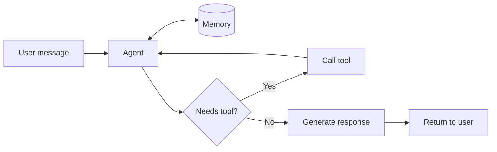

# Your First Agent

**From API calls to something that acts.**

The word "agent" gets thrown around a lot in AI. Sometimes it means a system that can browse the web and write code autonomously. Sometimes it means a chatbot with a system prompt. The term is fuzzy because it comes from philosophy, got borrowed by AI researchers, and now means different things to different people.

Before we build one, let's understand what we're actually talking about.

## What Is an Agent?

The concept has deep roots. Aristotle linked agency to voluntary action arising from deliberate choice, distinguishing intentional behavior from involuntary reactions. Kant positioned autonomy (the capacity for self-governance) at the core of what it means to be an agent.

The main concept: an agent is the *source* of action, not merely reacting to stimuli.

In AI research, the standard textbook definition comes from Russell and Norvig: "An agent is anything that perceives its environment (using sensors) and acts upon it (using actuators)." This is deliberately broad and pragmatic - designed for engineering, not philosophy.

For a more rigorous framework, Barandiaran, Di Paolo, and Rohde (2009) proposed three necessary conditions for genuine agency:

1. **Individuality** - the system defines its own boundaries
2. **Interactional asymmetry** - it acts on its environment, not just responds to it
3. **Normativity** - it regulates activity according to internal goals

Their synthesis: "Agency is an autonomous organization that adaptively regulates its coupling with its environment and contributes to sustaining itself."

Try applying this to an LLM and things get fuzzy. Is the system prompt part of the agent's goals? Is the context window its "individuality"? Where does the LLM end and the environment begin? These questions don't have principled answers because LLMs weren't designed with this framework in mind.

## Agents in the LLM Context

Yoav Goldberg cuts through the philosophical ambiguity with a pragmatic definition. An LLM agent has:

1. A **prompt** defining its behavior
2. **Tools** it can call
3. A **multi-step process** with memory between calls

That's what we'll use.



The LLM decides what to do. Memory holds the conversation history and previous reasoning steps. If the agent needs information or capabilities it doesn't have, it calls a tool. The result goes back to the LLM, which continues reasoning. This loop repeats until the agent has an answer.

This is different from a simple API call. With a raw LLM call, you send a prompt and get text back. With an agent, the LLM can take multiple steps, use external tools, and maintain context across those steps. The "agency" is in that loop - the system acts on its environment rather than just responding.

## FastroAgent

FastroAgent provides the tools to implement this loop. Looking at Goldberg's three components:

```python
from fastroai import FastroAgent

agent = FastroAgent(
    model="openai:gpt-4o",
    system_prompt="You are a financial advisor assistant.",  # 1. Prompt
)
```

The **prompt** defines behavior. The **model** is the transformer from Section 0 - it predicts tokens based on the patterns it learned. When you call `run()`, you start the loop:

```python
response = await agent.run("How should I budget $5000/month?")
```

This single call might involve **multiple steps** internally. If the agent has tools (covered in Section 5), it can decide to call them, get results, and continue reasoning. The `run()` method handles that loop until the agent produces a final answer.

**Memory** between calls is your responsibility. We'll see this shortly.

---

FastroAgent wraps PydanticAI's Agent. The API is intentionally similar:

```python
# PydanticAI
from pydantic_ai import Agent

agent = Agent(model="openai:gpt-4o", system_prompt="...")
result = await agent.run("What is the capital of France?")
print(result.output)

# FastroAI
from fastroai import FastroAgent

agent = FastroAgent(model="openai:gpt-4o", system_prompt="...")
response = await agent.run("What is the capital of France?")
print(response.output)
```

FastroAgent creates a PydanticAI Agent internally. You can also pass your own:

```python
pydantic_agent = Agent(model="openai:gpt-4o", ...)
agent = FastroAgent(agent=pydantic_agent)  # Wrap for cost tracking
```

The difference is what comes back. Remember from Section 0: every token costs money. And from Section 1: you need to verify and iterate. FastroAgent tracks both:

```python
response.output          # Typed output (string here, Pydantic model with structured output)
response.content         # Always the raw text
response.input_tokens    # Tokens in your prompt
response.output_tokens   # Tokens in the response
response.cost_microcents # Cost in 1/1,000,000 of a dollar
response.cost_dollars    # Cost as float for display
```

For text responses, `.output` and `.content` are the same. When you add structured output in Section 4, `.output` becomes your typed Pydantic model while `.content` stays as the raw text.

Why microcents? Floating-point math has precision errors. `0.1 + 0.2` equals `0.30000000000000004` in Python. When you're tracking costs across thousands of calls, that matters. Integers are exact.

## System Prompts

Remember from Section 0: prompts aren't instructions in a special language. You're providing context that makes certain continuations more likely. "You are a financial advisor" works because text written by financial advisors looks different from text written by novelists.

```python
agent = FastroAgent(
    model="openai:gpt-4o",
    system_prompt="""You are a financial advisor assistant.

You help users understand their spending patterns and suggest budgets.
You speak in plain language, avoiding jargon.
You never give specific investment advice or stock recommendations.
If asked about investments, explain that you focus on budgeting and
suggest they consult a licensed financial advisor.""",
)
```

Specific constraints work better than vague intentions. "Never give investment advice" is easier for the model to follow than "be careful about financial advice." The model has seen many examples of what "never do X" looks like - it's a clear pattern to match.

## Temperature

Section 0 covered how the model produces a probability distribution over possible next tokens. Temperature controls how it samples from that distribution.

```python
# Consistent, predictable outputs
agent = FastroAgent(model="openai:gpt-4o", temperature=0.0)

# More varied, creative outputs
agent = FastroAgent(model="openai:gpt-4o", temperature=1.0)
```

At temperature 0, the model always picks the most likely token. Higher values flatten the distribution, giving less likely tokens a better chance. For classification and extraction, use low temperature (0.0-0.3). For creative tasks, higher values (0.7-1.0) add variety.

## The Agent Is Stateless

This is Goldberg's third component: memory between calls. But the memory isn't in the agent - it's yours to manage.

```python
from pydantic_ai.messages import ModelMessage

history: list[ModelMessage] = await my_storage.load(user_id)

response = await agent.run(
    "What did I ask you earlier?",
    message_history=history,
)

# You decide what to save - typically the exchange
await my_storage.save(user_id, "What did I ask you earlier?", response.content)
```

Each `run()` call is independent. There's no hidden state. This connects directly to Section 0: the transformer has no memory between calls. What looks like continuous conversation is you assembling the context window - including previous messages - and sending it fresh each time.

FastroAgent makes this explicit rather than hiding it. Where history lives (database, Redis, session) is your decision. How long to keep it, when to summarize, what to include - all your decisions.

## Streaming

Remember the generation pipeline from Section 0? The model produces tokens one at a time. Streaming lets you see each token as it's generated rather than waiting for the complete response:

```python
async for chunk in agent.run_stream("Tell me a story"):
    if chunk.is_final:
        print(f"\nCost: ${chunk.usage_data.cost_dollars:.6f}")
    else:
        print(chunk.content, end="", flush=True)
```

The final chunk includes complete usage data. Earlier chunks just have content as it arrives.

## What's Next

You now have an agent that can respond to messages. But remember Section 1: LLMs can't calculate, can't look things up, can't interact with external systems. Right now your agent has the same limitations.

Section 3 fixes that with tools - the code that handles what LLMs can't.

[Letting Agents Do Things →](3-letting-agents-do-things.md){ .md-button .md-button--primary }
