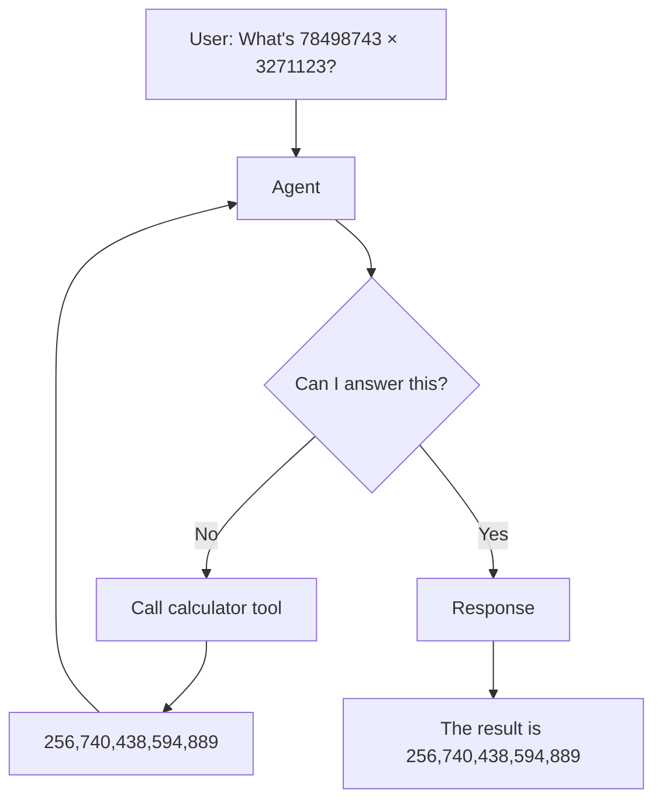
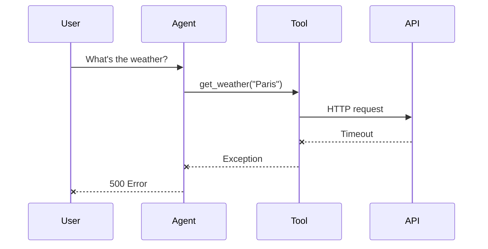
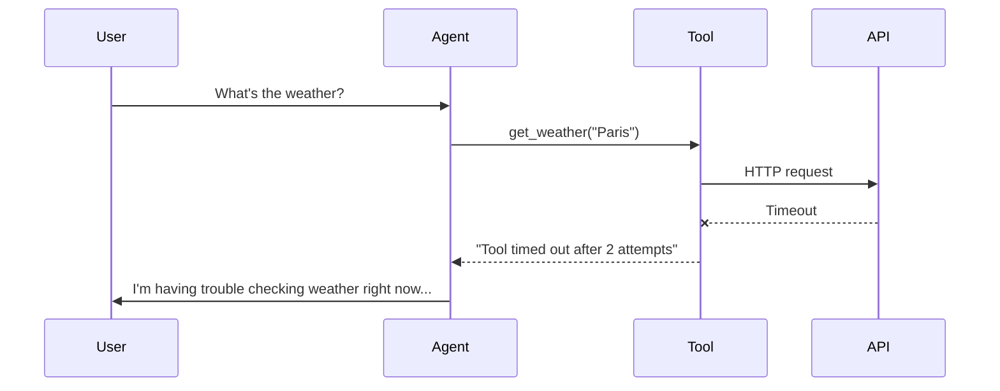

# Letting Agents Do Things

**Tools turn text generators into systems that act.**

Section 1 laid out the problem: LLMs can't calculate, can't look things up, can't interact with external systems. Section 2 introduced agents and mentioned tools as part of Goldberg's definition. Now we make agents useful.

## What Tools Do

Remember the pattern from Section 1: LLMs for language-based decisions, code for everything else. Tools are that "everything else."



The LLM doesn't compute the answer. It recognizes "this needs calculation," calls a tool, and incorporates the result. The tool does the actual work.

This is Goldberg's second component in action. An agent with tools can query databases, call APIs, read files, run calculations, and really interact with any system you give it access to

The LLM decides *what* to do. The tool *does* it.

## Defining Tools

PydanticAI tools are async functions with docstrings. The docstring tells the LLM what the tool does:

```python
async def get_weather(location: str) -> str:
    """Get current weather for a location.

    Args:
        location: City name, e.g. "Paris" or "New York"
    """
    async with httpx.AsyncClient() as client:
        response = await client.get(f"https://api.weather.com/{location}")
        return response.json()["description"]
```

The function signature tells the LLM what arguments to pass. The return value goes back to the LLM for its next step.

Register tools with an agent using toolsets:

```python
from pydantic_ai.toolsets import FunctionToolset
from fastroai import FastroAgent

toolset = FunctionToolset(tools=[get_weather])

agent = FastroAgent(
    model="openai:gpt-4o",
    system_prompt="You can check the weather.",
    toolsets=[toolset],
)

response = await agent.run("What's the weather in Tokyo?")
```

The agent sees the tool's name and docstring, decides whether to use it, and calls it with appropriate arguments.

## When Tools Fail

That weather API will eventually time out because the server is slow, return an error because you hit a rate limit or just hang indefinitely because something's broken.

With a regular tool, this crashes your entire request. The user sees an error page, you've wasted the prompt tokens. The conversation is dead (unless you deal with it).



The AI never gets a chance to respond gracefully.

## @safe_tool

`@safe_tool` changes this. When something fails, the AI receives an error message instead of an exception:

```python
from fastroai import safe_tool

@safe_tool(timeout=10, max_retries=2)
async def get_weather(location: str) -> str:
    """Get current weather for a location."""
    async with httpx.AsyncClient() as client:
        response = await client.get(f"https://api.weather.com/{location}")
        return response.json()["description"]
```

Now when the API times out,

the wrapper waits up to 10 seconds. If it fails, it retries (up to 2 times) using exponential backoff. If all attempts fail, it returns an error message



The AI incorporates the failure into its response. The user gets something useful instead of an error page.

---

The decorator options:

```python
@safe_tool(
    timeout=30,          # Seconds per attempt
    max_retries=3,       # Total attempts
    on_timeout="...",    # Custom timeout message
    on_error="...",      # Custom error message
)
```

Custom messages help the AI respond better:

```python
@safe_tool(
    timeout=30,
    on_timeout="Weather service is slow. Suggest trying again later.",
    on_error="Weather unavailable: {error}. Offer to help with something else.",
)
async def get_weather(location: str) -> str:
    ...
```

The AI sees these messages as tool output. Clearer messages lead to better responses.

## When to Use @safe_tool

Use it for anything that touches the outside world:

- Network requests to APIs
- Database queries
- File system operations
- Third-party services

Skip it for pure computation - math, string manipulation, local data lookups. These either work or they don't, and if they don't, something's fundamentally broken.

## Multiple Tools

Group related tools into a toolset:

```python
from pydantic_ai.toolsets import FunctionToolset
from fastroai import FastroAgent, safe_tool

@safe_tool(timeout=10)
async def get_weather(location: str) -> str:
    """Get current weather."""
    ...

@safe_tool(timeout=5)
async def get_time(timezone: str) -> str:
    """Get current time in a timezone."""
    ...

toolset = FunctionToolset(tools=[get_weather, get_time])

agent = FastroAgent(
    model="openai:gpt-4o",
    system_prompt="You can check weather and time.",
    toolsets=[toolset],
)
```

The agent now has access to both tools and will choose which to call based on the user's question.

## A Complete Example

Let's create a very simple personal finance assistant that analyzes spending. This tool embeds some domain knowledge - it knows what percentage of income is reasonable for different categories:

```python
async def analyze_spending(
    monthly_income: float,
    amount: float,
    category: str
) -> str:
    """Analyze spending in a category relative to income.

    Args:
        monthly_income: Monthly income in dollars
        amount: Amount spent in this category
        category: Category name like "food", "housing", "transportation"
    """
    percentage = (amount / monthly_income) * 100

    # Financial guidelines by category
    guidelines = {
        "food": {"reasonable": 15, "high": 20},
        "housing": {"reasonable": 30, "high": 35},
        "transportation": {"reasonable": 15, "high": 20},
    }

    limits = guidelines.get(category.lower(), {"reasonable": 10, "high": 15})

    if percentage <= limits["reasonable"]:
        assessment = "reasonable"
    elif percentage <= limits["high"]:
        assessment = "a bit high but manageable"
    else:
        assessment = "above recommended guidelines"

    return f"{percentage:.1f}% of income on {category} - {assessment}"
```

This is pure computation, no network calls, no external dependencies. It doesn't need `@safe_tool` because it can't fail in ways that would crash the request. Now let's create the agent with access to this tool:

```python
from pydantic_ai.toolsets import FunctionToolset
from fastroai import FastroAgent

toolset = FunctionToolset(tools=[analyze_spending])

agent = FastroAgent(
    model="openai:gpt-4o",
    system_prompt="""You are a personal finance assistant.

You help people understand their spending patterns.
Use the analyze_spending tool to calculate percentages and assessments.
Be encouraging but realistic.""",
    toolsets=[toolset],
)
```

When someone asks:

```python
response = await agent.run(
    "I earn $5000/month and spent $800 on food. Is that too much?"
)
```

The agent calls `analyze_spending(5000, 800, "food")`, gets back `"16.0% of income on food - a bit high but manageable"`, and generates a helpful response using that assessment.

The LLM couldn't reliably calculate 800/5000 = 16%, and it definitely doesn't know financial guidelines. But it can recognize when analysis is needed and call a tool that does.

## What's Next

Tools let agents do things. But the agent's response is still just text - if you need to extract data from it, you're back to parsing strings.

Section 4 adds structured output: the agent returns typed Pydantic models instead of text, so your code can work with real data.

[Getting Data Back, Not Just Text →](4-getting-data-back.md){ .md-button .md-button--primary }
