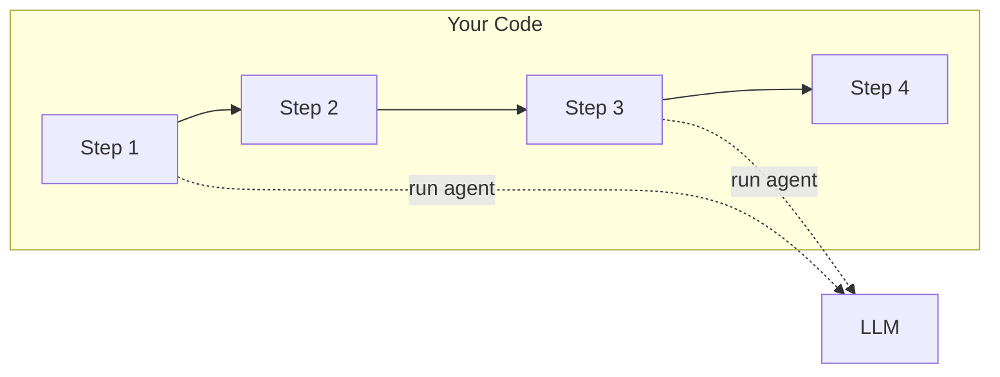
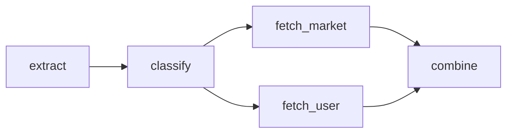

# Multi-Step Workflows

**The orchestration problem isn't solved yet.**

Real applications rarely stay simple. You need to classify a document, then research based on that classification, then draft a response, then verify the facts. Each step builds on the previous one. How do you coordinate this?

The AI industry is still figuring this out. Between 2023 and 2025, frameworks have proliferated - LangChain, LangGraph, CrewAI, AutoGen, MetaGPT - each with different philosophies about how much autonomy to give the LLM. Research papers describe elaborate multi-agent systems where LLMs debate each other, critique each other's work, and dynamically form teams.

Some of this is genuinely useful. Much of it adds complexity without solving real problems. The fundamental question remains: when you have a multi-step task, what should the LLM decide, and what should your code decide?

## Two Schools of Thought

One approach gives the LLM more control. Let the model plan its own steps, decide which tools to call, evaluate whether it's done. Frameworks in this camp build increasingly sophisticated reasoning patterns - ReAct (reasoning and acting in loops), Reflexion (self-evaluation and correction), Tree of Thoughts (exploring multiple reasoning paths).

The problem is failure modes. Cemri et al. analyzed 1,600+ traces from popular multi-agent frameworks in their 2025 paper ["Why Do Multi-Agent LLM Systems Fail?"](https://arxiv.org/abs/2503.13657) and found 14 unique failure categories. Error cascades are common - a small mistake early on gets amplified as each agent builds on faulty foundations. Unlike humans who naturally filter information, LLMs tend to accept flawed input uncritically.

Their key finding: "Improvements in base model capabilities will be insufficient to address these failures. Good multi-agent design requires organizational principles beyond individual agent capabilities."

In other words, smarter models won't automatically mean better orchestration. The architecture matters.

## FastroAI's Approach

FastroAI takes the opposite path: leave as little as possible to the LLM.

This connects directly to Section 1. LLMs are good at understanding language and generating text. They're not good at planning, maintaining state across operations, or making decisions that require consistency. So let them do what they're good at, and let deterministic code handle the rest.



The workflow structure is defined in code, not by the LLM. Which steps run, in what order, with what dependencies - that's all deterministic. The LLM only gets involved when you need to generate or understand text.

This sounds limiting, but consider: most "multi-agent" workflows are really just pipelines with LLM calls at certain points. Classify this document (LLM call), look up related data (database query), generate a summary (LLM call), format for output (code). The orchestration isn't the hard part - it's just function composition. What's hard is making each LLM call reliable.

The same applies to routing. When different inputs need different processing paths - simple requests get a fast pipeline, complex ones get thorough analysis - your code controls that decision. You might use an LLM to classify the input (that's what they're good at), but your code decides what to do with that classification, handles failures, and picks the pipeline. The routing logic stays in code you control.

There's another reason to structure workflows this way: LLMs work better when focused. A model with a narrow task - "classify this document into one of five categories" - performs more reliably than one juggling multiple responsibilities. The system prompt is clearer, the expected output is constrained, and there's less room for the model to drift off course. When you break a complex workflow into steps, each agent can be small and specialized. You're not asking one agent to classify, research, write, and verify all at once. You're asking four focused agents to each do one thing well.

## What Pipelines Actually Provide

If orchestration is mostly just function composition, why have a pipeline abstraction at all? Three reasons.

The first is grouping. When you break a task into steps, each step might involve multiple agent calls, tool executions, and intermediate processing. A step is a boundary - it has inputs, outputs, and encapsulates complexity. You can test steps independently, reuse them across different workflows, and reason about them as units.

```python
@step(timeout=30.0, retries=2)
async def classify(ctx: StepContext[MyDeps]) -> str:
    response = await ctx.run(classifier_agent, ctx.get_input("text"))
    return response.output
```

The decorator defines the step's behavior - how long to wait, how many retries. The function defines what the step does. The context provides access to inputs, dependencies, and other steps' outputs.

The second reason is automatic aggregation. Section 5 covered cost tracking for individual calls. Across a multi-step workflow, you want aggregate costs - what did this entire document processing run cost? Without centralized tracking, you're summing manually after each call. The pipeline handles this:

```python
result = await pipeline.execute(inputs, deps)
print(result.usage.total_cost_dollars)  # Sum across all steps
```

This also enables cost budgets. Set a limit for the entire pipeline, and execution stops before spending more. You can't enforce workflow-wide limits without centralized tracking.

The third reason is handling dependencies. In a pipeline, steps can depend on each other's outputs:



This is a directed acyclic graph (DAG). Each edge says "this step needs that step's output." From this structure, the executor derives execution order automatically. It also knows that `fetch_market` and `fetch_user` can run in parallel - both depend only on `classify`, not on each other.

You didn't write parallelism code. You declared dependencies, and the parallelism followed.

## The Coordination Problem

Beyond execution order, steps need to share data. A step needs access to the original inputs, outputs from steps it depends on, and shared resources like database connections.

Passing these explicitly gets messy. If a step depends on three others, its function signature needs parameters for all three outputs plus original inputs plus dependencies. Add a step, update signatures everywhere.

Pipelines solve this with a context object:

```python
document = ctx.get_input("document")      # Original pipeline input
entities = ctx.get_dependency("extract")  # Output from extract step
db = ctx.deps.database                    # Your application dependencies
```

The step declares its dependencies in the graph. The context provides them. Adding a new dependency means updating the graph, not changing function signatures throughout your code.

## When This Makes Sense

Not every multi-call workflow needs a pipeline. If you're chaining two or three calls sequentially, just write the code:

```python
entities = await extractor.run(document)
response = await writer.run(f"Given {entities.output}, write...")
```

Pipelines help when you have multiple steps with real dependencies between them, when independent steps should run concurrently, when you need workflow-wide cost tracking or budgets, or when the step logic is complex enough that encapsulation helps.

They don't help for single agent calls, for truly independent operations (just use `asyncio.gather`), or when the abstraction overhead isn't worth it.

The guides cover implementation details - defining steps with classes or decorators, configuring timeouts and retries, handling early termination. But the philosophy is consistent: the LLM generates text. Everything else is deterministic code.

## What's Next

Pipelines orchestrate your workflow. But when something goes wrong in production - a step is slow, costs are higher than expected, the output is wrong - you need to see what happened. Which step took the time? What was the actual prompt that produced bad output?

Section 8 covers tracing: seeing inside your AI calls and correlating them with the rest of your application.

[Finding Problems in Production →](8-finding-problems-in-production.md){ .md-button .md-button--primary }
