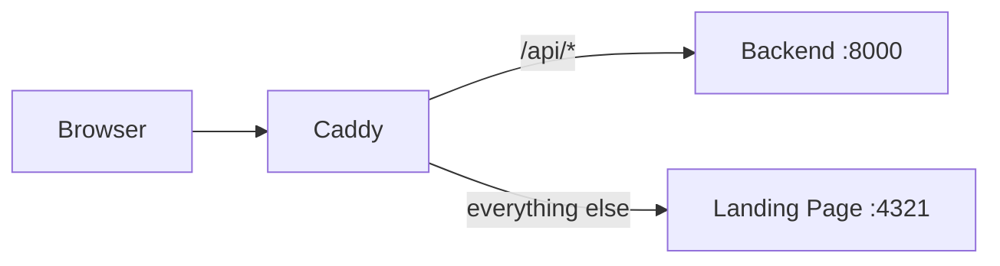

# Frontend

FastroAI includes a landing page built with Astro, TailwindCSS, and React. You'll edit a single YAML file to customize all the content, and the forms connect to the backend API automatically.

## How It Fits Together

The landing page runs as a separate service from the backend. In production, Caddy sits in front and routes traffic to the right place based on the URL path.



The landing page handles your public marketing content. When someone fills out the interest form or contact form, those requests go through Caddy to the backend API.

## Content-Driven Design

All your content lives in a single YAML file. You won't be hunting through components to change your pricing or update a testimonial.

Open `content.yml` in the landing page root, and you'll find sections for:

- App name, tagline, and description
- Hero section text and call-to-action
- Feature list with icons
- Pricing plans
- Customer testimonials
- Stats and social proof
- Colors and branding
- Which sections to show

When you change this file, you're changing what appears on the page. No code edits needed.

## Component Variants

Each major section comes with multiple visual variants. Want a centered hero instead of split layout? Change one line in content.yml:

```yaml
variants:
  hero: "centered"       # or: default, minimal, split
  features: "showcase"   # or: default, cards, minimal
  pricing: "comparison"  # or: default, simple
  testimonials: "slider" # or: default, carousel
  cta: "cards"           # or: default, minimal, split
```

The variant picker components in `src/components/variants/` handle the switching automatically.

## Feature Toggles

You can turn entire sections on or off. If you're pre-launch and don't have testimonials yet, just disable that section:

```yaml
features_enabled:
  pricing: true
  testimonials: false
  blog: false
  interestList: true
  contactForm: true
  navbar: true
```

A disabled section won't render at all.

## Form Integration

The landing page has two built-in forms that connect to the backend:

**Interest/Waitlist Form** posts to `/api/v1/landing/interest`. When someone signs up, the backend stores their email and sends a welcome message through the email queue.

**Contact Form** posts to `/api/v1/landing/contact`. The backend stores the inquiry and sends a confirmation email.

You configure the API connection in content.yml:

```yaml
api:
  baseUrl: "/api/v1"
  contactUrl: "/api/v1/landing/contact"
  interestUrl: "/api/v1/landing/interest"
```

In production, Caddy proxies `/api` requests to the backend, so these relative paths work. For local development where you're running both services separately, set `API_BASE_URL` in your `.env` to point to the backend directly.

## Directory Structure

If you need to go beyond content.yml and customize components, here's how the landing page is organized:

```
landing_page/
├── src/
│   ├── components/
│   │   ├── forms/              # ContactForm, InterestForm
│   │   ├── layout/             # Navbar, Footer
│   │   ├── sections/           # Hero, Features, CTA
│   │   └── variants/           # Multiple versions of each section
│   ├── layouts/Layout.astro    # Base HTML layout
│   ├── lib/content.ts          # YAML content loader
│   ├── pages/
│   │   ├── index.astro         # Main landing page
│   │   └── health.astro        # Health check endpoint
│   └── styles/global.css
├── public/                      # Static assets
├── content.yml                  # All page content
├── astro.config.mjs            # Astro configuration
└── package.json
```

The `components/variants/` folder is where the different visual versions of each section live. If you want to create your own Hero variant, add it there and update the variant picker.

## Development

Start the landing page for local development:

```bash
cd landing_page
npm install
npm run dev
```

This starts the Astro dev server at `http://localhost:4321` with hot reload. Changes to content.yml need a page refresh.

If you're running the backend locally too, set the API URL in `.env`:

```bash
API_BASE_URL="http://localhost:8000/api/v1"
```

## Building for Production

The full build runs image optimization, favicon generation, and OG image creation before the Astro build:

```bash
npm run build
```

If you want to skip the image processing (faster builds during iteration):

```bash
npm run build:quick
```

The output goes to `dist/`. Run it with:

```bash
node ./dist/server/entry.mjs
```

## Docker Deployment

In the docker-compose stack, the landing page runs as its own container:

```yaml
landing-page:
  build:
    context: ./landing_page
  ports:
    - "4321:4321"
  volumes:
    - ./landing_page/content.yml:/app/content.yml
  depends_on:
    - web
```

Notice the content.yml volume mount. You can update your page content without rebuilding the container.

## Key Files

| File | What It Does |
|------|--------------|
| `landing_page/content.yml` | All page content and settings |
| `landing_page/astro.config.mjs` | Astro build configuration |
| `landing_page/src/lib/content.ts` | Loads and types the YAML content |
| `landing_page/src/pages/index.astro` | Main page that assembles components |
| `backend/src/interfaces/api/v1/landing.py` | Backend API for forms |

---

[Configuration →](configuration.md){ .md-button .md-button--primary }
