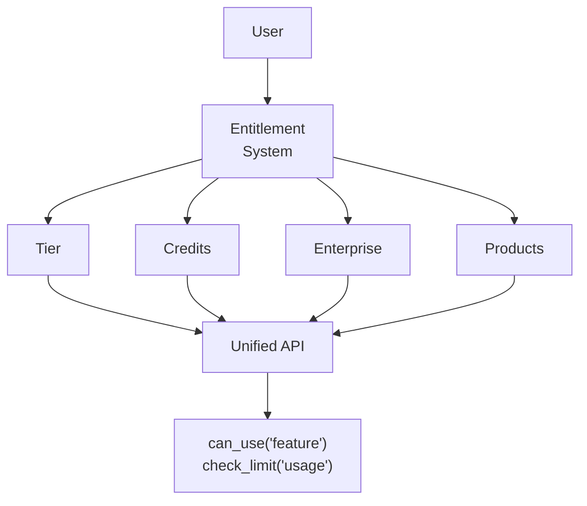
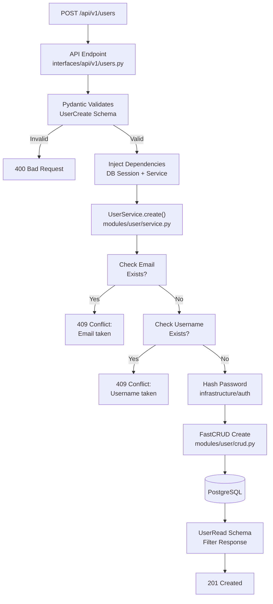

# Understanding Your Template

**The architecture, design decisions, and structure of FastroAI.**

You have FastroAI running. Now you need to understand how it's built and why. This isn't a feature list - it's a technical discussion about the architecture, the tradeoffs we made, and how the pieces fit together.

## Three-Layer Architecture

FastroAI follows a layered architecture pattern. Not because it's trendy, but because it solves real problems in maintaining and scaling applications.

```
backend/src/
├── infrastructure/     # Technical foundations
├── modules/           # Domain logic
└── interfaces/        # External communication
```

The separation is strict. Infrastructure never imports from modules. Modules never import from interfaces. Dependencies flow in one direction: interfaces → modules → infrastructure.

This matters when you're debugging at 2 AM. If user authentication breaks, you know it's in infrastructure/auth. If payment calculations are wrong, it's in modules/payment. If the API returns wrong data, start in interfaces/api.

### Infrastructure Layer

The infrastructure layer contains technical implementations that aren't specific to your business domain. Database connections, authentication mechanisms, caching strategies, external service clients.

```
infrastructure/
├── ai/               # AI provider abstraction (FastroAgent)
├── auth/             # Authentication mechanisms
│   ├── jwt/         # Token generation and validation
│   ├── oauth/       # OAuth provider implementations
│   └── session/     # Session storage and management
├── cache/           # Caching abstraction
│   └── backends/    # Redis, memcached implementations
├── taskiq/          # Async task queue configuration
├── config/          # Settings and environment management
├── database/        # SQLAlchemy setup and base models
├── email/           # Email client abstraction
├── logging/         # Structured logging configuration
├── observability/   # Monitoring and tracing
├── rate_limit/      # Rate limiting implementation
├── security/        # Security utilities and validators
└── stripe/          # Stripe client and webhook handling
```

Each subdirectory is a self-contained unit with its own responsibility. The auth system doesn't know about Stripe. The cache doesn't know about email. This isolation makes testing and modification straightforward.

### Modules Layer

Modules contain your business domain logic. Each module represents a bounded context in your application:

```
modules/
├── user/            # User management
│   ├── models.py    # SQLAlchemy models
│   ├── schemas.py   # Pydantic schemas for validation
│   ├── crud.py      # Database operations
│   └── service.py   # Business logic
├── conversation/    # AI conversation management
├── payment/         # Payment processing logic
├── subscription/    # Subscription lifecycle
├── entitlement/     # Access control logic
├── credits/         # Credit system
├── ai_usage/        # AI usage tracking
└── notification/    # Notification preferences
```

Every module follows the same basic internal structure, though not all modules need every file. Some modules like `notification` might not have models.py if they don't store data. Others like `common` provide utilities without CRUD operations. But the pattern is consistent - when a module needs database models, they're in models.py. When it needs business logic, that's in service.py.

This consistency is a major pro. If you need to change how user authentication works, you know to look in `modules/user/service.py`. If payment calculations are wrong, check `modules/payment/service.py`. Database queries for conversations? That's `modules/conversation/crud.py`. You don't hunt through the codebase - you know exactly where each piece of logic lives.

The module pattern enforces separation of concerns. Database queries stay in CRUD. Business rules stay in service. Validation stays in schemas. When requirements change, you know exactly where to make modifications.

### Interfaces Layer

Interfaces are how the outside world communicates with your application:

```
interfaces/
├── api/
│   └── v1/          # REST API endpoints
│       ├── __init__.py
│       ├── auth.py
│       ├── users.py
│       ├── conversations.py
│       └── payments.py
├── admin/           # Admin panel interface
└── main.py         # FastAPI application setup
```

Each interface file maps to a specific module or infrastructure component. The auth.py interface talks to infrastructure/auth and modules/user. The payments.py interface coordinates between modules/payment, modules/subscription, and infrastructure/stripe.

## Design Decisions

### Database Stack Decisions

FastroAI uses SQLAlchemy + FastCRUD instead of SQLModel or raw SQL. This needs explaining because everyone has opinions about ORMs.

First, why not SQLModel? SQLModel tries to unify SQLAlchemy and Pydantic models into one. Sounds great, but it creates problems. You lose separation of concerns - your database schema becomes your API schema. When SQLAlchemy adds a new feature, you wait for SQLModel to support it. When Pydantic updates, you hope SQLModel keeps up. We chose explicit separation: SQLAlchemy models for the database, Pydantic schemas for validation, FastCRUD bridging them.

The separation looks like more code, but it gives you control. Your API can return different fields than your database stores. You can version your API independently from your database schema. Database internals don't leak into your API responses.

Now, about FastCRUD. Writing CRUD operations is boring. Every model needs the same operations - create, read, update, delete, list with pagination, filter with conditions. FastCRUD eliminates this repetition and serves as our repository pattern - a consistent interface to the database that keeps data access logic separate from business logic.

```python
# What you'd write without FastCRUD (for every model!)
async def get_users(db, status=None, offset=0, limit=100, sort_by="created_at"):
    query = select(User)
    if status:
        query = query.where(User.status == status)
    # Add sorting, pagination, handle errors, manage joins...

# With FastCRUD - all models get this for free
crud = FastCRUD(User)
users = await crud.get_multi(
    db,
    status="active",
    offset=0,
    limit=100,
    sort_columns=["created_at"],
    sort_orders=["desc"]
)
```

FastCRUD provides advanced features out of the box:

- **Advanced filtering** - Use `__gt`, `__lt`, `__in`, `__between` operators
- **Dynamic sorting** - Sort by any column in any direction
- **Cursor pagination** - Efficient pagination for large datasets
- **Soft deletes** - Automatic filtering of deleted records
- **Bulk operations** - Insert/update hundreds of records efficiently
- **Complex joins** - Join multiple models with `JoinConfig`

For joined queries, FastCRUD uses explicit configuration:

```python
from fastcrud import JoinConfig

# Get users with their tier information
users = await crud.get_multi_joined(
    db,
    joins_config=[
        JoinConfig(
            model=Tier,
            join_on=User.tier_id == Tier.id,
            join_prefix="tier_",
            schema_to_select=TierSchema
        )
    ]
)
```

But here's the key: when FastCRUD isn't enough, you can drop down to SQLAlchemy:

```python
# Start with FastCRUD for simple queries
users = await crud.get_multi(db, tier__name="pro")

# Need something complex? Use SQLAlchemy directly
query = (
    select(User, func.sum(Payment.amount).label("total_spent"))
    .join(Payment)
    .group_by(User.id)
    .having(func.sum(Payment.amount) > 1000)
)
result = await db.execute(query)

# Need maximum performance? Use raw SQL
result = await db.execute(
    text("SELECT * FROM users WHERE id = ANY(:ids)"),
    {"ids": user_ids}
)
```

This is the pattern that works in production. Use FastCRUD for the 90% of queries that are standard CRUD. Use SQLAlchemy's query builder for complex business logic. Drop to raw SQL when you need specific database features or maximum performance.

The async setup is already handled for you - connection pooling, session lifecycle, lazy loading prevention. You don't need to think about it. Just use the provided patterns and focus on building your application. When you need to scale to thousands of concurrent users, the infrastructure is already there.

### Session-Based Authentication

FastroAI uses session-based authentication by default, not JWT. Every Medium tutorial will tell you to use JWT, but we went with sessions for practical reasons.

JWT solves a problem most people don't have: avoiding a session store. In exchange, it creates problems everyone will have: you can't log users out.

Think about it. With JWT, the token is self-contained. Once it's out there, it's valid until it expires. User clicks logout? Best you can do is delete it from their browser and hope they don't have it saved somewhere. Account compromised? That token is still valid for hours, days, or however long you set the expiry.

With sessions, logout actually works:

```python
# User clicks logout
DELETE /api/v1/auth/logout
# Server deletes session from Redis
# Cookie becomes meaningless immediately
```

The session cookie is just a random ID pointing to data in Redis. Delete the Redis entry, the session is gone. Instantly. Across all devices if you want.

There's also the security angle. JWT has a huge surface area for mistakes. Even Auth0, who literally sell authentication as a service, shipped a vulnerability that let attackers forge tokens. The JWT spec is complicated, libraries have bugs, and most tutorials get it wrong. We found popular tutorials with no logout, month-long expiry times, and tokens stored in localStorage where any XSS can steal them.

Sessions are boring. A random ID in a cookie, data in Redis. Hard to mess up.

The practical benefits of sessions:

- Instant logout (actually works)
- Revoke access immediately when needed
- See who's logged in right now
- Track session duration and activity
- Support "logout all devices"
- Smaller cookies (40 bytes vs 500+)

"But what about scale?" Redis handles millions of sessions without breaking a sweat. By the time you outgrow Redis sessions, you'll have the resources to solve that problem properly.

JWT is implemented in FastroAI too - we use it for mobile apps where cookies don't exist, and it's available for microservices or when you specifically need stateless tokens. But for web applications, sessions give you control. You can actually manage your users' authentication state instead of hoping tokens expire eventually.

Both have their place. We just picked the default that lets you actually log users out.

### Unified Entitlement System

Instead of hardcoding "if user.subscription == 'pro'" throughout the codebase, FastroAI uses a unified entitlement system. This abstraction handles multiple business models:



The entitlement system translates different business models into a single interface:

- **Tier-based**: "Pro" users get advanced AI, priority support, higher limits
- **Credit-based**: Pay-per-use with no monthly fee, usage tracking
- **Enterprise**: Custom features, special pricing, SLA guarantees
- **Product-based**: Multiple products combine their features and limits

The system uses a dependency resolver pattern. Each entitlement type (tier, credits, products) has a resolver that determines what the user can access. The main entitlement service aggregates these resolvers.

This design allows business model evolution without code changes. Add a new pricing model? Write a new resolver. Change tier features? Update configuration, not code.

### Background Task Architecture

FastroAI uses **Taskiq** for background tasks - a modern async task queue designed for the FastAPI ecosystem. Unlike traditional task queues, Taskiq is built from the ground up for async/await patterns.

Here's how async tasks work with Taskiq:

```python
# FastAPI endpoint (async)
async def generate_report(request):
    # Queue to Taskiq (stays async)
    await generate_report_task.kiq(user_id)

# Taskiq task (actually async)
@email_broker.task
async def generate_report_task(user_id: int):
    # Proper async/await, no thread spawning
    response = await openai.chat.completions.create(...)  # Efficient awaiting
    await send_email_task.kiq(user_id, report=response)
```

**Why Taskiq over Celery?**

- **Native async support**: Tasks run with async/await, not blocking threads
- **Type safety**: Full type hints and validation with Pydantic
- **Simple architecture**: Redis or RabbitMQ broker, no complex routing
- **FastAPI integration**: Built for modern Python web frameworks
- **Better resource usage**: I/O-bound tasks don't block worker threads

Most background tasks in AI SaaS are I/O bound - waiting for email servers, waiting for LLM responses, waiting for external APIs. Taskiq handles these efficiently with async/await instead of thread pools.

**Current Implementation:**
- **Email tasks**: Async sending with template rendering
- **Notification tasks**: User notifications and bulk operations  
- **System tasks**: Cleanup, metrics, scheduled operations
- **Webhook tasks**: Async processing of external webhooks

Taskiq supports both Redis and RabbitMQ brokers, with Redis being the default for simplicity. For complex workflows requiring durability and orchestration, consider dedicated workflow engines like Temporal or Hatchet.

### Database Migrations

Database migrations change your schema - add a column, create an index, rename a table. FastroAI handles this two ways: quick development setup and proper migrations.

**For development**, `create_tables()` runs on startup:
```python
# This happens automatically when you start the app
if create_tables_on_startup:
    await create_tables()  # Creates all tables from your models
```

You can disable this by setting `create_tables_on_startup=False` in `main.py`:
```python
app = create_application(
    router=router,
    settings=settings,
    create_tables_on_startup=False,  # Disable auto table creation
)
```

This works because of the model registry in `src/modules/__init__.py`:
```python
# Every model is explicitly imported here
from .user.models import User
from .tier.models import Tier
# ... all other models
```

When the app starts, importing the API routes triggers a chain: routes → services → models. Combined with the explicit registry, SQLAlchemy knows about every table. Great for development, but don't use this in production.

**For production**, use Alembic:
```bash
alembic revision --autogenerate -m "Add tier_id to users"
alembic upgrade head  # Apply it
```

The magic is in `migrations/env.py`:
```python
# Walks through all modules and imports them
import_models("src.modules")
target_metadata = Base.metadata  # Now has all models registered
```

Alembic compares your models to your actual database and generates SQL to make them match. But it's not perfect. It catches obvious stuff - new columns, dropped tables. It misses subtle changes - string length increases, check constraints, enum changes.

Always check the generated migration in `migrations/versions/`. Read the actual SQL. Test the rollback:
```bash
alembic downgrade -1  # Can you undo it?
```

We make models explicit to help Alembic generate clean migrations:
```python
__tablename__ = "user"  # Explicit table name
email = Column(String(255), nullable=False)  # Explicit constraints
```

Everything explicit means predictable migrations and no surprises in production.

## Module Structure: Same Pattern Everywhere

Every module in FastroAI follows the same pattern. Learn one, you understand them all. This consistency is intentional - when something breaks at 3 AM, you know exactly where to look.

Most modules have these files, though not all modules need every file:

```
modules/user/
├── models.py      # SQLAlchemy models (database tables)
├── schemas.py     # Pydantic schemas (validation/serialization)
├── crud.py        # FastCRUD repository (database queries)
├── service.py     # Business logic (the actual work)
└── exceptions.py  # Custom exceptions (when things go wrong)
```

Not every module has all files. The `notification` module might not have `models.py` if it doesn't store data. The `common` module provides utilities without CRUD operations. But when a file exists, it always has the same responsibility:

#### models.py
Your database table definition:
```python
class User(Base, TimestampMixin):
    __tablename__ = "user"

    id = Column(String, primary_key=True)
    email = Column(String, unique=True, nullable=False)
    tier_id = Column(String, ForeignKey("tier.id"))

    # Relationships to other tables
    tier = relationship("Tier", back_populates="users")
    conversations = relationship("Conversation", back_populates="user")
```

This is pure SQLAlchemy. If you know SQLAlchemy, you're good. If not, it's just declaring what columns your table has.

#### schemas.py
What data goes in and out of your API:
```python
class UserCreate(BaseModel):
    email: EmailStr  # Pydantic validates it's actually an email
    password: SecretStr  # Won't accidentally log the password

class UserResponse(BaseModel):
    id: str
    email: str
    tier_name: str  # Can include computed fields
    # Notice no password - we never send that back
```

Schemas are your API contract. They validate incoming data and shape outgoing responses. Database internals stay in models, API structure stays in schemas. Clean separation.

#### crud.py
Database operations via FastCRUD.

Most modules just instantiate FastCRUD directly:
```python
from fastcrud import FastCRUD

crud_user = FastCRUD(User)
```

This gives you paginated queries, filtering, sorting, and joins out of the box.

When you need custom queries, extend it:
```python
class UserRepository(FastCRUD[User, UserCreate, UserUpdate]):
    async def get_by_email(self, db, email: str):
        return await self.get(db, email=email)

    async def get_with_subscription(self, db, user_id: str):
        return await self.get_joined(
            db,
            join_model=Subscription,
            id=user_id
        )
```

FastCRUD handles the joins, you just specify what you want.

#### service.py
Where business logic lives:
```python
class ConversationService:
    async def send_message(
        self,
        conversation_id: int,
        user_id: int,
        message_data: MessageSend,
        db: AsyncSession
    ) -> dict[str, Any]:
        conversation = await self._validate_conversation_access(conversation_id, user_id, db)
        await self._check_usage_limits(user_id, conversation_id, db)
        await self._save_user_message(conversation_id, message_data, db)

        try:
            ai_response = await self._process_ai_response(
                conversation_id,
                user_id,
                message_data.content,
                conversation,
                db
            )
            return await self._save_ai_response(conversation_id, ai_response, db)
        except Exception as e:
            return await self._handle_ai_processing_error(conversation_id, e)
```

Services orchestrate complex business flows. This one: verifies ownership, checks usage limits, saves user message, creates conversation-specific AI agent, gets AI response, tracks costs, saves assistant message. All the business logic and orchestration in one place.

When you need to fix something, you know where it lives. Password hashing broken? Check the service. Query too slow? Look in CRUD. API returning wrong fields? That's schemas. No hunting through the codebase.

## Following a Request Through the Stack

Let's trace what happens when a user creates an account. This is how the layers actually work together:



Here's what actually happens:

**Request arrives** (`interfaces/api/v1/users.py:48`)
```python
@router.post("/")
async def create_user(
    user: UserCreate,  # Pydantic validates automatically
    db: Depends(async_session),
    user_service: Depends(get_user_service)
) -> UserRead:
```

Before your function even runs, Pydantic validates the request body against `UserCreate`. Wrong email format? Missing field? Your code never executes. This is why you rarely see validation code in the endpoints.

**Service handles the business logic** (`modules/user/service.py:39`)
```python
async def create(self, user: UserCreate, db: AsyncSession):
    # Business rule: emails must be unique
    if await crud_users.exists(db=db, email=user.email):
        raise UserExistsError("Email already registered")

    # Security rule: never store plaintext
    user_dict["hashed_password"] = get_password_hash(password)
    del user_dict["password"]  # Remove plaintext immediately

    # Create the user
    return await crud_users.create(
        db=db,
        object=user_internal,
        schema_to_select=UserRead
    )
```

The service enforces your business rules. It doesn't know HOW to hash passwords (that's infrastructure) or HOW to insert into the database (that's CRUD). It just knows WHAT the rules are.

**Response gets filtered** <br>
The created user goes back through the stack. At the API layer, the `UserRead` schema controls what the client sees:
```python
class UserRead(BaseModel):
    id: str
    email: str
    username: str
    # Notice: no hashed_password field
```

The password hash exists in the database model but not in the response schema. It never leaves the server. This isn't security through obscurity - it's security through architecture.

!!! tip "The Payoff of Layer Separation"

    When you need to change how passwords are hashed, you change one function in infrastructure/auth. The service doesn't care if you use bcrypt or argon2.

    When you need to add a "username must be lowercase" rule, you add it in the service. The API endpoint doesn't change.

    When you need the API to return a new field, you add it to the schema. The service logic doesn't change.

    This is why debugging is straightforward. User registration fails? The error tells you exactly which layer failed. Database error? That's CRUD. Business rule violation? That's service. Bad request format? That's Pydantic. Each layer has one job.

## Configuration Notes

A few interesting decisions in our configuration setup:

**Redis database separation** - We use different Redis databases for different purposes:

- DB 0: Cache
- DB 1: Rate limiting
- DB 2: Taskiq result backend

This isolation prevents cache flushes from killing your rate limits or losing background job results.

**Fail-open rate limiting** - When `RATE_LIMITER_FAIL_OPEN=true`, if Redis dies, requests go through instead of blocking everyone. Better to temporarily lose rate limiting than take down your entire API.

**Production security validation** - Set `PRODUCTION_SECURITY_VALIDATION_ENABLED=true` and the app checks on startup that you're not using default passwords, debug mode, or insecure cookies in production. Catches those "forgot to change the secret key" mistakes.

**Pluggable backends** - Both cache and rate limiting support Redis or Memcached. Same API, different backends. Start with Redis, switch to Memcached if you need to, your code doesn't change.

The full configuration guide is [here](../configuration). These are just the non-obvious bits worth knowing about.

## Database Design Patterns

Every FastroAI table follows the same patterns. Once you understand them, you can predict how any table works.

**Sequential IDs, and that's fine**. We use auto-incrementing integers for primary keys:
```python
id: Mapped[int] = mapped_column(
    autoincrement=True,
    primary_key=True,
)
```

Yes, someone could figure out you have 1,234 users. For most SaaS applications, that doesn't matter. You have authentication protecting your endpoints. If you need UUIDs later for distributed systems or to hide user counts, it's a migration away. Start simple.

**Most tables get timestamps**. The `TimestampMixin` adds `created_at` and `updated_at` to models that need them:
```python
class User(Base, TimestampMixin):
    # Automatically gets created_at and updated_at
```
Not literally every table - lookup tables or purely relational tables might not need them. But for entities that change over time (users, payments, conversations), timestamps are automatic. No forgetting to add them, no inconsistent naming.

**Soft deletes for important data**. Users, payments, conversations - they get `is_deleted` or `deleted_at` fields. When you "delete" them, you're just marking them deleted. The data stays for audits, compliance, or that inevitable "can you restore this?" request.

Hard deletes are for truly temporary data - cache entries, session tokens, things that should actually disappear.

**Foreign keys are explicit**. No Rails-style magic where `user_id` automatically creates a relationship. You define it:
```python
tier_id: Mapped[int | None] = mapped_column(
    Integer,
    ForeignKey("tiers.id"),
    comment="Foreign key to user's subscription tier"
)
```

Explicit is better than implicit. You know exactly what's connected to what. The comment tells future you (or your teammate) what this relationship means. No surprises when you refactor.

**Relationships are optional and used for admin UI**. SQLAlchemy `relationship()` declarations aren't required for data access - FastCRUD handles joins through explicit queries. However, the built-in models include relationships for SQLAdmin integration, allowing admins to select related objects from dropdowns instead of typing IDs:

```python
# Foreign key (required for data integrity)
tier_id: Mapped[int | None] = mapped_column(ForeignKey("tiers.id"))

# Relationship (optional, enables admin UI dropdowns)
tier: Mapped["Tier | None"] = relationship("Tier", back_populates="users", lazy="selectin", init=False)
```

If you add relationships to your own models for admin purposes, use `lazy="selectin"` for async compatibility and `init=False` to exclude them from the dataclass constructor. Never use `default=None` on relationships with nullable FK columns - it causes SQLAlchemy to clear the FK value during commit.

!!! warning "Admin views need a mixin for dataclass models"
    SQLAdmin's default behavior creates an empty model instance then sets attributes - this fails for `MappedAsDataclass` models with required fields. All built-in admin views use `DataclassModelMixin`:

    ```python
    from backend.src.interfaces.admin.mixins import DataclassModelMixin

    class MyModelAdmin(DataclassModelMixin, ModelView, model=MyModel):
        # ... your admin config

        async def on_model_change(self, data, model, is_created, request):
            # Transform data before model creation (model is None when is_created=True)
            if is_created:
                data["some_field"] = transform(data["some_field"])
    ```

    The mixin calls `on_model_change` before creating the model, so you can transform form data (like hashing passwords) before it reaches the dataclass constructor.

The schema is mostly normalized - each fact lives in one place. But we're not religious about it. If joining 5 tables to show a username is killing performance, we'll cache it. Pragmatism over purity.

## Error Handling Strategy

Errors happen. The question is how gracefully you handle them. FastroAI uses a hierarchy of exceptions that gets more specific as you go down the stack.

**Domain exceptions for business logic**. Everything inherits from `DomainError`:
```python
class DomainError(Exception):
    """Base class for all domain-specific errors."""

class ResourceNotFoundError(DomainError):
    """When you can't find what you're looking for"""

class UserNotFoundError(ResourceNotFoundError):
    """More specific - it's a user that doesn't exist"""
```

This hierarchy matters. You can catch `ResourceNotFoundError` to handle any missing resource, or catch `UserNotFoundError` specifically when you need user-specific logic.

**Infrastructure errors stay separate**. Cache failures, rate limiter problems, Stripe API issues - these get their own exception trees:
```python
class CacheException(Exception):
    """Cache backend problems"""

class StripeServiceError(Exception):
    """Payment processing issues"""
```

Why separate? Because infrastructure failures need different handling than business logic violations. A missing user is a 404. A Redis timeout might be a 503 or could trigger a fallback.

**Automatic mapping to HTTP status codes**. The magic happens in `error_handler.py`:
```python
# Your service raises domain exceptions
if not user:
    raise UserNotFoundError(f"User {user_id} not found")

# The framework maps them to HTTP responses automatically
# UserNotFoundError → 404 Not Found
# ValidationError → 400 Bad Request
# PermissionDeniedError → 403 Forbidden
```

No manual `HTTPException` creation in your business logic. Services think in domain terms, the API layer handles HTTP concerns.

**Exception handling keeps it clean**. Your services raise domain exceptions, and there's a mapping system in `error_handler.py` that converts them to appropriate HTTP responses. No need to manually create `HTTPException` objects in your business logic.

The pattern is simple: be specific about what went wrong, let the error handler worry about how to communicate it to the client.

## Performance Considerations

Performance isn't about making everything fast - it's about making the right things fast and accepting tradeoffs elsewhere.

**Async everywhere, but understand the cost**. FastAPI, SQLAlchemy, Redis clients - the whole stack is async. This means you can handle thousands of concurrent requests with minimal threads. But async code is harder to debug, and every function call becomes `await something()`. The payoff comes when you're waiting on databases, APIs, or AI models. For a SaaS app that's mostly I/O bound, this is the right choice.

**Connection pools prevent disasters**. Database connections are expensive to create. Connection pools reuse them:
```python
POSTGRES_POOL_SIZE: int = config("POSTGRES_POOL_SIZE", default=20)
POSTGRES_MAX_OVERFLOW: int = config("POSTGRES_MAX_OVERFLOW", default=0)
```
Twenty connections can handle hundreds of concurrent requests if they're mostly waiting on external APIs. But if you're doing CPU-heavy work, you'll starve the pool. Know your workload.

**No lazy loading, ever**. SQLAlchemy's lazy loading creates N+1 queries - query for users, then a separate query for each user's tier. Disaster. We disable it completely:
```python
# This would create N+1 queries with lazy loading
users = await crud_users.get_multi(db, limit=100)
for user in users:
    print(user.tier.name)  # Separate query for each user!

# Instead, use explicit joins
users = await crud_users.get_joined(
    db, join_model=Tier, limit=100
)
```
More typing upfront, but predictable query patterns. You always know exactly what SQL gets generated.

**Cache what changes slowly**. User sessions? Cache them - they don't change often and lookups are frequent. Payment records? Never cache - money needs to be consistent. The rule: cache reads that happen way more often than writes.

**Don't cache everything**. Caching adds complexity - cache invalidation, consistency concerns, debugging becomes harder. Only cache when the performance gain is obvious and the data can tolerate some staleness.

!!! warning "The Performance Trap"

    Don't optimize until you measure. FastroAI's default setup handles thousands of requests per second on modest hardware. Most performance problems come from bad queries, not architectural choices. Use the built-in observability to find real bottlenecks before changing anything.

## Security Architecture

Security is like an onion (or an ogre) - multiple layers, and it might make you cry if you peel back too many at once.

**Input validation at the gate**. Every API input goes through Pydantic validation before your code sees it. Someone sends `{"user_id": "'; DROP TABLE users; --"}` as a JSON field? Pydantic rejects it because `user_id` expects an integer. Your business logic never sees malformed data.

**SQLAlchemy prevents injection**. We use the ORM exclusively - no raw SQL unless absolutely necessary. SQLAlchemy parameterizes queries automatically:
```python
# Safe - SQLAlchemy handles parameterization
user = await crud_users.get(db, email=user_email)

# Also safe - FastCRUD uses SQLAlchemy under the hood
users = await crud_users.get_multi(db, tier_id=tier_id)

# Dangerous (and we don't do this)
# query = f"SELECT * FROM users WHERE email = '{user_email}'"
```

**Session-based auth with CSRF protection**. Sessions aren't just for avoiding JWTs - they enable CSRF protection. Every state-changing request (POST, PUT, DELETE) requires a CSRF token. Someone tricks your user into clicking a malicious link? The request fails because it doesn't have the token.

**Rate limiting at the middleware level**. Before your endpoint code runs, the rate limiter checks if this user/IP has exceeded their limits. Brute force attack? Blocked. API abuse? Throttled. Your application logic doesn't need to think about it.

**Secrets stay in environment variables**. No API keys, passwords, or tokens in code. Ever. The production security validator checks common misconfigurations on startup:

- **Insecure secret keys** - Default values, short keys, predictable patterns
- **Database credentials** - Default "postgres" password or empty passwords
- **Admin interface** - No IP restrictions when enabled
- **Redis security** - Missing passwords, unencrypted connections
- **CORS configuration** - Overly permissive wildcard origins
- **Session security** - Insecure cookies, long timeouts, disabled CSRF

It won't scan your code for hardcoded secrets, but it catches the obvious configuration mistakes that lead to breaches.

**Audit logs for the important stuff**. User logins, payment processing, permission changes - these generate structured logs with user IDs, timestamps, and actions. Not for debugging (that's what application logs are for), but for compliance and forensics when something goes wrong.

The pattern is defense in depth. If one layer fails, others catch the attack. Input validation fails? SQL injection prevention catches it. Rate limiter goes down? Authentication still protects your endpoints. No single point of failure.

**Backend does all validation and logic**. This is important - the frontend validates for user experience, but the backend validates for security. Someone can bypass your frontend entirely and hit your API directly. Every piece of business logic and validation must exist in the backend:

```python
# Frontend: Show friendly error before user submits
if (!email.includes("@")) {
  showError("Please enter a valid email");
  return;
}

# Backend: Actually enforce the rule
class UserCreate(BaseModel):
    email: EmailStr  # Pydantic validates this is a real email

async def create_user(user_data: UserCreate, db: AsyncSession):
    # Business logic ALWAYS in backend
    if await crud_users.exists(db=db, email=user_data.email):
        raise UserExistsError("Email already registered")
```

Frontend validation is for convenience - showing errors quickly, preventing unnecessary requests, guiding the user. Backend validation is for security - nothing gets past it, no matter how the request arrives.

## Next Steps

Now that you understand the architecture:

1. **Explore a module** - Pick one module and trace through models → schemas → crud → service
2. **Follow a request** - Use the debugger to step through a complete request flow
3. **Understand the tradeoffs** - Each design decision has pros and cons, what are the cons? When would it make sense to switch something in the implementation?

Ready to configure your settings? That's what we'll do next.

<div style="text-align: center; margin-top: 50px;">
    <a href="../configuration/" class="md-button md-button--primary">
        Next: Configuration →
    </a>
</div>
