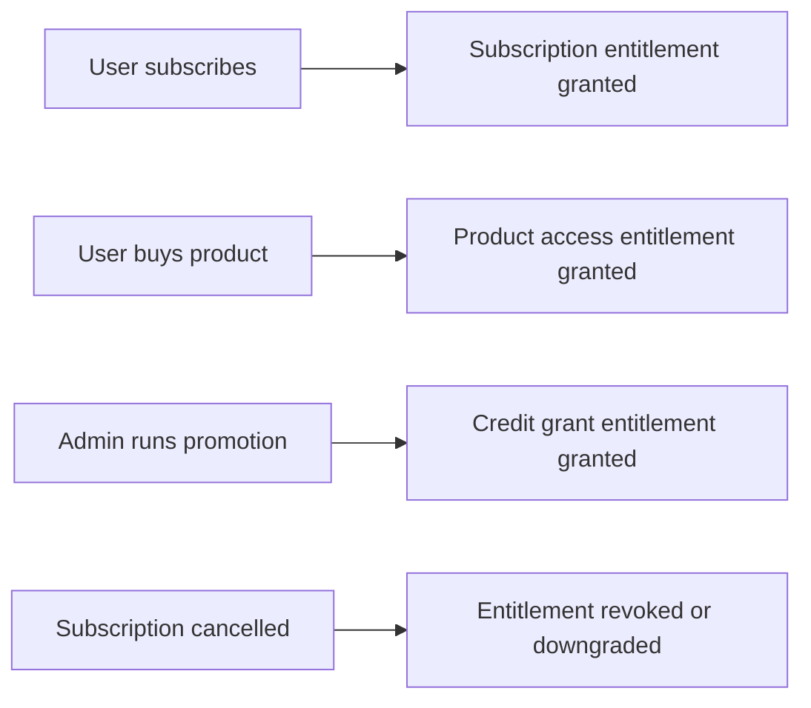

# Access Control

Access control in FastroAI is built around entitlements, not rigid tier structures. This gives you flexibility to grant, revoke, and combine access rights without rewriting your business logic every time your pricing model changes.

## The Problem with Tiers Alone

Most SaaS apps start with simple tiers: Free, Pro, Enterprise. But then reality hits:

- A user needs Pro features but with Enterprise-level API limits
- You want to give someone temporary access to a feature for a trial
- A customer churns but you want them to keep read-only access
- You're running a promotion that grants credits without changing their tier

If your access checks are `if user.tier == "pro"`, you're stuck. Every edge case requires code changes.

## Entitlements: The Building Blocks

Entitlements are individual access rights that can be granted, revoked, and combined. Instead of checking tiers, you check what entitlements a user has:

```python
# Instead of this:
if user.tier in ["pro", "enterprise"]:
    allow_advanced_export()

# You do this:
check = await entitlement_service.check_entitlement(
    EntitlementCheckRequest(
        user_id=user.id,
        entitlement_type=EntitlementType.FEATURE_UNLOCK,
    ),
    db,
)
if check.has_access:
    allow_advanced_export()
```

A user can have multiple entitlements from different sources. They might have a subscription entitlement from their monthly plan, a credit grant from a promotion, and a feature unlock from an enterprise contract. All of these stack.

## How Entitlements Flow

Entitlements don't appear out of nowhere. They're granted through specific events:



When a user subscribes to a plan, the payment system automatically grants the appropriate entitlements. When they cancel, those entitlements are revoked (or downgraded to free tier, depending on your business model).

This separation means your payment logic doesn't need to know about features, and your feature logic doesn't need to know about payments. They communicate through entitlements.

## API Keys: Programmatic Access

API keys are a different kind of access control. They're for programmatic access to your API, typically used by:

- Third-party developers building on your platform
- Users who want to automate workflows
- Service-to-service communication

API keys have their own permission model (resource + action) and usage tracking, separate from entitlements. A user might have full entitlements to a feature but still need an API key with specific permissions to access it programmatically.

## In This Section

- **[Entitlements](entitlements.md)** - Types, granting, checking, and consuming entitlements
- **[API Keys](api-keys.md)** - Key generation, permissions, usage tracking

## Key Files

| Component | Location |
|-----------|----------|
| Entitlement service | `backend/src/modules/entitlement/service.py` |
| Entitlement types | `backend/src/modules/entitlement/enums.py` |
| Lifecycle handlers | `backend/src/modules/entitlement/lifecycle_handlers/` |
| API key service | `backend/src/modules/api_keys/service.py` |
| API key permissions | `backend/src/modules/api_keys/enums.py` |

---

[Entitlements →](entitlements.md){ .md-button .md-button--primary }
