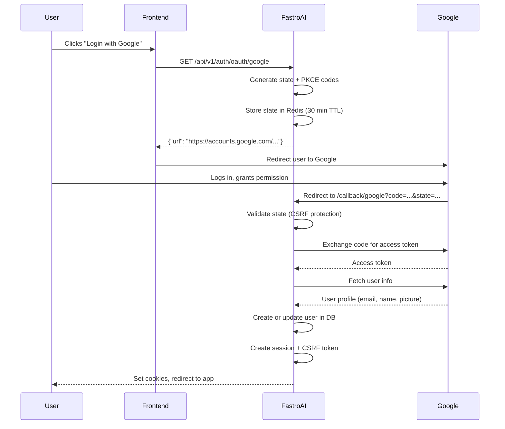

# OAuth Providers

"Login with Google" and "Login with GitHub" are already built into FastroAI. You just need to add your OAuth credentials.

## Configuring Google

1. Go to the [Google Cloud Console](https://console.cloud.google.com/)
2. Create a project (or select an existing one)
3. Navigate to **APIs & Services > Credentials**
4. Click **Create Credentials > OAuth client ID**
5. Select **Web application**
6. Add your authorized redirect URI:
   ```
   http://localhost:8000/api/v1/auth/oauth/callback/google
   ```
   For production, replace `localhost:8000` with your domain.

7. Copy the Client ID and Client Secret to your `.env`:

```bash
OAUTH_GOOGLE_CLIENT_ID=your-client-id.apps.googleusercontent.com
OAUTH_GOOGLE_CLIENT_SECRET=your-client-secret
OAUTH_REDIRECT_BASE_URL=http://localhost:8000  # Your app's base URL
```

That's it. The `/api/v1/auth/oauth/google` endpoint is now active.

## Configuring GitHub

1. Go to [GitHub Developer Settings](https://github.com/settings/developers)
2. Click **New OAuth App**
3. Fill in:
   - **Application name**: Your app name
   - **Homepage URL**: Your app's URL
   - **Authorization callback URL**:
     ```
     http://localhost:8000/api/v1/auth/oauth/callback/github
     ```

4. Copy the Client ID, then generate a Client Secret
5. Add to your `.env`:

```bash
OAUTH_GITHUB_CLIENT_ID=your-client-id
OAUTH_GITHUB_CLIENT_SECRET=your-client-secret
OAUTH_REDIRECT_BASE_URL=http://localhost:8000
```

## How the OAuth Flow Works

When a user clicks "Login with Google":



FastroAI handles all the security details: state parameter for CSRF protection, PKCE for authorization code security, and secure cookie handling.

## OAuth Endpoints

| Endpoint | Method | Purpose |
|----------|--------|---------|
| `/api/v1/auth/oauth/google` | GET | Start Google login flow |
| `/api/v1/auth/oauth/callback/google` | GET | Handle Google callback |
| `/api/v1/auth/oauth/github` | GET | Start GitHub login flow |
| `/api/v1/auth/oauth/callback/github` | GET | Handle GitHub callback |

The login endpoints accept an optional `redirect_uri` query param to specify where to send the user after successful login:

```
GET /api/v1/auth/oauth/google?redirect_uri=/dashboard
```

## User Creation

When someone logs in via OAuth for the first time, FastroAI:

1. Checks if a user with that provider ID exists (e.g., `google_id`)
2. If not, checks if a user with that email exists
3. If found by email, links the OAuth provider to that account
4. If not found at all, creates a new user

This means existing users can "upgrade" to OAuth login. If they log in with Google using the same email as their password account, the accounts merge.

The User model stores OAuth info in these fields:

```python
google_id: str | None      # Google's "sub" claim
github_id: str | None      # GitHub's user ID
oauth_provider: str | None # "google", "github", etc.
email_verified: bool       # True for OAuth users (providers verify email)
```

## Adding a New OAuth Provider

FastroAI uses a factory pattern that makes adding providers straightforward.

### Step 1: Create the Provider Class

Create `backend/src/infrastructure/auth/oauth/providers/twitter.py`:

```python
from typing import Any

from ..provider import AbstractOAuthProvider
from ..schemas import OAuthUserInfo


class TwitterOAuthProvider(AbstractOAuthProvider):
    def __init__(self, client_id: str, client_secret: str, redirect_uri: str):
        super().__init__(
            client_id=client_id,
            client_secret=client_secret,
            redirect_uri=redirect_uri,
            scopes=["tweet.read", "users.read"],
            authorize_endpoint="https://twitter.com/i/oauth2/authorize",
            token_endpoint="https://api.twitter.com/2/oauth2/token",
            userinfo_endpoint="https://api.twitter.com/2/users/me",
            provider_name="twitter",
        )

    async def process_user_info(self, user_info: dict[str, Any]) -> OAuthUserInfo:
        """Normalize Twitter's response to our standard format."""
        data = user_info.get("data", {})
        return OAuthUserInfo(
            provider="twitter",
            provider_user_id=str(data.get("id")),
            email=None,  # Twitter doesn't provide email in basic scope
            email_verified=False,
            name=data.get("name"),
            username=data.get("username"),
            picture=data.get("profile_image_url"),
            raw_data=user_info,
        )

    @classmethod
    def create(cls, client_id: str, client_secret: str, redirect_uri: str):
        """Factory method called by OAuthProviderFactory."""
        return cls(client_id, client_secret, redirect_uri)
```

The key method is `process_user_info()`. It translates the provider's user data format into FastroAI's `OAuthUserInfo` schema.

### Step 2: Register with the Factory

In `backend/src/infrastructure/auth/oauth/dependencies.py`, add the registration:

```python
from .providers.twitter import TwitterOAuthProvider

# Near the top, with other registrations
OAuthProviderFactory.register_provider("twitter", TwitterOAuthProvider)
```

### Step 3: Add Configuration

In `backend/src/infrastructure/config/settings.py`, add to `AuthSettings`:

```python
OAUTH_TWITTER_CLIENT_ID: str = config("OAUTH_TWITTER_CLIENT_ID", default="")
OAUTH_TWITTER_CLIENT_SECRET: str = config("OAUTH_TWITTER_CLIENT_SECRET", default="")
```

### Step 4: Create the Dependency and Endpoints

In `backend/src/infrastructure/auth/oauth/dependencies.py`:

```python
def get_twitter_provider() -> AbstractOAuthProvider:
    settings = AuthSettings()
    if not settings.OAUTH_TWITTER_CLIENT_ID or not settings.OAUTH_TWITTER_CLIENT_SECRET:
        raise HTTPException(
            status_code=501,
            detail="Twitter OAuth not configured",
        )
    return OAuthProviderFactory.create_provider(
        provider_name="twitter",
        client_id=settings.OAUTH_TWITTER_CLIENT_ID,
        client_secret=settings.OAUTH_TWITTER_CLIENT_SECRET,
        redirect_uri=f"{settings.OAUTH_REDIRECT_BASE_URL}/api/v1/auth/oauth/callback/twitter",
    )
```

In `backend/src/interfaces/api/v1/auth.py`, add the endpoints (follow the Google pattern):

```python
@router.get("/oauth/twitter")
async def oauth_twitter_login(
    request: Request,
    redirect_uri: str | None = Query(None),
    oauth_provider: AbstractOAuthProvider = Depends(get_twitter_provider),
    state_storage = Depends(get_oauth_state_storage),
):
    # Same implementation as oauth_google_login
    # Just change provider references to "twitter"
    ...

@router.get("/oauth/callback/twitter")
async def oauth_twitter_callback(...):
    # Same implementation as oauth_google_callback
    ...
```

### Step 5: Add User Model Field (Optional)

If you want to store the provider's user ID for direct lookups, add a field to the User model:

```python
# In backend/src/modules/user/models.py
twitter_id: Mapped[str | None] = mapped_column(String(50), unique=True, index=True)
```

And update `OAuthAccountService` to use it when looking up existing users.

## Provider-Specific Quirks

### GitHub Email

GitHub doesn't include email in the user profile response. The GitHub provider makes a separate API call to `/user/emails` to fetch the primary verified email. This is already handled in `providers/github.py:77-105`.

### Google Refresh Tokens

Google only returns a refresh token on the first authorization. The Google provider requests `access_type=offline` and `prompt=consent` to ensure you get one. See `providers/google.py:41-52`.

## Key Files

| Component | Location |
|-----------|----------|
| OAuth base class | `backend/src/infrastructure/auth/oauth/provider.py` |
| Google provider | `backend/src/infrastructure/auth/oauth/providers/google.py` |
| GitHub provider | `backend/src/infrastructure/auth/oauth/providers/github.py` |
| Provider factory | `backend/src/infrastructure/auth/oauth/factory.py` |
| OAuth dependencies | `backend/src/infrastructure/auth/oauth/dependencies.py` |
| OAuth schemas | `backend/src/infrastructure/auth/oauth/schemas.py` |
| Auth endpoints | `backend/src/interfaces/api/v1/auth.py` |
| User OAuth fields | `backend/src/modules/user/models.py:17-112` |

---

[← JWT Tokens](jwt.md){ .md-button } [Access Control →](../access-control/index.md){ .md-button .md-button--primary }
