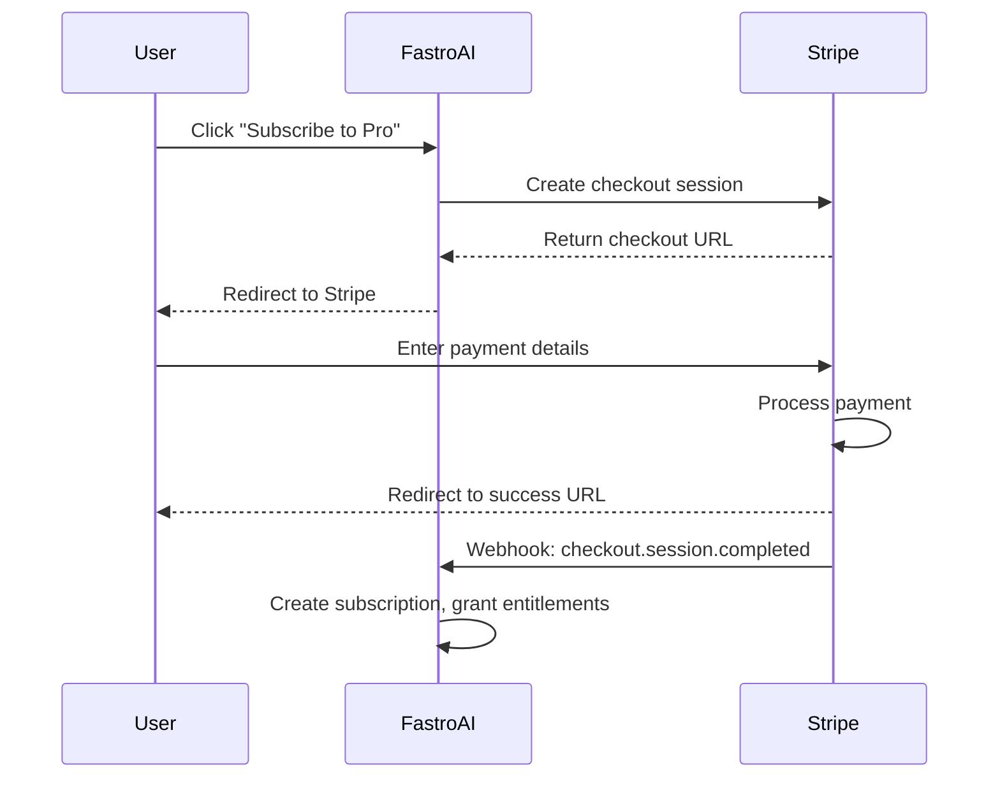

# Payments

FastroAI uses Stripe for all payment processing. You don't need to build payment forms, handle card validation, or worry about PCI compliance. Stripe handles the hard parts, and FastroAI wires it up to your users and entitlements.

## How the Integration Works

The payment flow goes through Stripe Checkout, which is Stripe's hosted payment page. When a user wants to subscribe or buy something, FastroAI creates a checkout session and redirects them to Stripe. After they complete payment, Stripe redirects them back and sends a webhook to confirm the transaction.



This approach means your app never touches raw card numbers. Stripe handles all the sensitive stuff, and your webhook handlers deal with the business logic: creating subscriptions, granting entitlements, and updating user records.

## Two Databases, One Source of Truth

FastroAI stores payment data in two places: Stripe (the source of truth for subscription state) and your local database (for audit trails, entitlement triggers, and fast queries).

When a user subscribes, Stripe manages the billing cycle, retries failed payments, and sends invoices. Your local database tracks which payments happened, links them to users, and triggers entitlement grants. The webhook handlers keep these in sync.

This dual storage gives you the best of both worlds. You can query payment history locally without hitting Stripe's API, but subscription state (is this user still paying?) always comes from Stripe.

## Configuration

Add your Stripe keys to your environment:

```bash
STRIPE_SECRET_KEY=sk_test_...
STRIPE_PUBLISHABLE_KEY=pk_test_...
STRIPE_WEBHOOK_SECRET=whsec_...
```

The secret key is for server-side API calls. The webhook secret verifies that incoming webhooks actually came from Stripe. Get these from your [Stripe Dashboard](https://dashboard.stripe.com/apikeys).

For local development, use Stripe's test mode keys. Test cards like `4242 4242 4242 4242` will work without charging real money.

## Testing Webhooks Locally

Stripe can't send webhooks to `localhost`, so you need to forward them. The Stripe CLI makes this easy:

```bash
stripe listen --forward-to localhost:8000/api/v1/webhooks/stripe
```

This prints a webhook signing secret for local testing. Use that secret in your `.env` instead of the production one.

## What Gets Created

When a user completes checkout, the webhook handler does several things:

1. **Payment record** - Tracks the transaction in your database
2. **Subscription record** - For recurring payments, stores the subscription details
3. **Entitlements** - Grants access based on what the price is configured to unlock
4. **Discount redemption** - If a coupon was used, marks it as redeemed

All of this happens automatically. You configure what each price grants (in `price.extra_metadata`), and the webhook handlers take care of the rest.

## In This Section

- **[Products & Prices](products-and-prices.md)** - Setting up what you sell
- **[Subscriptions](subscriptions.md)** - Recurring payments and plan changes
- **[Discounts](discounts.md)** - Coupons and promotional pricing
- **[Credits](credits.md)** - Consumable credits and transactions
- **[Webhooks](webhooks.md)** - Handling Stripe events

## Key Files

| Component | Location |
|-----------|----------|
| Stripe service | `backend/src/infrastructure/stripe/client.py` |
| Payment service | `backend/src/modules/payment/service.py` |
| Payment endpoints | `backend/src/interfaces/api/v1/payments.py` |
| Webhook handler | `backend/src/interfaces/api/v1/webhooks.py` |
| Settings | `backend/src/infrastructure/config/settings.py` |

---

[Products & Prices →](products-and-prices.md){ .md-button .md-button--primary }
