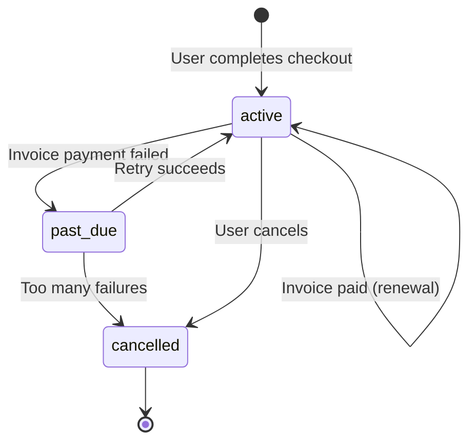

# Subscriptions

Subscriptions are the core of most SaaS business models. Users sign up for a plan, get billed automatically, and can upgrade, downgrade, or cancel as their needs change. FastroAI handles all of this through Stripe, keeping local records in sync for fast queries and entitlement management.

## The Subscription Lifecycle

A subscription starts when a user completes checkout for a recurring price. Stripe creates the subscription on their end, and FastroAI's webhook handler creates a local record:



The `status` field comes directly from Stripe. Most of the time you'll see `active` (user is paying and has access), `past_due` (payment failed but Stripe is retrying), or `cancelled` (subscription ended). There are also edge cases like `incomplete` when the initial payment is still processing, `trialing` during free trials, and `unpaid` when all retry attempts have failed.

## Getting Subscription Status

To check a user's current subscription:

```python
from src.modules.payment.service import PaymentService

payment_service = PaymentService()

status = await payment_service.get_subscription_status(user_id=123, db=db)

if status["has_subscription"]:
    print(f"Plan: {status['price_id']}")
    print(f"Status: {status['status']}")
    print(f"Next billing: {status['next_billing_date']}")
    print(f"Will cancel at period end: {status['cancel_at_period_end']}")
else:
    print("No active subscription")
```

Or through the API at `GET /api/v1/payments/subscription/status`.

## Changing Plans

When a subscriber wants to upgrade or downgrade, FastroAI handles this intelligently. If they try to start checkout for a different recurring price while already subscribed, the payment service detects this and switches to a subscription update flow instead of creating a new checkout.

### Prorating

Stripe prorates subscription changes automatically. If someone on a $10/month plan upgrades to a $30/month plan halfway through their billing cycle, they'll be charged the difference for the remaining days.

Before making a change, you can preview the prorated amount:

```python
preview = await payment_service.get_subscription_preview(
    user_id=123,
    new_price_id=456,
    db=db,
)

if preview["immediate_charge"]:
    print(f"You'll be charged ${preview['prorated_amount'] / 100:.2f}")
elif preview["credit_applied"]:
    print(f"You'll receive a ${abs(preview['prorated_amount']) / 100:.2f} credit")

print(f"Next billing date: {preview['next_billing_date']}")
```

Or through `POST /api/v1/payments/subscription/preview` with `{"price_id": 456}`.

### How Plan Changes Work

When you call `create_checkout_session` for a user who already has an active subscription, FastroAI detects the existing subscription and generates a preview invoice to calculate the proration. Instead of creating a checkout redirect, it updates the Stripe subscription directly with the new price, creates a payment record for the prorated charge, and applies any discount codes. You get back the upgrade details immediately without the user needing to visit Stripe's checkout page.

```python
result = await payment_service.create_checkout_session(
    user_id=123,
    payment_data=PaymentCreate(
        price_id=new_price_id,
        discount_code="UPGRADE20",  # Optional
    ),
    success_url="https://example.com/success",
    cancel_url="https://example.com/cancel",
    db=db,
)

if result.get("type") == "subscription_upgrade":
    # Subscription was updated in place
    print(f"Upgraded! Prorated charge: ${result['prorated_amount'] / 100:.2f}")
else:
    # New checkout session created (user wasn't subscribed)
    print(f"Redirect to: {result['checkout_url']}")
```

## Cancelling Subscriptions

Users can cancel their subscription, and FastroAI supports two cancellation modes.

### Cancel at Period End (Default)

The user keeps access until their current billing period ends, then the subscription stops. This is the default because it's what users expect. They paid for a month, they should get a month.

```python
result = await payment_service.cancel_subscription(
    user_id=123,
    db=db,
    at_period_end=True,  # This is the default
)

print(f"Access continues until: {result['period_end']}")
```

### Cancel Immediately

Stops access right away. Use this for refunds, fraud, or when the user explicitly requests immediate cancellation. Access is revoked and subscription discounts are ended.

```python
result = await payment_service.cancel_subscription(
    user_id=123,
    db=db,
    at_period_end=False,
)
```

Through the API: `POST /api/v1/payments/subscription/cancel` with `{"cancel_immediately": false}` for end-of-period cancellation or `{"cancel_immediately": true}` for immediate.

## What Happens on Renewal

Each billing cycle, Stripe sends an `invoice.payment_succeeded` webhook. FastroAI's handler creates a payment record for the billing cycle, renews the user's entitlements for continued access, and updates the subscription's period dates.

If payment fails, Stripe sends `invoice.payment_failed`. The `PaymentService` has a `handle_invoice_payment_failed` method ready to use, but you'll need to wire it up in the webhook router (see [Webhooks](webhooks.md#extending-adding-new-event-handlers)). Stripe will retry the payment according to your retry settings in the Stripe Dashboard.

After all retries fail, Stripe sends `customer.subscription.deleted`. FastroAI updates the subscription status to `cancelled`, revokes all subscription entitlements, and ends any active subscription discounts.

## The Subscription Model

The local subscription record stores everything you need for fast queries:

```python
class Subscription(Base):
    user_id: int                    # Who owns this subscription
    price_id: int                   # Current plan price
    stripe_subscription_id: str     # Reference to Stripe
    stripe_customer_id: str         # Stripe customer reference

    current_period_start: datetime  # Start of current billing period
    current_period_end: datetime    # End of current billing period

    status: str                     # From Stripe: active, past_due, etc.
    cancel_at_period_end: bool      # True if cancelling at period end
    is_active: bool                 # Local active flag
    cancelled_at: datetime | None   # When cancellation happened
```

## Key Files

| Component | Location |
|-----------|----------|
| Subscription model | `backend/src/modules/subscription/models.py` |
| Payment service | `backend/src/modules/payment/service.py` |
| Stripe service | `backend/src/infrastructure/stripe/client.py` |
| Payment endpoints | `backend/src/interfaces/api/v1/payments.py` |

---

[← Products & Prices](products-and-prices.md){ .md-button } [Discounts →](discounts.md){ .md-button .md-button--primary }
