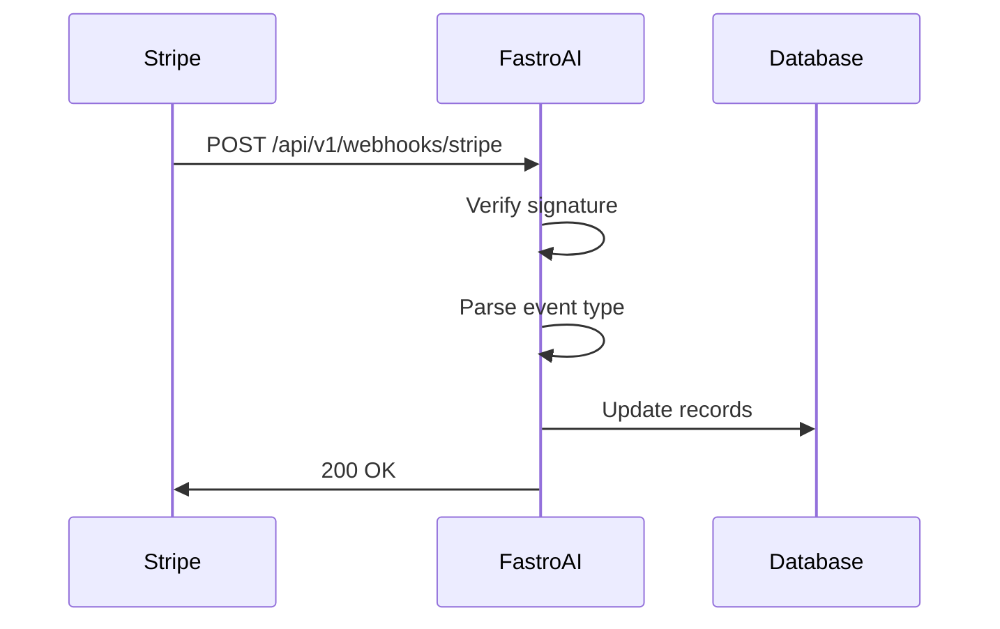

# Webhooks

Stripe webhooks tell your app when things happen: payments complete, subscriptions cancel, disputes get filed. FastroAI handles several webhook events automatically, and you can extend the system to handle more.

## How Webhooks Work

When something happens in Stripe (a checkout completes, an invoice is paid), Stripe sends an HTTP POST request to your webhook endpoint with details about the event.



The signature verification step is critical. It proves the request actually came from Stripe and wasn't forged by someone else.

## Configuring the Webhook

In your Stripe Dashboard, create a webhook endpoint pointing to `https://yourdomain.com/api/v1/webhooks/stripe`. Select the events you want to receive (at minimum, the ones FastroAI handles). Then copy the webhook signing secret to your environment:

```bash
STRIPE_WEBHOOK_SECRET=whsec_...
```

For local development, use the Stripe CLI to forward webhooks:

```bash
stripe listen --forward-to localhost:8000/api/v1/webhooks/stripe
```

The CLI prints a signing secret for local testing. Use that instead of your production secret.

## Events FastroAI Handles

The webhook router in `backend/src/interfaces/api/v1/webhooks.py` dispatches events to handler methods in `PaymentService`.

### checkout.session.completed

This is the main event for new purchases. When a user completes checkout, the handler updates the payment record status to `SUCCEEDED`, creates a local `Subscription` record for recurring payments, redeems any discount code that was used, grants entitlements based on the price's `extra_metadata` configuration, and updates the user's subscription reference.

### checkout.session.expired

When a user abandons checkout without completing payment, Stripe fires this event. The handler marks the payment record as failed so you know the checkout was never completed.

### invoice.payment_succeeded

This fires each billing cycle for subscriptions. The handler creates a payment record for the billing period and renews the user's entitlements for continued access. This is what keeps subscription access going month after month.

### customer.subscription.deleted

Fires when a subscription ends, whether because the user cancelled, payment failed too many times, or the subscription was deleted in Stripe. The handler updates the local subscription to `cancelled` status, revokes all subscription-linked entitlements, and ends any active subscription discounts.

### charge.dispute.created

Handles chargebacks. When a customer disputes a charge, the handler records the dispute information and revokes product entitlements. You can modify this behavior if you prefer to wait for dispute resolution before revoking access.

## Extending: Adding New Event Handlers

To handle additional Stripe events, add them to the webhook router:

```python
# In backend/src/interfaces/api/v1/webhooks.py

elif event["type"] == "invoice.payment_failed":
    invoice = event["data"]["object"]
    await payment_service.handle_invoice_payment_failed(invoice, db)
```

Then implement the handler in `PaymentService`:

```python
# In backend/src/modules/payment/service.py

async def handle_invoice_payment_failed(
    self, stripe_invoice: dict, db: AsyncSession
) -> None:
    """Handle failed invoice payment."""
    subscription_id = stripe_invoice.get("subscription")
    if not subscription_id:
        return

    logger.warning(f"Invoice payment failed for subscription {subscription_id}")

    await self.entitlement_service.handle_payment_failure(
        stripe_subscription_id=subscription_id,
        db=db,
    )
```

## Idempotency

Stripe may send the same webhook multiple times due to retries or network issues. Your handlers should be idempotent, meaning processing the same event twice has the same result as processing it once.

FastroAI's handlers achieve this by checking if records already exist before creating them. For example, `handle_checkout_session_completed` checks if a subscription record already exists for the Stripe subscription ID before creating one.

If you add custom handlers, follow the same pattern:

```python
async def handle_some_event(self, event_data: dict, db: AsyncSession):
    existing = await self.some_crud.get_by_stripe_id(
        db=db, stripe_id=event_data["id"]
    )
    if existing:
        logger.info(f"Event already processed: {event_data['id']}")
        return

    # Process the event...
```

## Signature Verification

The webhook handler verifies signatures before processing:

```python
from src.infrastructure.stripe.webhooks.handler import verify_webhook_signature

event = verify_webhook_signature(payload, sig_header)
```

This function uses Stripe's built-in signature verification. It raises `StripeWebhookError` if the signature is invalid, which gets converted to an HTTP 400 response.

Never skip signature verification. Without it, anyone could send fake webhook requests to your endpoint.

## Testing Webhooks

The Stripe CLI can trigger test events:

```bash
stripe trigger checkout.session.completed
stripe trigger customer.subscription.deleted
```

You can also resend events from the Stripe Dashboard's webhook logs, which is useful for debugging production issues.

## Key Files

| Component | Location |
|-----------|----------|
| Webhook router | `backend/src/interfaces/api/v1/webhooks.py` |
| Signature verification | `backend/src/infrastructure/stripe/webhooks/handler.py` |
| Event handlers | `backend/src/modules/payment/service.py` |
| Stripe settings | `backend/src/infrastructure/config/settings.py` |

---

[← Credits](credits.md){ .md-button } [Admin →](../admin/index.md){ .md-button .md-button--primary }
