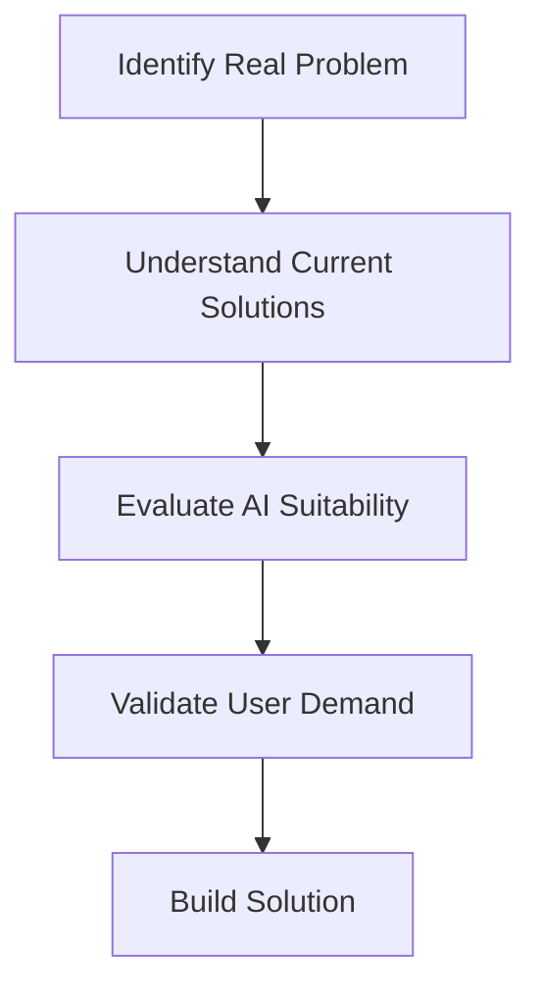
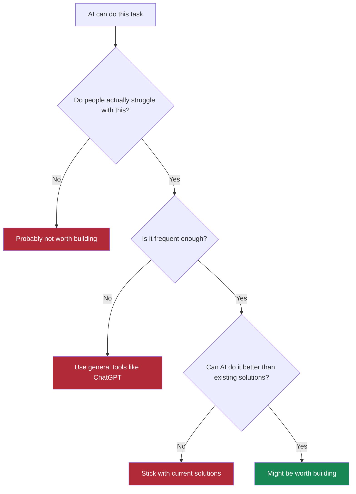

# Identifying Problems Worth Solving

The difference between building something people want and building something impressive is actually solving a problem instead of just trying to do something cool.

Many AI projects start with excitement about the technology. "What if we used GPT to..." or "I saw this cool demo where..." This backwards approach is why so many AI applications fail. They're solutions looking for problems, rather than solutions to real problems.

Unless you have a bunch of money to use on research, your best bet isn't asking "What can we do with transformers?", it's asking "What problems do people have that we might be able to solve better?" This distinction matters more than you might think.

## Starting with Problems, Not Technology

Here's how sustainable AI applications actually get built: you identify a real problem that affects real people, understand how they currently solve it, figure out if AI can improve the existing solutions, and validate that people will actually use the improvement.

Notice that "Can we build this with AI?" comes third, not first. This is intentional.

Most failed AI projects start with step 3 (AI capabilities) and try to work backwards to find problems. This backwards approach is a common pattern in failed AI initiatives. Now that we know that we should focus on problems, let's see how to judge wich problem to tackle.

## The Problem Hierarchy

Not all problems are created equal. Some problems are painful and people actively seek solutions. Others are minor annoyances that people complain about but don't actually act on.

Successful AI applications understand two dimensions: pain intensity and frequency of encounter. Problems that cause real pain and occur frequently create the strongest market opportunities because they motivate people to actively seek solutions and change their behavior.

**High-pain, frequent** problems like financial stress or team communication breakdowns drive people to spend money, invest time learning new tools, and switch from existing solutions. The combination of urgency and repetition creates sustained demand that can support businesses.

**Low-pain, infrequent** problems like digital decluttering or password updates rarely motivate behavior change. People might acknowledge these as problems, but they develop workarounds or simply tolerate the inconvenience rather than seeking dedicated solutions.

Here's the hierarchy that predicts which AI solutions will probably work:

| Problem Type | User Behavior | Market Potential | Examples |
|--------------|---------------|------------------|----------|
| **High Pain + Frequent** | Actively seek solutions, willing to pay | Excellent | Financial stress, communication tools |
| **High Pain + Infrequent** | Seek solutions when needed | Good | Tax preparation, legal advice |
| **Low Pain + Frequent** | Develop workarounds | Limited | Email organization, photo sorting |
| **Low Pain + Infrequent** | Ignore or tolerate | Poor | Digital decluttering, password updates |

Two examples that illustrate the extreme ends of this spectrum:

-   :material-trending-up:{ .lg .middle .green } **High-Pain + Frequent: Business Finance**

    ---

    **Small business owners managing finances** - this is high-pain territory.

    **Pain Level:** Poor financial decisions can kill a business, stress keeps owners awake at night

    **Frequency:** Daily financial decisions, weekly cash flow concerns, monthly planning cycles

    **Current Solutions:** Basic accounting software, expensive consultants, overwhelming spreadsheets

    **Result:** People actively seek solutions and will pay for real help

-   :material-image-multiple:{ .lg .middle .gray } **Low-Pain + Infrequent: Photo Organization**

    ---

    **Organizing digital photos** - people might grumble about it.

    **Pain Level:** Not urgent enough to drive real action

    **Frequency:** Sporadic, when storage gets full or looking for specific photos

    **Current Solutions:** Usually "good enough" - basic photo apps, cloud storage

    **Result:** Hard to monetize because people don't prioritize solving it

This contrast shows why understanding problem characteristics matters for AI applications. Problem characteristics help explain why financial management tools can build sustainable businesses while photo organization apps struggle to find paying customers.

Note that you can create successful businesses even out of low pain infrequent problems, but it's a lot harder if you don't have the resources and time to create a need for your users. Changing user behavior is **hard**, and not many companies get to do this. Now let's see about problem validation.

## Problem Validation

What looks like a problem on the surface might not be one that people care enough to solve. Many AI projects solve problems that sound important but don't translate into real user behavior.

Take email organization as an example. Everyone complains about email overload, so building an AI-powered email organizer seems like a no-brainer. But when you dig deeper, you discover that most people have developed coping mechanisms that work well enough. They're not actively seeking a solution because the problem, while annoying, doesn't cause enough pain to motivate change.

Personal finance management, on the other hand, represents a different category entirely. Financial stress affects the majority of people and has serious consequences. People make spending decisions every day, they need to check in on their finances regularly, and they're constantly planning for the future. The problem never goes away, and the stakes are high enough that people actively seek solutions.

Daily problems like personal productivity or communication tools have more potential than something people only deal with once a year, even if that annual problem is quite painful.

### Understanding the Competitive Landscape

AI applications thrive where current solutions are poor or adequate - they struggle against excellent existing solutions.

Don't avoid competitive markets entirely. Competition often validates real demand. The question is: what gaps exist that AI can address?

In financial management, you've got apps like Mint and YNAB that are good for tracking but poor for insights. Financial advisors provide excellent personalized advice but are expensive and not accessible to most people for day-to-day questions. Bank apps have basic features but no intelligence - they can tell you what you spent but can't explain patterns or suggest improvements. Spreadsheets are flexible but require expertise most people don't have.

When you map out this landscape, you can see opportunities where AI might add value: providing personalized insights without requiring a human advisor, explaining spending patterns in natural language, or helping people understand their financial behavior without forcing them to become spreadsheet experts.

Note that even this might not be great, maybe people don't want to interact with a chatbot for everything, which is why experimentation is important. Maybe your solution isn't a chatbot, and the AI part is just helping your application make decisions internally. There are lots of limitations and things you need to explore, let's see how available data can affect your solution next.

## Data Makes or Breaks AI Applications

AI applications live or die based on the data they can access. Some domains give you tons of structured, useful data that makes AI incredibly powerful. Others give you almost nothing to work with, forcing users to do manual data entry that kills adoption.

Consider financial applications versus mental health applications:

| Aspect | Financial Applications | Mental Health Applications |
|--------|----------------------|---------------------------|
| **Data Source** | Bank transactions, credit cards, bills | Self-reported mood, manual journaling |
| **Data Quality** | Structured, automatic, comprehensive | Subjective, requires user effort |
| **User Effort** | Zero - data flows automatically | High - must form new habits |
| **Time to Value** | Immediate insights from existing data | Weeks/months of data entry required |
| **Accuracy** | Objective financial facts | Subjective self-assessment |
| **Privacy Concerns** | Moderate - financial data | High - deeply personal information |
| **Regulatory Issues** | Some compliance requirements | Heavy regulation, liability concerns |

This isn't to say mental health applications can't work, but they face much steeper challenges. Financial applications can provide value immediately based on existing transaction data. Mental health applications need users to form new habits and manually input sensitive information before they can provide any value.

The pattern here is simple: AI works best when it can analyze existing user behavior rather than requiring new habits. Financial transactions happen automatically and contain rich information. Mental health requires active user participation and subjective reporting.

Next, let's learn how to identify common pitfalls for AI projects.

## Recognizing Anti-Patterns

There are certain types of problems that seem appealing but usually fail, and learning to recognize these patterns can save you significant time and effort.

Common AI project anti-patterns to watch out for:

The **"wouldn't it be cool if"** problems sound fun but lack real pain. AI that predicts what clothes you'll want to wear falls into this category. People don't actually struggle with choosing clothes enough to justify a complex solution, and the personal nature of style preferences makes it difficult for AI to provide consistently valuable recommendations.

The **"AI can totally do this"** problems focus on technical capability rather than market need. Sure, AI can write professional emails, but most people don't actually struggle with email writing enough to justify a dedicated solution. Plus, when they occasionally need help with a difficult email, they can just use ChatGPT directly. The question isn't whether AI can technically perform the task, but whether it can do so in a way that creates real value for users.

The **"someone must want this"** problems assume demand without validation. AI-powered habit trackers fall into this category. People say they want to track their habits, but most habit tracking apps have terrible retention rates because people don't actually stick with habit tracking long enough to get value.

The **"I have this problem"** trap jumps from personal annoyance to business opportunity without proper validation. Having a problem yourself can be a good starting point - you understand the pain firsthand. But ask yourself: did you actually spend money trying to fix this problem? If you didn't spend money on it, it's probably not that big a problem even for you. And if it's not big enough for you to pay for, why would other people pay for your solution?

Now let's think if we're adding AI because it's the right thing or just because it's cool (and why the latter might not be a good idea).

## Always Try the Simple Solution First

Before committing to an AI approach, you should seriously consider whether simpler solutions might work better. Adding AI complexity to your application has real costs - development time, operational complexity, unpredictable behavior, and ongoing maintenance. Sometimes the best AI solution is no AI at all.

To illustrate this decision-making process, consider email categorization as a practical example:

-   :material-robot:{ .lg .middle } **LLM-Powered Approach**

    ---

    **How it works:** Reads email content and categorizes messages with sophisticated natural language intelligence

    **Pros:** Works well, handles edge cases gracefully, technically superior

    **Cons:** Slower, less predictable, harder to debug, more expensive

    **Best for:** When you need that extra 5% of edge case handling

-   :material-cog:{ .lg .middle } **Rules-Based Approach**

    ---

    **How it works:** Looks at sender addresses, subject line keywords, and message metadata

    **Pros:** Faster, more predictable, easier to debug, handles 95% of cases perfectly

    **Cons:** Struggles with edge cases, less flexible

    **Best for:** When clear patterns exist and 95% accuracy is sufficient

The LLM approach is technically superior for language understanding, but the simple approach might be the better choice unless you specifically need that extra 5% of edge case handling. You need to understand not just whether AI can solve a problem, but whether it's the right tool for the job.

The evaluation framework comes down to a few key questions you should ask about every potential AI project:

| Question | AI Favored | Simple Solution Favored |
|----------|------------|-------------------------|
| **Could rule-based logic solve this?** | No - too many edge cases | Yes - clear if-then rules work |
| **Is natural language understanding needed?** | Yes - users need conversational interface | No - structured inputs work fine |
| **Do you need personalization?** | Yes - responses must adapt to individuals | No - one-size-fits-all works |
| **How important is explainability?** | Moderate - approximate reasoning OK | Critical - exact logic required |
| **What's the precision requirement?** | Mixed - some approximation acceptable | High - zero tolerance for errors |

This framework helps you make informed decisions rather than jumping to AI because it seems impressive.

For our personal finance example, natural language understanding is valuable for a certain part. Users ask questions like "Why am I spending so much money?" or "Help me save for vacation." These queries require understanding intent, context, and implied meaning that traditional systems struggle with. The variability in how different users want insights presented - some prefer encouraging language, others want direct facts, some need simple summaries, others want comprehensive analysis - makes personalization essential rather than nice-to-have.

## The Business Analysis

Even if you've identified a real problem that AI can solve better than existing solutions, you need to consider the business realities of building and maintaining an AI application.

**AI Project Costs:**

- LLM API calls cost money, especially for personalized analysis
- Specialized knowledge required for development and tuning
- Complex testing strategies and monitoring needed
- Balance insight quality with operational expenses

For high-volume, low-margin applications, these costs might be prohibitive. If you have a small team or tight timeline, simpler approaches might be more practical. If you need to document exact decision-making logic for regulatory compliance, LLM "black box" reasoning creates problems.

But when the language capabilities are central to your value proposition - when users want to ask natural questions and receive personalized, understandable explanations - these costs become justifiable. Be honest about whether AI adds enough value to justify its complexity.

## Validation Through Current Behavior

The best way to validate that you've identified a real problem is to focus on current behavior rather than hypothetical preferences.

**Don't ask:** "Would you use an AI tool for X?"

**Instead ask:**

- How do you currently handle X?
- What's frustrating about that process?
- What workarounds have you developed?
- How much time or money do you currently spend dealing with this?

Look for existing solutions as a positive signal. If multiple competitors have paying customers, that's evidence of real demand. If no one else is trying to solve the problem, that might be a red flag rather than an opportunity.

Most importantly, remember that people want problems solved - they don't care about the underlying technology. The "AI-powered" part isn't a selling point unless it enables capabilities that weren't possible before. Users care about outcomes, not implementation details.

This perspective helps you stay focused on what matters: finding real problems where AI can provide improvement over existing solutions, and where that improvement is valuable enough to justify the additional complexity of building and maintaining an AI system.

The framework we've discussed - pain intensity, frequency, current solution quality, data availability, and market validation - provides a systematic way to evaluate opportunities. The goal is to develop intuition about what makes a problem worth solving. That intuition comes from talking to people, understanding their current solutions and frustrations, and honestly assessing whether AI can make their lives better.

When you find a problem that passes this evaluation - high pain, frequent occurrence, poor current solutions, rich data, and market validation - then you can start thinking about whether AI is the right tool for the job. That's what we'll explore next: understanding what LLMs can actually do well, and when they're the right choice versus when simpler solutions would work better.

[Understanding What LLMs Can Actually Do →](understanding-what-llms-can-do.md){ .md-button .md-button--primary }
