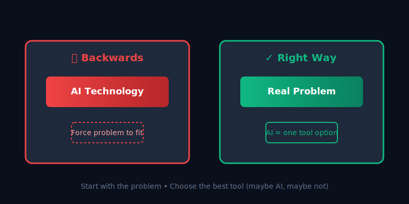

# What Problems are Solvable by AI?

Before you write a single line of code, you need to answer this question. Most AI projects fail because they solve problems that don't need AI solutions, or worse, problems that don't exist at all.

<div class="grid cards" markdown>

-   :material-lightbulb-alert:{ .lg .middle } **The Question Everyone Skips**

    ---

    Most AI applications fail not because of bad code, but because they're solving the wrong problems.

    This is the most important question in AI development, but almost no one asks it first.

-   :material-alert-circle:{ .lg .middle } **The Reality**

    ---

    Perfect technical implementation + Beautiful UI + Flawless deployment = **Expensive solution to a nonexistent problem**

    This section helps you avoid that trap.

</div>

Most AI projects fail because they solve the wrong problems. You can have perfect technical implementation, beautiful UI, and flawless deployment, but if AI doesn't actually help with the problem you're trying to solve, you've built an expensive solution to a nonexistent problem - this is what we're calling the _backwards approach_.

## The Backwards Approach

We're living through an AI hype cycle where every day someone announces they're "adding AI" to their product. Most of these announcements sound impressive but solve no real problems. They're building AI for the sake of AI, which is backwards.

AI is a tool, not a magic wand. Like any tool, it's good for specific jobs and terrible for others. You wouldn't use a hammer to cut wood or a saw to drive nails (maybe you would if it meant getting VC money but let's ignore this).

The same logic applies to AI, but the difference is that hammers and saws have obvious use cases. AI's capabilities are less intuitive, which leads to expensive mistakes.

You'll see way too many people approach AI development by starting with:

```
"What can AI do?" → Find problems to fit the technology
```

This backwards thinking is why most AI projects fail. The right approach flips this around completely.



*The backwards approach starts with AI capabilities and searches for problems to apply them to. The right approach starts with real problems and evaluates whether AI is the best solution.*

Instead of diving into code, we'll think like problem solvers. Start with "What problems do people actually have?" and determine when AI is the right solution. This approach leads to applications that people actually want to use and pay for, rather than impressive demos that nobody needs. We'll use a real example for this.

## Learning Through a Real Example

Throughout this section, we'll work through a concrete example: building a Personal Finance Assistant. This isn't a toy example - it's a real problem that affects millions of people and represents a business opportunity (there's definitely someone making money with this exact idea).

Personal finance makes a good case study because it's a problem that people struggle with daily. Managing finances, understanding spending patterns, and making informed financial decisions cause real stress and have serious consequences. The problem has clear AI benefits - natural language understanding, pattern recognition, and personalized recommendations are what LLMs do well. Financial services represents a large market with proven willingness to pay for valuable tools (you're paying to save money), and the complexity scales so we can start simple and add sophisticated features as we learn.

As we work through this example, you'll see how to apply the same thinking process to your own problem domain. The specific details will be different, but the fundamental approach works for any AI application.

## The Right Way to Think About AI Problems

Most tutorials start here: "Let's install the libraries and start coding!"

This is like starting to build a house by mixing concrete. You might end up with something, but it probably won't be what you actually need. Successful AI products start here: "What problems do people actually have?"

This section is about building the right thing, not just building things right.

**What You'll Learn:**

Systematic problem-solving frameworks that work for any AI application:

- Problem identification and market validation
- AI suitability assessment (when to use AI vs simpler solutions)
- Requirement specification that drives technical decisions
- Success criteria definition for measurable outcomes

<div class="grid cards" markdown>

-   :material-lightbulb:{ .lg .middle } **Think Like a Problem Solver**

    ---

    This section won't teach you to code. Instead, it teaches you how to think about AI problems.

    This thinking guides every technical decision you make later.

-   :material-chart-line:{ .lg .middle } **Real Business Impact**

    ---

    The same process used by successful AI startups to identify valuable opportunities and avoid expensive failures.

    Technical skills you can learn anywhere. These frameworks separate successful projects from failures.

</div>

### What You'll Gain

By the time you finish this section, you'll have:

- Framework for identifying AI-suitable problems that you can apply to any domain
- Understanding of LLM capabilities and limitations so you know when to use AI
- Practical evaluation criteria to determine if your idea will actually benefit from AI
- Ability to translate vague problems into actionable technical requirements

## Your Learning Path

<div class="grid cards" markdown>

-   :material-magnify:{ .lg .middle } **[Identifying Problems Worth Solving](identifying-problems-worth-solving.md)**

    ---

    Learn systematic approaches to problem identification and evaluation

    **Outcome:** Problem evaluation framework

-   :material-robot:{ .lg .middle } **[Understanding What LLMs Can Do](understanding-what-llms-can-do.md)**

    ---

    What AI can and can't do well in practice

    **Outcome:** AI capability assessment

-   :material-finance:{ .lg .middle } **[I Have a Problem that Can be Solved by AI: Financial Assistant](../1-case-study-personal-finance-assistant/index.md)**

    ---

    Complete walkthrough from problem to requirements

    **Outcome:** Ready-to-implement requirements

-   :material-hammer-wrench:{ .lg .middle } **I Want to Build a Proof of Concept: First AI Application** *(Coming Soon)*

    ---

    From validated problem to working prototype

    **Outcome:** Working AI application with FastroAI

-   :material-account-group:{ .lg .middle } **Other People Want to Use My Tool** *(Coming Soon)*

    ---

    Multi-user systems and authentication

    **Outcome:** Production-ready user management

-   :material-cash-multiple:{ .lg .middle } **I Want to Monetize My App** *(Coming Soon)*

    ---

    Payment systems and business models

    **Outcome:** Revenue-generating AI application

-   :material-trending-up:{ .lg .middle } **I Need to Scale** *(Coming Soon)*

    ---

    Performance and scaling for production

    **Outcome:** Scalable AI platform

</div>

[Start Problem Identification →](identifying-problems-worth-solving.md){ .md-button .md-button--primary }
