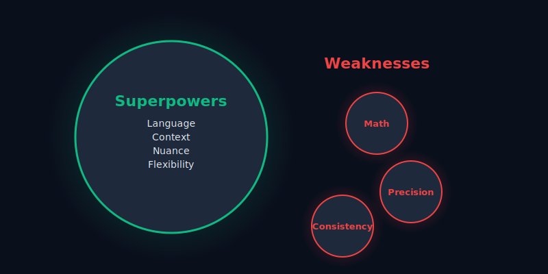

# Understanding What LLMs Can Actually Do

**What they're good at and what they're terrible at.**

You've learned how to identify problems worth solving. You understand that most problems don't need AI solutions, and you know how to spot the ones that might. Now comes the next question: what can LLMs actually do in practice?

Before we continue, let's be clear about what we mean by "AI" in this guide. When we've been talking about AI applications, we're specifically referring to generative AI - mostly Large Language Models like GPT, Claude, and Gemini. The broader field of AI includes machine learning for recommendations, computer vision for image recognition, evolutionary algorithms for optimization, and many other techniques. But this guide focuses on LLM-powered applications because that's what most people mean when they say "AI application" today.

LLM demos show perfect scenarios with cherry-picked examples. LLM reality involves edge cases, user confusion, and messy real-world complexity. Understanding this gap is what separates working applications from impressive demos.

## What LLMs Actually Do Well

Large Language Models are good at specific things. Understanding these capabilities helps you recognize when they're the right tool for the job.



*LLMs excel in areas requiring language understanding and flexibility, but struggle with precision and consistency.*

Four main capabilities make LLMs useful for certain applications:

<div class="grid cards" markdown>

-   :material-message-text:{ .lg .middle } **Natural Language Understanding**

    ---

    When someone says "I spent way too much on coffee last month," there's a lot happening beneath those words - regret, acknowledgment of a pattern, a request for help.

    Traditional programming would struggle to extract all this nuance. You'd need to anticipate every possible way someone might express financial concerns. LLMs handle the messiness of human communication.

-   :material-pencil-outline:{ .lg .middle } **Text Generation & Transformation**

    ---

    LLMs can take information and present it in different ways - summaries, explanations, different tones, various formats. This flexibility is powerful for user-facing applications.

    Instead of showing raw numbers, they can transform transaction data into insights like "You spent 23% more on dining out this month, primarily due to five expensive weekend meals." They make structured data meaningful for humans.

-   :material-chart-timeline:{ .lg .middle } **Pattern Recognition in Language**

    ---

    LLMs can spot trends and anomalies that humans might miss. They can identify spending patterns, detect sentiment changes, or recognize when someone's financial behavior is shifting.

    This goes beyond simple data analysis - it's about understanding the story that language tells about behavior and circumstances.

-   :material-tune:{ .lg .middle } **Contextual Adaptation**

    ---

    LLMs can adjust their responses based on the specific situation, user preferences, and conversational history. Some people want detailed breakdowns, others prefer simple summaries. Some prefer encouraging language, others want direct facts.

    LLMs can adapt their tone and level of detail dynamically, creating interactions that feel personalized rather than scripted.

</div>

## What LLMs Are Terrible At

Understanding what LLMs can't do well is just as important as understanding their strengths. These limitations will derail your project if you don't plan around them.

Fundamental constraints that affect every architecture decision:

- **Math errors**: LLMs get basic arithmetic wrong and struggle with multi-step calculations. For financial apps, never trust them with actual number crunching - they can interpret results, but calculations must happen in traditional code.

- **Hallucinations**: They confidently state plausible-sounding but completely false "facts." They might cite non-existent studies or make up statistics, which is dangerous in domains like finance where wrong information leads to poor decisions.

- **Inconsistency**: The same LLM might give different answers to identical questions on different days, or contradict previous statements. Users expect reliable behavior, especially for something like spending pattern analysis.

- **Outdated information**: Most LLMs have training data cutoffs and can't access current information unless you provide it. They can't browse the internet or get live data feeds for current market conditions or tax law changes.

- **Logic breakdown**: Multi-step reasoning falls apart when each step depends on the previous ones being exactly right. They struggle with problems requiring perfect logical consistency across dependent steps.

These constraints shape every architectural decision. Here's what this looks like in practice:

```python
# Wrong approach - don't do this!
def calculate_budget(income, expenses):
    prompt = f"Calculate budget with income {income} and expenses {expenses}"
    return llm.generate(prompt)  # Unreliable!

# Right approach
def calculate_budget(income, expenses):
    budget = income - sum(expenses)  # Traditional calculation
    explanation = llm.explain_budget_result(income, expenses, budget)
    return budget, explanation
```

LLMs can interpret the results of calculations and explain what they mean, but the calculations themselves need to happen in traditional code.

## How This Affects Your Architecture

These strengths and limitations directly affect how you should architect AI applications. Use LLMs for what they do well, traditional approaches for everything else.

Dividing responsibilities:

| Component | LLM Handles | Traditional Code Handles |
|-----------|-------------|-------------------------|
| **User Interface** | Natural language queries, personalized explanations | Data validation, error handling |
| **Data Processing** | Pattern interpretation, insight generation | Calculations, data transforms |
| **Business Logic** | Contextual recommendations | Rules enforcement, workflow control |
| **Data Storage** | Deciding what to store, categorization logic | All database operations |
| **External APIs** | Response formatting | API calls, error handling |

**Use LLMs for communication, not computation.** Let them handle natural language input and output, but do actual computations with traditional code. For financial apps, LLMs can interpret "I want to save more money" and generate helpful explanations, but use regular programming to calculate interest rates, budget allocations, and spending trends.

**Combine AI with authoritative data.** Don't let LLMs make up facts about financial markets or tax laws. Use them to interpret and explain real data from authoritative sources. They're good at taking complex financial regulations and explaining them in simple terms, but they shouldn't be generating the regulatory information themselves. Think of LLMs as translators, not encyclopedias.

**Design for inconsistency.** Build systems that can handle varying responses from LLMs. Don't assume they'll always format output the same way or make identical decisions in similar situations. Build validation layers and provide ways for users to clarify when responses don't match their expectations.

**Validate everything that matters.** Never trust LLM output without verification, especially for important decisions. Build validation layers that can catch mathematical errors, verify calculations, and ensure LLM-generated summaries accurately reflect the underlying data. The cost of verification is less than the cost of wrong decisions.

**Provide context explicitly.** Feed LLMs the information they need rather than expecting them to remember or infer missing details. For each query, explicitly provide user preferences, recent transactions, and relevant financial data. This reduces hallucinations and incorrect assumptions.

## Applying This to Financial Applications

Let's get concrete with our personal finance assistant example. LLMs should handle what they do well while avoiding their weaknesses entirely.

For financial applications, here's how to use LLM strengths while avoiding their pitfalls:

<div class="grid cards" markdown>

-   :material-check-circle:{ .lg .middle .green } **What LLMs Should Handle**

    ---

    **User Query Interpretation:** Transform vague questions like "Why did I spend so much money last month?" into specific analysis requirements

    **Personalized Explanations:** Convert raw data into meaningful insights like "Your spending increased by $400, primarily due to three car repairs totaling $380"

    **Communication Adaptation:** Adjust tone and detail level - detailed breakdowns vs simple summaries, encouraging vs direct language

    **Context Understanding:** Recognize implied meaning and user intent from conversational input

-   :material-close-circle:{ .lg .middle .red } **What LLMs Should NOT Handle**

    ---

    **Mathematical Calculations:** Never trust LLMs with actual number crunching, totals, percentages, or financial computations

    **Financial Advice Generation:** Don't let them create novel investment strategies or financial recommendations without validation

    **Precise Data Handling:** Can't be trusted with exact dollar amounts or dates without verification against source data

    **Regulatory Information:** Shouldn't generate tax laws, compliance requirements, or financial regulations from memory

</div>

LLMs should interpret and explain results that traditional code has already calculated and validated. They make data meaningful for humans, but the underlying data processing must happen through reliable, deterministic systems.

## Working With LLM Quirks

Working with LLMs means accepting their quirks and designing around them, not against their nature.

Take precision. LLMs are good at "roughly right" insights that help users understand patterns and trends. They're terrible at "exactly right" calculations or precise logical reasoning. Design your application to use the former while using traditional approaches for the latter. This acceptance of approximation becomes a feature when applied correctly.

Since LLMs can be inconsistent, build feedback loops into your interface. "Did this answer help?" isn't sufficient - ask specific questions about accuracy and usefulness. Provide ways for users to request more detail, different explanations, or alternative perspectives on the same data.

Layer multiple techniques together. Combine LLM insights with rule-based systems, traditional algorithms, and user controls. This creates applications that are more reliable than relying solely on LLM capabilities while still benefiting from their flexibility and natural language understanding.

Plan for hallucinations rather than hoping they won't happen. Assume LLMs will occasionally generate plausible-sounding but incorrect information. Build systems that can catch and correct these errors, or at least make it clear to users when information might be uncertain or approximate.

Design transparent interfaces that help users understand what's happening. Don't hide the AI behind opaque interfaces - make it clear when users are interacting with AI-generated content. This helps users develop appropriate levels of trust and makes it easier for them to provide feedback when something seems wrong.

Work with LLM characteristics rather than trying to force them into traditional software patterns.

## Common Misconceptions

Before we move on, let's address some widespread misconceptions about what LLMs can do. These misunderstandings cause real problems because they lead to architectural decisions that don't work in practice.

I've seen teams spend months building applications based on these false assumptions, only to discover fundamental flaws when they try to deploy. Understanding what LLMs actually are - and what they're not - helps you avoid these expensive mistakes.

Here are the misconceptions that cause the most trouble:

| Misconception | Reality | Implication |
|---------------|---------|-------------|
| **LLMs are search engines** | Generate responses from training patterns | Provide current data explicitly |
| **LLMs are databases** | Can't reliably store/retrieve facts | Use proper databases for user data |
| **LLMs are perfect reasoners** | Make logical errors humans wouldn't | Validate reasoning for critical decisions |
| **LLMs are consistent APIs** | Introduce variability by design | Design for uncertainty, not determinism |
| **LLMs are human replacements** | Augment capabilities in specific domains | Combine with human oversight |

LLMs are not search engines. They don't look up information - they generate responses based on patterns in their training data. They can't reliably answer questions that require current or specialized knowledge that wasn't in their training set.

```python
# Wrong assumption
user_query = "What's the current Fed interest rate?"
response = llm.generate(user_query)  # May be outdated or wrong!

# Better approach
current_rate = get_fed_rate_from_api()  # Get real data
response = llm.explain_rate_impact(current_rate, user_context)
```

LLMs are not databases. They can't reliably store or retrieve specific facts about users or transactions. Don't treat them as a way to store user data or business logic. LLMs don't actually remember anything - they just generate text based on what you include in each request. When it seems like they "remember" earlier parts of a conversation, that's because you're sending the previous messages along with each new request. This means you're responsible for managing what gets remembered and for how long.

These misconceptions matter because they lead to fundamental architectural mistakes. If you think LLMs are search engines, you'll expect them to provide current information without giving them access to current data. If you think they're databases, you'll try to use them to store user information and wonder why it disappears between sessions.

The pattern here is simple: LLMs are text generation systems that happen to be very good at understanding and producing human language. They're not replacements for traditional software components like databases, APIs, or search systems. They work best when combined with these traditional components, not when used as substitutes for them.

## Making Smart Design Decisions

LLMs are powerful tools with real limitations. Good applications understand both sides and design accordingly.

LLMs are good at making interactions feel natural and human-like. They can take complex information and present it in ways that are easy to understand. They can adapt to different users and contexts in ways that traditional software can't match.

But they're also unpredictable, occasionally wrong, and limited in their reasoning capabilities. They work best when combined with traditional programming approaches that handle the parts they're not good at.

The best LLM applications don't try to do everything with AI. They use LLMs for the specific things LLMs do well, while using other approaches for everything else.

Now that you understand what LLMs can and can't do, you have the foundation for making smart decisions about when and how to use them. Next, we'll see how this understanding applies to a concrete example: building a personal finance assistant from initial problem identification through to technical requirements.

[Case Study: Building a Personal Finance Assistant →](../1-case-study-personal-finance-assistant/index.md){ .md-button .md-button--primary }
