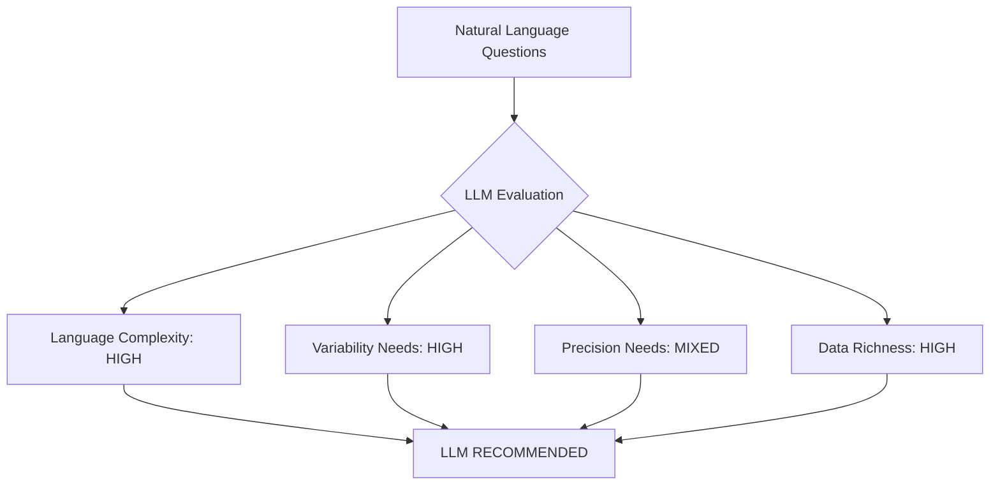

# Case Study: Technical Design

**From problem validation to technical requirements.**

We've validated our Personal Finance Assistant opportunity. Now we need to figure out whether AI is actually the right tool for this job and design a system that works.

This is where many projects go wrong - they assume AI is the answer without checking whether it actually helps or just adds complexity.

## Evaluating LLM Suitability

Let's check whether LLMs are the right tool for this problem based on what we know about their capabilities and limitations.

Financial applications work well with LLMs in several ways that make AI actually useful rather than just impressive.

The language challenge is real. Financial questions are often vague and contextual: "Why am I spending so much?" or "How can I save for vacation?" Understanding these queries requires natural language processing that can handle ambiguity, implied meaning, and conversational context.

!!! note
    Traditional keyword-based systems would struggle with the variability in how people express financial concerns. Consider these equivalent queries:

    - "I'm spending too much money"
    - "My expenses are out of control"
    - "Where does all my money go?"
    - "I need to cut back on spending"

    An LLM understands these all mean the same thing.

Then there's personalization. Different users need completely different communication styles, levels of detail, and types of insights. Some want encouraging guidance, others prefer direct facts. Some need simple explanations of financial concepts, others want thorough analysis. This variability is exactly what LLMs excel at - adapting their communication style to individual preferences.

The precision story is interesting too. Account balances and calculations must be exact - there's no room for approximation when dealing with actual dollar amounts. But insights and explanations can be approximate. "You spent about 20% more on dining out this month" is more useful than listing every transaction, and this type of interpretation is where LLMs add real value.

Financial data is also rich with context. Every transaction tells a story about user behavior and preferences. Transaction amounts, dates, merchants, categories, and patterns over time provide plenty of context for generating insights. Unlike domains where you need users to manually input preferences and goals, financial behavior data reveals a lot about what users actually prioritize.

Finally, user expectations make sense here. Natural language interaction works well for financial guidance. People are used to asking human advisors questions and receiving personalized explanations. They want to understand their financial situation, not just see raw data, which plays to LLM strengths in explanation and interpretation.

So LLMs make sense for this problem. The financial domain plays to their strengths while avoiding most of their weaknesses. The language understanding and personalization capabilities are worth the additional complexity.

## What We Actually Need to Build

Now let's figure out what this means in practice. We could build dozens of features, but we need to focus on the core problem first: helping people understand where their money goes.

Remember Alex, our teacher who gets to the end of the month with $0? That's our primary validation target. If we can help Alex understand their spending patterns, we've solved the core problem.

!!! note "Core Problem to Solve"
    Take a user's financial data and natural language questions, then provide personalized insights they can actually understand and act on.

The system needs to handle a few key things:

-   :material-message-text:{ .lg .middle } **Natural Language Processing**

    ---

    Handle questions like "Why am I spending so much?" or "Where does my money go?"

-   :material-chart-timeline:{ .lg .middle } **Transaction Analysis**

    ---

    Automatically categorize transactions and identify spending patterns over time

-   :material-account-voice:{ .lg .middle } **Personalized Insights**

    ---

    Tailor explanations to individual users - some want details, others want simple summaries

Everything else is a nice-to-have that we can add later. Goal tracking, investment advice, detailed budgeting - those are features for after we prove the core concept works.

## The Technical Reality

Building a financial app isn't like building other AI applications. The constraints are different and they shape every decision you make.

!!! warning "Financial Apps Are Different"
    When it comes to money, math has to be perfect. Account balances, spending totals, and calculations can't have any errors. All financial calculations must use regular programming - never trust LLMs to do the math.

Speed matters more than you might think. When Alex asks "Where does my money go?", they want an answer in 2-10 seconds, not 30 seconds while they watch a loading spinner. Financial questions feel urgent to users.

Security isn't optional either. Financial data is heavily regulated, which means encryption, secure API connections, and detailed audit logs. These aren't nice-to-haves - they're legal requirements that will affect your architecture decisions.

Then there's the data problem. Banks don't always make transaction data easy to access programmatically. Some have good APIs, others require screen scraping or manual uploads. You need flexibility in how information gets into your system.

Scale is something to keep in mind, but don't over-engineer for it upfront. The separation between LLM work and financial calculations helps with this later, but your first priority is proving the concept works for Alex, not optimizing for thousands of users you don't have yet.

All of this points toward a hybrid approach: use LLMs for understanding questions and explaining results, but use traditional code for all the mathematical work and data processing.

## How to Actually Build This

The hybrid approach means we need to split responsibilities clearly between what LLMs are good at and what traditional code handles better:

-   :material-robot:{ .lg .middle } **LLM Handles**

    ---

    - Understanding user questions
    - Translating to specific calculations
    - Explaining results in natural language
    - Generating insights from patterns

-   :material-calculator:{ .lg .middle } **Traditional Code Handles**

    ---

    - All mathematical calculations
    - Data storage and retrieval
    - Transaction categorization
    - Security and validation

This split works well, but there are a few key things to remember:

**Give LLMs context upfront** - Don't expect them to remember details. For each query, you need to explicitly provide user preferences, recent transactions, and relevant financial data.

**Validate everything** - Any dollar amounts or calculations mentioned in LLM explanations should be checked against actual financial data before you show them to users.

**Keep components separate** - Your natural language processing, financial analysis, and data integration should be independent layers so you can improve one without breaking others.

## How We'll Know It's Working

The real question is: how will we know if we're actually solving the problem? 

The most important metric is behavioral change. Are users like Alex making different financial decisions after using the tool? That's the ultimate test - everything else is just a proxy.

But we need some practical metrics too:

**User engagement** tells us if people find it useful. If 70% of users come back weekly and spend 5+ minutes asking multiple questions, that's a good sign they're getting value.

**Problem resolution** shows whether we're actually helping. We want 85% of users rating responses as helpful, and we want to see measurable changes in spending behavior.

**Technical performance** keeps users from getting frustrated. Responses under 2 seconds, accurate transaction categorization over 95% of the time, and reliable uptime.

**Business viability** determines whether this can actually work as a product. User acquisition costs under $50, decent conversion from free to paid, and customer lifetime value that makes the economics work.

The key insight is that all the technical metrics don't matter if users aren't making better financial decisions.

## Where We Stand

We've checked whether LLMs make sense for this problem, figured out what we need to build, and defined how we'll measure success. The analysis supports building an AI-powered solution that combines LLM strengths with traditional programming reliability.

This technical foundation guides our implementation decisions and helps us avoid common AI project pitfalls.

Now we need to figure out what to build first and how to prioritize features.

[Continue to Implementation Plan →](implementation-plan.md){ .md-button .md-button--primary }
