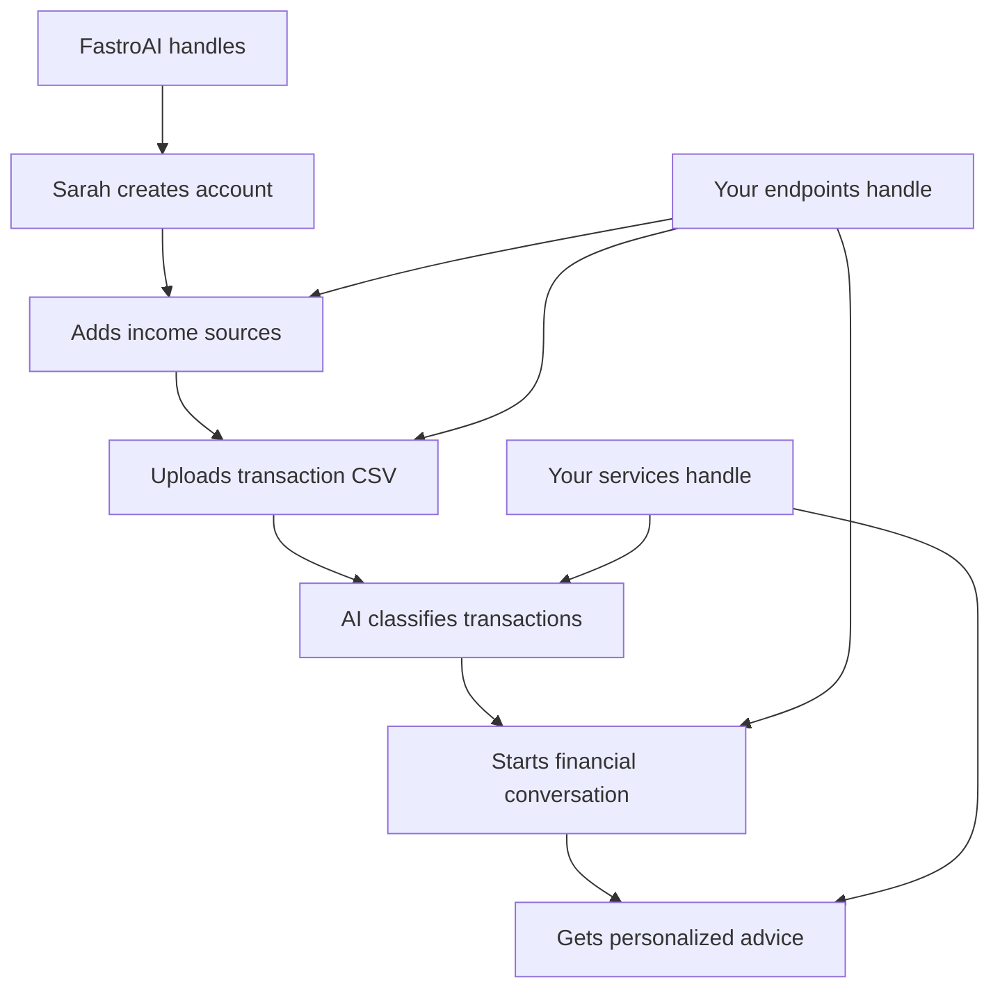
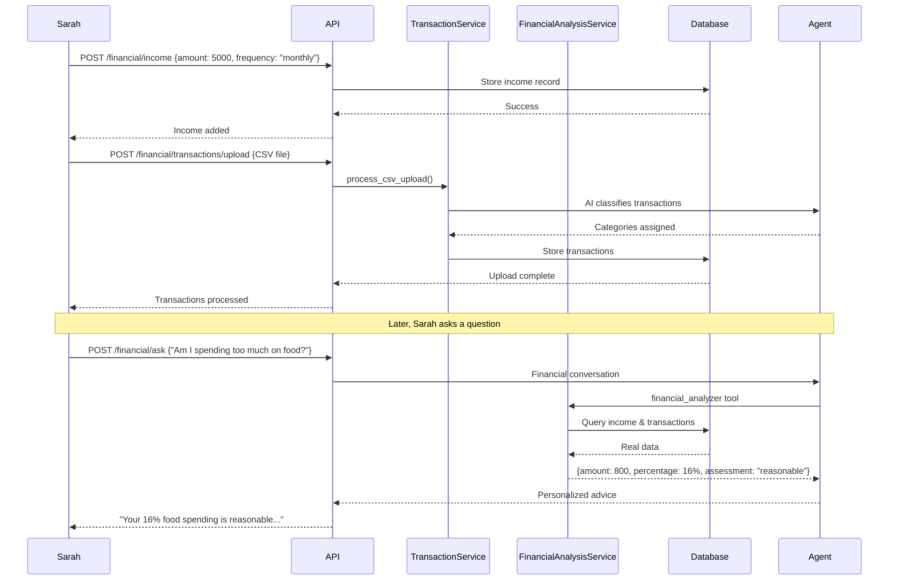
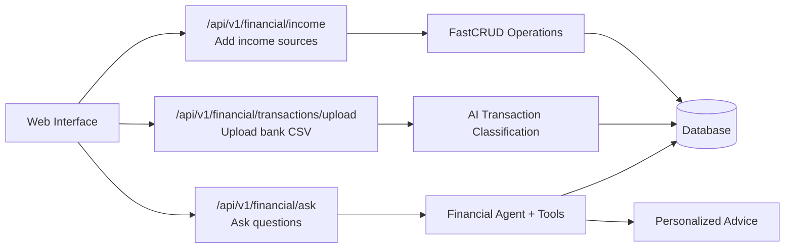

# Building APIs

**From working services to web endpoints people can actually use.**

You built a financial agent that understands Sarah's questions and provides personalized advice. You also built data processing that can classify her bank transactions and store them in a structured database. But here's the problem: Sarah still can't use any of this through a web browser.

Right now, your financial assistant only works when you call it directly from Python code. Sarah can't open her laptop, navigate to your app, and ask "Am I spending too much on food?" There's no HTTP layer connecting your intelligent backend to the web interface she expects.

Time to build the API endpoints that make your financial assistant accessible through a browser. This is where your carefully crafted agent and data processing become something people can actually use.

## The Missing HTTP Layer

Sarah wants something simple. She wants to visit your web app, maybe save some basic financial information about her income and spending categories, then start asking questions. "How much do I spend on food compared to other people?" "Is my transportation budget reasonable?" "Should I be worried about my entertainment spending?"

Behind each of those questions, your system needs to authenticate that it's really Sarah asking, load her financial profile and spending history, process the question through your financial agent with her real data, and return personalized advice she can understand.

FastroAI already handles the hard infrastructure parts, so you can focus on the financial-specific logic and plug it into FastroAI's established patterns.

| What FastroAI Handles | What You Build |
|----------------------|----------------|
| User authentication and session management | Financial profile storage and retrieval |
| Database connections and cleanup | Spending analysis and percentage calculations |
| Error handling and HTTP responses | AI agent integration with financial context |
| Request validation and routing | Financial domain logic and business rules |

FastroAI comes with a complete conversation API that shows you the patterns. You can find it in `src/interfaces/api/v1/conversations.py`. Here's how a typical FastroAI endpoint works:

```python
@router.post("/", status_code=201)
async def create_conversation(
    conversation: ConversationCreate,
    current_user: Annotated[dict[str, Any], Depends(get_current_user)],
    conversation_service: ConversationService = Depends(get_conversation_service),
    db: AsyncSession = Depends(async_session),
) -> ConversationRead:
    try:
        return await conversation_service.create_conversation(
            user_id=current_user["id"],
            conversation_data=conversation,
            db=db,
        )
    except Exception as e:
        http_exc = handle_exception(e)
        if http_exc:
            raise http_exc
        raise HTTPException(status_code=500, detail="Internal server error")
```

Notice how the user comes as a dictionary - `current_user["id"]` not `current_user.id`. FastroAI uses dependency injection everywhere, so services get passed in rather than created inside the function. Error handling goes through a centralized `handle_exception` function that maps domain exceptions to appropriate HTTP responses.

We'll follow the same patterns for our financial endpoints. Use the same dependency injection, the same error handling, the same authentication approach. Build on what FastroAI provides instead of inventing our own patterns.

Now that you understand how FastroAI structures endpoints, let's build the financial-specific ones that Sarah needs.

## Building Financial Endpoints

Sarah wants to ask "Am I spending too much on food?" and get personalized advice based on her actual income and spending. But right now, your system has no way for her to input her financial information or ask questions through a web interface. This is where we need to build the HTTP endpoints that connect her browser to your financial agent.

Sarah's workflow will be simple: first, she saves her income and spending information through a profile endpoint. Then she can ask questions through a conversation endpoint that automatically loads her financial context and provides personalized insights. Both endpoints need to follow FastroAI's established patterns so they integrate cleanly with authentication, error handling, and the existing API structure.

Start by creating the router that will handle all financial operations:

```python
# src/interfaces/api/v1/financial.py
from fastapi import APIRouter, Depends, HTTPException, status
from typing import Dict, Any, Annotated
from sqlalchemy.ext.asyncio import AsyncSession

from ....infrastructure.auth.session.dependencies import get_current_user
from ....infrastructure.database.session import async_session
from ....modules.conversation.schemas import MessageSend, MessageRead
from ....modules.conversation.deps import ConversationDeps
from ....modules.conversation.service import ConversationService
from ....modules.common.utils.error_handler import handle_exception
from ....modules.finance.service import TransactionService, FinancialAnalysisService
from ..dependencies import get_conversation_service

router = APIRouter(tags=["Financial Analysis"])
```

Note that we don't add a `prefix` to the router here because it will be added when we register it in `__init__.py` later. This creates URLs like `/api/v1/financial/ask` and `/api/v1/financial/transactions/upload` that fit naturally with FastroAI's existing structure.

The core functionality Sarah needs is asking financial questions. This endpoint connects her to the financial agent you built with its financial_analyzer tool.

First, define a request schema for the endpoint:

```python
from pydantic import BaseModel, Field

class FinancialQuestionRequest(BaseModel):
    """Request schema for financial questions."""

    conversation_id: int = Field(
        ...,
        description="ID of the conversation to send the message to"
    )
    content: str = Field(
        ...,
        min_length=1,
        max_length=10000,
        description="The financial question to ask"
    )
```

Now create the endpoint:

```python
@router.post("/ask")
async def ask_financial_question(
    request: FinancialQuestionRequest,
    current_user: Annotated[dict[str, Any], Depends(get_current_user)],
    db: AsyncSession = Depends(async_session),
    conversation_service: ConversationService = Depends(get_conversation_service),
) -> MessageRead:
    """Ask a financial question and get personalized advice.

    The conversation must have been previously created by the user.
    """

    try:
        message_data = MessageSend(content=request.content)
        response = await conversation_service.send_message(
            user_id=current_user["id"],
            conversation_id=request.conversation_id,
            message_data=message_data,
            db=db,
        )

        return response

    except Exception as e:
        http_exc = handle_exception(e)
        if http_exc:
            raise http_exc
        raise HTTPException(
            status_code=500,
            detail="Internal server error"
        )
```

This endpoint connects Sarah directly to your financial agent through FastroAI's conversation system. When she asks "Am I spending too much on food?", the agent can analyze her specific situation using the financial_analyzer tool you built earlier.

The tool calculates spending percentages and compares them against financial guidelines to determine whether her spending is reasonable, moderate, or high. The agent needs her actual financial data to provide meaningful analysis rather than generic advice.

This creates our next requirement. Sarah needs a way to save her income and spending information so the agent can access it during conversations. The profile endpoints handle this essential foundation.

## Transaction Upload Endpoints

Sarah has CSV files from her bank with transaction data. The system you built can classify these transactions and store them in the database, but she needs a web interface to upload them. These endpoints connect the transaction processing service you built to the web interface.

```python
from fastapi import UploadFile, File
from pydantic import BaseModel
from ....modules.finance.service import TransactionService

class TransactionUploadResponse(BaseModel):
    success: bool
    transactions_processed: int
    message: str

@router.post("/transactions/upload")
async def upload_transactions(
    current_user: Annotated[dict[str, Any], Depends(get_current_user)],
    db: AsyncSession = Depends(async_session),
    file: UploadFile = File(...),
) -> TransactionUploadResponse:
    """Upload and process a CSV file of bank transactions."""

    try:
        if not file.filename.endswith('.csv'):
            raise HTTPException(status_code=400, detail="File must be a CSV")

        content_bytes = await file.read()
        csv_content = content_bytes.decode('utf-8')

        transaction_service = TransactionService()
        result = await transaction_service.process_csv_upload(
            csv_content=csv_content,
            user_id=current_user["id"],
            db=db
        )
        csv_count = result['uploaded_count']

        return {
            "success": True,
            "transactions_processed": csv_count,
            "message": f"Successfully processed {csv_count} transactions"
        }

    except Exception as e:
        http_exc = handle_exception(e)
        if http_exc:
            raise http_exc
        raise HTTPException(
            status_code=500,
            detail="Failed to process transactions"
        )
```

This endpoint uses the TransactionService you built in the previous section. Sarah uploads a CSV file, the service classifies each transaction using AI, and stores the results in the Transaction table with proper categories.

She'll also want to see her transaction history:

```python
from fastcrud.paginated import (
    PaginatedListResponse,
    compute_offset,
    paginated_response
)
from ....modules.finance.schemas import TransactionRead

@router.get(
    "/transactions",
    response_model=PaginatedListResponse[TransactionRead],
)
async def get_transactions(
    current_user: Annotated[dict[str, Any], Depends(get_current_user)],
    db: AsyncSession = Depends(async_session),
    page: int = 1,
    items_per_page: int = 10,
) -> dict[str, Any]:
    """Get user's transaction history with pagination."""

    try:
        transaction_service = TransactionService()
        transactions_data = await transaction_service.get_user_transactions(
            db=db,
            user_id=current_user["id"],
            offset=compute_offset(page, items_per_page),
            limit=items_per_page
        )

        return paginated_response(
            crud_data=transactions_data,
            page=page,
            items_per_page=items_per_page
        )

    except Exception as e:
        http_exc = handle_exception(e)
        if http_exc:
            raise http_exc
        raise HTTPException(status_code=500, detail="Internal server error")
```

Now Sarah can save her financial information and retrieve it later. The frontend can pre-populate forms with her existing data, so she doesn't have to re-enter everything each time.

Notice how both endpoints follow the same pattern as FastroAI's conversation API. Same dependency injection, same error handling, same response structure. This consistency makes the API predictable for frontend developers.

These endpoints handle the data Sarah needs to upload and review, but they work with the services and database models you built earlier. The upload endpoint processes her CSV files through the AI classification system, while the transactions endpoint lets her review what was stored.

The connection between these endpoints and your financial agent happens through the FinancialAnalysisService you built in the previous section. When Sarah asks "Am I spending too much on food?" through the `/ask` endpoint, the agent can call methods like `get_user_monthly_income()`, `get_spending_by_category()`, and `analyze_spending_by_category()` to get her actual financial data rather than working with hardcoded examples.

## Income Management Endpoints

Before Sarah can get meaningful financial analysis, she needs to tell the system about her income sources. FastroAI already handles user accounts, but you need endpoints for managing income information.

First, an endpoint for adding new income sources:

```python
from ....modules.finance.schemas import IncomeCreate, IncomeRead, IncomeCreateInternal
from ....modules.finance.crud import crud_income

@router.post(
    "/income",
    status_code=201,
    summary="Add Income Source",
    response_description="The created income record",
)
async def add_income_source(
    income_data: IncomeCreate,
    current_user: Annotated[dict[str, Any], Depends(get_current_user)],
    db: AsyncSession = Depends(async_session),
) -> IncomeRead:
    """Add a new income source for the authenticated user."""
    start = (income_data.start_date.replace(tzinfo=None)
             if income_data.start_date
             else None)
    finish = (income_data.end_date.replace(tzinfo=None)
              if income_data.end_date
              else None)
    try:
        income_internal = IncomeCreateInternal(
            user_id=current_user["id"],
            amount=income_data.amount,
            frequency=income_data.frequency,
            source=income_data.source,
            start_date=start,
            end_date=finish
        )

        income_record = await crud_income.create(
            db=db,
            object=income_internal,
            schema_to_select=IncomeRead
        )

        return income_record

    except Exception as e:
        http_exc = handle_exception(e)
        if http_exc:
            raise http_exc
        raise HTTPException(
            status_code=500, detail="Failed to add income source"
        )
```

An endpoint for listing all income sources with pagination:

```python
@router.get(
    "/income",
    summary="List Income Sources",
    response_model=PaginatedListResponse[IncomeRead],
)
async def get_income_sources(
    current_user: Annotated[dict[str, Any], Depends(get_current_user)],
    db: AsyncSession = Depends(async_session),
    page: int = 1,
    items_per_page: int = 10,
) -> dict[str, Any]:
    """Get user's income sources with pagination."""

    try:
        income_data = await crud_income.get_multi(
            db=db,
            offset=compute_offset(page, items_per_page),
            limit=items_per_page,
            schema_to_select=IncomeRead,
            user_id=current_user["id"]
        )

        return paginated_response(
            crud_data=income_data,
            page=page,
            items_per_page=items_per_page
        )

    except Exception as e:
        http_exc = handle_exception(e)
        if http_exc:
            raise http_exc
        raise HTTPException(
            status_code=500,
            detail="Failed to retrieve income sources"
        )
```

And an endpoint for deleting income sources:

```python
@router.delete(
    "/income/{income_id}",
    status_code=204,
    summary="Delete Income Source",
)
async def delete_income_source(
    income_id: Annotated[int, Path(description="Income source ID")],
    current_user: Annotated[dict[str, Any], Depends(get_current_user)],
    db: AsyncSession = Depends(async_session),
) -> None:
    """
    Delete an income source.
    Users can only delete their own income sources.
    """

    try:
        existing_income = await crud_income.get(
            db=db,
            id=income_id,
            user_id=current_user["id"]
        )

        if not existing_income:
            raise HTTPException(
                status_code=404,
                detail="Income source not found"
            )

        await crud_income.delete(
            db=db,
            id=income_id,
            user_id=current_user["id"]
        )

    except HTTPException:
        raise
    except Exception as e:
        http_exc = handle_exception(e)
        if http_exc:
            raise http_exc
        raise HTTPException(
            status_code=500,
            detail="Failed to delete income source"
        )
```

These endpoints let Sarah manage her salary, freelance income, or other income sources. The financial analysis service uses this data to calculate spending percentages when she asks questions about her budget.

## Understanding the Complete Flow

Sarah signs up, adds her $5000 salary through the income endpoint, then uploads her bank CSV. The AI classifies her transactions automatically. When she asks "Am I spending too much on food?", she gets advice based on her real $800 spending and $5000 income.

<div align="center">

</div>

The difference between this and your earlier prototype? Sarah's agent now works with her actual financial data instead of hardcoded examples. Here's what happens when she asks a question:

<div align="center">

</div>

Notice how Sarah's question doesn't go directly to the AI. The conversation service loads her income and transaction data first, then the agent calls the financial_analyzer tool with her real numbers.

The agent gets both "$800 spent on food" and "14.5% of income" to work with. That's why it can say "your 14.5% is reasonable for food spending" instead of giving generic budgeting advice.

You've built all the endpoints Sarah needs, but they won't work until you register them with FastroAI's main API.

## Registering Your API with FastroAI

Your financial endpoints are ready, but FastroAI needs to know about them. This is where you connect your router to FastroAI's main API structure so users can actually access your endpoints.

```python
# src/interfaces/api/v1/__init__.py
from fastapi import APIRouter
from .financial import router as financial_router
# ... other existing imports

router = APIRouter(prefix="/v1")
router.include_router(financial_router, prefix="/financial")
# ... other existing router includes
```

This creates URLs like `/api/v1/financial/ask` and `/api/v1/financial/transactions/upload` that follow FastroAI's existing patterns. This consistency makes the API predictable for frontend developers who need to integrate with your endpoints.

FastroAI automatically includes your endpoints in the API documentation. When you visit `/docs` with your app running, you'll see interactive documentation for all your financial endpoints alongside the existing conversation endpoints. You can test everything directly in the browser.

!!! note "Production Considerations"
    This tutorial takes shortcuts to focus on the core API patterns. In production, you'd want separate routers for each resource (`src/interfaces/api/v1/transactions.py`, `src/interfaces/api/v1/income.py`) instead of one financial router, proper input validation with detailed error responses for CSV uploads, rate limiting on file upload endpoints to prevent abuse, and proper file size limits and virus scanning for uploaded CSVs.

    You'd also implement pagination cursors instead of offset-based pagination for better performance, comprehensive API versioning strategy when endpoints change, proper OpenAPI documentation with detailed examples and error codes, and background job processing for large CSV uploads rather than blocking HTTP requests.

    Still, it's better to have working endpoints that solve the real problem than nothing at all. Someone who genuinely needs financial analysis will work with a single `/financial` router if it means getting their AI assistant connected to a web interface.

With your endpoints registered and documented, you have a complete HTTP API that connects the frontend to your financial agent. The infrastructure is ready - now let's see how it all works together from the frontend perspective.

## Seeing Everything Work Together

Time to test what you've built and see how it feels from the frontend perspective. Start your FastroAI application and visit `/docs` to test the endpoints interactively. Let's walk through the complete user experience to see how all the pieces work together.

Sarah starts by adding her income information. The frontend posts her monthly salary through the income endpoint:

```json
POST /api/v1/financial/income
{
  "amount": 5000,
  "frequency": "monthly",
  "source": "salary"
}
```

The system stores her income record and returns the created data:

```json
{
  "id": 1,
  "amount": 5000,
  "frequency": "monthly",
  "source": "salary",
  "user_id": 123
}
```

Next, Sarah uploads her bank transaction CSV through the upload endpoint. The system processes each transaction through AI classification and stores the results in the database. With her financial data loaded, Sarah can now ask questions about her spending:

```json
POST /api/v1/financial/ask
{
  "content": "Am I spending too much on food?"
}
```

The response combines her actual transaction data with financial guidance. The agent uses the financial_analyzer tool you built to calculate spending percentages and provide personalized advice based on her real income and transaction history.

Sarah can continue asking questions about different spending categories. The conversation service automatically loads her income records and transaction data, then the financial agent analyzes her specific situation using the services you built in previous sections.

Notice how the agent doesn't give generic budgeting advice. It calculates actual percentages from her uploaded transactions, compares them against her stated income, and provides targeted recommendations based on her specific financial situation.

Your financial assistant now works through HTTP endpoints, but let's step back and look at what you've actually built here.

## What You've Built

You now have working HTTP endpoints that connect any web interface to your financial assistant. The endpoints handle income management, transaction upload with AI classification, and financial conversations through the agent you built.

<div align="center">

</div>

Your financial assistant started as Python code that worked in a terminal. Now it's accessible through HTTP endpoints that follow FastroAI's patterns for authentication, error handling, and database operations. Users can upload bank CSVs, add income sources, and ask questions about spending through any web interface.

The API uses FastroAI's existing infrastructure rather than building HTTP plumbing from scratch. The conversation endpoint connects to your financial agent, the upload endpoint processes CSVs through AI classification, and the income endpoints use FastCRUD for database operations. You focused on the financial logic while FastroAI handled the web framework concerns.

Right now, Sarah could use your financial assistant through the Swagger documentation at `/docs`. She can upload her CSV files, add income sources, and ask financial questions directly through the interactive API interface. If the financial analysis genuinely helps her make better spending decisions, she might be perfectly happy using Swagger for now.

But for a real proof of concept, you want something that feels more like a proper application. Let's connect these endpoints to a simple web interface that makes the experience smoother for users who aren't comfortable with API documentation.

[Next: Creating a Simple Interface →](creating-a-simple-interface.md){ .md-button .md-button--primary }
