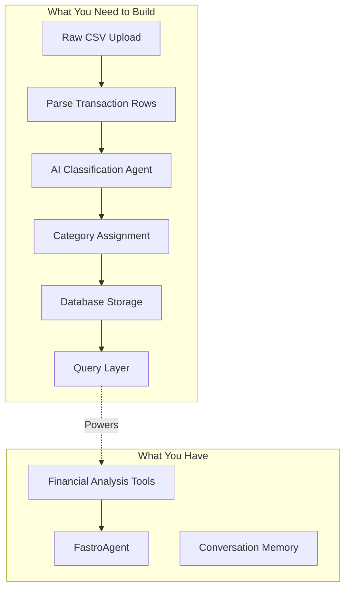
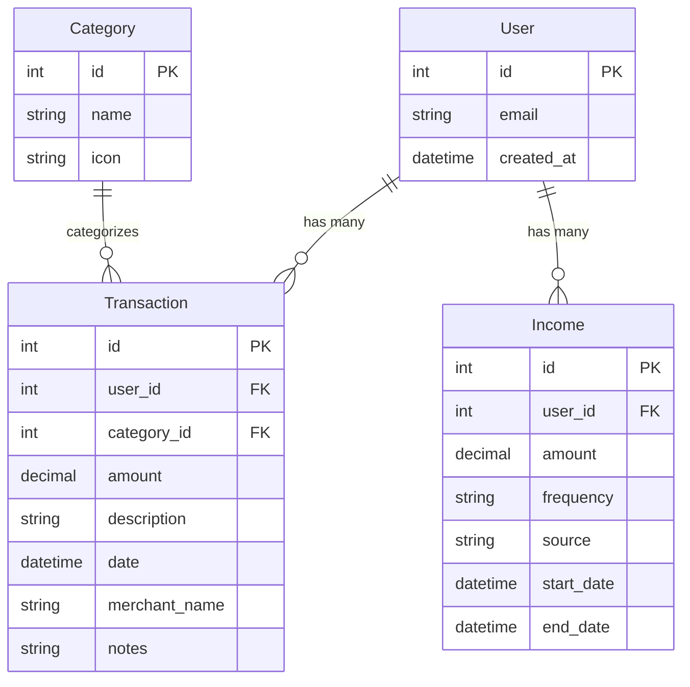
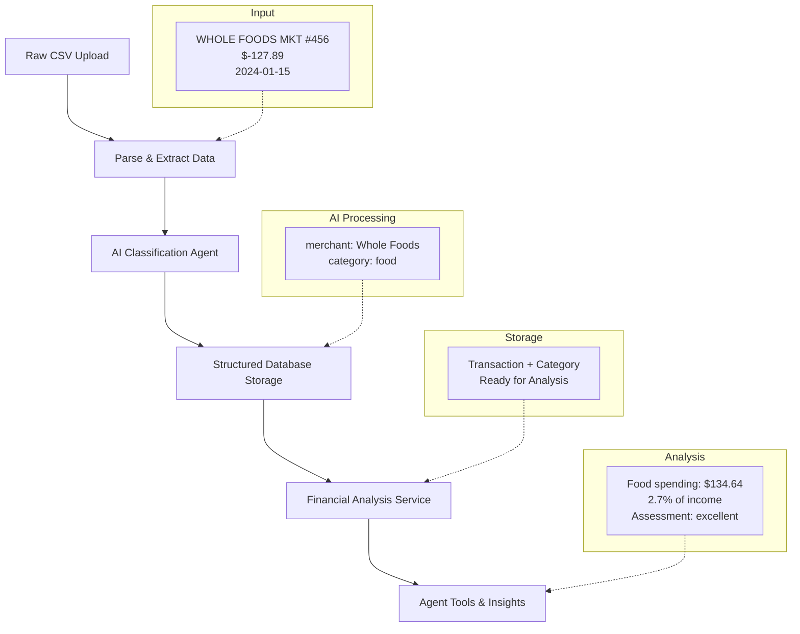

# Data Layer & Business Rules

You built an AI agent that works with clean, categorized examples. But real financial data starts as uncategorized transactions - raw CSV uploads with descriptions like "WHOLE FOODS MKT #123" that need to be classified as "food" spending.

The complete flow should handle: uncategorized CSV upload → AI-powered classification → structured storage → agent queries categorized data → personalized insights. Right now you only have the last piece.

Let's build the data layer and business logic that transforms uncategorized transaction data into structured information your agent can analyze.

## The Data Flow Challenge

Behind the simple user experience lies a complex data transformation pipeline. Raw transaction data needs to become structured, queryable information that your financial agent can reason about.

The challenge isn't just storage - it's intelligent classification. Raw descriptions like "UBER TRIP 01/16" or "VENMO PAYMENT - JOHN" need to become categorized spending that your agent can analyze. This classification happens once during upload, but powers every conversation afterward.

Your system needs to handle uncategorized input, apply business rules for classification, store structured results, and provide your agent with clean data to query. Each step has its own complexity, but together they create the foundation for intelligent financial conversations.

Here's what you have versus what you need to build:

<div align="center">

</div>

Let's start by building the foundation - database models that can store both raw and classified financial information.

## Storing Financial Data

Your data model needs to handle both raw transaction data from CSV uploads and the structured, classified results that your agent will query. The key insight is storing transactions in their original form while adding classification fields that AI can populate.

FastroAI already provides a User model with authentication and basic user management. Let's build on that foundation and create models that support the classification workflow.

First, we need a way to categorize transactions. Sarah's spending falls into categories like food, transportation, and entertainment:

```python
from sqlalchemy import Integer, String, Numeric, DateTime, ForeignKey
from sqlalchemy.orm import Mapped, mapped_column
from datetime import datetime
from ...infrastructure.database.session import Base
from ...infrastructure.database.models import TimestampMixin

class Category(Base):
    """Transaction categories for organizing spending."""

    __tablename__ = "categories"

    id: Mapped[int] = mapped_column(
        Integer, primary_key=True, autoincrement=True, init=False
    )
    name: Mapped[str] = mapped_column(String, nullable=False, unique=True)
    icon: Mapped[str] = mapped_column(String, nullable=True)
```

Next, we need to store Sarah's actual transactions. Each transaction captures both the raw data from her bank statement and our processed version:

```python
class Transaction(Base, TimestampMixin):
    """Financial transaction record with categorization."""

    __tablename__ = "transactions"

    id: Mapped[int] = mapped_column(
        Integer, primary_key=True, autoincrement=True, init=False
    )
    user_id: Mapped[int] = mapped_column(
        Integer, ForeignKey("user.id"), nullable=False, index=True
    )
    category_id: Mapped[int] = mapped_column(
        Integer, ForeignKey("categories.id"), nullable=True
    )

    # Raw transaction data from CSV
    amount: Mapped[float] = mapped_column(Numeric(10, 2), nullable=False)
    description: Mapped[str] = mapped_column(String, nullable=False)
    date: Mapped[datetime] = mapped_column(DateTime, nullable=False)

    # Processed data for better analysis
    merchant_name: Mapped[str] = mapped_column(String, nullable=True)
    notes: Mapped[str] = mapped_column(String, nullable=True)
```

Finally, we need to track Sarah's income so our agent can calculate spending percentages:

```python
class Income(Base, TimestampMixin):
    """User income sources for calculating spending percentages."""

    __tablename__ = "income"

    id: Mapped[int] = mapped_column(
        Integer, primary_key=True, autoincrement=True, init=False
    )
    user_id: Mapped[int] = mapped_column(
        Integer, ForeignKey("user.id"), nullable=False, index=True
    )
    amount: Mapped[float] = mapped_column(Numeric(10, 2), nullable=False)
    frequency: Mapped[str] = mapped_column(String, nullable=False)
    source: Mapped[str] = mapped_column(String, nullable=True)
    start_date: Mapped[datetime] = mapped_column(DateTime, nullable=False)
    end_date: Mapped[datetime] = mapped_column(DateTime, nullable=True)
```

This model handles the messy reality of financial data. The `description` field stores exactly what appears on Sarah's statement, while `merchant_name` provides a cleaned-up version for analysis. Using the decimal type ensures money calculations stay accurate down to the penny.

FastroAI models use foreign keys for data relationships. SQLAlchemy `relationship()` declarations are optional and primarily used for SQLAdmin integration (enabling dropdown selection of related objects). Data access between models is handled through FastCRUD with explicit queries when you need to join or fetch related data - you don't need relationships for that.

Here's how these models connect together. The User model shows just the basics - FastroAI provides additional authentication and profile fields:

<div align="center">

</div>

Now you have database models that can store both raw and classified transaction data. Next, you need the business logic to transform uncategorized CSV data into structured information your agent can query.

## Smart Transaction Classification

Your system needs to transform raw transaction descriptions into structured, categorized data. Rule-based classification isn't feasible for a proof of concept - you'd spend months building merchant mapping rules, and you're not in the data categorization business. AI classification gets you working results quickly.

The solution uses a dedicated classification agent that processes transactions in batches, assigning categories and cleaning merchant names. This happens during data upload, creating clean structured data for your conversation agent to query later.

First, define the Pydantic schemas you'll need for data validation and AI responses:

```python
from pydantic import BaseModel
from typing import List, Optional
from datetime import datetime
from decimal import Decimal
from enum import Enum

class TransactionCategory(str, Enum):
    FOOD = "food"
    TRANSPORTATION = "transportation"
    ENTERTAINMENT = "entertainment"
    SHOPPING = "shopping"
    BILLS = "bills"
    HEALTH = "health"
    TRAVEL = "travel"
    OTHER = "other"

class TransactionCreateInternal(BaseModel):
    """Internal schema for creating transactions."""
    user_id: int
    amount: Decimal
    description: str
    merchant_name: str
    category_id: int
    date: datetime
    notes: Optional[str] = None

class CategoryCreateInternal(BaseModel):
    name: str
    icon: str

class TransactionClassification(BaseModel):
    merchant_name: str
    category: TransactionCategory

class IncomeCreate(BaseModel):
    """Schema for creating income records via API."""
    amount: Decimal
    frequency: str  # "monthly", "weekly", "yearly"
    source: Optional[str] = None
    start_date: datetime
    end_date: Optional[datetime] = None

class IncomeCreateInternal(BaseModel):
    """Internal schema for creating income records with user_id."""
    user_id: int
    amount: Decimal
    frequency: str
    source: Optional[str] = None
    start_date: datetime
    end_date: Optional[datetime] = None

class IncomeRead(BaseModel):
    """Schema for reading income data from API."""
    id: int
    user_id: int
    amount: Decimal
    frequency: str
    source: Optional[str]
    start_date: datetime
    end_date: Optional[datetime]
    created_at: datetime
    updated_at: datetime

    class Config:
        from_attributes = True

class TransactionRead(BaseModel):
    """Schema for reading transaction data from API."""
    id: int
    user_id: int
    category_id: Optional[int]
    amount: Decimal
    description: str
    merchant_name: Optional[str]
    date: datetime
    notes: Optional[str]
    created_at: datetime

    class Config:
        from_attributes = True
```

Now create a classification agent using PydanticAI directly:

```python
from pydantic_ai import Agent

# Classification agent for processing transaction descriptions
classification_agent = Agent(
    "gpt-4o-mini",
    output_type=list[TransactionClassification],
    system_prompt="""
    You classify financial transactions based on their descriptions.

    Extract the merchant name and categorize the spending.
    You MUST use exactly one of these categories:
    - food
    - transportation
    - entertainment
    - shopping
    - bills
    - health
    - travel
    - other

    Use "other" if the transaction doesn't clearly fit the other categories.
    Be consistent with naming - "Starbucks" not "STARBUCKS STORE #123".

    You'll receive multiple transactions to classify.
    Return structured data for each transaction.""",
)
```

The agent setup uses PydanticAI's structured responses to ensure you get clean, typed data back. By specifying `output_type=list[TransactionClassification]`, you guarantee the agent returns exactly what you need for database storage.

```python
async def classify_transactions_batch(
    transaction_strings: list[str],
    batch_size: int = 20
) -> list[TransactionClassification]:
    all_results = []

    for i in range(0, len(transaction_strings), batch_size):
        batch = transaction_strings[i:i + batch_size]

        transaction_list = "\n".join(
            [f"{j+1}. {transaction}" for j, transaction in enumerate(batch)]
        )

        result = await classification_agent.run(
            f"Classify these {len(batch)} transactions:\n{transaction_list}"
        )
        batch_results = result.output
        all_results.extend(batch_results)

    return all_results
```

Now you need business logic to process CSV uploads and create classified transactions. Let's follow the actual data flow: parse CSV → classify with AI → store results.

**Step 1: Parsing the CSV**

Real bank CSVs are inconsistent with date formats, so start with a helper function that tries the most common patterns you'll encounter in CSV exports:

```python
from typing import List, Dict, Any
from sqlalchemy.ext.asyncio import AsyncSession
from sqlalchemy import select
from decimal import Decimal
from datetime import datetime
import csv
import io

def parse_transaction_date(date_str: str) -> datetime:
    """Parse date from CSV, handling common formats."""
    if not date_str:
        raise ValueError("Missing date in CSV row")

    formats = ["%Y-%m-%d", "%m/%d/%Y", "%d/%m/%Y", "%Y-%m-%d %H:%M:%S"]

    for fmt in formats:
        try:
            return datetime.strptime(date_str, fmt)
        except ValueError:
            continue

    raise ValueError(
        f"Unable to parse date: '{date_str}'. "
        "Expected formats: YYYY-MM-DD, MM/DD/YYYY, DD/MM/YYYY"
    )
```

With date parsing handled, you need to process the CSV rows and prepare them for AI classification. This will be a method inside the `TransactionService` class. The trick is building both structured data for storage and rich strings for the AI to analyze:

```python
class TransactionService:
    """Service for processing and classifying financial transactions."""

    def _parse_csv_for_classification(
        self,
        csv_content: str
    ) -> tuple[list[dict[str, Any]], list[str]]:
        """
        Parse CSV and build both structured data and classification strings.

        Args:
            csv_content: Raw CSV content as string

        Returns:
            Tuple of (structured transaction data, transaction str for AI)
        """
        csv_data = csv.DictReader(io.StringIO(csv_content))
        transaction_data = []
        transaction_strings = []

        for row in csv_data:
            parsed_data = {
                'description': row.get('Description', ''),
                'amount': Decimal(str(row.get('Amount', '0'))),
                'date': parse_transaction_date(row.get('Date', ''))
            }
            transaction_data.append(parsed_data)

            parts = []
            if row.get('Description'):
                parts.append(row.get('Description'))
            if row.get('Amount'):
                parts.append(f"${abs(float(row.get('Amount', 0)))}")
            if row.get('Date'):
                parts.append(row.get('Date'))

            transaction_strings.append(" | ".join(parts))

        return transaction_data, transaction_strings
```

This single pass through the CSV produces both structured data for storage and rich strings for AI classification. The AI gets strings like "STARBUCKS STORE #123 | $6.75 | 2024-01-15" with maximum context.

**Step 2: The Main Service Method**

Now add the main method to the `TransactionService` class that orchestrates the complete workflow:

```python
    async def process_csv_upload(
        self,
        csv_content: str,
        user_id: int,
        db: AsyncSession
    ) -> dict[str, Any]:
        """Process uploaded CSV and create classified transactions.

        Args:
            csv_content: Raw CSV content as string
            user_id: User ID uploading the transactions
            db: Database session

        Returns:
            Dictionary with upload statistics
        """
        data, strings = self._parse_csv_for_classification(csv_content)

        classifications = await classify_transactions_batch(strings)

        await self._create_transactions(db, user_id, data, classifications)

        return {
            "uploaded_count": len(data),
            "classified_count": len(classifications)
        }
```

This orchestrates the complete workflow: parse the raw CSV, get AI classifications, and store the structured results. The service returns counts so you can show users feedback about what was processed.

**Step 3: Storing the Results**

You have parsed CSV data and AI classifications. Time to save everything to the database.

```python
from fastcrud import FastCRUD
from .models import Transaction, Category, Income

crud_transactions: FastCRUD = FastCRUD(Transaction)
crud_categories: FastCRUD = FastCRUD(Category)
crud_income: FastCRUD = FastCRUD(Income)
```

Now combine the raw data with AI results. Each transaction gets both its original description and the cleaned merchant name:

```python
    async def _create_transactions(
        self,
        db: AsyncSession,
        user_id: int,
        transaction_data: list[dict[str, Any]],
        classifications: list[TransactionClassification]
    ) -> None:
        """Create transaction records with their classifications.

        Args:
            db: Database session
            user_id: User ID for the transactions
            transaction_data: Parsed transaction data from CSV
            classifications: AI-generated classifications
        """
        transactions_to_create = []

        for i, data in enumerate(transaction_data):
            classification = classifications[i]
            category = await crud_categories.get(
                db=db, name=classification.category.value
            )

            transaction_create = TransactionCreateInternal(
                user_id=user_id,
                amount=data['amount'],
                description=data['description'],
                merchant_name=classification.merchant_name,
                category_id=category["id"],
                date=data['date'],
                notes=None
            )
            transactions_to_create.append(transaction_create)

        for transaction_create in transactions_to_create:
            await crud_transactions.create(
                db=db, object=transaction_create, commit=False
            )

        await db.commit()
```

The enum ensures the AI can only return valid categories, so the category lookup is straightforward. The `commit=False` parameter prevents FastCRUD from committing after each transaction - instead we commit once at the end.

You'll also want a method to retrieve user transactions for displaying them in the API:

```python
    async def get_user_transactions(
        self,
        db: AsyncSession,
        user_id: int,
        offset: int = 0,
        limit: int = 10
    ) -> dict[str, Any]:
        """Get paginated user transactions.

        Args:
            db: Database session
            user_id: User ID
            offset: Number of records to skip
            limit: Maximum number of records to return

        Returns:
            Dictionary with transaction data and count
        """
        return await crud_transactions.get_multi(
            db=db,
            user_id=user_id,
            offset=offset,
            limit=limit
        )
```

You've got classified transaction data sitting in the database, but your financial agent from the previous section is still working with hardcoded examples. Time to connect the two.

## Connecting Agent to Real Data

Your financial agent from the previous section can tell someone their food spending is "reasonable," but it's using made-up numbers. When someone asks "How much did I spend on food?", you want the agent to query their actual transactions and give real insights.

Let's build a service that handles financial analysis using the classified transactions you just stored. Following FastroAI service patterns, create a dedicated analysis service:

```python
from datetime import datetime, timedelta
from typing import Dict, Any
from decimal import Decimal

class FinancialAnalysisService:
    """Service for analyzing user financial data."""

    async def get_user_monthly_income(
        self,
        db: AsyncSession,
        user_id: int
    ) -> Decimal:
        """Calculate total monthly income from all sources."""
        income_result = await crud_income.get_multi(db=db, user_id=user_id)
        income_data = income_result.get('data', [])

        total_monthly_income = Decimal('0')
        for income in income_data:
            if isinstance(income, dict):
                amount = Decimal(str(income.get('amount', 0)))
                frequency = income.get('frequency', 'monthly')
            else:
                amount = income.amount
                frequency = income.frequency

            if frequency == 'weekly':
                amount = amount * 4
            elif frequency == 'yearly':
                amount = amount / 12

            total_monthly_income += amount

        if total_monthly_income > 0:
            return total_monthly_income

        return Decimal('5000')
```

This handles the reality that users often have multiple income sources. Sarah might have a salary plus freelance work, or someone might have part-time jobs with different pay schedules. The method normalizes everything to monthly amounts so spending percentages make sense.

Next, add methods for querying spending data:

```python
    async def get_spending_by_category(
        self,
        db: AsyncSession,
        user_id: int,
        category_name: str,
        months_back: int = 1
    ) -> Decimal:
        """Get total spending in a category for the specified period."""
        end_date = datetime.now()
        start_date = end_date - timedelta(days=30 * months_back)

        category_result = await crud_categories.get(
            db=db, name=category_name
        )
        if not category_result:
            return Decimal('0')

        transactions_result = await crud_transactions.get_multi(
            db=db,
            user_id=user_id,
            category_id=category_result["id"],
            date__gte=start_date,
            date__lte=end_date
        )

        transactions_data = transactions_result.get('data', [])
        total_spent = sum(
            Decimal(
                str(transaction.get('amount', 0))
            ) if isinstance(transaction, dict)
            else transaction.amount
            for transaction in transactions_data
        )

        return total_spent
```

FastCRUD's `get_multi` method handles the complex filtering for you. The `date__gte` and `date__lte` parameters let you specify date ranges without writing raw SQL, while the user_id and category_id filters ensure you only get relevant transactions.

Finally, combine these into the analysis method your agent tools expect:

```python
    async def analyze_spending_by_category(
        self,
        db: AsyncSession,
        user_id: int,
        category_name: str,
        months_back: int = 1
    ) -> dict[str, Any]:
        """Analyze user's spending in a specific category using real data."""

        total_spent = await self.get_spending_by_category(
            db, user_id, category_name, months_back
        )
        monthly_income = await self.get_user_monthly_income(db, user_id)

        percentage = float(total_spent / monthly_income * 100)

        if percentage <= 10:
            assessment = "excellent"
        elif percentage <= 20:
            assessment = "reasonable"
        elif percentage <= 30:
            assessment = "moderate"
        else:
            assessment = "high"

        return {
            "category": category_name,
            "amount_spent": float(total_spent),
            "percentage_of_income": percentage,
            "assessment": assessment,
            "period": f"last {months_back} month(s)"
        }
```

This method pulls together the spending data and income calculation to provide the percentage-based assessment your agent needs. The assessment logic gives users realistic feedback - spending 5% of income on food is excellent, while spending 35% might need attention.

This service pattern separates concerns properly - income calculation, spending queries, and analysis logic each have their own methods. This makes the code more testable and reusable across different parts of your application.

Now create a wrapper function that your agent tools can use:

```python
async def financial_analyzer_tool(
    db: AsyncSession,
    user_id: int,
    category_name: str,
    months_back: int = 1
) -> dict:
    """Financial analyzer tool that uses real user transaction data."""
    service = FinancialAnalysisService()
    analysis = await service.analyze_spending_by_category(
        db, user_id, category_name, months_back
    )

    return {
        "percentage": analysis["percentage_of_income"],
        "assessment": analysis["assessment"],
        "amount": analysis["amount_spent"]
    }
```

This wrapper maintains the same interface as your original financial_analyzer tool from the previous section, so you can drop it in without changing the agent configuration.

Your financial agent can now handle real user questions about spending. When someone asks "How much did I spend on food last month?", the agent queries their actual transactions instead of returning made-up numbers.

Now let's review everything you've built so far.

## What You've Built

You've created a complete data transformation pipeline that turns uncategorized financial transactions into structured, analyzable information. Your system transforms raw CSV uploads into personalized financial insights:

<div align="center">

</div>

Your financial agent went from a demo to something people can actually use. Sarah can now upload her bank statement CSV, and the system handles the messy work of figuring out that "AMZN MKTP US*2K3L67" means she bought something on Amazon and should count as shopping.

The database stores both the original transaction descriptions and the cleaned versions. Why both? Because you'll inevitably want to improve your classification logic, and having the raw data means you can reprocess everything without asking users to re-upload files.

!!! note "Production Considerations"
    This tutorial takes shortcuts to focus on the core problem. In production, you'd want configurable CSV column mapping (not hardcoded `Description`, `Amount`, `Date`), constants for spending assessment thresholds instead of hardcoded percentages, and flexible category management rather than a fixed enum.

    But here's the thing: it's better to have an imperfect version solving the real problem than nothing at all. Someone who genuinely needs this will format their CSV to match if it means getting their financial analysis working.

The analysis service does the math your agent needs - calculating percentages, comparing to income, and deciding whether someone's spending is "reasonable" or "high." No more hardcoded responses about imaginary spending patterns.

Most importantly, when someone asks "How much did I spend on food?", they get their actual food spending, not a made-up example.

The data foundation is solid. Your next challenge is building the API layer that lets users actually interact with this system through web interfaces.

[Continue to Building APIs →](/learn/2-building-your-first-ai-application/building-apis){ .md-button .md-button--primary }
