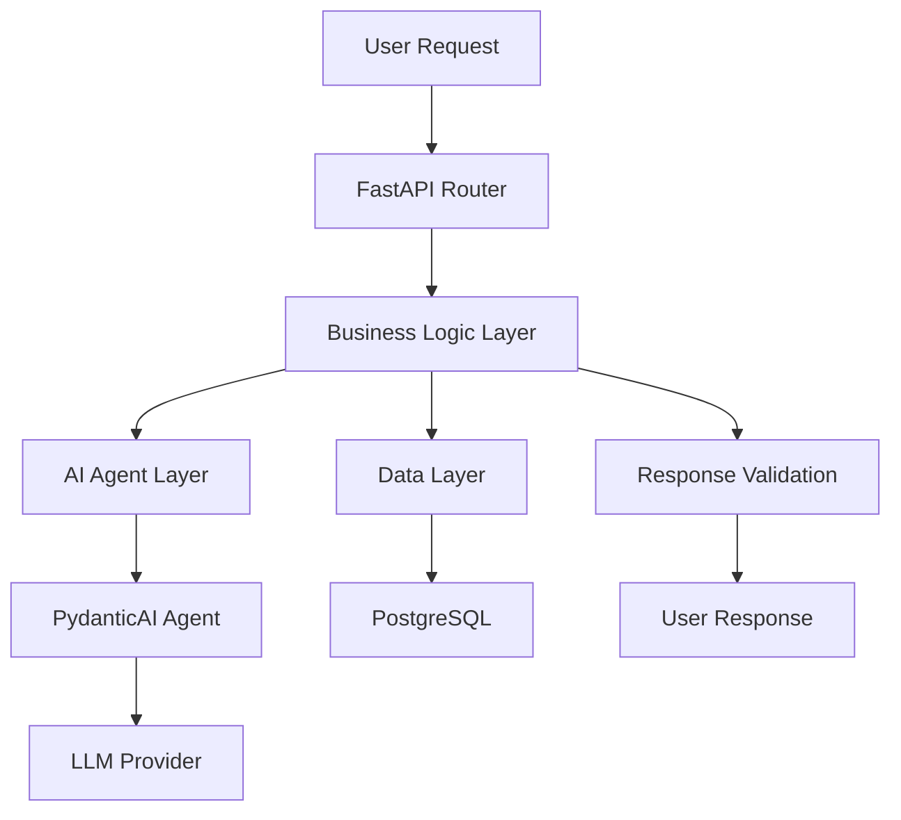
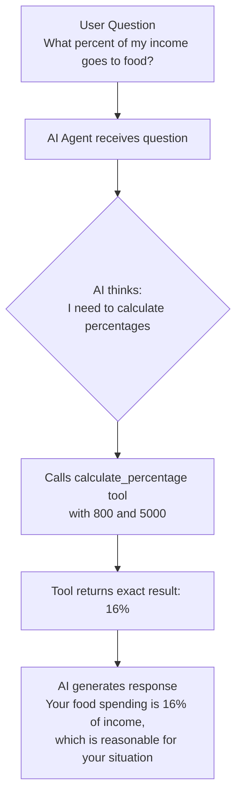
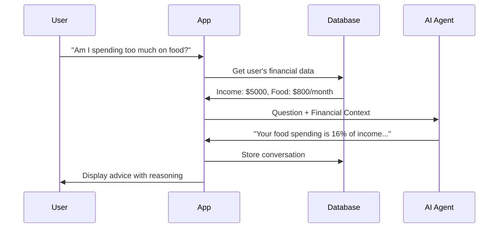
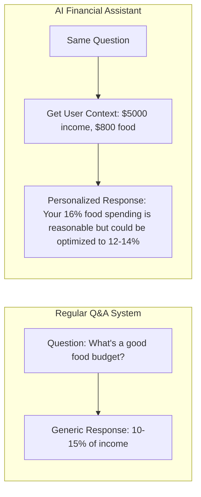
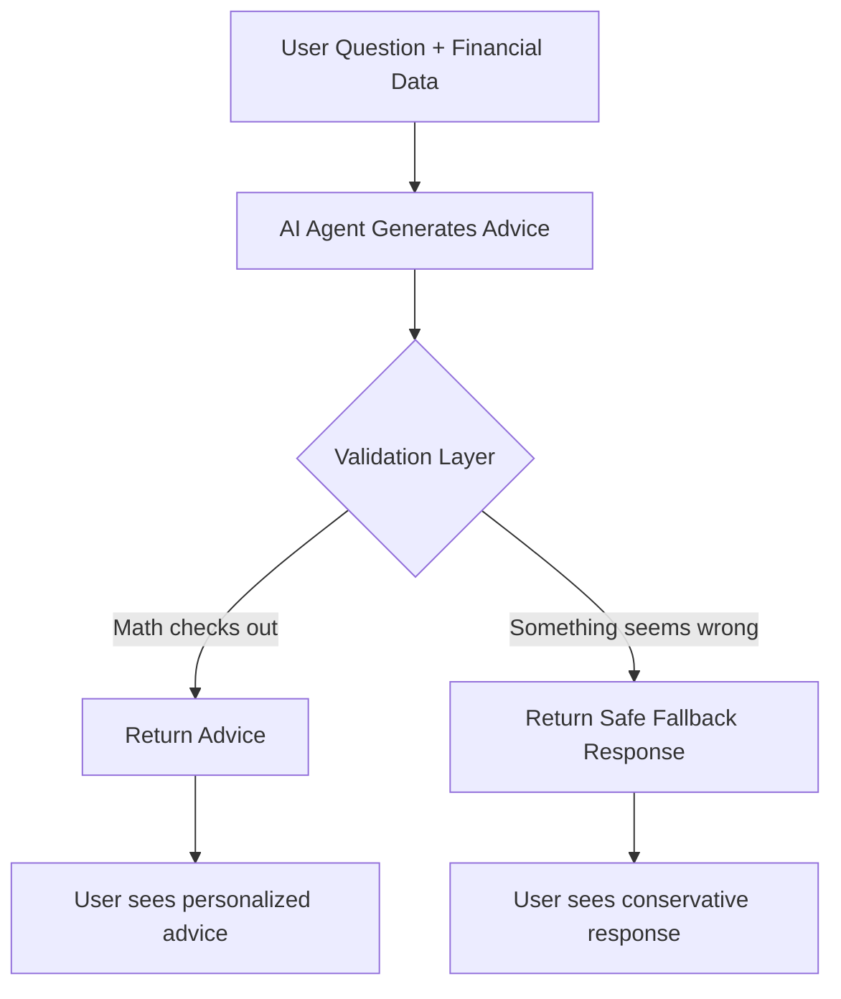
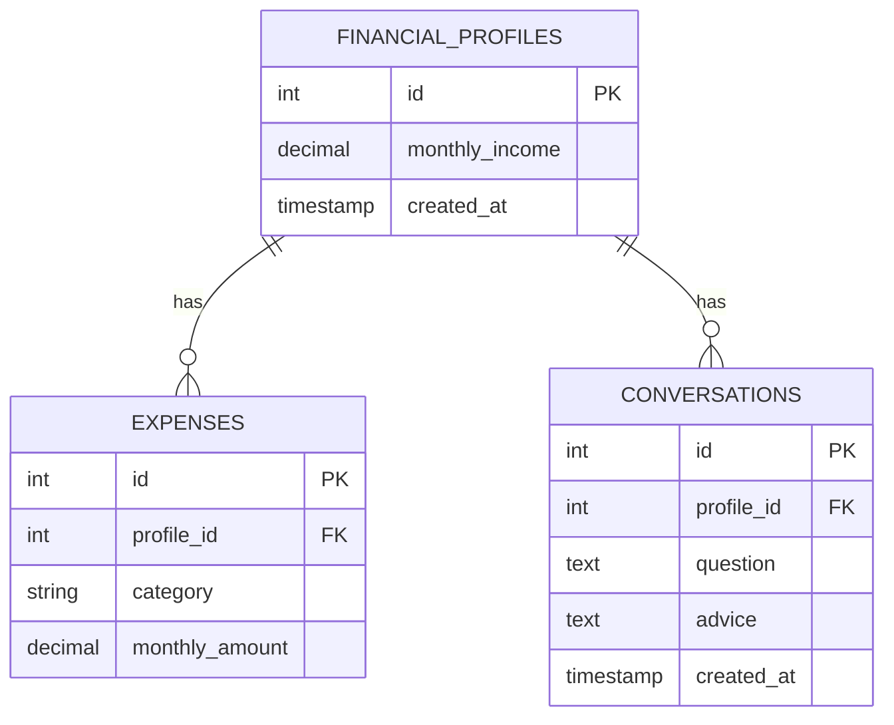
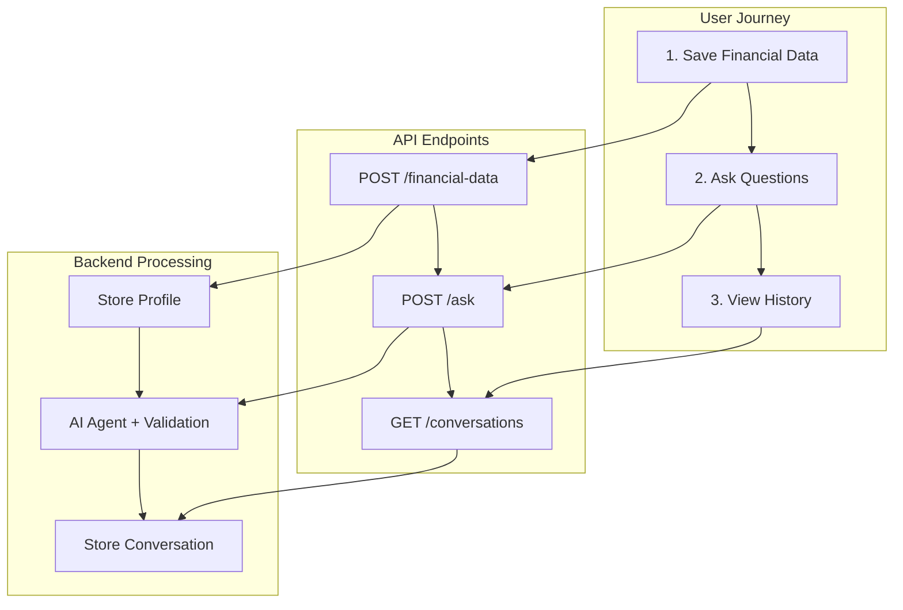
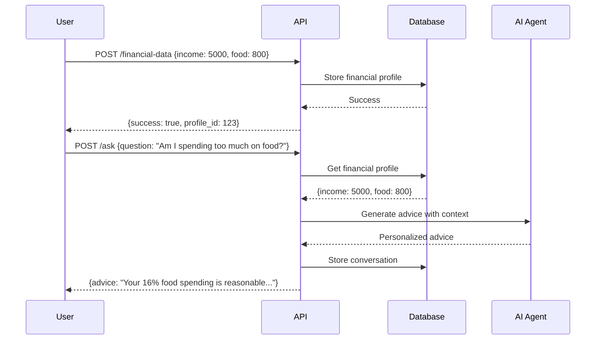
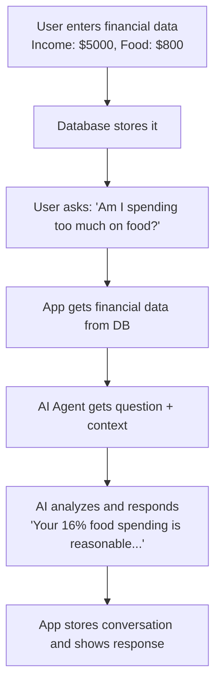

# Requirements to Architecture

**From "what to build" to "how to build it."**

Section 1 gave us validated requirements and a clear implementation plan. Now we need to translate those requirements into specific technical architecture using FastroAI.

"AI-powered financial advice" sounds clear until you try to build it. What does that actually mean when someone opens your app wondering if they're spending too much on takeout?

The gap between "this sounds like a good idea" and "this actually works" is where projects get stuck. We need to get concrete about what happens when Sarah checks her bank account and asks your app a question.

## From Requirements to Real Code

Section 1 gave us the Personal Finance Assistant requirements. We know Sarah's problem: she earns $5,000 monthly, spent $800 on dining last month, and needs to understand if that's reasonable.

Now we need to figure out exactly what happens when she opens your app and types "Am I spending too much on food?"

This is where FastroAI comes in. Instead of building authentication, databases, and AI infrastructure from scratch, we use FastroAI's foundation and focus on the actual problem: giving Sarah useful financial insights.

Let's trace through what needs to happen technically when Sarah asks her question.

## What Actually Needs to Happen

Sarah asks "Am I spending too much on food?" Here's what your system needs to do:

First, get Sarah's financial context. Not just the $800 she spent, but her income level, other expense categories, maybe previous conversations about her goals. Without this context, any advice would be generic and useless.

Second, understand what she's really asking. "Am I spending too much?" isn't just math - it's asking for judgment about whether her behavior makes sense for her situation. This needs both calculation (what percentage of income?) and reasoning (is this reasonable for someone earning $5,000/month?).

Third, respond in a way that actually helps her decide what to do. Just saying "You spent $800" doesn't help. She needs context: is this normal for her income level? How does it compare to guidelines? What could she do differently?

This gives us specific technical requirements:

- Store and retrieve personalized financial profiles 
- Accept natural language questions about finances
- Combine user data with financial reasoning to generate insights
- Provide actionable recommendations based on individual circumstances
- Remember previous conversations for ongoing guidance

These aren't vague goals - these are specific capabilities we can build. And notice we're not talking about AI models or database schemas yet. We're talking about what the system needs to do for real users in real situations.

## Architecture That Works

AI applications need to separate two different types of logic:

**Deterministic operations**: storing financial data, calculating percentages, validating inputs. This needs to work perfectly every time, and it's the kind of logic you already know how to build.

**AI operations**: understanding questions, generating personalized advice, explaining concepts. This is powerful but unpredictable, and needs special handling.

Keep these separate while letting them work together. You want reliable web application logic with AI intelligence, without AI unpredictability breaking your core business logic.

Here's how FastroAI structures this:

This diagram shows how FastroAI structures the layers. Let's see how this works when Sarah asks her question.

When Sarah asks "Am I spending too much on food?", here's what happens:

**Business Logic Layer** handles the reliable stuff first: fetching her financial profile, calculating that $800 represents 16% of her $5,000 income, validating that the numbers make sense.

**AI Agent Layer** gets involved after the math is done. It receives Sarah's question plus the pre-calculated financial context, then generates personalized advice. The AI doesn't do math (it's terrible at math) - it focuses on understanding the question and generating helpful guidance.

**Response Validation** acts as a safety net. Since we're dealing with financial advice, we catch obviously problematic responses before they reach users. If the AI somehow suggests spending 150% of income, this layer falls back to safer advice.

This separation makes debugging easier. Your core business logic works like any other web application, your AI components are isolated and replaceable, and you can test each layer independently. When something goes wrong, you can quickly identify whether it's a data problem, business logic problem, or AI problem.

LLMs are great at generating text and understanding context, but terrible at calculations. Ask an LLM "What's 15% of $5,000?" and you might get $750, $675, or something completely wrong.

This is why we separate concerns. But sometimes the AI still needs to perform calculations during its reasoning process. That's where FastroAgent comes in.

FastroAgent is essentially an LLM that can call functions when it needs to perform operations beyond text generation. When Sarah asks "What percentage of my income goes to food?", the agent recognizes it needs to do math, calls a `calculate_percentage` tool with her specific data ($800 and $5,000), gets the exact result (16%), then uses that accurate calculation to generate helpful, personalized advice.

This combination of AI reasoning with reliable tools makes agents practical for real applications. The AI handles what it's good at - understanding questions and generating contextual responses - while delegating precise operations to deterministic functions that always work correctly.

!!! info "Agent Definition in Practice"
    In the context of LLMs, an agent typically consists of:

    - **A prompt that defines behavior** - Instructions for how the AI should act and respond
    - **A set of tools** - Deterministic functions for calculations, data retrieval, external API calls
    - **Multi-step capability** - Ability to chain operations together while maintaining context
    - **Memory/state** - Remembering previous interactions and maintaining conversation context

    This is different from philosophical definitions of agency in AI research, but it's the practical definition that matters for building applications.

## Following Sarah's Question Through the System

Let's trace through what happens when Sarah asks her question. She types "Am I spending too much on food?" and hits enter. Here's the journey through FastroAI:

The flow is simple: question comes in, context gets added, AI processes everything together, response goes back. Everything else is optimization.

FastroAI provides the infrastructure, but you need to build four components specific to your financial assistant:

-   :material-database:{ .lg .middle } **Data Storage**

    ---

    Store user financial profiles and conversation history. Simple PostgreSQL tables for income, expenses by category, and past Q&A sessions.

-   :material-brain:{ .lg .middle } **AI Agent**

    ---

    PydanticAI agent that combines user questions with their financial context to generate personalized advice using LLM reasoning + calculation tools.

-   :material-api:{ .lg .middle } **API Layer**

    ---

    Three endpoints: save financial data, ask questions, get conversation history. Simple request-response patterns work fine for proof of concept.

-   :material-shield-check:{ .lg .middle } **Validation**

    ---

    Basic checks to ensure AI advice makes mathematical sense. Prevent recommendations that exceed available income or seem obviously wrong.

This looks like any other web application, but there's a key difference - your system knows Sarah's specific financial situation:

Your system provides advice tailored to her actual numbers, not generic rules.

Since you're giving financial advice, you need safety mechanisms to prevent obviously problematic recommendations:

This validation layer catches obvious problems - like suggesting someone spend 150% of their income or put all savings into high-risk investments - and falls back to safer responses.

It's not perfect, but it prevents the obvious ways an AI system could give harmful financial advice.

## Simple Data That Works

For your proof of concept, you're storing two types of information: basic financial profiles and conversation history.

Start simple. You can add complexity later, but starting simple lets you focus on proving the core experience works:

Three simple tables. No complex analytics, no feature stores, no real-time pipelines. Just the essential information.

Here's how data flows through your system:

This gives FastroAgent everything it needs to provide personalized advice. You can start building immediately without complex data modeling decisions. Add sophisticated features later, only when you have evidence that users need them.

## APIs That Just Work

Your proof of concept needs to support a simple user journey: enter financial information, ask questions, review conversation history.

That translates to three FastAPI endpoints:

Each endpoint has a clear, single responsibility that maps directly to what users need to do:

-   :material-content-save:{ .lg .middle } **Save Financial Data**

    ---

    `POST /financial-data` - User inputs their income and expenses by category. Returns success confirmation.

-   :material-chat-question:{ .lg .middle } **Ask Questions**

    ---

    `POST /ask` - User asks a question, system gets their financial context, AI generates personalized advice.

-   :material-history:{ .lg .middle } **View History**

    ---

    `GET /conversations` - User can see their previous questions and the AI's responses.

To see how this works in practice, let's trace through the complete request/response flow for a typical user session:

This shows the complete flow from user input to AI-powered response. Each step is straightforward - no complex state management, no sophisticated caching, no advanced error handling. Just the essential operations to deliver value.

You can build this entire API layer in an afternoon using FastroAI's foundation, so you can focus on making sure the AI provides helpful advice.

## Putting It All Together

We started with Sarah's frustration about not understanding her spending patterns, and translated that into a specific system that can help her.

The architecture isn't complex, but it's complete. Every piece has a clear purpose. Here's how it all works:

This solves the core problem: Sarah gets personalized financial insights without becoming a spreadsheet expert, without expensive advisors, and without the complexity of traditional budgeting apps.

Notice what you're not building: no user authentication (FastroAI handles that), no database setup (FastroAI provides it), no complex caching. You're building exactly what's needed to validate this approach works.

Get the core experience right first. Prove that people find value in AI-powered financial conversations. Then add complexity only when you have evidence it's needed.

You have a complete technical specification. The next step is creating your first FastroAgent that can turn this design into reality.

## Ready to Build Your First Agent?

With a solid architecture plan, you're ready to start building. The next step is creating your first FastroAgent that can handle real user queries reliably.

[Continue to Your First AI Agent →](your-first-ai-agent.md){ .md-button .md-button--primary }
