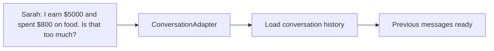
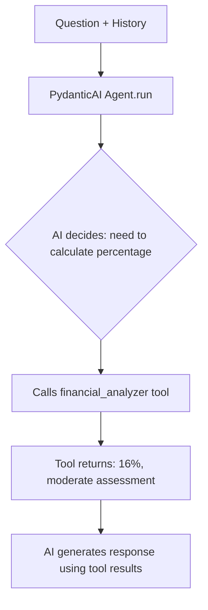
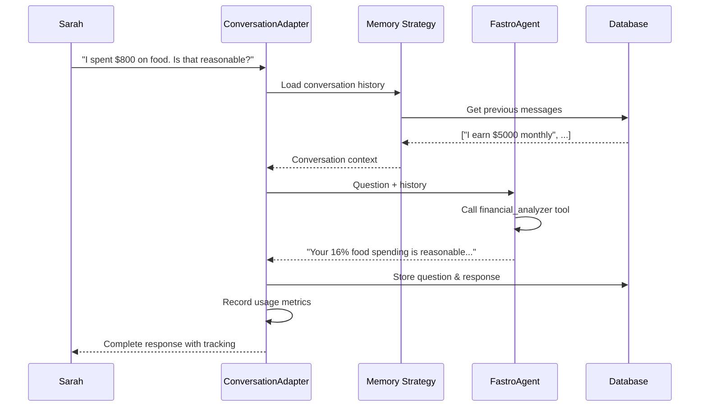
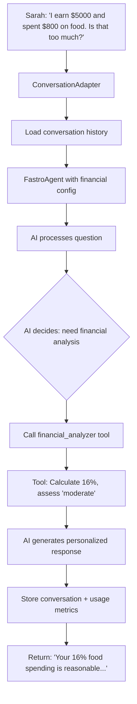

# Your First AI Agent

**From architecture to working FastroAgent implementation.**

You have a solid architecture plan for the Personal Finance Assistant. Sarah wants to ask "Am I spending too much on food?" and get personalized insights based on her $5,000 income and $800 dining expenses.

Now we need to build the actual FastroAgent that can handle her question, calculate the 16% percentage, and provide helpful financial guidance. This is where architectural concepts become working code.

## Understanding FastroAgent in Practice

FastroAgent is your interface to AI functionality in FastroAI. It wraps PydanticAI with the infrastructure features you need when building applications people actually use.

When Sarah asks her question, several things need to happen: the agent needs to understand her natural language, extract the relevant numbers, perform calculations with those numbers, apply financial knowledge to interpret the results, and respond in a way that helps her make decisions. Raw AI models handle the language understanding, but everything else requires additional infrastructure.

FastroAgent coordinates these capabilities through three main components: memory strategies that maintain conversation context across multiple interactions, tools that perform reliable calculations and data operations, and usage tracking that monitors costs and performance. Understanding how these pieces work together is key to building effective AI applications.

To see how all these components work together, let's trace through what happens when Sarah asks her financial question.

**Step 1: Memory Loading** <br>
Sarah's question triggers the conversation system to load her previous context:

<div align="center">

</div>

**Step 2: AI Processing** <br>
FastroAgent processes the question with PydanticAI, which may call tools during reasoning:

<div align="center">

</div>

**Step 3: Response and Storage** <br>
The complete response gets stored and usage metrics are recorded:

<div align="center">

</div>

FastroAgent handles all this coordination automatically. You don't need to manually load conversation history, track usage metrics, or store interactions - the agent takes care of the infrastructure while you focus on building your financial analysis tools. The memory system ensures Sarah's conversations build on previous context, the usage tracking gives you detailed cost and performance data, and the conversation adapter bridges everything together seamlessly.

Now let's see how this works by building the financial assistant agent step by step.

## Building the Agent Configuration

Sarah needs specific behavior from our financial assistant: accurate calculations, encouraging but realistic advice, and responses she can understand and act on. Let's translate these requirements into agent configuration.

We want the agent to handle three things well: understand her natural language questions, perform reliable math, and explain financial concepts clearly. Here's how that translates to FastroAgent settings:

```python
from src.infrastructure.ai.agent import FastroAgent, AgentConfig

# Create configuration for the financial assistant
config = AgentConfig(
    model="gpt-4o-mini",
    system_prompt="""
    You are a personal finance assistant that helps people understand their
    spending patterns and make better financial decisions.

    Your goal is to provide personalized, actionable insights about
    users' financial situations.

    When someone asks about their spending, help them understand:
    - Whether their spending levels are reasonable for their income
    - How their patterns compare to general financial guidelines
    - Specific steps they can take to improve their situation

    You have access to these tools when needed:
    - financial_analyzer: For calculating spending percentages and
                          comparing against financial guidelines
    - calculator: For precise mathematical operations

    Always be encouraging while being realistic about financial situations.
    Explain concepts in plain language that anyone can understand.""",
    temperature=0.3,
    max_tokens=4000
)

# Create the agent with the configuration
agent = FastroAgent(config=config)
```

The system prompt defines what role the agent plays and what it should help users accomplish. We list the available tools so the agent knows what capabilities it has for helping with calculations and analysis.

Temperature of 0.3 keeps responses consistent - important for financial advice where you want reliable guidance, not creative variation. The 4000 token limit provides room for detailed explanations while keeping responses focused and costs reasonable.

Now we have an agent configured for financial assistance, but it needs the actual tools to do calculations and analysis. Let's build those next.

## Creating Financial Analysis Tools

When Sarah asks "Am I spending too much on food?", the agent needs to do more than just understand language - it needs to calculate that $800 is 16% of $5,000 and know whether 16% is reasonable for food spending. This is where tools come in.

Tools are functions that AI agents can call during their reasoning process. Think of them as the agent's way of performing precise operations it can't do reliably with language alone. For our financial assistant, we need two types:

- **General math** - FastroAI includes a built-in calculator for basic arithmetic
- **Financial analysis** - We'll build a custom tool that knows about spending guidelines

Let's start with the financial analysis tool that can handle Sarah's question:

```python
async def financial_analyzer(
    monthly_income: float,
    category_spending: float,
    category_name: str
) -> dict:
    """Analyze spending in a category relative to income."""

    if monthly_income <= 0:
        return {"error": "Income must be positive"}

    # Calculate the percentage
    percentage = (category_spending / monthly_income) * 100

    # Financial guidelines for different spending categories
    guidelines = {
        "food": {"reasonable": 15, "high": 20},
        "housing": {"reasonable": 30, "high": 35},
        "transportation": {"reasonable": 15, "high": 20},
        "entertainment": {"reasonable": 10, "high": 15},
    }

    guideline = guidelines.get(category_name.lower(), {"reasonable": 10, "high": 15})

    # Assess the spending level
    if percentage <= guideline["reasonable"]:
        assessment = "reasonable"
        recommendation = f"Your {category_name} spending is within normal limits."
    elif percentage <= guideline["high"]:
        assessment = "moderate"
        recommendation = f"Your {category_name} spending is getting high but manageable."
    else:
        assessment = "high"
        recommendation = f"Your {category_name} spending exceeds recommended guidelines."

    return {
        "percentage": round(percentage, 1),
        "assessment": assessment,
        "recommendation": recommendation,
        "amount": category_spending
    }
```

This tool does exactly what Sarah needs: takes her income and food spending, calculates the percentage, compares it to financial guidelines, and returns both the numbers and an assessment.

Now we need to give our agent access to both this custom tool and FastroAI's built-in calculator. We do this by creating a toolset:

```python
from pydantic_ai.toolsets import FunctionToolset
from src.infrastructure.ai.tools.built_in.math import calculator

# Create toolset with both built-in and custom tools
financial_toolset = FunctionToolset(tools=[
    calculator,  # FastroAI's built-in math tool
    financial_analyzer,  # Our custom financial analysis tool
])

# Add the toolset to our agent (using the config from earlier)
agent = FastroAgent(
    config=config,
    toolsets=[financial_toolset]
)
```

Now when Sarah asks her question, the agent can call `financial_analyzer(5000, 800, "food")` to get precise calculations and assessment, then use that information to generate a helpful response.

Our agent has configuration and tools, but there's one more piece needed for a good user experience: conversation memory. Let's add that next.

## Implementing Conversation Memory

Imagine Sarah asks "I earn $5000 monthly" and gets a response. Then she asks "I spent $800 on food. Is that too much?" Without conversation memory, the agent has no idea about her $5000 income from the previous message. It would have to ask her to repeat information or give generic advice.

Conversation memory lets the agent remember previous exchanges and build on them. This makes interactions feel natural and saves Sarah from repeating herself.

FastroAI handles this through memory strategies. The most common is the sliding window strategy - it keeps the most recent messages in context so the agent can reference earlier parts of the conversation. The sliding window keeps recent messages (FastroAI defaults to 20) and automatically drops older ones. This gives enough context for meaningful financial discussions while controlling costs.

Our FastroAgent can process individual questions, but it doesn't handle conversation flow by itself. We need three additional components to make conversations work:

**Memory Strategy** - Remembers previous messages so the agent can reference earlier parts of the conversation.

**Execution Tracer** - Tracks what happens during each interaction for debugging and monitoring. When something goes wrong, you can trace exactly what the agent did.

**Conversation Adapter** - FastroAI provides this adapter that transforms a regular FastroAgent into a conversation-capable agent. It handles loading conversation history, managing memory, and storing new interactions automatically. For different use cases, you could create other adapters (like a batch processing adapter) or use the base FastroAgent directly for single-shot interactions.

Here's how to set these up:

```python
from src.interfaces.api.dependencies import get_sliding_window_strategy
from src.infrastructure.ai.observability import ExecutionTracer
from src.modules.conversation.adapter import ConversationAdapter

# Get the memory strategy (handles conversation history)
memory_strategy = get_sliding_window_strategy(db_session)

# Set up tracing for debugging and monitoring
tracer = ExecutionTracer()

# Create the conversation adapter that connects everything
conversation_adapter = ConversationAdapter(
    agent=agent,  # Our financial agent from earlier
    memory_strategy=memory_strategy,
    tracer=tracer
)
```

The conversation adapter coordinates between the different components. Here's what happens when Sarah asks "I spent $800 on food. Is that reasonable?":

<div align="center">

</div>

Notice how Sarah just asks a question naturally, but the adapter ensures her previous mention of "$5000 monthly" income gets loaded and used by the agent to provide accurate, contextual advice. All the complexity of conversation management, memory handling, and usage tracking happens automatically.

Now let's see how to actually use this conversation system in your application.

## Processing Questions with Conversation Context

Now let's put everything together and see how Sarah can actually have a conversation with our financial assistant. We want her to be able to say "I earn $5000 monthly" in one message, then ask "I spent $800 on food. Is that reasonable?" in the next message and have the agent understand both pieces of information.

Here's how to create a function that handles Sarah's financial conversations:

```python
from src.modules.conversation.deps import ConversationDeps

async def chat_with_financial_assistant(session, user_id, question, conversation_name="finances"):
    # Package up everything needed for conversation management
    deps = ConversationDeps(
        session=session,    # Database access for loading/storing messages
        user_id=user_id,    # Keeps Sarah's conversations separate from other users
        conversation_id=conversation_name  # Groups related messages
    )

    # Use our conversation adapter (created in the previous section)
    response = await conversation_adapter.chat(
        message=question,
        deps=deps
    )

    return response.content
```

The `ConversationDeps` object is FastroAI's implementation of dependency injection - a pattern that manages resources and their lifecycles automatically.

Database connections need to be opened, used, and properly closed. User sessions need to be validated. Memory strategies need to be configured. Instead of managing all this complexity manually, FastroAI's dependency injection handles it automatically.

!!! tip "Dependency Injection Benefits"
    Dependency injection separates resource management from business logic. Instead of your conversation code managing database connections, user authentication, and memory strategies directly, these resources are created and configured externally, then injected into your functions when needed. This approach provides several key advantages:

    - **Automatic cleanup**: Database connections close when requests finish
    - **Resource safety**: No memory leaks from forgotten cleanup code
    - **Easy testing**: Inject mock objects without changing business logic
    - **Flexible configuration**: Switch databases or auth systems without code changes

When a web request comes in, FastroAI creates a database session, validates the user, sets up the conversation context, and packages everything into `ConversationDeps`. When the request finishes, it automatically closes the database connection and cleans up resources.

This makes testing much easier too - you can inject mock dependencies for testing without changing your core logic. And if you need to switch databases or change authentication, you only update the dependency configuration, not every function.

Let's see this in action with Sarah's actual conversation:

```python
# Sarah's first question - establishes her income
sarah_user_id = 123
first_response = await chat_with_financial_assistant(
    session=db_session,
    user_id=sarah_user_id,
    question="I earn $5000 monthly",
    conversation_name="budget_review"
)
# Response: "Thanks for sharing your income information. I can help you analyze..."

# Sarah's follow-up question - the agent remembers her income
second_response = await chat_with_financial_assistant(
    session=db_session,
    user_id=sarah_user_id,
    question="I spent $800 on food. Is that reasonable?",
    conversation_name="budget_review"  # Same conversation
)
# Response: "Your food spending of $800 is 16% of your $5000 income, which is..."
```

Because we're using the same `conversation_name` ("budget_review"), the agent automatically remembers Sarah's $5000 income from the first message and uses it to analyze her $800 food spending in the second message.

Sarah could also start a completely separate conversation about a different topic:

```python
# Different conversation - agent won't mix this with budget talk
vacation_response = await chat_with_financial_assistant(
    session=db_session,
    user_id=sarah_user_id,
    question="I'm planning a trip to Europe",
    conversation_name="vacation_planning"  # Different conversation
)
```

This conversation system makes the agent feel natural to use - Sarah can have ongoing discussions about her finances without having to repeat herself, and she can keep different topics organized in separate conversations.

Now that we have a complete working conversation system, let's look at how the agent coordinates all the pieces when answering Sarah's questions.

## Complete Conversation Example

Let's trace through a complete conversation to see how all the pieces we've built work together - agent configuration, tools, memory, and conversation management:

```python
# Sarah starts a new conversation about her budget
response1 = await chat_with_financial_assistant(
    session=db_session,
    user_id=123,
    question="I earn $5000 monthly and spent $800 on food. Is that too much?",
    conversation_name="budget_review"
)
# Agent calls financial_analyzer(5000, 800, "food")
# Returns: "Your food spending of $800 is 16% of your income, which is slightly
# above the recommended range but still manageable."

# Sarah asks a follow-up question - agent remembers her income
response2 = await chat_with_financial_assistant(
    session=db_session,
    user_id=123,
    question="What about $1200 on housing?",
    conversation_name="budget_review"  # Same conversation
)
# Agent loads previous context, calls financial_analyzer(5000, 1200, "housing")
# Returns: "Your housing cost of $1200 is 24% of your $5,000 income, which is
# excellent! Combined with your food spending we discussed earlier, you're
# managing your major expenses quite well."
```

Notice how the agent remembers Sarah's $5000 income from the first question and uses it automatically in the second response. It calls the right financial analysis tool for each category, references previous parts of the conversation, and provides advice that's specific to her situation.

This shows all our components working together - agent configuration helps it understand financial questions, tools handle precise calculations, conversation memory provides context, and everything coordinates to generate helpful responses.

But how do you know if your agent is working efficiently? That's where usage tracking comes in.

## Understanding Usage Tracking

You've built something that works, but you have no idea what it costs to run. Sarah asks "Am I spending too much on food?" and gets a helpful answer, but did that question cost you a penny or a dollar? When you have a hundred users asking questions daily, will your costs be manageable or will they eat your budget?

After processing Sarah's question, you get detailed metrics about what actually happened:

```python
response = await conversation_adapter.chat(message="Am I spending too much?", deps=deps)

# Usage information is automatically captured
print(f"Total tokens used: {response.total_tokens}")
print(f"Cost in microcents: {response.cost_microcents}")
print(f"Processing time: {response.processing_time_ms}ms")
print(f"Model used: {response.model}")
print(f"Tools called: {len(response.tool_calls)}")
print(f"Trace ID: {response.trace_id}")
```

Example output:
```
Total tokens used: 156
Cost in microcents: 1240
Processing time: 1840ms
Model used: gpt-4o-mini
Tools called: 1
Trace ID: trace_abc123
```

Sarah's question cost about 1.2 cents, used 156 tokens, took 1.8 seconds to process, and called one tool for the financial analysis. Not expensive, but if you have thousands of users asking questions daily, those costs add up quickly.

The trace ID is great for when things go wrong. You can search your logs by trace ID to see exactly what happened during a specific conversation - which tools were called, how memory was loaded, what errors occurred. This makes debugging AI applications much more manageable than trying to reproduce mysterious failures.

Now you have visibility into your agent's performance and costs. But let's step back and look at what you've actually built.


## What You've Built

You now have a complete working FastroAgent that can handle Sarah's real questions. When she asks "I earn $5000 and spent $800 on food. Is that too much?", your agent understands her natural language, calls the financial_analyzer tool to calculate that 16% percentage, compares it against spending guidelines, and generates helpful advice she can actually use. It remembers the conversation for follow-up questions and tracks usage metrics automatically.

Here's what you built and how it all works together:

<div align="center">

</div>

This actually works. Sarah can ask real questions and get useful answers. The agent doesn't just understand language - it does math correctly, remembers conversations, and gives advice that makes sense. You built something people would use.

You could extend this foundation with more financial tools, better spending categorization, or connections to banking APIs. But right now, you have something Sarah can actually use to get better insights about her money.

The agent handles all the AI complexity. Your next challenge is building the data layer and business rules that transform raw financial data into the structured information your agent needs.

[Continue to Data Layer & Business Rules →](data-layer-and-business-rules.md){ .md-button .md-button--primary }
