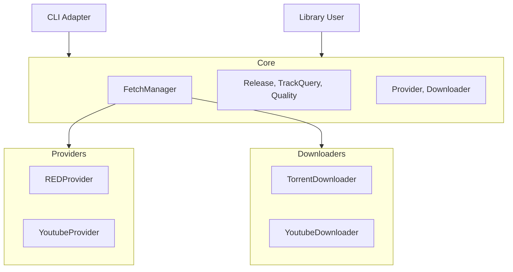

# Architecture & Design

This document details the architectural decisions, component design, and key learnings from the development of **flacfetch**.

## 1. High-Level Architecture

The system follows **Clean Architecture** principles to decouple core logic from external providers and interfaces.

### Core Components

*   **FetchManager**: The central orchestrator. It aggregates results from registered providers, applies sorting/prioritization logic, and delegates downloading.
*   **Models**:
    *   `Release`: Unified representation of a search result. Abstracts away differences between a Torrent and a YouTube video. Contains metadata (Year, Label, Views) and download info.
    *   `Quality`: Value object representing format (FLAC/Opus/AAC), bitrate, and source media. Implements comparison logic (`__lt__`) for sorting.
*   **Interfaces**:
    *   `Provider`: Abstract base class for search sources.
    *   `Downloader`: Abstract base class for download mechanisms.

## 2. Key Design Choices

### 2.1. Selective BitTorrent Downloading
**Challenge**: Private trackers usually organize content by **Album**, but users often want a single **Track**. Downloading a 500MB FLAC album for one 30MB song is inefficient.
**Solution**:
*   **Search**: `REDProvider` uses the `filelist` API parameter to find torrents containing the specific track title.
*   **Matching**: It parses the file list string (`filename{{{size}}}|||...`) to identify the exact target file index.
*   **Download**: `TorrentDownloader` uses `libtorrent`'s `prioritize_files` API. It sets the target file priority to `7` (High) and all others to `0` (Skip), downloading only the necessary chunks.

### 2.2. Hybrid Prioritization Logic
**Challenge**: "Best" means different things for different sources.
*   **RED**: "Best" = Original Release (Oldest), Lossless, Healthy (Seeders).
*   **YouTube**: "Best" = Modern Codec (Newest), Official Source (Topic Channel), High Bitrate.
**Solution**:
The `FetchManager` implements a weighted sort key:
1.  **Match Score**: Does the filename exactly match the query? (Crucial for filtering junk).
2.  **Official Score**: (YouTube only) Is it a "Topic" channel or "Official Audio"? (Heavily boosted).
3.  **Release Type**: (RED) Album > Single > EP.
4.  **Health**: Seeders (RED) / Views (YouTube - implicitly handled via display).
5.  **Quality**: Lossless > High Bitrate.
6.  **Year (Contextual)**:
    *   *RED*: **Oldest First** (Prefer original pressings).
    *   *YouTube*: **Newest First** (Prefer modern Opus uploads over legacy 2011 AAC uploads).

### 2.3. YouTube Quality & Reliability
**Learnings**:
*   **Metadata vs Reality**: YouTube metadata (via `yt-dlp`) can be misleading. Older videos might list "AAC" but provide very low bitrate (48kbps) streams even if `itag` suggests higher potential.
*   **Bitrate Guessing**: Estimating bitrate from file size is dangerous for video containers. We switched to relying strictly on `abr` (Audio Bitrate) or known `itag` mapping (e.g., 251 -> Opus 130k).
*   **Proxy for Quality**: Since accurate bitrate is hard to guarantee without downloading, we use **Upload Year** as a strong proxy. Videos uploaded post-2015 (and especially post-2020) almost always offer high-quality Opus streams. Pre-2015 uploads are often legacy AAC with lower fidelity.
*   **Visuals**: The CLI color-codes the Year (Green > 2020, Red < 2015) instead of showing potentially inaccurate bitrate numbers, empowering the user to choose based on "Freshness".

### 2.4. Security: No Hardcoded URLs
**Design Decision**: Tracker API base URLs are **never** stored in the source code. Both `REDProvider` and `OPSProvider` require a `base_url` parameter that must be provided at runtime (typically via environment variables).

**Rationale**:
1. **Privacy**: Private trackers prefer their URLs not be publicly indexed.
2. **Safety**: Ensures test suites cannot accidentally hit real tracker APIs without proper mocking.
3. **Flexibility**: Allows easy switching between different tracker instances if needed.

## 3. Implementation Details

### RED Provider
*   **Lazy Loading**: Fetching file lists for *every* search result is slow. We implemented a default search limit (20 groups) to prevent rate-limiting while still finding the best match.
*   **Lossless Filter**: Hard-coded to only return `FLAC` results to ensure archival quality from trackers.
*   **Base URL Required**: The `base_url` constructor parameter is mandatory; if not provided, an error is raised.

### YouTube Provider
*   **Topic Search**: Appends "topic" to search queries to surface auto-generated "Art Tracks" (high quality, static image) which are preferred over user uploads.
*   **URL Handling**: Constructs `youtu.be` short links for easy sharing/checking.

## 4. Future Improvements
*   **Metadata Tagging**: Auto-tag downloaded files using MusicBrainz/Discogs.
*   **Spectral Analysis**: Integrate `ffmpeg` or `sox` to verify frequency cutoffs post-download automatically.

