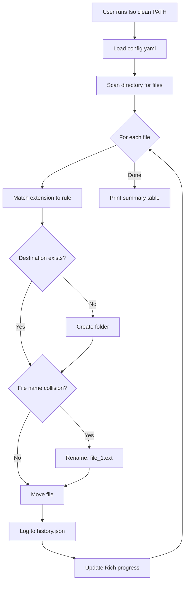

# fso

**fso** (File System Organizer) - A cross-platform CLI tool that automatically organizes files into categorized folders based on their extensions.

## Features

- **Clean**: Instantly organize files in any directory into categorized subfolders
- **Watch**: Monitor a directory and automatically organize new files as they appear
- **Undo**: Revert the last organization operation with a single command
- **Dry Run**: Preview what would happen without actually moving files
- **Customizable**: Define your own rules via a simple YAML configuration
- **Cross-Platform**: Works on Windows, macOS, and Linux

## How It Works

<details>
<summary>Click to see the data flow diagram</summary>



</details>

## Installation

### From Source

```bash
# Clone the repository
git clone https://github.com/yourusername/fso.git
cd fso

# Create a virtual environment (recommended)
python -m venv venv

# Activate the virtual environment
# Windows (PowerShell)
.\venv\Scripts\Activate.ps1
# Windows (CMD)
.\venv\Scripts\activate.bat
# macOS/Linux
source venv/bin/activate

# Install in development mode
pip install -e .
```

## Usage

### Clean Command

Organize files in a directory:

```bash
# Organize your Downloads folder
fso clean ~/Downloads

# Preview what would happen (dry run)
fso clean ~/Downloads --dry-run

# Use a custom config file
fso clean ~/Downloads --config ./my-config.yaml

# Show detailed output
fso clean ~/Downloads --verbose

# Silent mode (errors only)
fso clean ~/Downloads --quiet
```

**Example Output:**

```
Organizing files... ━━━━━━━━━━━━━━━━━━━━━━━━━━━━━━━━━━ 100% photo.jpg

     Moved Files Summary
┏━━━━━━━━━━━┳━━━━━━━┓
┃ Folder    ┃ Files ┃
┡━━━━━━━━━━━╇━━━━━━━┩
│ Archives  │     2 │
│ Documents │     5 │
│ Images    │    12 │
├───────────┼───────┤
│ Total     │    19 │
└───────────┴───────┘

Created 3 new folder(s)
```

### Watch Command

Monitor a directory and organize files as they appear:

```bash
# Watch your Downloads folder
fso watch ~/Downloads

# Custom delay before organizing (for large downloads)
fso watch ~/Downloads --delay 3.0

# Use custom config
fso watch ~/Downloads --config ./my-config.yaml
```

Press `Ctrl+C` to stop watching.

**Example Output:**

```
Watching: C:\Users\you\Downloads
Delay: 1.0s | Press Ctrl+C to stop

-> vacation-photo.jpg moved to Images/
-> quarterly-report.pdf moved to Documents/
-> project-backup.zip moved to Archives/
```

### Undo Command

Revert the last organization:

```bash
fso undo
```

**Example Output:**

```
Undoing operation from 2024-01-15T10:30:45
Target directory: C:\Users\you\Downloads
Files to restore: 19

Proceed with undo? [y/n]: y

✓ Restored 19 file(s)
✓ Removed 3 empty folder(s)
```

### Config Command

View configuration information:

```bash
# Show user config file location
fso config

# Show current configuration
fso config --show

# Show config file path with status
fso config --path
```

## Configuration

fso uses a YAML configuration file. The default configuration organizes files into these categories:

```yaml
rules:
  Images: [jpg, jpeg, png, gif, svg, webp, ico, bmp, tiff, raw, heic]
  Documents: [pdf, doc, docx, txt, rtf, odt, xlsx, xls, pptx, ppt, csv, epub]
  Archives: [zip, tar, rar, gz, 7z, bz2, xz, iso]
  Videos: [mp4, mkv, avi, mov, wmv, flv, webm, m4v, mpeg, mpg]
  Audio: [mp3, wav, flac, aac, ogg, m4a, wma, opus, aiff]
  Code: [py, js, ts, html, css, json, xml, yaml, yml, md, sh, bat, ps1]
  Executables: [exe, msi, dmg, deb, rpm, appimage, apk]

default_folder: Misc

exclude_patterns:
  - "*.tmp"
  - "*.part"
  - "*.crdownload"
  - "*.download"
  - "desktop.ini"
  - "Thumbs.db"
  - ".DS_Store"
```

### Config File Locations

The user config file is stored in a platform-specific location:

| Platform | Location |
|----------|----------|
| Windows  | `%LOCALAPPDATA%\fso\config.yaml` |
| macOS    | `~/Library/Application Support/fso/config.yaml` |
| Linux    | `~/.config/fso/config.yaml` |

To customize, copy the default `config.yaml` to your user config location.

## Safety Features

- **No Overwrites**: If a file with the same name exists in the destination, the new file is automatically renamed (e.g., `photo.jpg` -> `photo_1.jpg`)
- **Undo Support**: Every operation is logged, allowing you to revert changes
- **Dry Run Mode**: Preview changes before executing
- **Hidden Files Ignored**: Files starting with `.` are never moved
- **Exclude Patterns**: Skip temporary files, partial downloads, and system files

## Development

### Running Tests

```bash
# Install dev dependencies
pip install -e ".[dev]"

# Run tests
pytest

# Run tests with coverage
pytest --cov=fso
```

### Project Structure

```
fso/
├── fso/
│   ├── __init__.py      # Package version
│   ├── main.py          # CLI commands (Typer)
│   ├── core.py          # File organization logic
│   ├── config.py        # Configuration loading
│   ├── observers.py     # File watching (Watchdog)
│   └── utils.py         # History tracking, helpers
├── tests/
│   ├── test_config.py
│   └── test_core.py
├── config.yaml          # Default configuration
├── pyproject.toml       # Package configuration
└── README.md
```

## License

MIT License - see LICENSE file for details.
