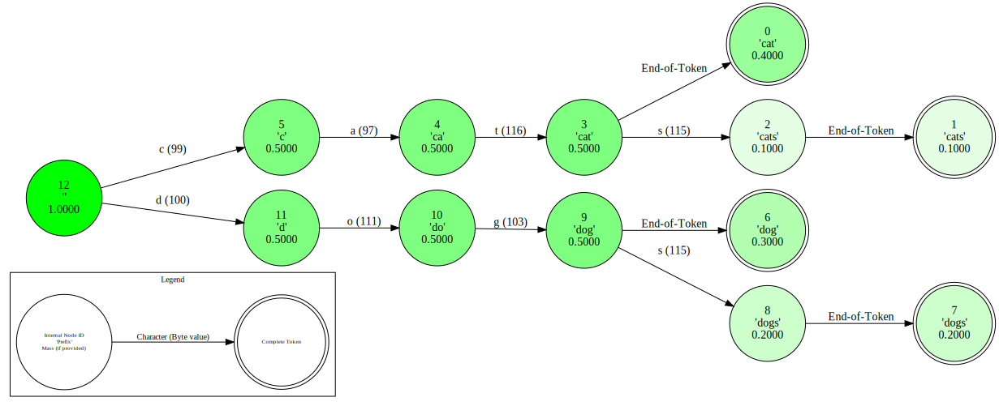

[](https://genlm.github.io/backend/)
[](https://github.com/genlm/backend/actions/workflows/pytest.yml)
[](https://codecov.io/github/genlm/genlm-backend)
[](https://pypi.org/project/genlm-backend/)

GenLM Backend is a high-performance backend for language model probabilistic programs, built for the GenLM ecosystem. It provides an **asynchronous** and **autobatched** interface to `vllm` and `transformers` language models, enabling scalable and efficient inference.

## Key Features
- Automatic batching of concurrent log-probability requests—enabling efficient large-scale inference without having to write batching logic yourself
- Byte-level decoding support for transformers tokenizers—enabling advanced token-level control
- Supports for arbitrary Hugging Face models (e.g., LLaMA, DeepSeek, etc.) with fast inference and automatic KV caching using vllm


## Quick Start

This library supports installation via pip:

```bash
pip install genlm-backend
```

## Example: Autobatched Sequential Importance Sampling with LLMs

This example demonstrates how `genlm-backend` enables concise, scalable probabilistic inference with language models. It implements a Sequential Importance Sampling (SIS) algorithm that makes asynchronous log-probabality requests which get automatically batched by the language model.


```python
import torch
import asyncio
from genlm.backend import load_model_by_name

# --- Token-level masking using the byte-level vocabulary --- #
def make_masking_function(llm, max_token_length, max_tokens):
    eos_id = llm.tokenizer.eos_token_id
    valid_ids = torch.tensor([
        token_id == eos_id or len(token) <= max_token_length
        for token_id, token in enumerate(llm.byte_vocab)
    ], dtype=torch.float).log()
    eos_one_hot = torch.nn.functional.one_hot(
        torch.tensor(eos_id), len(llm.byte_vocab)
    ).log()

    def masking_function(context):
        return eos_one_hot if len(context) >= max_tokens else valid_ids

    return masking_function

# --- Particle class for SIS --- #
class Particle:
    def __init__(self, llm, mask_function, prompt_ids):
        self.context = []
        self.prompt_ids = prompt_ids
        self.log_weight = 0.0
        self.active = True
        self.llm = llm
        self.mask_function = mask_function

    async def extend(self):
        logps = await self.llm.next_token_logprobs(self.prompt_ids + self.context)
        masked_logps = logps + self.mask_function(self.context).to(logps.device)
        logZ = masked_logps.logsumexp(dim=-1)
        self.log_weight += logZ
        next_token_id = torch.multinomial((masked_logps - logZ).exp(), 1).item()
        if next_token_id == self.llm.tokenizer.eos_token_id:
            self.active = False
        else:
            self.context.append(next_token_id)

# --- Autobatched SIS loop --- #
async def autobatched_sis(n_particles, llm, masking_function, prompt_ids):
    particles = [Particle(llm, masking_function, prompt_ids) for _ in range(n_particles)]
    while any(p.active for p in particles):
        await asyncio.gather(*[p.extend() for p in particles if p.active])
    return particles

# --- Run the example --- #
llm = load_model_by_name("gpt2") # or e.g., "meta-llama/Llama-3.2-1B" if you have access
mask_function = make_masking_function(llm, max_token_length=10, max_tokens=10)
prompt_ids = llm.tokenizer.encode("Montreal is")
particles = await autobatched_sis( # use asyncio.run(autobatched_sis(...)) if you are not in an async context
    n_particles=10, llm=llm, masking_function=mask_function, prompt_ids=prompt_ids
)

strings = [llm.tokenizer.decode(p.context) for p in particles]
log_weights = torch.tensor([p.log_weight for p in particles])
probs = torch.exp(log_weights - log_weights.logsumexp(dim=-1))

for s, p in sorted(zip(strings, probs), key=lambda x: -x[1]):
    print(f"{repr(s)} (probability: {p:.4f})")

```

This example highlights the following features:

* 🌀 **Asynchronous Inference Loop.** Each particle runs independently, but all LLM calls are scheduled concurrently via `asyncio.gather`. The backend batches them automatically, so you get the efficiency of large batched inference without writing batching logic yourself.
* 🔁 **Byte-level Tokenization Support.** Token filtering is done using the model’s byte-level vocabulary, which `genlm-backend` exposes—enabling low-level control over generation in ways not possible with most high-level APIs.


## Development

See the [DEVELOPING.md](DEVELOPING.md) file for information on how to install the project for local development.


## Main Components

### Asynchronous Language Model Backends

The [`genlm.backend.llm`](reference/genlm/backend/llm/__init__/) module provides asynchronous interfaces for computing next-token probabilities with `vllm` and `transformer` language models.

```python
from genlm.backend import AsyncVirtualLM
# Initialize model with vLLM backend from a HuggingFace model name
llm = AsyncVirtualLM.from_name("meta-llama/Llama-3.2-1B")
```

This submodule includes two key classes:

- **AsyncVirtualLM** (GPU): vLLM-based backend optimized for next-token probability computations. Fastest and most memory-efficient; requires a GPU. Uses vLLM's prefix caching feature for KV caching.
- **AsyncTransformer** (CPU): HuggingFace-based backend for next-token probability computations. Slower and less memory-efficient; for CPU usage.

See the [LLM Code Reference](reference/genlm/backend/llm/__init__/) for detailed API documentation.

### Vocabulary Decoding

The [`genlm.backend.tokenization`](reference/genlm/backend/tokenization/__init__/) module converts Hugging Face tokenizer vocabularies into byte and string representations, with each token's representation stored at its corresponding token ID in the output lists.

```python
from transformers import AutoTokenizer
from genlm.backend import decode_vocab

# Load a tokenizer and decode its vocabulary
tokenizer = AutoTokenizer.from_pretrained("gpt2")
byte_vocab, str_vocab = decode_vocab(tokenizer)
byte_vocab[10] # Byte representation of token with ID 10
```

!!! warning
    The byte representation (`byte_vocab`) is the canonical form and should be preferred for reliable token handling. The string representation (`str_vocab`) is provided for convenience and debugging but may not correctly represent all tokens, especially those containing invalid UTF-8 sequences.

### Token-Character Tries

The [`genlm.backend.trie`](reference/genlm/backend/trie/__init__/) module provides an efficient trie data structure for mapping weight distributions over tokens to weight distributions over token prefixes.

```python
from genlm.backend import TokenCharacterTrie
# Initialize TokenCharacterTrie from a byte vocabulary
trie = TokenCharacterTrie(decode=[b'cat', b'cats', b'dog', b'dogs'])
probs = [0.4, 0.1, 0.3, 0.2]
# Get mass at each node given a distribution over the vocab
trie_ws = trie.weight_sum(probs)
trie.visualize(trie_ws)
```




This submodule includes three key classes:

- **TokenCharacterTrie** (CPU): Base implementation for CPU usage.
- **ParallelTokenCharacterTrie** (GPU): GPU-accelerated version which uses sparse matrix operations for mass summing.
- **AsyncTokenCharacterTrie** (Async): Asynchronous wrapper for use in asynchronous contexts; enables automatic batching of concurrent requests. This class can wrap either the sequential or parallel trie implementations.

See the [Trie Code Reference](reference/genlm/backend/trie/__init__/) for detailed API documentation.


## Troubleshooting

* If you are getting:
    ```bash
    A module that was compiled using NumPy 1.x cannot be run in
    NumPy 2.0.2 as it may crash. To support both 1.x and 2.x
    versions of NumPy, modules must be compiled with NumPy 2.0.
    Some module may need to rebuild instead e.g. with 'pybind11>=2.12'.

    If you are a user of the module, the easiest solution will be to
    downgrade to 'numpy<2' or try to upgrade the affected module.
    We expect that some modules will need time to support NumPy 2.
    ```
    then you should downgrade your version of `numpy` with `pip install "numpy<2"`.
