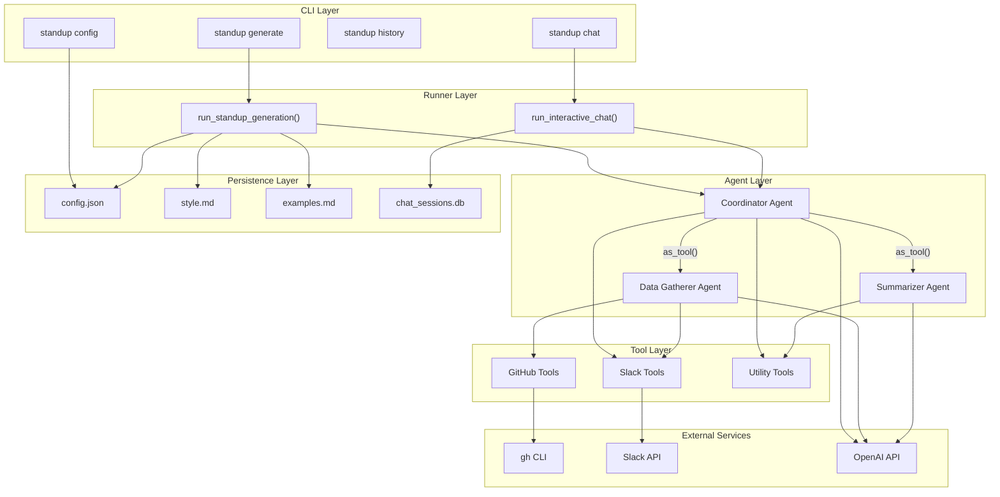
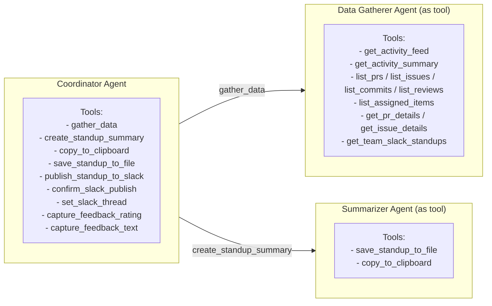
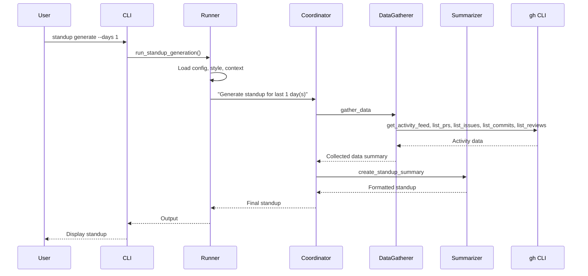

# Architecture

Multi-agent system built with the OpenAI Agents SDK that generates daily standup summaries from GitHub activity.

## High-Level Overview



## Agent Architecture

The system uses the **agents-as-tools** pattern — sub-agents are wrapped via `as_tool()` and invoked by the coordinator rather than using handoffs.



| Agent | Model | Temp | Role |
|-------|-------|------|------|
| **Coordinator** | gpt-5.2 | 0.5 | Orchestrates workflow, handles user commands (copy, save, publish) |
| **Data Gatherer** | gpt-5.2 | 0.3 | Collects GitHub activity via `gh` CLI, optionally fetches Slack standups |
| **Summarizer** | gpt-5.2 | 0.7 | Creates formatted standup summaries using style/example preferences |

## Data Flow (Generate Mode)



**Chat mode** (`standup chat`) wraps the same flow in an interactive loop with `SQLiteSession` for conversation persistence. Use `--resume` to continue a previous session.

## Context & State

`StandupContext` is a dataclass passed through all agents and tools via `RunContextWrapper`. It holds transient per-run state (not persisted between runs) including:

- **Config**: `StandupConfig` instance, `days_back`, `with_history`, `style_instructions`
- **Collected data**: `collected_prs`, `collected_issues`, `collected_commits`, `collected_reviews`, `collected_activity_feed`
- **Caches**: `pr_details_cache`, `issue_details_cache`
- **Output**: `current_standup`, `recent_standups`, `github_username`
- **Slack state**: `collected_slack_standups`, `slack_thread_ts`, `slack_channel_id`, `slack_publish_confirmed`, `slack_standup_to_publish`

### Storage

| Storage | Location | Purpose |
|---------|----------|---------|
| Config | `./config/config.json` | User preferences (model, channel, etc.) |
| Style | `./config/style.md` | Detailed standup formatting instructions |
| Examples | `./config/examples.md` | Few-shot prompting examples |
| Sessions DB | `.standup-data/chat_sessions.db` | Chat conversation history (SDK managed) |
| PostHog | Cloud (opt-in) | Usage analytics and agent tracing |

Configuration priority: `.env` / environment variables > `config.json` > defaults. Style sources (`style.md` + `config.json: style_instructions` + `examples.md`) are combined via `get_combined_style_instructions()`.

## Tool Inventory

### GitHub Tools (`tools/github/`)

Two-tier pattern: overview/list tools for discovery, detail tools for drill-down.

| Tool | File | Description |
|------|------|-------------|
| `get_activity_feed` | `github_events.py` | Chronological feed of all activity (start here) |
| `get_activity_summary` | `github_activity.py` | Aggregate contribution statistics via GraphQL |
| `list_prs` | `github_prs.py` | Search PRs (authored/reviewed/assigned/involves/review-requested) |
| `list_issues` | `github_issues.py` | Search issues (authored/assigned/mentions/involves) |
| `list_commits` | `github_commits.py` | Search commits by user |
| `list_reviews` | `github_reviews.py` | Reviews given/received with states (APPROVED, CHANGES_REQUESTED, etc.) |
| `list_assigned_items` | `github_assigned.py` | All open assigned items (no date filter) |
| `get_pr_details` | `github_prs.py` | Full PR context (body, reviews, CI, linked issues) |
| `get_issue_details` | `github_issues.py` | Full issue context (body, linked PRs, labels) |

### Slack Tools (`tools/slack/`)

| Tool | File | Description |
|------|------|-------------|
| `get_team_slack_standups` | `slack_standups.py` | Read team standup threads and replies |
| `publish_standup_to_slack` | `slack_publish.py` | Post standup to thread (requires confirmation) |
| `confirm_slack_publish` | `slack_publish.py` | Set confirmation flag for publish safety |
| `set_slack_thread` | `slack_publish.py` | Override target thread via URL or timestamp |

### Utility & Feedback Tools

| Tool | File | Description |
|------|------|-------------|
| `copy_to_clipboard` | `clipboard.py` | Copy standup to system clipboard |
| `save_standup_to_file` | `history.py` | Export to markdown file |
| `capture_feedback_rating` | `feedback.py` | Capture thumbs up/down + PostHog `$ai_metric` event |
| `capture_feedback_text` | `feedback.py` | Capture detailed feedback + PostHog `$ai_feedback` event |

## Guardrails

| Guardrail | Type | Purpose |
|-----------|------|---------|
| `validate_days_guardrail` | Input | Limits `days_back` to reasonable range |
| `pii_check_guardrail` | Output | Checks for PII in generated content |

## Observability

**Hooks** (`hooks.py`): `StandupRunHooks` (run-level) and `StandupAgentHooks` (agent-level) provide logging for verbose mode.

**PostHog** (optional, `instrumentation.py`): When `POSTHOG_API_KEY` is set, emits `standup_generated`, `standup_saved`, `$ai_metric`, and `$ai_feedback` events linked via trace IDs.

## Directory Structure

```
src/github_standup_agent/
├── cli.py                 # Typer CLI entry point
├── runner.py              # Agent execution (generate/chat modes)
├── context.py             # StandupContext dataclass
├── config.py              # Configuration loading/saving
├── hooks.py               # Run/Agent hooks for logging
├── instrumentation.py     # PostHog integration
├── agents/
│   ├── coordinator.py     # Main orchestrator agent
│   ├── data_gatherer.py   # GitHub data collection agent
│   └── summarizer.py      # Summary generation agent
├── tools/
│   ├── clipboard.py       # System clipboard
│   ├── history.py         # History DB tools
│   ├── feedback.py        # Feedback capture tools
│   ├── github/            # GitHub CLI wrappers
│   │   ├── github_activity.py   # get_activity_summary
│   │   ├── github_assigned.py   # list_assigned_items
│   │   ├── github_events.py     # get_activity_feed
│   │   ├── github_prs.py        # list_prs, get_pr_details
│   │   ├── github_issues.py     # list_issues, get_issue_details
│   │   ├── github_commits.py    # list_commits
│   │   └── github_reviews.py    # list_reviews
│   └── slack/             # Slack API tools
│       ├── slack_client.py      # Slack API client
│       ├── slack_standups.py    # get_team_slack_standups
│       └── slack_publish.py     # publish/confirm/set_slack_thread
└── guardrails/
    ├── input_guardrails.py
    └── output_guardrails.py
```

## Key Design Decisions

1. **Agents-as-Tools**: Sub-agents invoked as tools (not handoffs) for more reliable, predictable execution flow.
2. **Context Passing**: `StandupContext` via `RunContextWrapper` keeps state out of the LLM but accessible to all tools.
3. **Two-Step Slack Publish**: Preview → confirm → publish prevents accidental posts.
4. **Style Priority**: `style.md` + `config.json` style + `examples.md` are combined, with file-level config taking precedence.
5. **Session Persistence**: `chat_sessions.db` (SDK-managed conversation persistence) for resumable chat mode.
