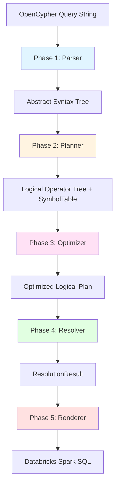

# Architecture Overview

## High-Level Dataflow



## Separation of Concerns (4-Phase Design)

The transpiler strictly separates concerns across phases to ensure correctness and maintainability. This architecture is documented in [CONTRIBUTING.md](contributing.md).

### Design Principle

Each phase has a **single responsibility** and **does not** perform the responsibilities of other phases:

1. **Parser**: Syntax only (what is valid Cypher?)
2. **Planner**: Semantics only (what does it mean logically?)
3. **Resolver**: Validation only (do all references exist?)
4. **Renderer**: Implementation only (how to generate SQL?)

This prevents:
- Parser from needing schema knowledge
- Planner from validating column references
- Renderer from making semantic decisions

---

## Phase 1: Parser (Lexical/Syntactic Analysis)

**Location**: [src/gsql2rsql/parser/](https://github.com/devmessias/gsql2rsql/tree/main/python/src/gsql2rsql/parser/)

### Responsibility
Convert OpenCypher query string to Abstract Syntax Tree (AST). Validates **syntax only** — does NOT validate semantics, resolve references, or access schema.

### Key Components

| File | Purpose | Lines |
|------|---------|-------|
| [`opencypher_parser.py`](https://github.com/devmessias/gsql2rsql/tree/main/python/src/gsql2rsql/parser/opencypher_parser.py) | Main entry point, ANTLR runtime invocation | ~60 |
| [`ast.py`](https://github.com/devmessias/gsql2rsql/tree/main/python/src/gsql2rsql/parser/ast.py) | AST node definitions (50+ node types) | ~1500 |
| [`visitor.py`](https://github.com/devmessias/gsql2rsql/tree/main/python/src/gsql2rsql/parser/visitor.py) | ANTLR visitor pattern implementation | ~800 |
| [`operators.py`](https://github.com/devmessias/gsql2rsql/tree/main/python/src/gsql2rsql/parser/operators.py) | Operator enums (binary, aggregation, functions) | ~300 |
| [`grammar/`](https://github.com/devmessias/gsql2rsql/tree/main/python/src/gsql2rsql/parser/grammar/) | ANTLR-generated parser/lexer | ~8000 |

### Input/Output
- **Input**: OpenCypher query string
- **Output**: `QueryNode` (root AST node)

### Key Classes

```python
# Base AST node
class TreeNode:
    def dump_tree(self, indent: int = 0) -> str
    def evaluate_type(self, symbol_table: SymbolTable) -> DataType

# Expression nodes
class QueryExpression(TreeNode):
    # Base for all expressions (binary, function calls, literals, etc.)

class QueryExpressionBinary(QueryExpression):
    operator: BinaryOperator
    left: QueryExpression
    right: QueryExpression

class QueryExpressionFunction(QueryExpression):
    function: Function
    arguments: list[QueryExpression]

# Entity nodes
class NodeEntity(TreeNode):
    variable: str | None
    labels: list[str]

class RelationshipEntity(TreeNode):
    variable: str | None
    types: list[str]
    direction: Direction  # LEFT, RIGHT, BOTH

# Query structure
class MatchClause(TreeNode):
    pattern: QueryPattern
    optional: bool

class WithClause(TreeNode):
    projections: list[ProjectionItem]
    aggregation: bool

class ReturnClause(TreeNode):
    projections: list[ProjectionItem]
    distinct: bool
    order_by: list[OrderByItem]
    limit: int | None
```

### Example Parsing

**Cypher:**
```cypher
MATCH (p:Person)-[:KNOWS]->(f:Person) WHERE p.age > 30 RETURN p.name
```

**AST Structure (simplified):**
```
QueryNode
└── SingleQueryNode
    ├── MatchClause
    │   └── QueryPattern
    │       ├── NodeEntity(variable="p", labels=["Person"])
    │       ├── RelationshipEntity(types=["KNOWS"], direction=RIGHT)
    │       └── NodeEntity(variable="f", labels=["Person"])
    ├── WhereClause
    │   └── QueryExpressionBinary(
    │         operator=GREATER_THAN,
    │         left=QueryExpressionProperty(entity="p", property="age"),
    │         right=QueryExpressionValue(value=30)
    │       )
    └── ReturnClause
        └── ProjectionItem(
              expression=QueryExpressionProperty(entity="p", property="name"),
              alias="name"
            )
```

---

## Phase 2: Planner (Logical Operator Construction)

**Location**: [src/gsql2rsql/planner/](https://github.com/devmessias/gsql2rsql/tree/main/python/src/gsql2rsql/planner/)

### Responsibility
Convert AST to logical relational algebra. Builds symbol table tracking variable definitions and scopes. Does NOT resolve column references or validate property access.

### Key Components

| File | Purpose | Lines |
|------|---------|-------|
| [`logical_plan.py`](https://github.com/devmessias/gsql2rsql/tree/main/python/src/gsql2rsql/planner/logical_plan.py) | Main orchestrator, AST → operator conversion | ~500 |
| [`operators.py`](https://github.com/devmessias/gsql2rsql/tree/main/python/src/gsql2rsql/planner/operators.py) | Logical operator definitions (11 operator types) | ~1200 |
| [`symbol_table.py`](https://github.com/devmessias/gsql2rsql/tree/main/python/src/gsql2rsql/planner/symbol_table.py) | Variable tracking with nested scopes | ~400 |
| [`path_analyzer.py`](https://github.com/devmessias/gsql2rsql/tree/main/python/src/gsql2rsql/planner/path_analyzer.py) | Variable-length path optimization | ~300 |
| [`schema.py`](https://github.com/devmessias/gsql2rsql/tree/main/python/src/gsql2rsql/planner/schema.py) | Internal schema representation | ~200 |
| [`subquery_optimizer.py`](https://github.com/devmessias/gsql2rsql/tree/main/python/src/gsql2rsql/planner/subquery_optimizer.py) | Conservative subquery flattening | ~400 |

### Input/Output
- **Input**: AST + GraphSchema
- **Output**: LogicalPlan (operator tree + symbol table)

### Logical Operators

```python
# Base class
class LogicalOperator:
    input_operators: list[LogicalOperator]
    output_scope: Schema

    def get_output_scope(self) -> Schema
    def propagate_data_types(self) -> None
    def dump_operator(self) -> str

# Terminal node (data source)
class StartLogicalOperator(LogicalOperator):
    pass

# Table/edge scan
class DataSourceOperator(StartLogicalOperator):
    table_name: str
    entity_schema: EntitySchema
    filters: list[QueryExpression]  # pushable filters

# Join
class JoinOperator(LogicalOperator):
    join_type: JoinType  # INNER, LEFT, RIGHT, FULL
    join_keys: list[JoinKeyPair]  # (left_col, right_col)

# Variable-length path (WITH RECURSIVE)
class RecursiveTraversalOperator(LogicalOperator):
    edge_type: str
    min_depth: int
    max_depth: int
    direction: Direction
    predicates: list[QueryExpression]  # pushable edge filters

# Filters (WHERE)
class SelectionOperator(LogicalOperator):
    predicate: QueryExpression

# Projections (SELECT)
class ProjectionOperator(LogicalOperator):
    projections: list[ProjectionItem]
    aliases: dict[str, str]

# Aggregation boundary (GROUP BY)
class AggregationBoundaryOperator(LogicalOperator):
    group_by_keys: list[str]
    aggregations: list[AggregationExpression]

# UNWIND
class UnwindOperator(LogicalOperator):
    list_expression: QueryExpression
    alias: str

# Set operations
class SetOperator(LogicalOperator):
    set_type: SetOperationType  # UNION, INTERSECT, EXCEPT
    distinct: bool
```

### Operator Graph Example

**Cypher:**
```cypher
MATCH (p:Person)-[:KNOWS]->(f:Person)
WHERE p.age > 30
RETURN p.name, COUNT(*) AS friends
```

**Operator Tree:**
```
ProjectionOperator(projections=[p.name, COUNT(*) AS friends])
└── AggregationBoundaryOperator(group_by=[p])
    └── SelectionOperator(predicate: p.age > 30)
        └── JoinOperator(join_type=INNER, keys=[(source.id, edge.source_id), (sink.id, edge.target_id)])
            ├── DataSourceOperator(table="Person", alias="source")
            ├── DataSourceOperator(table="Knows", alias="edge")
            └── DataSourceOperator(table="Person", alias="sink")
```

---

## Phase 3: Optimizer (Conservative Transformations)

**Location**: [src/gsql2rsql/planner/subquery_optimizer.py](https://github.com/devmessias/gsql2rsql/tree/main/python/src/gsql2rsql/planner/subquery_optimizer.py)

### Responsibility
Apply **conservative** transformations to reduce SQL nesting. Only flattens patterns guaranteed to preserve semantics.

### Optimization Rules

**Safe to Flatten:**
- ✅ Selection → Projection: `WHERE` can be pushed before `SELECT`
- ✅ Selection → Selection: Multiple `WHERE` clauses can be merged

**NEVER Flattened:**
- ❌ Projection → Projection: Aliases must stay in separate subqueries
- ❌ Anything involving aggregation boundaries: Aggregation semantics are fragile

### Configuration
- Enabled by default
- Disable with `--no-optimize` CLI flag

---

## Phase 4: Resolver (Column Reference Validation)

**Location**: [src/gsql2rsql/planner/column_resolver.py](https://github.com/devmessias/gsql2rsql/tree/main/python/src/gsql2rsql/planner/column_resolver.py)

### Responsibility
Validate **ALL** column references before rendering. Query schema for entity properties. Build resolution context for SQL generation.

### Key Components

| File | Purpose |
|------|---------|
| [`column_resolver.py`](https://github.com/devmessias/gsql2rsql/tree/main/python/src/gsql2rsql/planner/column_resolver.py) | Main resolver implementation |
| [`column_ref.py`](https://github.com/devmessias/gsql2rsql/tree/main/python/src/gsql2rsql/planner/column_ref.py) | Resolved reference objects |

### Resolution Process

1. Visit operators in topological order
2. Build symbol table tracking available columns at each operator
3. Resolve all column references in expressions
4. Validate property accesses against entity schemas
5. Create `ResolvedColumnRef` objects with SQL column names

### Key Classes

```python
class ResolvedColumnRef:
    """Resolved reference to a single column."""
    entity_name: str
    property_name: str | None  # None = entire entity
    sql_column_name: str
    data_type: DataType

class ResolvedExpression:
    """Resolved expression with type info."""
    original_expression: QueryExpression
    resolved_columns: list[ResolvedColumnRef]
    data_type: DataType

class ResolutionResult:
    """Complete resolution context."""
    resolved_projections: dict[str, ResolvedProjection]
    resolved_expressions: dict[int, ResolvedExpression]
    column_mappings: dict[str, ResolvedColumnRef]
```

### Error Handling

The resolver provides rich error messages with suggestions:

```
Error: Column 'p.nam' not found in scope
Did you mean: 'p.name'?
Available columns: p.id, p.name, p.age
```

Uses Levenshtein distance for typo suggestions.

---

## Phase 5: Renderer (SQL Generation)

**Location**: [src/gsql2rsql/renderer/sql_renderer.py](https://github.com/devmessias/gsql2rsql/tree/main/python/src/gsql2rsql/renderer/sql_renderer.py)

### Responsibility
Generate Databricks Spark SQL from logical plan using pre-resolved column references. Handle SQL dialect specifics.

### Key Components

| File | Purpose | Lines |
|------|---------|-------|
| [`sql_renderer.py`](https://github.com/devmessias/gsql2rsql/tree/main/python/src/gsql2rsql/renderer/sql_renderer.py) | Main SQL code generator | ~2000 |
| [`schema_provider.py`](https://github.com/devmessias/gsql2rsql/tree/main/python/src/gsql2rsql/renderer/schema_provider.py) | Database schema provider interface | ~200 |

### Input/Output
- **Input**: LogicalPlan + ResolutionResult + GraphSchema
- **Output**: Databricks Spark SQL string

### Rendering by Operator Type

```python
class SQLRenderer:
    def render_plan(self, plan: LogicalPlan) -> str:
        """Main entry point."""

    def _render_data_source(self, op: DataSourceOperator) -> str:
        """Table scan with optional filters."""

    def _render_join(self, op: JoinOperator) -> str:
        """JOIN clause with ON conditions."""

    def _render_selection(self, op: SelectionOperator) -> str:
        """WHERE clause."""

    def _render_projection(self, op: ProjectionOperator) -> str:
        """SELECT with aliases."""

    def _render_aggregation(self, op: AggregationBoundaryOperator) -> str:
        """GROUP BY with HAVING."""

    def _render_recursive(self, op: RecursiveTraversalOperator) -> str:
        """WITH RECURSIVE CTE for variable-length paths."""

    def _render_unwind(self, op: UnwindOperator) -> str:
        """LATERAL VIEW EXPLODE for UNWIND."""

    def _render_set_operator(self, op: SetOperator) -> str:
        """UNION / INTERSECT / EXCEPT."""
```

### Special SQL Patterns

**Variable-Length Paths (WITH RECURSIVE):**
```sql
WITH RECURSIVE paths_1 AS (
    -- Base case: direct edges
    SELECT e.source_id AS start_node, e.target_id AS end_node, 1 AS depth,
           ARRAY(e.source_id, e.target_id) AS path,
           ARRAY(e.source_id) AS visited
    FROM graph.Knows e
    UNION ALL
    -- Recursive case: extend paths
    SELECT p.start_node, e.target_id AS end_node, p.depth + 1 AS depth,
           CONCAT(p.path, ARRAY(e.target_id)) AS path,
           CONCAT(p.visited, ARRAY(e.source_id)) AS visited
    FROM paths_1 p
    JOIN graph.Knows e ON p.end_node = e.source_id
    WHERE p.depth < 5 AND NOT array_contains(p.visited, e.target_id)
)
```

**OPTIONAL MATCH (LEFT JOIN with COALESCE):**
```sql
LEFT JOIN graph.Person AS f ON p.friend_id = f.id
-- Later: COALESCE(f.name, 'Unknown')
```

**Edge Collection (STRUCT for properties):**
```sql
COLLECT(STRUCT(edge.amount AS amount, edge.timestamp AS timestamp)) AS edges
```

---


## Directory Structure

```
src/gsql2rsql/
├── __init__.py                    # Public API exports
├── cli.py                         # CLI with TUI (2200 lines)
├── pyspark_executor.py            # Runtime validation
│
├── parser/                        # Phase 1: Syntax
│   ├── opencypher_parser.py      # Main entry point
│   ├── ast.py                    # AST nodes (50+ types)
│   ├── visitor.py                # ANTLR visitor
│   ├── operators.py              # Operator enums
│   └── grammar/                  # ANTLR-generated
│
├── planner/                       # Phase 2-4: Semantics
│   ├── logical_plan.py           # AST → operators
│   ├── operators.py              # 11 operator types
│   ├── symbol_table.py           # Variable tracking
│   ├── path_analyzer.py          # Path optimization
│   ├── schema.py                 # Internal schema
│   ├── column_resolver.py        # Phase 4: Resolution
│   ├── column_ref.py             # Resolved refs
│   └── subquery_optimizer.py     # Phase 3: Optimization
│
├── renderer/                      # Phase 5: SQL generation
│   ├── sql_renderer.py           # Main codegen (2000 lines)
│   └── schema_provider.py        # Schema interface
│
└── common/                        # Shared infrastructure
    ├── schema.py                 # Graph schema definitions
    ├── exceptions.py             # Rich error types
    ├── logging.py                # Debug logging
    └── utils.py                  # Utilities
```

---

## Key Design Decisions

1. **Why 4-Phase Separation?**
   - **Correctness**: Each phase has clear invariants
   - **Testability**: Each phase can be tested independently
   - **Maintainability**: Changes to one phase don't ripple to others
   - **Debuggability**: Can inspect intermediate representations (AST, operators, resolution)

2. **Why ANTLR?**
   - Industry-standard parser generator
   - Excellent error recovery
   - Visitor pattern for clean AST construction
   - OpenCypher grammar already exists (adapted here)

3. **Why Logical Operators?**
   - Relational algebra is well-understood
   - Easy to reason about correctness
   - Enables optimization passes
   - Clear mapping to SQL constructs

4. **Why Separate Resolution Phase?**
   - Column references can't be validated during planning (schema not fully known)
   - Renderer needs pre-resolved refs to avoid semantic decisions
   - Clear error messages require full context

5. **Why Conservative Optimizer?**
   - Safety over performance (correctness first)
   - User-transparent (can disable with `--no-optimize`)
   - Only proven-safe patterns

---

## Where to Look Next

- [#](#) — Detailed design rationale
- [CONTRIBUTING.md](contributing.md) — Full architectural boundaries
- [contributing.md](contributing.md) — How to extend the transpiler
- [src/gsql2rsql/](https://github.com/devmessias/gsql2rsql/tree/main/python/src/gsql2rsql/) — Source code
