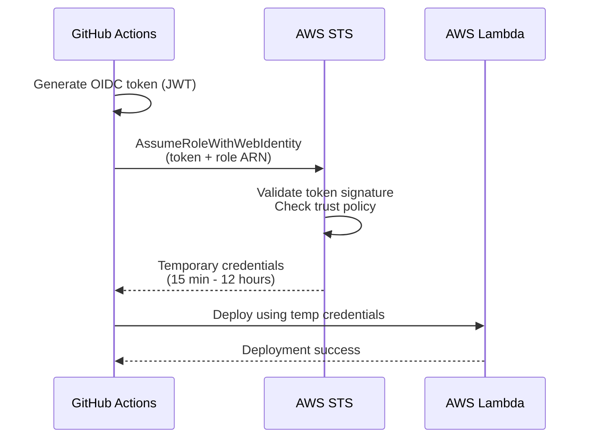

# AWS OIDC Setup for Python SDK Lambda Testing

## Context

The `python-sdk` repository needs to run **real AWS Lambda tests** in CI/CD (GitHub Actions). We want to use **OIDC (OpenID Connect)** for authentication instead of long-lived AWS access keys for better security.

**Current State:**
- OIDC infrastructure already exists in the `deployments` repo (`initial_setup/iam_oidc.tf`)
- Some workflows (e.g., `testing-01-terraform-destroy.yml`) already use OIDC successfully
- Trust policy currently only allows `deployments` repo

**Goal:**
- Extend OIDC trust to include `python-sdk` repo for Lambda testing

---

## OIDC Mental Model

Think of OIDC like a club membership system:

| Component | What It Does |
|-----------|-------------|
| **OIDC Provider** | "GitHub Actions is a valid ID issuer we trust" |
| **Trust Policy** | "Only people with IDs from specific repos can enter" |
| **Permissions Policy** | "Once inside, here's what you can do (deploy Lambdas, etc.)" |
| **GitHub Actions** | Shows ID (OIDC token), gets temporary AWS credentials |

**Key Insight:**
- **Trust Policy** = WHO can assume the role? (which GitHub repos?)
- **Permissions Policy** = WHAT can the role do? (which AWS actions?)

---

## What Already Exists in AWS

### 1. OIDC Provider ✅
```terraform
# Location: deployments/initial_setup/iam_oidc.tf
resource "aws_iam_openid_connect_provider" "github_oidc_provider" {
  url = "https://token.actions.githubusercontent.com"
  client_id_list = ["sts.amazonaws.com"]
}
```

This tells AWS: "Trust GitHub Actions as an identity provider"

### 2. IAM Role ✅
```terraform
# Location: deployments/initial_setup/iam_oidc.tf
resource "aws_iam_role" "github_oidc_role" {
  name = "GitHubActionsOIDCRoleDeployments-testing"
  
  assume_role_policy = jsonencode({
    Statement = [{
      Principal = {
        Federated = "arn:aws:iam::654654498014:oidc-provider/token.actions.githubusercontent.com"
      }
      Action = "sts:AssumeRoleWithWebIdentity"
      Condition = {
        StringLike = {
          "token.actions.githubusercontent.com:sub" = [
            "repo:honeyhiveai/deployments:*"  # Currently only deployments repo
          ]
        }
      }
    }]
  })
}
```

---

## What Needs to Change

### Option A: Extend Existing Role (Simpler, Recommended)

Update the trust policy in `deployments/initial_setup/iam_oidc.tf` to include `python-sdk`:

```terraform
"token.actions.githubusercontent.com:sub" = [
  "repo:honeyhiveai/deployments:*",
  "repo:honeyhiveai/python-sdk:*"  # ADD THIS LINE
]
```

**Pros:**
- Minimal change
- Uses existing infrastructure
- Same permissions as deployments workflows

**Cons:**
- `python-sdk` gets same broad permissions as `deployments` (may be more than needed)

### Option B: Create Separate Role (Better Isolation)

Create a new role `GitHubActionsOIDCRole-PythonSDK` with:
- Trust: Only `python-sdk` repo
- Permissions: Only Lambda/SAM deployment (least privilege)

**Pros:**
- Proper least-privilege separation
- Easier to audit what `python-sdk` can do
- Future-proof if other repos need OIDC

**Cons:**
- More Terraform code
- Need to define Lambda-specific permissions

---

## What Goes in GitHub Actions

### Required Configuration

```yaml
# .github/workflows/lambda-tests.yml
jobs:
  lambda-real-aws-environment:
    runs-on: ubuntu-latest
    
    # Step 1: Enable OIDC token generation
    permissions:
      id-token: write
      contents: read
    
    env:
      AWS_REGION: us-west-2
      AWS_ACCOUNT_ID: '654654498014'
    
    steps:
      - uses: actions/checkout@v4
      
      # Step 2: Assume the OIDC role (NO SECRETS NEEDED!)
      - name: Configure AWS credentials
        uses: aws-actions/configure-aws-credentials@v4
        with:
          role-to-assume: arn:aws:iam::${{ env.AWS_ACCOUNT_ID }}:role/GitHubActionsOIDCRoleDeployments-testing
          aws-region: ${{ env.AWS_REGION }}
      
      # Step 3: Use AWS as normal
      - name: Deploy Lambda
        run: |
          cd tests/lambda
          sam build
          sam deploy --no-confirm-changeset --no-fail-on-empty-changeset
```

**Key Points:**
- `permissions: id-token: write` → Tells GitHub to generate OIDC token
- `role-to-assume` → The IAM role ARN (NOT a secret!)
- `aws-region` → Which AWS region to use
- **NO** `aws-access-key-id` or `aws-secret-access-key` needed!

---

## How OIDC Flow Works



**Benefits Over Long-Lived Keys:**
- ✅ No secrets to rotate
- ✅ Temporary credentials (auto-expire)
- ✅ Fine-grained repo-level trust
- ✅ Audit trail (who assumed what role)
- ✅ No credential leakage risk

---

## Recommendation

**Short-term (This Week):**
- Use **Option A** (extend existing role) to unblock Lambda testing for Friday/Monday release
- One-line Terraform change in `deployments/initial_setup/iam_oidc.tf`
- Apply Terraform to `testing` environment

**Long-term (Next Sprint):**
- Create **Option B** (dedicated `python-sdk` role) with least-privilege Lambda permissions
- Migrate both `python-sdk` and update `hive-kube` workflows to use OIDC consistently
- Document OIDC pattern as org-wide standard

---

## Action Items

### For Infrastructure Team:
1. Update `deployments/initial_setup/iam_oidc.tf`:
   ```terraform
   "token.actions.githubusercontent.com:sub" = [
     "repo:honeyhiveai/deployments:*",
     "repo:honeyhiveai/python-sdk:*"  # ADD THIS
   ]
   ```

2. Apply Terraform change:
   ```bash
   cd deployments/initial_setup
   terraform plan
   terraform apply
   ```

3. Verify role ARN:
   ```bash
   aws iam get-role --role-name GitHubActionsOIDCRoleDeployments-testing
   ```

### For Python SDK Team:
1. Update `.github/workflows/lambda-tests.yml` with OIDC configuration (see example above)
2. Remove any placeholder `AWS_ACCESS_KEY_ID` / `AWS_SECRET_ACCESS_KEY` references
3. Test in `testing` environment first
4. Document in `docs/development/testing/lambda-testing.rst`

---

## Questions?

- **Q: Do we need to configure anything else in GitHub?**
  - A: No! Just `permissions: id-token: write` in the workflow

- **Q: What if the role assumption fails?**
  - A: Check that:
    1. Trust policy includes `python-sdk` repo
    2. Workflow has `permissions: id-token: write`
    3. Role ARN is correct

- **Q: Can we test this without affecting production?**
  - A: Yes! Start with `testing` environment role first

- **Q: What permissions does the role need for Lambda testing?**
  - A: Current `deployments` role has full permissions. For Lambda-specific, need:
    - `lambda:*`
    - `iam:PassRole`
    - `s3:*` (for SAM deployment)
    - `cloudformation:*` (SAM uses CFN)
    - `logs:*` (CloudWatch logs)

---

## References

- [AWS OIDC for GitHub Actions](https://docs.github.com/en/actions/deployment/security-hardening-your-deployments/configuring-openid-connect-in-amazon-web-services)
- [Existing OIDC workflows](file:///Users/josh/src/github.com/honeyhiveai/deployments/.github/workflows/testing-01-terraform-destroy.yml)
- [Current trust policy](file:///Users/josh/src/github.com/honeyhiveai/deployments/initial_setup/iam_oidc.tf)

