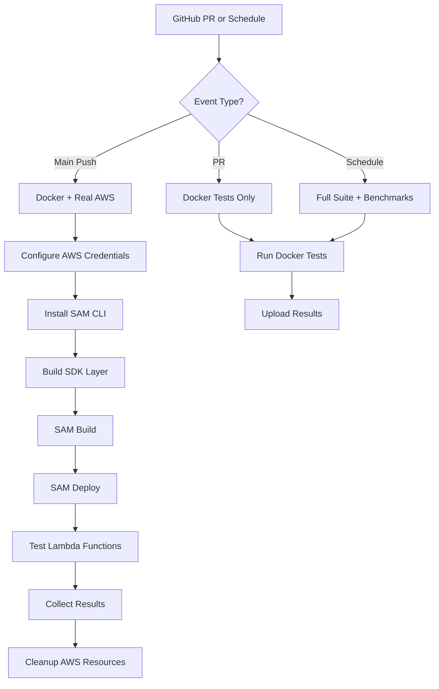

# AWS Lambda Real Deployment - Missing Infrastructure Analysis

**Date:** 2025-11-12  
**Status:** Final piece to complete Lambda testing infrastructure

---

## Current State

### ✅ What We Have (Complete)
1. **Docker-based testing infrastructure**
   - `tests/lambda/Dockerfile.bundle-builder`
   - `tests/lambda/Makefile`
   - `tests/lambda/docker-compose.lambda.yml`
   - Full test suite with performance benchmarking

2. **CI/CD Workflow** (`.github/workflows/lambda-tests.yml`)
   - Lines 121-166: `lambda-real-aws-tests` job ALREADY configured
   - AWS credentials action: `aws-actions/configure-aws-credentials@v4`
   - AWS SAM CLI setup: `aws-actions/setup-sam@v2`
   - Deployment commands ready

3. **Test Functions**
   - `tests/lambda/lambda_functions/working_sdk_test.py`
   - `tests/lambda/lambda_functions/cold_start_test.py`
   - `tests/lambda/lambda_functions/basic_tracing.py`

---

## ❌ What's Missing (Final Piece)

### 1. AWS SAM Deployment Infrastructure

**Referenced but doesn't exist:**
```bash
# From .github/workflows/lambda-tests.yml:147-159
cd tests/lambda/aws-deployment
sam build
sam deploy --no-confirm-changeset --no-fail-on-empty-changeset

# Test deployed Lambda
aws lambda invoke --function-name honeyhive-lambda-test response.json
cat response.json
```

**Directory doesn't exist:**
```bash
tests/lambda/aws-deployment/  # ← MISSING!
```

### 2. Required SAM Files

Need to create in `tests/lambda/aws-deployment/`:

#### `template.yaml` (AWS SAM Template)
```yaml
AWSTemplateFormatVersion: '2010-09-09'
Transform: AWS::Serverless-2016-10-31
Description: HoneyHive SDK Lambda Testing Infrastructure

Parameters:
  HHApiKey:
    Type: String
    Description: HoneyHive API Key
    NoEcho: true
  
  HHProject:
    Type: String
    Description: HoneyHive Project Name
    Default: lambda-ci-test

Resources:
  HoneyHiveLambdaTest:
    Type: AWS::Serverless::Function
    Properties:
      FunctionName: honeyhive-lambda-test
      Runtime: python3.11
      Handler: working_sdk_test.lambda_handler
      CodeUri: ../lambda_functions/
      MemorySize: 512
      Timeout: 30
      Environment:
        Variables:
          HH_API_KEY: !Ref HHApiKey
          HH_PROJECT: !Ref HHProject
          HH_SOURCE: aws-lambda-ci
          HH_TEST_MODE: "false"  # Real API testing
      Layers:
        - !Ref HoneyHiveSDKLayer
  
  HoneyHiveSDKLayer:
    Type: AWS::Serverless::LayerVersion
    Properties:
      LayerName: honeyhive-sdk-layer
      Description: HoneyHive SDK and dependencies
      ContentUri: ./layer/
      CompatibleRuntimes:
        - python3.11
        - python3.12
        - python3.13
      RetentionPolicy: Delete

  ColdStartTestFunction:
    Type: AWS::Serverless::Function
    Properties:
      FunctionName: honeyhive-cold-start-test
      Runtime: python3.11
      Handler: cold_start_test.lambda_handler
      CodeUri: ../lambda_functions/
      MemorySize: 256
      Timeout: 30
      Environment:
        Variables:
          HH_API_KEY: !Ref HHApiKey
          HH_PROJECT: !Ref HHProject
          HH_SOURCE: aws-lambda-ci-cold-start
      Layers:
        - !Ref HoneyHiveSDKLayer

Outputs:
  HoneyHiveLambdaTestArn:
    Description: ARN of the test Lambda function
    Value: !GetAtt HoneyHiveLambdaTest.Arn
  
  ColdStartTestArn:
    Description: ARN of the cold start test Lambda function
    Value: !GetAtt ColdStartTestFunction.Arn
```

#### `samconfig.toml` (SAM Configuration)
```toml
version = 0.1

[default.global.parameters]
stack_name = "honeyhive-lambda-test-stack"

[default.build.parameters]
cached = true
parallel = true

[default.deploy.parameters]
capabilities = "CAPABILITY_IAM"
confirm_changeset = false
resolve_s3 = true
region = "us-east-1"
parameter_overrides = "HHProject=lambda-ci-test"

[default.package.parameters]
resolve_s3 = true

[default.sync.parameters]
watch = true

[default.local_start_api.parameters]
warm_containers = "EAGER"

[default.local_start_lambda.parameters]
warm_containers = "EAGER"
```

#### `build-layer.sh` (Build SDK Layer)
```bash
#!/bin/bash
set -e

echo "🏗️  Building HoneyHive SDK Lambda Layer..."

# Create layer directory
mkdir -p layer/python

# Install HoneyHive SDK and dependencies
pip install ../../../ -t layer/python/
pip install openinference-instrumentation-openai -t layer/python/

# Remove unnecessary files to reduce layer size
find layer/python -type d -name "__pycache__" -exec rm -rf {} + 2>/dev/null || true
find layer/python -type d -name "tests" -exec rm -rf {} + 2>/dev/null || true
find layer/python -type d -name "*.dist-info" -exec rm -rf {} + 2>/dev/null || true

echo "✅ Layer built successfully"
du -sh layer/
```

#### `deploy.sh` (Deployment Script)
```bash
#!/bin/bash
set -e

echo "🚀 Deploying HoneyHive Lambda Test Infrastructure..."

# Check for required environment variables
if [ -z "$HH_API_KEY" ]; then
    echo "❌ HH_API_KEY not set"
    exit 1
fi

# Build the SDK layer
./build-layer.sh

# Build SAM application
sam build --parallel

# Deploy to AWS
sam deploy \
    --no-confirm-changeset \
    --no-fail-on-empty-changeset \
    --parameter-overrides "HHApiKey=$HH_API_KEY HHProject=${HH_PROJECT:-lambda-ci-test}"

echo "✅ Deployment complete"
```

#### `test-deployed-lambda.sh` (Test Script)
```bash
#!/bin/bash
set -e

echo "🧪 Testing deployed Lambda functions..."

# Test main function
echo "Testing honeyhive-lambda-test..."
aws lambda invoke \
    --function-name honeyhive-lambda-test \
    --payload '{"test_type": "ci_validation", "data": {"message": "CI test"}}' \
    response-main.json

cat response-main.json
echo ""

if grep -q '"statusCode": 200' response-main.json; then
    echo "✅ Main function test passed"
else
    echo "❌ Main function test failed"
    exit 1
fi

# Test cold start function
echo "Testing honeyhive-cold-start-test..."
for i in {1..3}; do
    echo "Invocation $i..."
    aws lambda invoke \
        --function-name honeyhive-cold-start-test \
        --payload "{\"test_type\": \"cold_start\", \"iteration\": $i}" \
        response-cold-$i.json
    
    cat response-cold-$i.json
    echo ""
    
    # Brief pause between invocations
    sleep 2
done

echo "✅ All Lambda tests passed"
```

#### `cleanup.sh` (Cleanup Script)
```bash
#!/bin/bash
set -e

echo "🧹 Cleaning up Lambda test infrastructure..."

# Delete SAM stack
sam delete --no-prompts

# Clean local build artifacts
rm -rf .aws-sam/
rm -rf layer/
rm -f response*.json

echo "✅ Cleanup complete"
```

---

## GitHub Secrets Configuration

### Required Secrets (Need to add to GitHub repo)

Navigate to: `https://github.com/honeyhiveai/python-sdk/settings/secrets/actions`

**Add these secrets:**

1. **AWS_ACCESS_KEY_ID**
   - Description: AWS IAM access key for Lambda deployment
   - Permissions needed: Lambda, IAM, CloudFormation, S3
   - Value: From AWS IAM user credentials

2. **AWS_SECRET_ACCESS_KEY**
   - Description: AWS IAM secret key for Lambda deployment
   - Value: Corresponding secret key for access key

3. **HH_API_KEY** (if not already exists)
   - Description: HoneyHive API key for production testing
   - Value: HoneyHive production API key

4. **HH_PROJECT** (if not already exists)
   - Description: HoneyHive project name for testing
   - Value: `lambda-ci-test` or appropriate project name

---

## IAM Permissions Required

### AWS IAM Policy for CI/CD User

```json
{
  "Version": "2012-10-17",
  "Statement": [
    {
      "Effect": "Allow",
      "Action": [
        "lambda:CreateFunction",
        "lambda:DeleteFunction",
        "lambda:UpdateFunctionCode",
        "lambda:UpdateFunctionConfiguration",
        "lambda:InvokeFunction",
        "lambda:GetFunction",
        "lambda:ListFunctions",
        "lambda:PublishLayerVersion",
        "lambda:DeleteLayerVersion"
      ],
      "Resource": "arn:aws:lambda:us-east-1:*:function:honeyhive-*"
    },
    {
      "Effect": "Allow",
      "Action": [
        "iam:CreateRole",
        "iam:DeleteRole",
        "iam:GetRole",
        "iam:PassRole",
        "iam:AttachRolePolicy",
        "iam:DetachRolePolicy",
        "iam:DeleteRolePolicy",
        "iam:PutRolePolicy"
      ],
      "Resource": "arn:aws:iam::*:role/honeyhive-*"
    },
    {
      "Effect": "Allow",
      "Action": [
        "cloudformation:CreateStack",
        "cloudformation:DeleteStack",
        "cloudformation:UpdateStack",
        "cloudformation:DescribeStacks",
        "cloudformation:DescribeStackEvents",
        "cloudformation:GetTemplate"
      ],
      "Resource": "arn:aws:cloudformation:us-east-1:*:stack/honeyhive-*"
    },
    {
      "Effect": "Allow",
      "Action": [
        "s3:CreateBucket",
        "s3:DeleteBucket",
        "s3:PutObject",
        "s3:GetObject",
        "s3:DeleteObject",
        "s3:ListBucket"
      ],
      "Resource": "arn:aws:s3:::aws-sam-cli-managed-*"
    }
  ]
}
```

---

## Implementation Checklist

### Phase 1: Create SAM Infrastructure
- [ ] Create `tests/lambda/aws-deployment/` directory
- [ ] Create `template.yaml` (SAM template)
- [ ] Create `samconfig.toml` (SAM configuration)
- [ ] Create `build-layer.sh` (build SDK layer)
- [ ] Create `deploy.sh` (deployment automation)
- [ ] Create `test-deployed-lambda.sh` (test script)
- [ ] Create `cleanup.sh` (cleanup automation)
- [ ] Create `README.md` (deployment documentation)

### Phase 2: AWS Setup
- [ ] Create AWS IAM user for CI/CD
- [ ] Attach IAM policy with Lambda/CloudFormation permissions
- [ ] Generate access key and secret key
- [ ] Test manual deployment locally

### Phase 3: GitHub Secrets
- [ ] Add `AWS_ACCESS_KEY_ID` to GitHub secrets
- [ ] Add `AWS_SECRET_ACCESS_KEY` to GitHub secrets
- [ ] Verify `HH_API_KEY` exists
- [ ] Verify `HH_PROJECT` exists

### Phase 4: Testing
- [ ] Test manual SAM deployment
- [ ] Test Lambda invocation
- [ ] Test cleanup script
- [ ] Trigger CI/CD workflow
- [ ] Verify real Lambda tests pass
- [ ] Monitor CloudWatch logs

---

## Directory Structure (Target)

```
tests/lambda/
├── aws-deployment/              # ← TO CREATE
│   ├── template.yaml           # SAM template
│   ├── samconfig.toml          # SAM config
│   ├── build-layer.sh          # Build SDK layer
│   ├── deploy.sh               # Deploy script
│   ├── test-deployed-lambda.sh # Test script
│   ├── cleanup.sh              # Cleanup script
│   └── README.md               # Documentation
├── lambda_functions/           # ← EXISTS
│   ├── working_sdk_test.py
│   ├── cold_start_test.py
│   └── basic_tracing.py
├── Dockerfile.bundle-builder   # ← EXISTS
├── Makefile                    # ← EXISTS
└── test_lambda_*.py            # ← EXISTS
```

---

## Workflow Execution Flow



---

## Cost Estimation

**AWS Lambda Testing Costs (Monthly):**
- Lambda invocations: ~1,000/month × $0.20/1M = $0.0002
- Lambda duration: ~10 seconds/invocation × $0.0000166667/GB-second = $0.17
- CloudWatch Logs: ~1 GB/month = $0.50
- S3 Storage (SAM artifacts): ~100 MB = $0.002

**Total: ~$0.67/month**

**With daily scheduled runs:** ~$20/month

---

## Next Steps

1. **Create SAM infrastructure files**
2. **Setup AWS IAM user with proper permissions**
3. **Configure GitHub secrets**
4. **Test manual deployment**
5. **Trigger CI/CD workflow**
6. **Monitor and validate**

---

## Success Criteria

✅ SAM templates deploy successfully  
✅ Lambda functions execute without errors  
✅ Performance metrics meet targets (<500ms cold start)  
✅ CI/CD workflow passes real AWS tests  
✅ Cleanup properly removes all resources  
✅ Zero manual intervention required for deployments  

