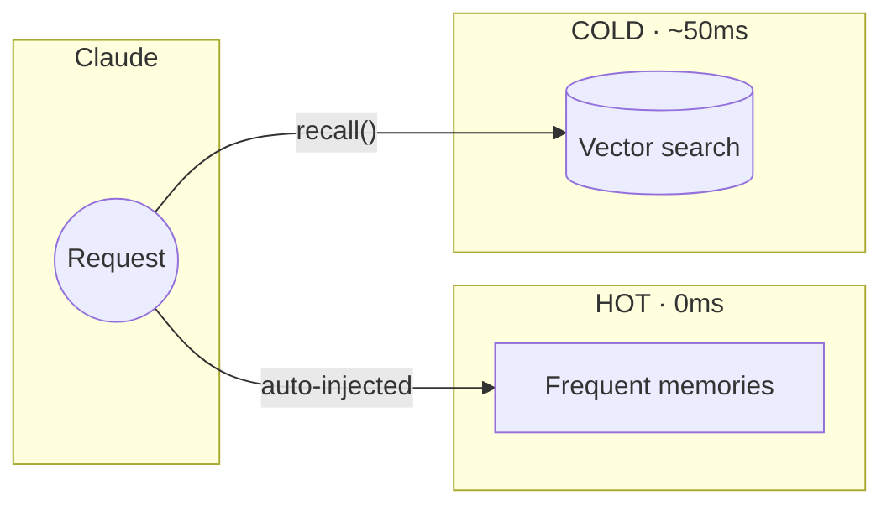

<!-- mcp-name: io.github.michael-denyer/hot-memory-mcp -->
<div align="center">

# Memory MCP

**Persistent memory for Claude Code**

[](LICENSE)
[](https://www.python.org/downloads/)
[](https://modelcontextprotocol.io)
[](https://claude.ai/code)
[](#development)
[](https://pypi.org/project/hot-memory-mcp/)

</div>

---

## Why

Every new chat starts from scratch. You explain your architecture *again*. You paste the same patterns *again*.

Memory MCP fixes this with two tiers:

1. **Hot cache (0ms)** — Frequently-used knowledge auto-injected before Claude thinks. No tool call.
2. **Cold storage (~50ms)** — Everything else, searchable by meaning.

The system learns what you use and promotes it automatically.

## Install

```bash
# Install package
uv tool install hot-memory-mcp   # or: pip install hot-memory-mcp

# Add plugin (recommended)
claude plugins add michael-denyer/memory-mcp
```

The plugin gives you auto-configured hooks, slash commands, and the Memory Analyst agent.

<details>
<summary>Manual config (no plugin)</summary>

Add to `~/.claude.json`:

```json
{
  "mcpServers": {
    "memory": {
      "command": "memory-mcp"
    }
  }
}
```
</details>

## How It Works



| Tier | Latency | Behavior |
|------|---------|----------|
| **Hot Cache** | 0ms | Auto-injected every request |
| **Cold Storage** | ~50ms | Semantic search on demand |

Memories used 3+ times auto-promote. Unused memories demote after 14 days.

## Features

- **Instant recall** — Hot cache bypasses tool calls entirely
- **Self-organizing** — Learns what you use, promotes automatically
- **Project-aware** — Memories auto-tagged by git repo
- **Knowledge graph** — Link related concepts, multi-hop recall
- **Pattern mining** — Learns from Claude's outputs
- **Trust scoring** — Outdated info decays and sinks
- **Local & private** — SQLite, no cloud, works offline
- **Apple Silicon** — MLX auto-detected on M-series Macs

## Quick Reference

### Slash Commands (with plugin)

| Command | Description |
|---------|-------------|
| `/memory-mcp:remember` | Store a memory |
| `/memory-mcp:recall` | Search memories |
| `/memory-mcp:hot-cache` | Manage hot cache |
| `/memory-mcp:stats` | Show statistics |
| `/memory-mcp:bootstrap` | Seed from project docs |

### Core Tools

```
remember(content, type, tags)  → Store
recall(query)                  → Search
promote(id) / demote(id)       → Hot cache
link_memories(from, to, type)  → Knowledge graph
```

### CLI

```bash
memory-mcp-cli bootstrap    # Seed from project docs
memory-mcp-cli status       # Show stats
memory-mcp-cli dashboard    # Web UI at :8765
memory-mcp-cli consolidate  # Merge duplicates
```

## Documentation

| Document | Description |
|----------|-------------|
| [Reference](docs/REFERENCE.md) | Full API, configuration, MCP resources |
| [Troubleshooting](docs/TROUBLESHOOTING.md) | Common issues and solutions |

## Development

```bash
git clone https://github.com/michael-denyer/memory-mcp.git
cd memory-mcp && uv sync
uv run pytest -v  # 654 tests
```

| Requirement | Value |
|-------------|-------|
| Python | 3.10+ |
| First run | ~60s (model download) |
| Startup | 2-5s |

## License

MIT
