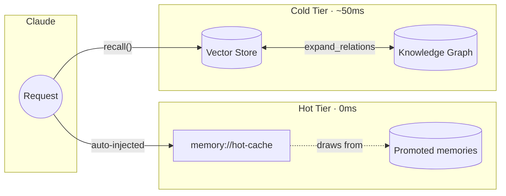

# Memory MCP - Project Instructions

## Core Value Proposition

**The Engram Insight**: Frequently-used patterns should be instantly available, not searched for.

This project differentiates from generic memory servers (like mcp-memory-service) through:

1. **Two-Tier Memory Architecture**
   - **Hot Cache**: Session-aware context injected at 0ms (no tool call needed)
   - **Cold Storage**: Semantic search for everything else

2. **Salience-Based Promotion**
   - Unified salience score: importance + trust + access count + recency
   - Auto-promote when salience ≥ 0.5 AND access count ≥ 3
   - Auto-demote after 14 days without access
   - Pin important memories to prevent auto-eviction

3. **Hot Cache Resource**
   - `memory://hot-cache`: Session-aware active context (~10 items)
   - Combines: recently recalled, predicted next, top promoted items
   - Backed by promoted memories (~20 items)

4. **Multi-Hop Recall**
   - `expand_relations=true` traverses knowledge graph
   - Finds associated memories via typed relationships
   - Score decay prevents dilution of results

5. **Episodic Memory**
   - Session-bound short-term context (7-day retention)
   - `end_session()` promotes top memories to long-term storage
   - Consolidates session context automatically

6. **Pattern Mining from Usage**
   - Extracts imports, commands, project facts from Claude's outputs
   - Frequency-based promotion candidates
   - Human approval before promotion (auto-approve for high-confidence)

7. **Knowledge Graph**
   - Link related memories with typed relationships
   - Relation types: `relates_to`, `depends_on`, `contradicts`, `supersedes`, `refines`, `elaborates`

8. **Trust Management**
   - Strengthen/weaken memory confidence with contextual reasons
   - Per-memory-type trust decay rates
   - Audit trail for trust changes

9. **Memory Consolidation**
   - `consolidate` CLI merges semantically similar memories
   - Reduces redundancy while preserving information

## Architecture



## Key Files

| Path | Purpose |
|------|---------|
| `.claude-plugin/` | Claude Code plugin (hooks, commands, agents) |
| `src/memory_mcp/server/` | MCP server package (tools, resources) |
| `src/memory_mcp/storage/` | Storage package (SQLite, vectors, hot cache) |
| `src/memory_mcp/mining.py` | Pattern extraction |
| `src/memory_mcp/cli.py` | CLI commands |
| `src/memory_mcp/config.py` | Settings and bootstrap file detection |

## Plugin-First Approach

The Claude Code plugin (`.claude-plugin/`) is the primary distribution:

- **Slash commands** (`/memory-mcp:*`) - 14 commands in `.claude-plugin/commands/`
- **Hooks** - SessionStart (bootstrap), Stop (log response), PreCompact (memory analyst)
- **Agents** - Memory Analyst for pre-compaction knowledge extraction

Users install via `claude plugins add michael-denyer/memory-mcp`.
The CLI (`memory-mcp-cli`) and MCP tools power the plugin internally.

## Key Features by Version

### v0.5.x (Current Architecture)
- **Internal refactoring**: Split large modules into focused packages
  - `storage/` with 16 mixin modules (CRUD, search, hot cache, trust, etc.)
  - `server/` with 12 tool modules organized by domain
  - No API changes - all imports remain backwards compatible

### v0.7.0 (Current)
- **Renamed resources for clarity**: `working-set` → `hot-cache`, `hot-cache` → `promoted-memories`
- **Hot cache is primary injection**: Session-aware context (~10 items) auto-injected
- **Promoted memories backing store**: ~20 items, disabled by default

### v0.3.0
- **Salience Scoring**: Unified metric for promotion/eviction decisions
- **Multi-Hop Recall**: `expand_relations` parameter for associative memory
- **Hot Cache Resource**: `memory://hot-cache` for session-aware context
- **Episodic Memory**: `end_session()` for session consolidation
- **Consolidation CLI**: `consolidate` command for memory deduplication
- **Fine-Grained Trust**: Contextual reasons and audit trail

### v0.2.x
- **Bootstrap**: `bootstrap_project` tool and `bootstrap` CLI command
- **Knowledge Graph**: `link_memories`, `unlink_memories`, `get_related_memories`
- **Trust Management**: `strengthen_trust`, `weaken_trust`
- **Session Tracking**: `get_or_create_session`, `get_session_memories`
- **Pin/Unpin**: `pin_memory`, `unpin_memory`

## CLI Entrypoints

Two separate entrypoints exist - don't confuse them:

```bash
# MCP server (stdio transport) - used by Claude Code
memory-mcp

# CLI tools (dashboard, bootstrap, consolidate, etc.)
memory-mcp-cli dashboard --port 8050
memory-mcp-cli bootstrap
memory-mcp-cli consolidate
```

## Testing

```bash
uv run pytest -v              # All tests
uv run pytest -k hot          # Hot cache tests only
uv run pytest -k bootstrap    # Bootstrap tests
uv run pytest -k relationship # Knowledge graph tests
uv run ruff check .           # Lint
uv run ruff format .          # Format
```

## Design Principles

### Zero-Config by Default

**The system must work out of the box with no configuration.** This is non-negotiable.

- All defaults should be optimized for immediate value
- `auto_promote=True`, `auto_demote=True`, `mining_auto_approve_enabled=True`
- Auto-detect hardware (MLX on Apple Silicon)
- Auto-bootstrap from project docs when promoted memories is empty
- Configuration exists for power users, not as a requirement

### When Working on This Project

- The hot cache is the differentiator - keep it simple and automatic
- Avoid adding features that don't serve the two-tier memory model
- If a feature requires manual user action, question whether it's worth it
- New features must have sensible defaults that "just work"
- Test with real Claude Code usage, not just unit tests

### Gotchas

- **vec0 doesn't support INSERT OR REPLACE**: Always DELETE before INSERT for vector operations
- **Two CLI entrypoints**: `memory-mcp` (server) vs `memory-mcp-cli` (tools) - don't confuse them
