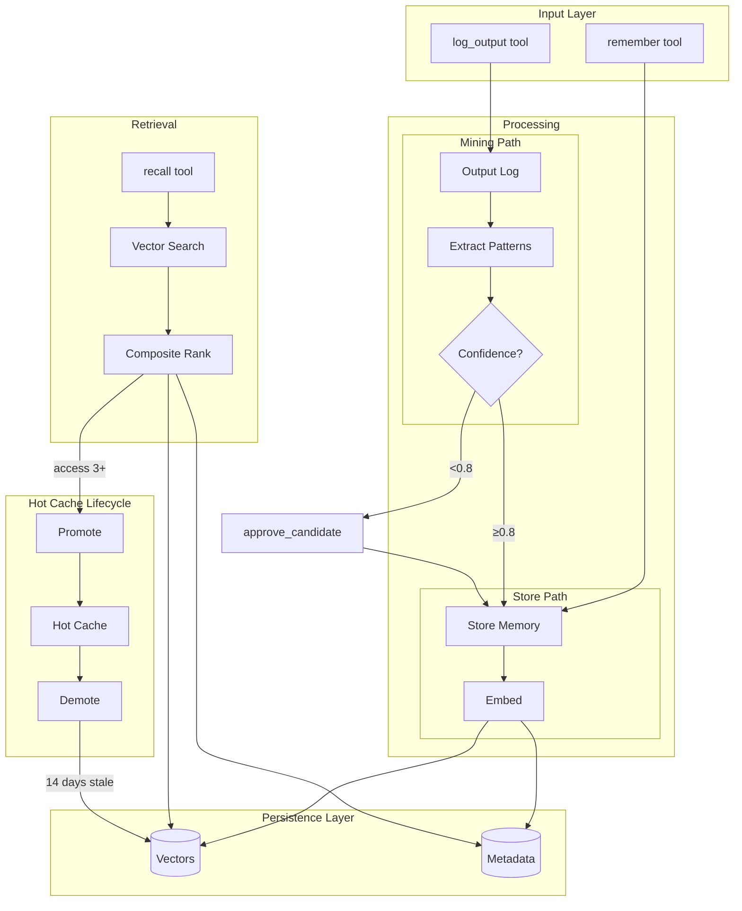
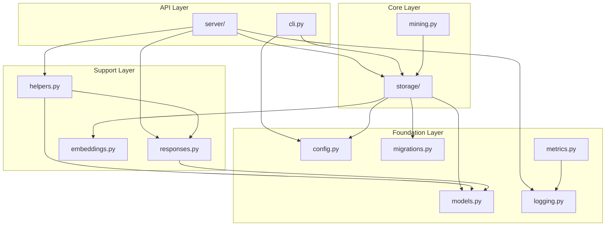

# Memory MCP Architecture

This document describes the design decisions, architecture patterns, and rationale behind Memory MCP.

## Core Design Principle

**The Engram Insight**: Frequently-used patterns should be instantly available, not searched for every time.

This principle drives every architectural decision. We optimize for the common case where a small set of project knowledge is accessed repeatedly.

## Two-Tier Memory Architecture

```
┌─────────────────────────────────────────────────────────────┐
│                      Claude / LLM                            │
└─────────────────────────────────────────────────────────────┘
        │                                    │
        ▼ (auto-injected)                    ▼ (tool call)
┌───────────────────┐              ┌────────────────────────┐
│    Hot Cache      │              │    Cold Storage        │
│  MCP Resource     │              │    Vector Database     │
│                   │              │                        │
│  - 20 items max   │◄────────────►│  - Unlimited capacity  │
│  - Instant recall │  promotion   │  - Semantic search     │
│  - Pinnable       │  / demotion  │  - ~50ms lookup        │
└───────────────────┘              └────────────────────────┘
        ▲                                    ▲
        │                                    │
        └──────────── Mining Pipeline ───────┘
```

### Why Two Tiers?

| Problem | Solution |
|---------|----------|
| Tool calls add latency | Hot cache injected via MCP resource (0ms) |
| Large context wastes tokens | Only 20 high-value items in hot cache |
| Manual memory management is tedious | Automatic promotion/demotion based on access |

### Hot Cache

- **Implementation**: MCP resource at `memory://hot-cache`
- **Capacity**: 20 items (configurable via `HOT_CACHE_MAX_ITEMS`)
- **Eviction**: LRU with composite scoring (access count + recency)
- **Pinning**: Items can be pinned to prevent eviction

**Scoring Formula**:
```
hot_score = (access_weight × access_count) + (recency_weight × recency_boost)
recency_boost = 0.5^(days_since_access / halflife_days)
```

### Cold Storage

- **Implementation**: SQLite with sqlite-vec extension
- **Vector Dimension**: 384 (all-MiniLM-L6-v2 default)
- **Search**: Cosine similarity with composite ranking

**Ranking Formula**:
```
composite_score = (similarity_weight × similarity) +
                  (recency_weight × recency_score) +
                  (access_weight × normalized_access)
```

## Data Flow



## Module Structure

```
src/memory_mcp/
├── server/             # MCP server package
│   ├── __init__.py     # Exports main(), mcp app
│   ├── app.py          # FastMCP setup, resources, lifespan
│   └── tools/          # Tool implementations by domain
│       ├── cold_storage.py   # remember, recall, forget, list
│       ├── hot_cache.py      # promote, demote, pin, unpin
│       ├── mining.py         # log_output, run_mining, review
│       ├── seeding.py        # seed_from_text, bootstrap_project
│       ├── trust.py          # validate_memory, invalidate_memory
│       ├── relationships.py  # link/unlink_memories, get_related
│       ├── contradictions.py # find/mark/resolve contradictions
│       ├── sessions.py       # session lifecycle tools
│       ├── maintenance.py    # db_maintenance, cleanup, info
│       ├── predictions.py    # access_patterns, predict_next
│       ├── retrieval.py      # mark_memory_used, quality stats
│       └── consolidation.py  # preview/run consolidation
├── storage/            # Storage package
│   ├── __init__.py     # Exports Storage class
│   ├── core.py         # Storage class, transactions, schema
│   ├── memory_crud.py  # store_memory, delete_memory, get_memory
│   ├── search.py       # recall, vector search, scoring
│   ├── hot_cache.py    # promote, demote, eviction logic
│   ├── trust.py        # adjust_trust, get_trust_history
│   ├── relationships.py # link_memories, knowledge graph
│   ├── contradictions.py # find/resolve contradictions
│   ├── sessions.py     # session lifecycle, episodic memory
│   ├── mining_store.py # pattern storage operations
│   ├── consolidation.py # memory merging logic
│   ├── retrieval.py    # RAG quality tracking
│   ├── maintenance.py  # cleanup, rebuild, vacuum
│   ├── audit.py        # audit history logging
│   ├── seeding.py      # bootstrap, seed operations
│   ├── output_logging.py # output log for mining
│   └── salience.py     # salience score computation
├── mining.py           # Pattern extraction algorithms
├── config.py           # Settings with environment variable loading
├── cli.py              # CLI commands for hooks and administration
├── embeddings.py       # Embedding providers (sentence-transformers, MLX)
├── responses.py        # Pydantic response models for MCP tools
├── models.py           # Enums and dataclasses (domain models)
├── migrations.py       # Database schema and version migrations
├── helpers.py          # Helper functions for tools
├── text_parsing.py     # Content chunking for seeding
├── logging.py          # Structured logging configuration
└── metrics.py          # Metrics collection and observability
```

### Module Dependencies



### Layer Responsibilities

| Module | Responsibility |
|--------|----------------|
| `server/` | MCP tools/resources, request validation, response construction |
| `storage/` | Data persistence, vector operations, business logic |
| `responses.py` | Pydantic models for tool return types |
| `models.py` | Domain enums (MemoryType, TrustReason) and dataclasses (Memory, Session) |
| `migrations.py` | Database schema definition and version migrations |
| `mining.py` | Pattern extraction algorithms |
| `embeddings.py` | Embedding abstraction (MLX on Apple Silicon, else ST) |
| `logging.py` | Loguru configuration, stderr output for MCP compatibility |
| `metrics.py` | Counters, gauges, and metric recording helpers |

### Why This Structure?

1. **Single responsibility**: Each mixin handles one domain (trust, search, hot cache, etc.)
2. **Thin server layer**: Tool modules adapt storage operations to MCP protocol
3. **Swappable embeddings**: Backend detection allows hardware optimization
4. **Backwards-compatible imports**: Package `__init__.py` re-exports preserve existing import paths

## Key Design Decisions

### 1. SQLite + sqlite-vec Over Vector Databases

**Chose**: SQLite with sqlite-vec extension

**Alternatives considered**: Pinecone, Weaviate, Milvus, Chroma

**Rationale**:
- **Local-first**: No network dependency, instant startup
- **Simplicity**: Single file database, easy backup/restore
- **Scale**: Handles thousands of memories efficiently
- **Portability**: Works everywhere Python works

**Trade-off**: Limited to single-user, single-machine scenarios

### 2. Sentence Transformers for Embeddings

**Chose**: all-MiniLM-L6-v2 (384 dimensions)

**Alternatives considered**: OpenAI embeddings, larger BERT models

**Rationale**:
- **Local**: No API calls, no costs, offline capable
- **Fast**: ~50ms per embedding on CPU
- **Small**: 90MB model, 384 dimensions
- **Quality**: Good semantic similarity for short text

**Trade-off**: Less powerful than larger models, but sufficient for memory retrieval

### 3. Automatic Promotion/Demotion

**Chose**: Frequency-based with configurable thresholds

**Design**:
- Promote after 3 accesses (configurable)
- Demote after 14 days without access (configurable)
- Evict lowest-scored when cache full

**Rationale**: Reduces manual intervention while ensuring hot cache reflects actual usage

### 4. Pattern Mining Pipeline

**Chose**: Regex-based extraction with occurrence counting

**Extracted patterns**:
- Python imports
- Shell commands (npm, git, docker, etc.)
- Project facts ("This project uses X")
- Code blocks from markdown

**Auto-approval**: Patterns with confidence ≥ 0.8 and occurrences ≥ 3 are automatically promoted

**Rationale**: Low overhead, high precision for common patterns

### 5. Trust Score System

**Chose**: Decay-based trust with explicit validation/invalidation

**Design**:
- Manual memories start at 1.0 trust
- Mined memories start at 0.7 trust
- Trust decays over time (type-specific half-lives)
- Explicit validation/invalidation adjusts trust

**Rationale**: Older information naturally becomes less reliable; explicit feedback accelerates correction

### 6. Knowledge Graph

**Chose**: Simple typed relationships stored in SQLite

**Relation types**:
- `relates_to`: General association
- `depends_on`: Prerequisite
- `supersedes`: Replaces older info
- `refines`: More specific version
- `contradicts`: Conflicting information
- `elaborates`: More detail

**Rationale**: Enables context expansion during recall without complex graph database

### 7. Predictive Hot Cache

**Chose**: Markov chain of access sequences

**Design**:
- Record (memory_A, memory_B) when accessed together
- Build transition probabilities
- Pre-warm cache with predicted next memories after each recall

**Rationale**: Learns actual usage patterns without explicit configuration

## Configuration Philosophy

**Principle**: Maximum value with minimal configuration

Default settings are optimized for immediate value:
- Predictive cache: Enabled by default
- Auto-approve mining: Enabled with conservative thresholds
- Auto-promote/demote: Enabled

Power users can tune via environment variables, but sensible defaults mean most users never need to.

## Error Handling Strategy

1. **Graceful degradation**: If embedding fails, memory still stored without vector
2. **Idempotent operations**: Duplicate stores merge tags and increment access
3. **Audit logging**: Destructive operations logged for recovery
4. **No silent failures**: Errors returned in response, not swallowed

## Performance Characteristics

| Operation | Typical Latency | Notes |
|-----------|-----------------|-------|
| Hot cache read | 0ms | Auto-injected by MCP |
| remember() | 50-100ms | Embedding dominates |
| recall() | 50-150ms | Vector search + ranking |
| Mining (24h) | 1-5s | Depends on log volume |
| Bootstrap | 2-10s | Depends on file count |

## Future Considerations

### Considered but Deferred

1. **Multi-user support**: Would require auth, permissions, conflict resolution
2. **Distributed storage**: Current single-file model sufficient for local use
3. **Custom embedding models**: Current model adequate; adding complexity not justified
4. **LLM-based extraction**: Regex patterns sufficient; LLM adds latency and cost

### Potential Enhancements

1. **Semantic deduplication**: Merge near-duplicate memories automatically
2. **Memory aging**: Archive very old, unused memories
3. **Cross-project sharing**: Share patterns across projects
4. **Embedding model migration**: Tools to rebuild vectors when changing models

## References

- [Engram](https://github.com/AnswerDotAI/engram) - Inspiration for hot cache concept
- [sqlite-vec](https://github.com/asg017/sqlite-vec) - Vector search extension
- [FastMCP](https://github.com/jlowin/fastmcp) - MCP server framework
- [sentence-transformers](https://www.sbert.net/) - Embedding models
