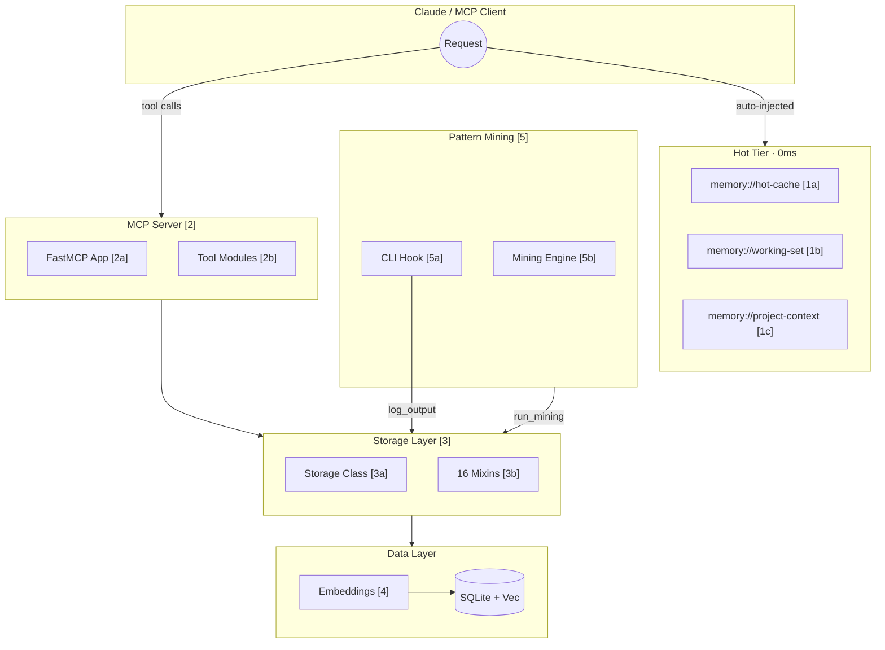
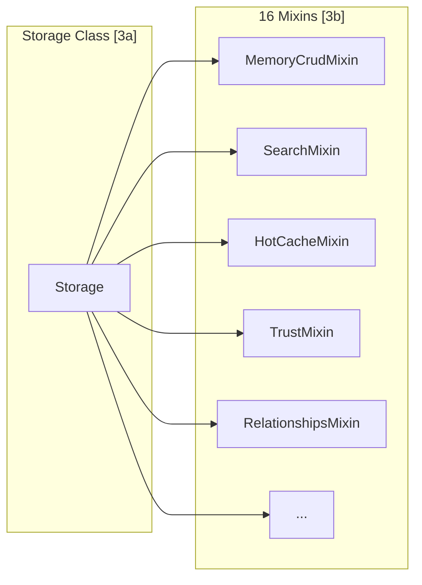
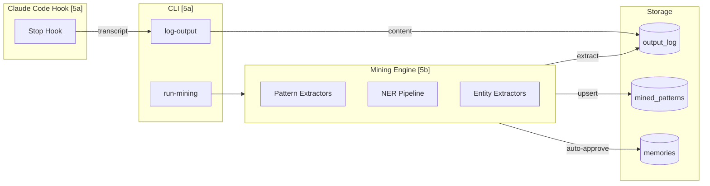
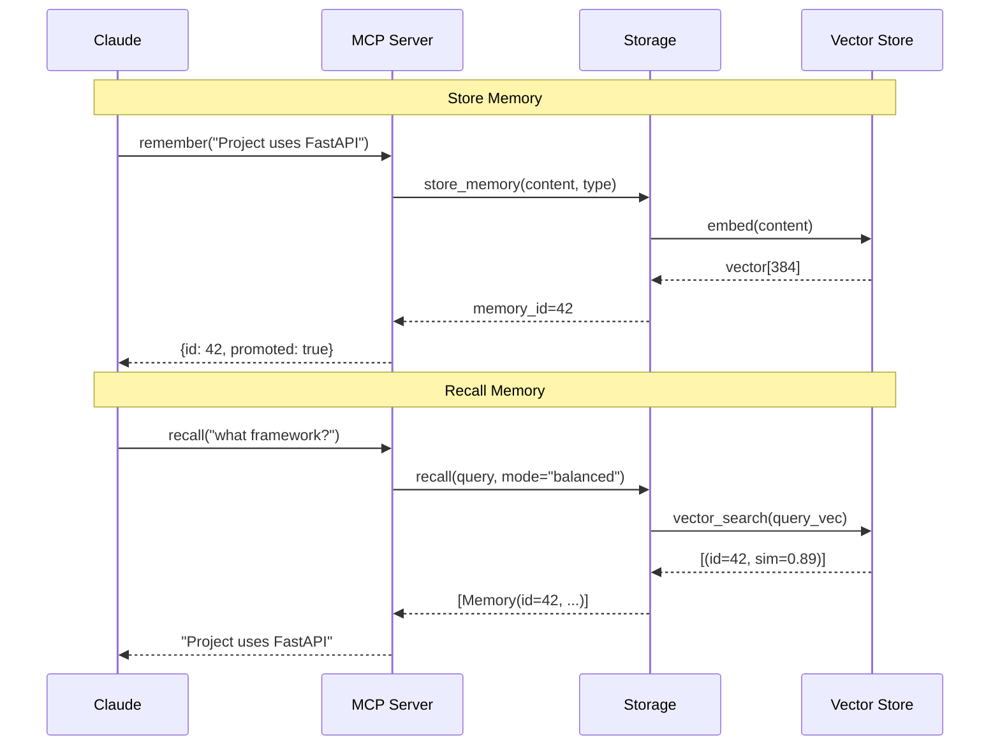
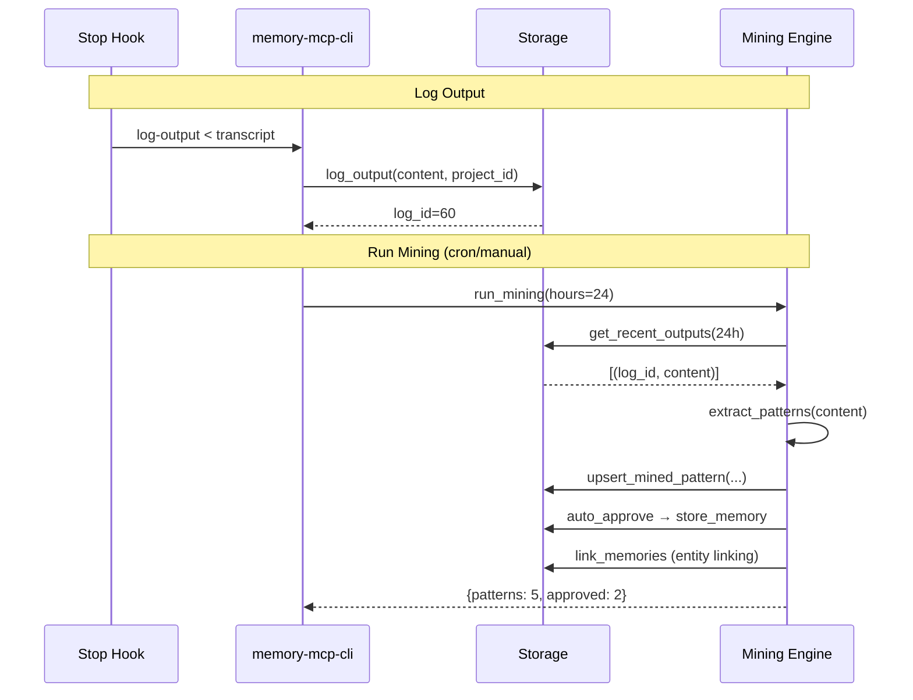
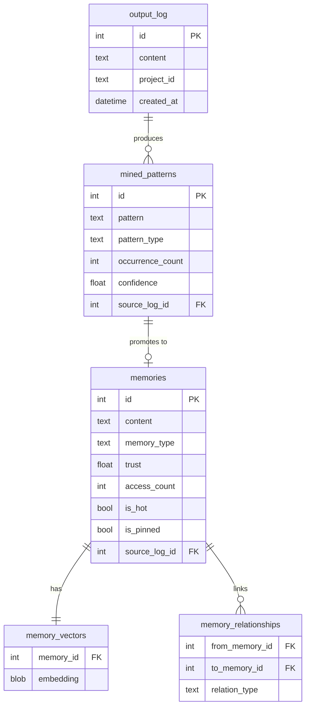

# Memory MCP Code Map

Visual architecture guide with bidirectional links to source code.

## System Overview

## Code References

### [1] Hot Tier Resources (Auto-Injected)

Resources are automatically injected into every Claude context - no tool call needed.

| ID | Resource | Description | File:Line |
|----|----------|-------------|-----------|
| 1a | `memory://hot-cache` | Top salience memories (~20 items) | [server/app.py:244](src/memory_mcp/server/app.py#L244) |
| 1b | `memory://working-set` | Session-aware active context (~10 items) | [server/app.py:293](src/memory_mcp/server/app.py#L293) |
| 1c | `memory://project-context` | Project-specific context | [server/app.py:347](src/memory_mcp/server/app.py#L347) |

### [2] MCP Server

| ID | Component | Description | File:Line |
|----|-----------|-------------|-----------|
| 2a | FastMCP App | Server initialization, shared state | [server/app.py:46](src/memory_mcp/server/app.py#L46) |
| 2b | Tool Modules | 12 modules with 50+ tools | [server/tools/](src/memory_mcp/server/tools/) |

#### Tool Modules [2b]

| Module | Tools | File |
|--------|-------|------|
| cold_storage | `remember`, `recall`, `recall_with_fallback`, `recall_by_tag`, `forget`, `list_memories`, `memory_stats` | [cold_storage.py](src/memory_mcp/server/tools/cold_storage.py) |
| hot_cache | `hot_cache_status`, `promote`, `demote`, `pin`, `unpin`, `metrics_status` | [hot_cache.py](src/memory_mcp/server/tools/hot_cache.py) |
| retrieval | `mark_memory_used`, `retrieval_quality_stats` | [retrieval.py](src/memory_mcp/server/tools/retrieval.py) |
| relationships | `link_memories`, `unlink_memories`, `get_related_memories`, `relationship_stats` | [relationships.py](src/memory_mcp/server/tools/relationships.py) |
| trust | `validate_memory`, `invalidate_memory`, `get_trust_history` | [trust.py](src/memory_mcp/server/tools/trust.py) |
| contradictions | `find_contradictions`, `get_contradictions`, `mark_contradiction`, `resolve_contradiction` | [contradictions.py](src/memory_mcp/server/tools/contradictions.py) |
| sessions | `get_sessions`, `get_session`, `get_session_memories`, `cross_session_patterns`, `set_session_topic`, `end_session` | [sessions.py](src/memory_mcp/server/tools/sessions.py) |
| mining | `log_output`, `mining_status`, `review_candidates`, `approve_candidate`, `reject_candidate`, `run_mining` | [mining.py](src/memory_mcp/server/tools/mining.py) |
| seeding | `seed_from_text`, `seed_from_file`, `bootstrap_project` | [seeding.py](src/memory_mcp/server/tools/seeding.py) |
| predictions | `access_patterns`, `predict_next`, `warm_cache`, `predictive_cache_status` | [predictions.py](src/memory_mcp/server/tools/predictions.py) |
| maintenance | `db_maintenance`, `run_cleanup`, `validate_embeddings`, `db_info`, `embedding_info`, `audit_history`, `db_rebuild_vectors` | [maintenance.py](src/memory_mcp/server/tools/maintenance.py) |
| consolidation | `preview_consolidation`, `run_consolidation` | [consolidation.py](src/memory_mcp/server/tools/consolidation.py) |

### [3] Storage Layer

| ID | Component | Description | File:Line |
|----|-----------|-------------|-----------|
| 3a | Storage | Main class composing all mixins | [storage/core.py:46](src/memory_mcp/storage/core.py#L46) |
| 3b | Mixins | 16 focused mixin modules | [storage/](src/memory_mcp/storage/) |

#### Storage Mixins [3b]

| Mixin | Purpose | File:Line |
|-------|---------|-----------|
| MemoryCrudMixin | Create, read, update, delete memories | [memory_crud.py:28](src/memory_mcp/storage/memory_crud.py#L28) |
| SearchMixin | Vector search and recall | [search.py:27](src/memory_mcp/storage/search.py#L27) |
| HotCacheMixin | Hot cache promotion/demotion | [hot_cache.py:22](src/memory_mcp/storage/hot_cache.py#L22) |
| TrustMixin | Trust scoring and history | [trust.py:19](src/memory_mcp/storage/trust.py#L19) |
| RelationshipsMixin | Knowledge graph links | [relationships.py:24](src/memory_mcp/storage/relationships.py#L24) |
| ContradictionsMixin | Contradiction detection | [contradictions.py:22](src/memory_mcp/storage/contradictions.py#L22) |
| SessionsMixin | Session management | [sessions.py:18](src/memory_mcp/storage/sessions.py#L18) |
| ConsolidationMixin | Memory deduplication | [consolidation.py:19](src/memory_mcp/storage/consolidation.py#L19) |
| MaintenanceMixin | DB maintenance | [maintenance.py:19](src/memory_mcp/storage/maintenance.py#L19) |
| AuditMixin | Audit logging | [audit.py:17](src/memory_mcp/storage/audit.py#L17) |
| MiningStoreMixin | Mined pattern storage | [mining_store.py:20](src/memory_mcp/storage/mining_store.py#L20) |
| PredictionsMixin | Predictive caching | [predictions.py:17](src/memory_mcp/storage/predictions.py#L17) |
| RetrievalMixin | Usage tracking | [retrieval.py:18](src/memory_mcp/storage/retrieval.py#L18) |
| BootstrapMixin | Project bootstrapping | [bootstrap.py:18](src/memory_mcp/storage/bootstrap.py#L18) |
| OutputLoggingMixin | Output log storage | [output_logging.py:16](src/memory_mcp/storage/output_logging.py#L16) |
| InjectionTrackingMixin | Resource injection tracking | [injection_tracking.py:35](src/memory_mcp/storage/injection_tracking.py#L35) |

### [4] Embeddings

| Component | Description | File:Line |
|-----------|-------------|-----------|
| EmbeddingEngine | Vector generation with caching | [embeddings.py:1](src/memory_mcp/embeddings.py#L1) |
| MLX Provider | Apple Silicon acceleration | [embeddings.py](src/memory_mcp/embeddings.py) |
| SentenceTransformers | Cross-platform fallback | [embeddings.py](src/memory_mcp/embeddings.py) |

### [5] Pattern Mining

| ID | Component | Description | File:Line |
|----|-----------|-------------|-----------|
| 5a | CLI Commands | `log-output`, `run-mining` | [cli.py:37](src/memory_mcp/cli.py#L37) |
| 5a | Stop Hook | Shell hook for logging | [hooks/memory-log-response.sh](hooks/memory-log-response.sh) |
| 5b | Pattern Extractors | 15 extractors for imports, commands, facts, etc. | [mining.py:986](src/memory_mcp/mining.py#L986) |
| 5b | Entity Extractors | Tech + Decision entity extraction | [mining.py:766](src/memory_mcp/mining.py#L766) |
| 5b | run_mining() | Main mining orchestration | [mining.py:870](src/memory_mcp/mining.py#L870) |

#### Pattern Extractors [5b]

| Extractor | Pattern Type | File:Line |
|-----------|--------------|-----------|
| extract_imports | Python/JS imports | [mining.py:175](src/memory_mcp/mining.py#L175) |
| extract_facts | Project facts | [mining.py:238](src/memory_mcp/mining.py#L238) |
| extract_commands | CLI commands | [mining.py:310](src/memory_mcp/mining.py#L310) |
| extract_code_patterns | Code snippets | [mining.py:387](src/memory_mcp/mining.py#L387) |
| extract_code_blocks | Fenced code | [mining.py:436](src/memory_mcp/mining.py#L436) |
| extract_decisions | Architecture decisions | [mining.py:477](src/memory_mcp/mining.py#L477) |
| extract_architecture | System architecture | [mining.py:543](src/memory_mcp/mining.py#L543) |
| extract_tech_stack | Technology mentions | [mining.py:612](src/memory_mcp/mining.py#L612) |
| extract_explanations | Why explanations | [mining.py:651](src/memory_mcp/mining.py#L651) |
| extract_config | Config patterns | [mining.py:689](src/memory_mcp/mining.py#L689) |
| extract_dependencies | Package deps | [mining.py:711](src/memory_mcp/mining.py#L711) |
| extract_api_endpoints | REST endpoints | [mining.py:733](src/memory_mcp/mining.py#L733) |
| extract_tech_entities | Tech entities (KG linking) | [mining.py:766](src/memory_mcp/mining.py#L766) |
| extract_decision_entities | Decision entities (KG linking) | [mining.py:887](src/memory_mcp/mining.py#L887) |
| extract_entities_ner | NER entities | [mining.py:148](src/memory_mcp/mining.py#L148) |

## Data Flow: Remember → Recall

## Data Flow: Pattern Mining

## Key Configuration

| Setting | Default | Description | File:Line |
|---------|---------|-------------|-----------|
| `hot_cache_max_items` | 20 | Max hot cache size | [config.py](src/memory_mcp/config.py) |
| `auto_promote` | true | Auto-promote on recall | [config.py](src/memory_mcp/config.py) |
| `auto_demote` | true | Auto-demote stale items | [config.py](src/memory_mcp/config.py) |
| `demotion_days` | 14 | Days before demotion | [config.py](src/memory_mcp/config.py) |
| `mining_auto_approve_enabled` | true | Auto-approve patterns | [config.py](src/memory_mcp/config.py) |
| `mining_auto_approve_confidence` | 0.8 | Min confidence for auto | [config.py](src/memory_mcp/config.py) |

## Database Schema (Simplified)

## Quick Navigation

| Area | Entry Point |
|------|-------------|
| Server startup | [server/__init__.py](src/memory_mcp/server/__init__.py) |
| All tools | [server/tools/__init__.py](src/memory_mcp/server/tools/__init__.py) |
| Storage class | [storage/core.py:46](src/memory_mcp/storage/core.py#L46) |
| CLI commands | [cli.py](src/memory_mcp/cli.py) |
| Configuration | [config.py](src/memory_mcp/config.py) |
| Models | [models.py](src/memory_mcp/models.py) |
| Migrations | [migrations.py](src/memory_mcp/migrations.py) |
