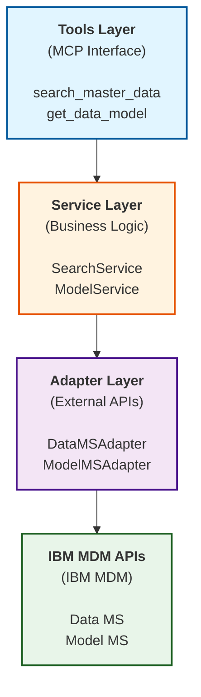

<!--
This file has been modified with the assistance of IBM Bob (AI Code Assistant)
-->

# IBM MDM MCP Server

[](https://opensource.org/licenses/Apache-2.0)
[](https://www.python.org/downloads/)
[](https://modelcontextprotocol.io)

A [Model Context Protocol (MCP)](https://modelcontextprotocol.io) server that provides AI assistants with seamless access to IBM Master Data Management (MDM) services through standardized REST API interactions.

## 🎯 Overview

This MCP server enables AI assistants like Claude to interact with IBM MDM services(formarly known as IBM Match 360), allowing users to search records, retrieve data models, and manage master data through natural language conversations. The server acts as a bridge between AI assistants and IBM MDM, exposing enterprise data management capabilities through the Model Context Protocol.

### Key Features

- 🔌 **MCP Protocol Support** - Standard interface for AI assistant integration
- 🌐 **Multi-Platform** - Supports IBM MDM SaaS on IBM Cloud and IBM MDM on Software Hub
- 🔐 **Secure Authentication** - Token-based authentication with automatic caching
- 🛠️ **Flexible Tool Modes** - Minimal or full tool exposure based on use case
- 📊 **Type-Safe** - Built with Pydantic models for robust data validation
- 🏗️ **Clean Architecture** - Layered design with adapter pattern for maintainability

## 📋 Table of Contents

- [Prerequisites](#prerequisites)
- [Installation](#installation)
  - [Option 1: Install from PyPI (Recommended)](#option-1-install-from-pypi-recommended)
  - [Option 2: Quick Start with Setup Wizard](#option-2-quick-start-with-setup-wizard)
  - [Option 3: Manual Installation](#option-3-manual-installation)
- [Configuration](#configuration)
- [Usage](#usage)
- [Integration with Claude Desktop](#integration-with-claude-desktop)
- [Running the Server](#running-the-server)
- [Available Tools](#available-tools)
- [Sample Queries](#sample-queries)
- [Testing](#testing)
- [Architecture](#architecture)
- [Troubleshooting](#troubleshooting)
- [Contributing](#contributing)
- [Publishing to PyPI](#publishing-to-pypi)
- [License](#license)

---

## Prerequisites

Before you begin, ensure you have:

- **Python 3.10+** - [Download here](https://www.python.org/downloads/)
- **Git** - [Installation guide](https://git-scm.com/)
- **IBM MDM Instance** - Access to IBM MDM SaaS (IBM Cloud) or IBM MDM on Software Hub with credentials ready
- **Claude Desktop** (Optional) - [Download here](https://claude.ai/download) if you want AI assistant integration

> 📖 **Need help getting started?** See the detailed [Setup Guide](docs/SETUP_GUIDE.md) for step-by-step instructions on installing prerequisites and obtaining IBM MDM credentials.

> 🔐 **Security Note (IBM Cloud only):** Generate a dedicated API key specifically for this MCP server - do not reuse existing API keys from other applications.

---

## Installation

Choose the installation method that best fits your needs:

### Option 1: Install from PyPI (Recommended)

The easiest way to install the IBM MDM MCP Server is via PyPI:

```bash
pip install ibm-mdm-mcp-server
```

After installation, you can run the server directly:

```bash
ibm_mdm_mcp_server
```

> **Note:** You'll still need to configure your credentials. See the [Configuration](#configuration) section below.

### Option 2: Quick Start with Setup Wizard

For development or customization, clone the repository and use the automated setup:

```bash
# Clone the repository
git clone https://github.com/IBM/mdm-mcp-server.git
cd mdm-mcp-server

# Run the setup wizard
python setup_wizard.py
```

The setup wizard will guide you through:
- Virtual environment creation and dependency installation
- Platform selection (IBM Cloud or Software Hub)
- Credential configuration
- Tool mode selection (minimal or full)
- Setup mode selection (Claude Desktop or HTTP)

**Setup Options:**
```bash
python setup_wizard.py              # Interactive setup (recommended)
python setup_wizard.py --claude     # Claude Desktop integration only
python setup_wizard.py --http       # HTTP mode only (for MCP Inspector)
```

📖 **For detailed setup instructions**, see the [Setup Guide](docs/SETUP_GUIDE.md)

### Option 3: Manual Installation

For advanced users or custom deployments, see the [Manual Installation Guide](docs/MANUAL_INSTALLATION.md).

---

## Configuration

After installation, configure your IBM MDM credentials:

### Using Environment Variables

Create a `.env` file in your working directory or set environment variables:

**For IBM MDM SaaS on IBM Cloud:**
```env
M360_TARGET_PLATFORM=cloud
API_CLOUD_BASE_URL=<your_mdm_base_url>
API_CLOUD_AUTH_URL=https://iam.cloud.ibm.com/identity/token
API_CLOUD_API_KEY=<your_api_key>
API_CLOUD_CRN=<your_instance_crn>
MCP_TOOLS_MODE=minimal
```

**For IBM MDM on Software Hub:**
```env
M360_TARGET_PLATFORM=cpd
API_CPD_BASE_URL=<your_cpd_base_url>
API_CPD_AUTH_URL=<your_cpd_auth_url>
API_USERNAME=<your_username>
API_PASSWORD=<your_password>
MCP_TOOLS_MODE=minimal
```

**Tool Mode Options:**
- `minimal` (default): Essential tools (`search_master_data`, `get_data_model`)
- `full`: All tools including `get_record`, `get_entity`, `get_records_entities_by_record_id`

---

## Usage

### Command Line

Run the server directly from the command line:

```bash
# Start in HTTP mode (default)
ibm_mdm_mcp_server

# Start on a custom port
ibm_mdm_mcp_server --port 3000

# Start in STDIO mode (for MCP clients)
ibm_mdm_mcp_server --mode stdio
```

### With Claude Desktop

**Quick Setup:**

Edit your Claude Desktop config file and add:

```json
{
  "mcpServers": {
    "ibm-mdm": {
      "command": "uvx",
      "args": ["ibm_mdm_mcp_server", "--mode", "stdio"],
      "env": {
        "M360_TARGET_PLATFORM": "cloud",
        "API_CLOUD_BASE_URL": "https://api.ca-tor.dai.cloud.ibm.com/mdm/v1/",
        "API_CLOUD_AUTH_URL": "https://iam.cloud.ibm.com/identity/token",
        "API_CLOUD_API_KEY": "<your_api_key>",
        "API_CLOUD_CRN": "<your_crn>",
        "MCP_TOOLS_MODE": "minimal"
      }
    }
  }
}
```

📖 **For comprehensive Claude Desktop setup** including uvx, source installation, HTTP mode, and troubleshooting, see the [Claude Desktop Setup Guide](docs/CLAUDE_DESKTOP_SETUP.md).

### Testing with MCP Inspector

```bash
# Start the server
ibm_mdm_mcp_server

# In another terminal, run the inspector
npx @modelcontextprotocol/inspector
```

---

## Integration with Claude Desktop

The IBM MDM MCP Server integrates seamlessly with Claude Desktop, enabling natural language interactions with your IBM MDM data.

### Setup Methods

Choose the method that best fits your needs:

1. **PyPI Package** (Recommended) - Simple `pip install` and configure
2. **uvx** (Easiest) - No installation needed, automatic updates
3. **Source Code** - For development and customization
4. **HTTP Mode** - For debugging and advanced use cases

📖 **Complete setup instructions for all methods**: [Claude Desktop Setup Guide](docs/CLAUDE_DESKTOP_SETUP.md)

### Quick Verification

After setup, ask Claude:
```
"What IBM MDM tools are available?"
```

You should see the configured tools listed.

## Running the Server

The server supports two operational modes: HTTP (for testing/development) and STDIO (for Claude Desktop integration).

### Quick Start

**Using PyPI installation:**
```bash
ibm_mdm_mcp_server              # Start in HTTP mode
ibm_mdm_mcp_server --port 3000  # Custom port
```

**From source:**
```bash
python src/server.py            # Start in HTTP mode
python src/server.py --port 3000  # Custom port
```

### Testing with MCP Inspector

```bash
# Start server
ibm_mdm_mcp_server

# In another terminal
npx @modelcontextprotocol/inspector
```

📖 **For detailed server operations, configuration, and troubleshooting**, see the [Running Server Guide](docs/RUNNING_SERVER.md).

## Available Tools

### Minimal Mode (Default)

Essential tools for common MDM operations:

| Tool | Description |
|------|-------------|
| `search_master_data` | Search for master data (records, entities, relationships, hierarchy nodes) in IBM MDM with flexible query parameters |
| `get_data_model` | Retrieve the complete MDM data model schema |

### Full Mode

All available tools including advanced operations:

| Tool | Description |
|------|-------------|
| `search_master_data` | Search for master data with advanced filtering |
| `get_data_model` | Retrieve data model schema |
| `get_record` | Retrieve a specific record by ID |
| `get_entity` | Retrieve an entity by ID |
| `get_records_entities_by_record_id` | Get all entities associated with a record |

Enable full mode by setting `MCP_TOOLS_MODE=full` in your environment configuration.

---

## Sample Queries

Want to see what you can do with this MCP server? Check out our comprehensive [Sample Queries Guide](docs/SAMPLES.md) which includes:

- 📊 **Report Templates** - Ready-to-use templates for dashboards and visualizations
- 🔄 **Common Usage Patterns** - Real-world scenarios with concrete examples
- 🎯 **Query Examples** - From basic searches to complex nested queries
- 📈 **Analytics Queries** - Distribution analysis, comparisons, and data quality reports
- 💡 **Best Practices** - Tips to prevent hallucination and ensure accurate results

**Quick Examples:**
```
"What entity types and searchable fields are available in my MDM system?"
"Find customer records where status equals active and region equals northeast"
"Create a regional distribution dashboard for customer records"
"Generate a data quality dashboard showing duplicates and missing data"
```

See the [full samples documentation](docs/SAMPLES.md) for detailed examples and templates.

## Testing

The project uses pytest with comprehensive test coverage.

### Quick Test Commands

**Run all tests:**
```bash
pytest tests/
```

**Run with coverage:**
```bash
pytest tests/ --cov=src --cov-report=term-missing
```

**Generate HTML coverage report:**
```bash
pytest tests/ --cov=src --cov-report=html
```

📖 **For detailed testing instructions, code quality checks, and CI/CD setup**, see the [Testing Guide](docs/TESTING.md).

## Architecture

This project implements a **clean 3-tier layered architecture** inspired by hexagonal architecture principles. For detailed architecture documentation, see [ARCHITECTURE.md](docs/ARCHITECTURE.md).



### Project Structure

```
src/
├── server.py                      # MCP server entry point
├── config.py                      # Configuration management
├── data_ms/                       # Data microservice
│   ├── search/                    # Search functionality
│   ├── records/                   # Record operations
│   └── entities/                  # Entity operations
├── model_ms/                      # Model microservice
│   └── model/                     # Data model operations
└── common/                        # Shared utilities
    ├── auth/                      # Authentication
    │   └── authentication_manager.py
    ├── core/                      # Core components
    │   ├── base_adapter.py        # Base adapter for HTTP
    │   └── base_service.py        # Base service class
    └── domain/                    # Domain models
```

### Key Design Patterns

- **Layered Architecture**: Clear separation between presentation, business logic, and infrastructure
- **Adapter Pattern**: Isolates external API communication with platform-specific implementations
- **Template Method**: Consistent service implementation patterns via base classes
- **Strategy Pattern**: Platform-specific authentication strategies (IBM Cloud vs Software Hub)
- **Dependency Injection**: Services receive adapter instances for flexibility and testability

**Hexagonal Architecture Inspiration**: While not a pure hexagonal implementation, the architecture draws from hexagonal principles by using adapters to isolate external dependencies and maintaining clear boundaries between layers.

## Troubleshooting

Having issues? Check our comprehensive troubleshooting guide:

📖 **[Troubleshooting Guide](docs/TROUBLESHOOTING.md)** - Complete solutions for:
- Installation and configuration issues
- Claude Desktop integration problems
- Server runtime errors
- Authentication failures
- Network connectivity issues
- Testing problems

**Quick Fixes:**
- **Server won't start:** Check Python version (3.10+) and environment variables
- **Tools don't appear in Claude:** Verify config file location and restart Claude Desktop
- **Authentication errors:** Validate credentials and test connectivity

For detailed solutions and step-by-step guides, see the [full troubleshooting documentation](docs/TROUBLESHOOTING.md).

## Contributing

### Development Setup

1. Fork the repository
2. Create a feature branch: `git checkout -b feature/your-feature`
3. Make your changes and add tests
4. Run tests: `pytest tests/`
5. Commit your changes: `git commit -m "Add your feature"`
6. Push to your fork: `git push origin feature/your-feature`
7. Submit a pull request

---

## Publishing to PyPI

For maintainers who need to publish new versions to PyPI, see the [PyPI Publishing Guide](docs/PYPI_PUBLISHING_GUIDE.md).

## License

This project is licensed under the Apache License 2.0 - see the [LICENSE](LICENSE) file for details.

## Support

For issues, questions, or contributions:

- **Issues**: [GitHub Issues](https://github.com/IBM/mdm-mcp-server/issues)
- **Documentation**: [Architecture Guide](docs/ARCHITECTURE.md)
- **IBM MDM Documentation**: [IBM Master Data Management](https://www.ibm.com/products/master-data-management)

## References

- [Model Context Protocol Documentation](https://modelcontextprotocol.io)
- [MCP Python SDK](https://github.com/modelcontextprotocol/python-sdk)
- [IBM Master Data Management](https://www.ibm.com/products/master-data-management)
- [FastMCP Framework](https://gofastmcp.com)

## Acknowledgments

Built with:
- [FastMCP](https://gofastmcp.com) - Fast MCP server framework
- [Pydantic](https://pydantic.dev) - Data validation
- [httpx](https://www.python-httpx.org) - HTTP client

---

**Made with ❤️ by IBM**