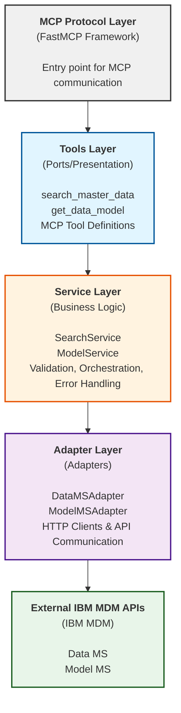
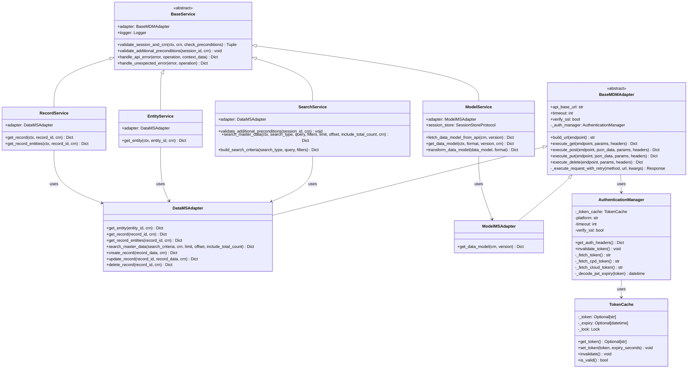
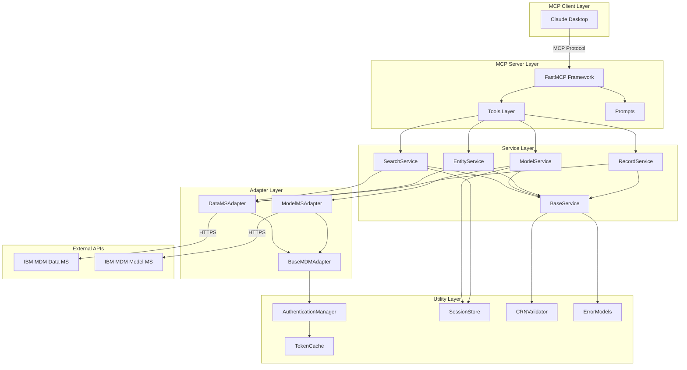
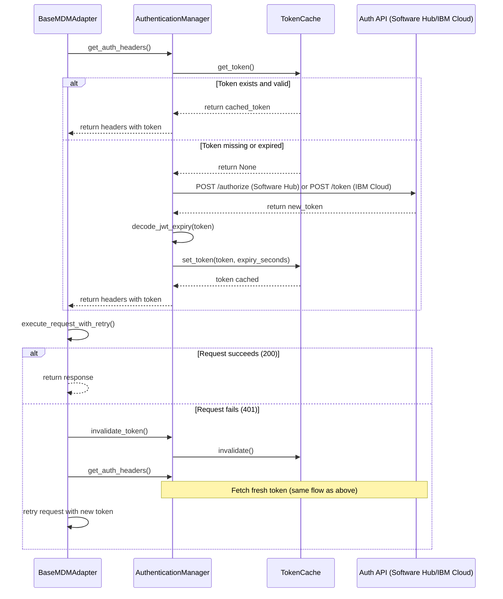
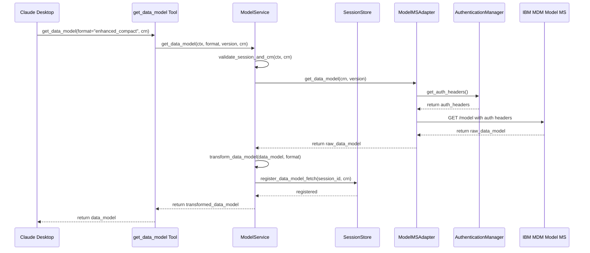
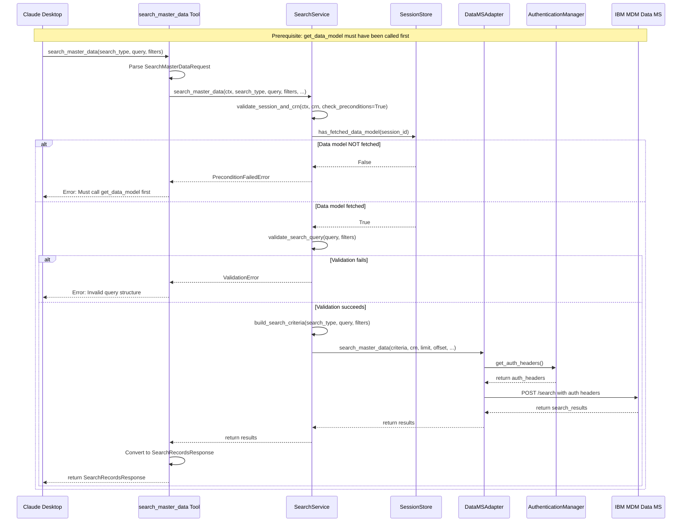

<!--
This file has been modified with the assistance of IBM Bob (AI Code Assistant)
-->

# MDM MCP Server Architecture

## Table of Contents
1. [Overview](#overview)
2. [Architectural Patterns](#architectural-patterns)
3. [System Components](#system-components)
4. [Architecture Diagrams](#architecture-diagrams)
5. [Authentication Flow](#authentication-flow)
6. [Request Flow](#request-flow)
7. [Data Models](#data-models)
8. [Error Handling](#error-handling)
9. [Testing Strategy](#testing-strategy)
10. [Deployment Modes](#deployment-modes)

---

## Overview

The MDM MCP Server is a Model Context Protocol (MCP) server that provides AI assistants with tools to interact with IBM Master Data Management (IBM MDM, formarly known as IBM Match 360)services. It implements a **clean 3-tier layered architecture** with the **Adapter pattern**, drawing inspiration from hexagonal architecture principles for maintainability, testability, and extensibility.

### Key Characteristics
- **Protocol**: Model Context Protocol (MCP) via FastMCP framework
- **Language**: Python 3.8+
- **Architecture**: 3-tier layered architecture with adapter pattern
- **Platforms**: Supports IBM MDM SaaS on IBM Cloud and IBM MDM on Software Hub
- **Transport**: HTTP (streamable) and STDIO modes

---

## Architectural Patterns

### 1. Layered Architecture with Adapter Pattern

The system is organized into three distinct layers with clear boundaries:



**Architecture Benefits**:
- **Clear Separation of Concerns**: Each layer has a single, well-defined responsibility
- **Testability**: Layers can be tested independently with mocked dependencies
- **Maintainability**: Changes in one layer have minimal impact on others
- **Flexibility**: Adapter pattern allows swapping HTTP implementations

**Hexagonal Architecture Inspiration**:

While this is a layered architecture rather than pure hexagonal architecture, it draws inspiration from hexagonal principles:

**What we have (hexagonal-inspired)**:
- Adapter pattern isolates external API dependencies
- Service layer contains business logic separate from infrastructure
- Dependency injection for flexibility
- Clear boundaries between layers

**What's different from pure hexagonal**:

1. **No port interfaces and dependency inversion**
   - **Current**: Services depend directly on concrete adapter classes
   - **Hexagonal way**: Services depend on abstract port interfaces; adapters implement those ports
   - **Significance**: In hexagonal architecture, the core defines what it needs (ports), and infrastructure adapts to provide it. This makes the core completely independent and testable.
   - **Why we don't have it**: For an MCP server bridging to a single external API (IBM MDM), the added abstraction provides minimal benefit while increasing complexity.

2. **Thin domain layer (Transaction Script pattern)**
   - **Current**: Business logic lives in procedural service methods
   - **Hexagonal way**: Business logic encapsulated in rich domain entities
   - **Why**: MCP server use case is primarily CRUD and API bridging, doesn't require complex domain modeling

**Design Decision**: We chose a pragmatic layered architecture over pure hexagonal to balance simplicity with good separation of concerns. For an MCP server that primarily acts as a bridge to external APIs, this provides sufficient abstraction without the complexity of full dependency inversion and rich domain models. The trade-off favors maintainability and simplicity over maximum flexibility.

### 2. Template Method Pattern

[`BaseService`](../src/common/core/base_service.py) implements the Template Method pattern:

```python
class BaseService(ABC):
    def validate_session_and_crn(self, ctx, crn, check_preconditions=False):
        # 1. Extract session ID
        session_id = ctx.session_id or "default"
        
        # 2. Validate CRN
        validated_crn, tenant_id = get_crn_with_precedence(crn)
        
        # 3. Hook for subclass-specific validation
        if check_preconditions:
            self.validate_additional_preconditions(session_id, validated_crn)
        
        return session_id, validated_crn, tenant_id
    
    def validate_additional_preconditions(self, session_id, validated_crn):
        # Hook method - subclasses override for custom validation
        pass
```

**Example**: [`SearchService`](../src/data_ms/search/service.py) overrides the hook to check data model preconditions.

### 3. Strategy Pattern

Model formatters use the Strategy pattern for different output formats:

```python
FORMAT_TRANSFORMERS = {
    "raw": lambda dm: dm,
    "entity_attribute": transform_to_entity_attribute_format,
    "enhanced": transform_to_enhanced_entity_attribute_format,
    "enhanced_compact": transform_to_enhanced_compact_format
}
```

### 4. Singleton Pattern

[`AuthenticationManager`](../src/common/auth/authentication_manager.py) uses thread-safe singleton for token cache sharing:

```python
def get_shared_auth_manager(platform=None, timeout=30, verify_ssl=False):
    """Thread-safe singleton with lazy initialization."""
    global _shared_auth_manager
    
    if _shared_auth_manager is None:
        with _shared_lock:
            if _shared_auth_manager is None:
                _shared_auth_manager = AuthenticationManager(...)
    
    return _shared_auth_manager
```

### 5. Dependency Injection

Services receive their dependencies via constructor injection:

```python
class SearchService(BaseService):
    def __init__(self, adapter: Optional[DataMSAdapter] = None):
        super().__init__(adapter or DataMSAdapter())
```

---

## System Components

### Core Components

#### 1. Server ([`server.py`](../src/server.py))
- **Responsibility**: MCP server initialization and tool registration
- **Framework**: FastMCP
- **Features**:
  - Tool registration (minimal/full modes)
  - Prompt definitions
  - Transport configuration (HTTP/STDIO)
  - CORS middleware

#### 2. Configuration ([`config.py`](../src/config.py))
- **Responsibility**: Environment-based configuration
- **Supports**:
  - Multi-platform (IBM Cloud, Software Hub)
  - Tool modes (minimal/full)
  - API endpoints and credentials

### Microservice Modules

#### Data Microservice (`data_ms/`)
Handles master data operations:

```
data_ms/
├── adapters/
│   └── data_ms_adapter.py      # HTTP client for Data MS
├── entities/
│   ├── service.py              # Entity business logic
│   └── tools.py                # Entity MCP tools
├── records/
│   ├── service.py              # Record business logic
│   └── tools.py                # Record MCP tools
└── search/
    ├── models.py               # Search data models
    ├── service.py              # Search business logic
    ├── tools.py                # Search MCP tools
    ├── tool_models.py          # Tool request/response models
    └── validators.py           # Search query validation
```

**Key Tools**:
- `search_master_data`: Complex nested AND/OR queries for any master data type
- `get_record`: Retrieve record by ID
- `get_entity`: Retrieve entity by ID
- `get_records_entities_by_record_id`: Get entities for a record

#### Model Microservice (`model_ms/`)
Handles data model operations:

```
model_ms/
├── adapters/
│   └── model_ms_adapter.py     # HTTP client for Model MS
└── model/
    ├── config.py               # Model service configuration
    ├── exceptions.py           # Model-specific exceptions
    ├── formatters.py           # Format transformation strategies
    ├── service.py              # Model business logic
    └── tools.py                # Model MCP tools
```

**Key Tools**:
- `get_data_model`: Retrieve data model with format options (raw, entity_attribute, enhanced, enhanced_compact)

### Common Modules (`common/`)

The `common` package contains shared components organized by responsibility:
- `auth/`: Authentication and token management
- `core/`: Base classes and architectural components
- `domain/`: Domain-specific logic (CRN validation, session management)
- `models/`: Shared data models and error responses

#### Authentication System

**[`AuthenticationManager`](../src/common/auth/authentication_manager.py)**:
- Platform-specific authentication (Software Hub, IBM Cloud)
- JWT token decoding and expiry management
- Token caching via [`TokenCache`](../src/common/auth/token_cache.py)
- Automatic token refresh on 401 errors

**[`TokenCache`](../src/common/auth/token_cache.py)**:
- Thread-safe token storage
- Expiry-based invalidation
- Shared across all adapters

#### Base Classes

**[`BaseService`](../src/common/core/base_service.py)**:
- Template Method pattern for common service logic
- Session and CRN validation
- Error handling utilities
- Extension points for subclasses

**[`BaseMDMAdapter`](../src/common/core/base_adapter.py)**:
- HTTP operations (GET, POST, PUT, DELETE)
- Automatic authentication header injection
- 401 retry with token refresh
- SSL and timeout configuration

#### Session Management

**[`SessionStore`](../src/common/domain/session_store.py)**:
- Tracks data model fetch status per session
- Enables precondition validation
- Thread-safe operations

#### Validation

**[`CRNValidator`](../src/common/domain/crn_validator.py)**:
- Cloud Resource Name validation
- Platform-specific CRN formats
- Tenant ID extraction

**[`SearchValidators`](../src/data_ms/search/validators.py)**:
- Search query structure validation
- Expression and filter validation
- Nested query validation

#### Error Models

**[`error_models.py`](../src/common/models/error_models.py)**:
- Standardized error response formats
- Error type categorization
- Context-rich error messages

---

## Architecture Diagrams

### Class Diagram

#### Core Service and Adapter Hierarchy



### Component Interaction Diagram



---

## Authentication Flow

### Sequence Diagram: Authentication with Token Caching



### Platform-Specific Authentication

#### IBM MDM on Software Hub
```python
# POST to Software Hub auth endpoint
response = requests.post(
    Config.API_CPD_AUTH_URL,
    json={"username": username, "password": password}
)
token = response.json()["token"]  # JWT token
```

#### IBM MDM SaaS on IBM Cloud
```python
# POST to IAM token endpoint
response = requests.post(
    Config.API_CLOUD_AUTH_URL,
    headers={"Content-Type": "application/x-www-form-urlencoded"},
    data={"grant_type": "urn:ibm:params:oauth:grant-type:apikey", "apikey": api_key}
)
token = response.json()["access_token"]  # Bearer token
```

---

## Request Flow

### Sequence Diagram: Get Data Model Flow (Must be called first)



### Sequence Diagram: Search Records Flow (Requires Data Model)



### Layer Responsibilities

#### 1. Tools Layer (Ports)

**Location**: `*/tools.py` files  
**Responsibility**: MCP tool interface

```python
def search_master_data(ctx: Context, request: SearchMasterDataRequest) -> SearchResponse:
    """MCP tool interface - handles request/response models."""
    service = get_search_service()
    result = service.search_master_data(...)
    return SearchMasterDataResponse(**result)
```

**Characteristics**:
- Thin layer - delegates to services
- Handles Pydantic model conversion
- Provides tool documentation
- Lazy service initialization

#### 2. Service Layer (Core Business Logic)

**Location**: `*/service.py` files  
**Responsibility**: Business logic and orchestration

```python
class SearchService(BaseService):
    def search_master_data(self, ctx, search_type, query, filters, ...):
        # 1. Validate session and CRN (with precondition check)
        session_id, crn, tenant_id = self.validate_session_and_crn(
            ctx, crn, check_preconditions=True
        )
        
        # 2. Validate search query
        validate_search_query(query, filters)
        
        # 3. Build search criteria
        criteria = self.build_search_criteria(...)
        
        # 4. Execute via adapter
        return self.adapter.search_master_data(criteria, crn, ...)
```

**Characteristics**:
- Contains business rules
- Orchestrates validation and adapter calls
- Platform-agnostic
- Testable without external dependencies

#### 3. Adapter Layer (External Communication)

**Location**: `*/adapters/*_adapter.py` files  
**Responsibility**: HTTP communication with IBM MDM APIs

```python
class DataMSAdapter(BaseMDMAdapter):
    def search_master_data(self, search_criteria, crn, limit, offset, ...):
        endpoint = "search"
        params = {"crn": crn, "limit": str(limit), ...}
        return self.execute_post(endpoint, search_criteria, params)
```

**Characteristics**:
- Knows API endpoints and parameters
- Uses base adapter HTTP methods
- Automatic authentication
- Error propagation to service layer

---

## Data Models

### Pydantic Models for Type Safety

#### Search Models ([`data_ms/search/models.py`](../src/data_ms/search/models.py))

```python
class SearchExpression(BaseModel):
    """Single search expression or nested query."""
    property: Optional[str] = None
    condition: Optional[SearchCondition] = None
    value: Optional[Any] = None
    operation: Optional[SearchOperation] = None
    expressions: Optional[List['SearchExpression']] = None

class SearchQuery(BaseModel):
    """Search query with expressions and operation."""
    expressions: List[SearchExpression]
    operation: SearchOperation = SearchOperation.AND

class SearchFilter(BaseModel):
    """Filter to narrow search results."""
    type: FilterType
    values: Optional[List[str]] = None
    data_quality_issues: Optional[List[DataQualityIssue]] = None
```

#### Tool Models ([`data_ms/search/tool_models.py`](../src/data_ms/search/tool_models.py))

```python
class SearchMasterDataRequest(BaseModel):
    """Request model for search_master_data tool."""
    search_type: SearchType
    query: Dict[str, Any]
    filters: Optional[List[Dict[str, Any]]] = None
    limit: int = Field(default=10, ge=1, le=50)
    offset: int = Field(default=0, ge=0)
    include_total_count: bool = True
    crn: Optional[str] = None

class SearchMasterDataResponse(BaseModel):
    """Success response for search_master_data tool."""
    results: List[Dict[str, Any]]
    total_count: Optional[int] = None
    limit: int
    offset: int
```

---

## Error Handling

### Error Response Structure

All errors follow a consistent format:

```python
{
    "error": True,
    "error_type": "validation_error" | "api_error" | "precondition_error",
    "message": "Human-readable error message",
    "details": {
        # Context-specific error details
    }
}
```

### Error Types

#### 1. Validation Errors
```python
create_validation_error(
    message="Invalid search query",
    validation_errors=["Missing required field: property"]
)
```

#### 2. API Errors
```python
create_api_error(
    message="Failed to search records",
    status_code=500,
    api_details={"endpoint": "/search", "response_text": "..."}
)
```

#### 3. Precondition Errors
```python
create_data_model_precondition_error(
    message="Data model must be fetched first",
    session_id="abc123"
)
```

### Error Handling Flow

```python
try:
    # Service operation
    result = service.search_master_data(...)
except CRNValidationError as e:
    return format_crn_error_response(crn, str(e))
except ValidationError as e:
    return create_validation_error(str(e), e.errors())
except requests.exceptions.RequestException as e:
    return service.handle_api_error(e, "search records")
except Exception as e:
    return service.handle_unexpected_error(e, "search records")
```

---

## Testing Strategy

### Test Structure

```
tests/
├── conftest.py                          # Shared fixtures
├── test_common/
│   ├── test_authentication_manager_jwt.py
│   ├── test_crn_validation.py
│   ├── test_session_store.py
│   ├── test_shared_auth_manager.py
│   └── test_token_cache.py
├── test_data_ms/
│   └── test_search_validators.py
└── test_model_ms/
    └── test_model_tools.py
```

### Testing Patterns

#### 1. Unit Tests
Test individual components in isolation:

```python
def test_token_cache_stores_token():
    cache = TokenCache()
    cache.set_token("test_token", expiry_seconds=3600)
    assert cache.get_token() == "test_token"
```

#### 2. Integration Tests
Test component interactions:

```python
def test_search_service_with_adapter(mock_adapter):
    service = SearchService(adapter=mock_adapter)
    result = service.search_master_data(...)
    assert mock_adapter.search_master_data.called
```

#### 3. Fixtures
Reusable test data and mocks:

```python
@pytest.fixture
def sample_data_model():
    return {
        "record_types": [...],
        "entity_types": [...]
    }

@pytest.fixture
def mock_context():
    context = Mock(spec=Context)
    context.session_id = "test_session"
    return context
```

### Current Coverage

- **Overall**: 39% (58 tests passing)
- **Well-tested**: CRN validation (65%), Search validators (70%)
- **Needs improvement**: API tools, Token caching, Model formatters

---

## Deployment Modes

### 1. STDIO Mode (Claude Desktop Integration)

```bash
python src/server.py --mode stdio
```

**Characteristics**:
- Standard input/output communication
- Used by Claude Desktop and other MCP clients
- Synchronous request/response
- No HTTP server overhead

**Configuration** (`claude_desktop_config.json`):

For IBM MDM SaaS on IBM Cloud:
```json
{
  "mcpServers": {
    "match360": {
      "command": "/path/to/venv/bin/python",
      "args": ["/path/to/src/server.py", "--mode", "stdio"],
      "env": {
        "M360_TARGET_PLATFORM": "cloud",
        "API_CLOUD_BASE_URL": "https://api.example.com/mdm/v1",
        "API_CLOUD_AUTH_URL": "https://iam.cloud.ibm.com/identity/token",
        "API_CLOUD_API_KEY": "your_api_key",
        "API_CLOUD_CRN": "crn:v1:bluemix:public:mdm:us-south:a/..."
      }
    }
  }
}
```

For IBM MDM on Software Hub:
```json
{
  "mcpServers": {
    "match360": {
      "command": "/path/to/venv/bin/python",
      "args": ["/path/to/src/server.py", "--mode", "stdio"],
      "env": {
        "M360_TARGET_PLATFORM": "cpd",
        "API_CPD_BASE_URL": "https://software-hub-instance.example.com/mdm/v1",
        "API_CPD_AUTH_URL": "https://software-hub-instance.example.com/icp4d-api/v1/authorize",
        "API_USERNAME": "admin",
        "API_PASSWORD": "your_password"
      }
    }
  }
}
```

### 2. HTTP Mode (Streamable HTTP)

```bash
python src/server.py --mode http --port 8000
```

**Characteristics**:
- HTTP server on specified port
- Streamable responses
- Suitable for web integrations
- CORS support

**Use Cases**:
- Web-based MCP clients
- Testing and debugging
- API exploration

### Tool Modes

#### Minimal Mode (Default)
```env
MCP_TOOLS_MODE=minimal
```

**Available Tools**:
- `search_master_data`: Search for master data (records, entities, relationships, hierarchy nodes) with complex queries
- `get_data_model`: Retrieve data model schema

**Use Case**: Production environments with focused functionality

#### Full Mode
```env
MCP_TOOLS_MODE=full
```

**Available Tools**:
- All minimal mode tools
- `get_record`: Retrieve specific record by ID
- `get_entity`: Retrieve specific entity by ID
- `get_records_entities_by_record_id`: Get all entities for a record

**Use Case**: Development and testing environments requiring full API access

---

## Design Principles

### 1. Separation of Concerns
- **Tools**: Handle MCP protocol and request/response models
- **Services**: Contain business logic and orchestration
- **Adapters**: Handle external API communication
- **Utils**: Provide cross-cutting concerns (auth, validation, errors)

### 2. Dependency Inversion
- Services depend on adapter abstractions, not concrete implementations
- Easy to mock for testing
- Easy to swap implementations

### 3. Single Responsibility
- Each class has one reason to change
- Clear, focused responsibilities
- Easy to understand and maintain

### 4. Open/Closed Principle
- Base classes provide extension points (hooks)
- New functionality added via subclassing
- Existing code remains stable

### 5. DRY (Don't Repeat Yourself)
- Common logic in base classes
- Shared utilities for cross-cutting concerns
- Reusable validation and error handling

---

## Key Design Decisions

### 1. Shared Authentication Manager
**Decision**: Use singleton pattern for AuthenticationManager  
**Rationale**: Maximize token cache efficiency across all adapters  
**Trade-off**: Less flexibility, but significant performance gain

### 2. Layered Architecture with Adapter Pattern
**Decision**: 3-tier layered architecture with adapter pattern, inspired by hexagonal principles
**Rationale**:
- Appropriate for MCP server use case (primarily a bridge to external APIs)
- Balances simplicity with good separation of concerns
- Provides testability and maintainability without over-engineering
- Adapter pattern isolates external API dependencies

**Trade-off**: Not pure hexagonal architecture (no explicit port interfaces), but pragmatic for the scope. Services depend on concrete adapters rather than abstractions, which is simpler but less flexible than full dependency inversion.

### 3. Pydantic Models
**Decision**: Use Pydantic for all request/response models  
**Rationale**: Type safety, validation, documentation  
**Trade-off**: Additional dependency, but worth the benefits

### 4. Session Store for Preconditions
**Decision**: Track data model fetch status per session  
**Rationale**: Enforce proper tool usage order (get_data_model before search)  
**Trade-off**: Additional state management, but prevents errors

### 5. Multiple Format Strategies
**Decision**: Support multiple data model formats  
**Rationale**: Different use cases need different representations  
**Trade-off**: More code, but better user experience

---

## References

- [FastMCP Documentation](https://gofastmcp.com/)
- [Model Context Protocol Specification](https://modelcontextprotocol.io/)
- [IBM MDM Documentation](https://www.ibm.com/docs/en/mdm)

---

## Glossary

- **MCP**: Model Context Protocol - protocol for AI assistant tool integration
- **CRN**: Cloud Resource Name - unique identifier for cloud resources
- **CPD**: Internal platform identifier for IBM MDM on Software Hub
- **JWT**: JSON Web Token - token format for authentication
- **IAM**: Identity and Access Management - IBM Cloud authentication service for IBM MDM SaaS
- **Adapter**: Component that translates between internal and external interfaces
- **Port**: Interface that defines how components interact
- **Service**: Component containing business logic
- **Tool**: MCP-exposed function that AI assistants can call