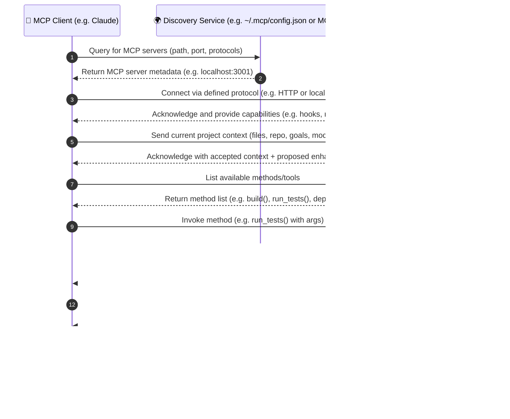
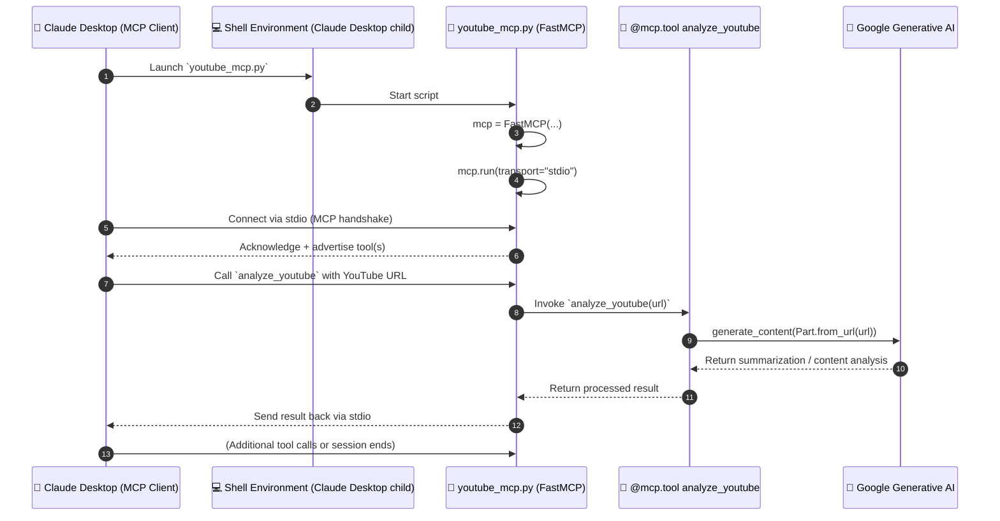
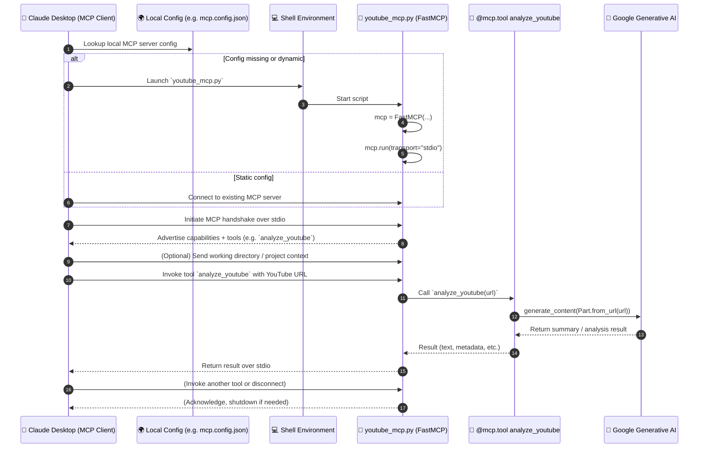

# MCP protocol overview

```mermaid

sequenceDiagram
    autonumber
    participant Client as 🧠 MCP Client (e.g. Claude)
    participant Discovery as 🌍 Discovery Service (e.g. ~/.mcp/config.json or MCP Registry)
    participant Server as 🛠️ MCP Server (your tool)

    %% Discovery Phase
    Client->>Discovery: Query for MCP servers (path, port, protocols)
    Discovery-->>Client: Return MCP server metadata (e.g. localhost:3001)

    %% Connection Phase
    Client->>Server: Connect via defined protocol (e.g. HTTP or local pipe)
    Server-->>Client: Acknowledge and provide capabilities (e.g. hooks, methods)

    %% Context Negotiation
    Client->>Server: Send current project context (files, repo, goals, model state)
    Server-->>Client: Acknowledge with accepted context + proposed enhancements

    %% Method Listing
    Client->>Server: List available methods/tools
    Server-->>Client: Return method list (e.g. build(), run_tests(), deploy())

    %% Invocation Phase
    Client->>Server: Invoke method (e.g. run_tests() with args)
    Server->>Server: Execute action or tool
    Server-->>Client: Return result (stdout, error, status, metadata)

    %% Optional Streaming / Subscriptions
    Client->>Server: Subscribe to events or state changes (optional)
    Server-->>Client: Stream updates (progress, logs)

    %% Cleanup Phase
    Client->>Server: Terminate session or disconnect
    Server-->>Client: Acknowledge disconnect

```

# YouTube / Gemini MCP Server

```mermaid
sequenceDiagram
    autonumber
    participant Claude as 🧠 Claude Desktop (MCP Client)
    participant Shell as 💻 Shell Environment (Claude Desktop child)
    participant MCPServer as 🐍 youtube_mcp.py (FastMCP)
    participant Tool as 🧩 @mcp.tool analyze_youtube
    participant GenAI as 🧠 Google Generative AI

    %% Startup Phase
    Claude->>Shell: Launch `youtube_mcp.py`
    Shell->>MCPServer: Start script
    MCPServer->>MCPServer: mcp = FastMCP(...)
    MCPServer->>MCPServer: mcp.run(transport="stdio")

    %% Connection Phase
    Claude->>MCPServer: Connect via stdio (MCP handshake)
    MCPServer-->>Claude: Acknowledge + advertise tool(s)

    %% Tool Invocation
    Claude->>MCPServer: Call `analyze_youtube` with YouTube URL

    %% Tool Dispatch
    MCPServer->>Tool: Invoke `analyze_youtube(url)`

    %% Backend Processing
    Tool->>GenAI: generate_content(Part.from_url(url))
    GenAI-->>Tool: Return summarization / content analysis

    %% Result Return
    Tool-->>MCPServer: Return processed result
    MCPServer-->>Claude: Send result back via stdio

    %% Optional Reuse
    Claude->>MCPServer: (Additional tool calls or session ends)

```

# Combined end to end

```mermaid
sequenceDiagram
    autonumber
    participant Claude as 🧠 Claude Desktop (MCP Client)
    participant Discovery as 🌍 Local Config (e.g. mcp.config.json)
    participant Shell as 💻 Shell Environment
    participant MCPServer as 🐍 youtube_mcp.py (FastMCP)
    participant Tool as 🧩 @mcp.tool analyze_youtube
    participant GenAI as 🧠 Google Generative AI

    %% Discovery and Launch Phase
    Claude->>Discovery: Lookup local MCP server config
    alt Config missing or dynamic
        Claude->>Shell: Launch `youtube_mcp.py`
        Shell->>MCPServer: Start script
        MCPServer->>MCPServer: mcp = FastMCP(...)
        MCPServer->>MCPServer: mcp.run(transport="stdio")
    else Static config
        Claude->>MCPServer: Connect to existing MCP server
    end

    %% Handshake and Registration
    Claude->>MCPServer: Initiate MCP handshake over stdio
    MCPServer-->>Claude: Advertise capabilities + tools (e.g. `analyze_youtube`)

    %% Context Sharing (Optional, if supported)
    Claude->>MCPServer: (Optional) Send working directory / project context

    %% Tool Invocation
    Claude->>MCPServer: Invoke tool `analyze_youtube` with YouTube URL

    %% Tool Dispatch
    MCPServer->>Tool: Call `analyze_youtube(url)`

    %% Tool Logic
    Tool->>GenAI: generate_content(Part.from_url(url))
    GenAI-->>Tool: Return summary / analysis result

    %% Return to Client
    Tool-->>MCPServer: Result (text, metadata, etc.)
    MCPServer-->>Claude: Return result over stdio

    %% Session Continuation or Exit
    Claude->>MCPServer: (Invoke another tool or disconnect)
    MCPServer-->>Claude: (Acknowledge, shutdown if needed)

```