# MCP YouTube/Gemini Integration - Presentation Slides

## Slide 1: MCP Protocol Overview

### How MCP Servers Connect and Communicate

```mermaid
%%{init: {
  'theme': 'base',
  'themeVariables': {
    'primaryColor': '#2563eb',
    'primaryTextColor': '#000000ff',
    'primaryBorderColor': '#1e40af',
    'lineColor': '#3b82f6',
    'secondaryColor': '#7c3aed',
    'tertiaryColor': '#10b981',
    'background': '#000000ff',
    'mainBkg': '#0f0000ff',
    'secondBkg': '#000204ff',
    'actorTextColor': '#1e293b',
    'actorBkg': '#e0e7ff',
    'actorBorder': '#6366f1',
    'activationBorderColor': '#3b82f6',
    'activationBkgColor': '#dbeafe',
    'sequenceNumberColor': '#000000ff',
    'noteBkgColor': '#fef3c7',
    'noteBorderColor': '#f59e0b'
  }
}}%%

sequenceDiagram
    participant Client as 🧠 MCP Client<br/>(Claude)
    participant Discovery as 🌍 Discovery<br/>Service
    participant Server as 🛠️ MCP Server<br/>(Your Tool)

    rect rgb(239, 246, 255)
        note over Client,Discovery: Discovery Phase
        Client->>Discovery: Find available servers
        Discovery-->>Client: Server location & protocol
    end

    rect rgb(237, 242, 255)
        note over Client,Server: Connection Phase
        Client->>Server: Connect
        activate Server
        Server-->>Client: Capabilities & methods
        deactivate Server
    end

    rect rgb(236, 253, 245)
        note over Client,Server: Execution Phase
        Client->>Server: Call method
        activate Server
        Server->>Server: Process
        Server-->>Client: Results
        deactivate Server
    end
```

# v1.1

---

## Slide 2: YouTube Analysis Flow

### From Claude to Gemini - Seamless Integration

```mermaid
%%{init: {
  'theme': 'base',
  'themeVariables': {
    'primaryColor': '#8b5cf6',
    'primaryTextColor': '#ffffff',
    'primaryBorderColor': '#7c3aed',
    'lineColor': '#a78bfa',
    'secondaryColor': '#ec4899',
    'tertiaryColor': '#06b6d4',
    'background': '#faf5ff',
    'mainBkg': '#ffffff',
    'secondBkg': '#f3e8ff',
    'actorTextColor': '#1e293b',
    'actorBkg': '#e9d5ff',
    'actorBorder': '#9333ea',
    'activationBorderColor': '#8b5cf6',
    'activationBkgColor': '#ede9fe',
    'sequenceNumberColor': '#ffffff'
  }
}}%%

sequenceDiagram
    participant User as 👤 User
    participant Claude as 🧠 Claude Desktop
    participant MCP as 🐍 YouTube MCP<br/>Server
    participant Gemini as ✨ Google<br/>Gemini AI

    User->>Claude: "Analyze this YouTube video"
    activate Claude
    
    Claude->>MCP: analyze_youtube(url)
    activate MCP
    
    MCP->>Gemini: Process video content
    activate Gemini
    
    Gemini->>Gemini: AI Analysis
    
    Gemini-->>MCP: Summary & insights
    deactivate Gemini
    
    MCP-->>Claude: Formatted results
    deactivate MCP
    
    Claude-->>User: Video analysis complete!
    deactivate Claude

    note over User,Gemini: 🚀 Fast, AI-powered video understanding
```

---

## Slide 3: Complete Integration Architecture

### End-to-End MCP + YouTube/Gemini Flow

```mermaid
%%{init: {
  'theme': 'base',
  'themeVariables': {
    'primaryColor': '#059669',
    'primaryTextColor': '#000000ff',
    'primaryBorderColor': '#047857',
    'lineColor': '#10b981',
    'secondaryColor': '#0891b2',
    'tertiaryColor': '#dc2626',
    'background': '#010703ff',
    'mainBkg': '#000000ff',
    'secondBkg': '#000302ff',
    'actorTextColor': '#064e3b',
    'actorBkg': '#d1fae5',
    'actorBorder': '#059669',
    'activationBorderColor': '#10b981',
    'activationBkgColor': '#d1fae5',
    'sequenceNumberColor': '#ffffff',
    'noteBkgColor': '#dbeafe',
    'noteBorderColor': '#2563eb'
  }
}}%%

sequenceDiagram
    participant Claude as 🧠 Claude
    participant Config as 📋 Config
    participant Shell as 💻 Shell
    participant MCP as 🐍 MCP Server
    participant Tool as 🎯 Tool
    participant AI as ✨ Gemini AI

    rect rgb(219, 234, 254)
        note over Claude,Shell: 🚀 Startup & Discovery
        Claude->>Config: Load MCP config
        Claude->>Shell: Launch server
        Shell->>MCP: Initialize
    end

    rect rgb(220, 252, 231)
        note over Claude,MCP: 🤝 Connection
        Claude->>MCP: Connect via stdio
        MCP-->>Claude: Ready with tools
    end

    rect rgb(254, 243, 199)
        note over Claude,AI: 🎬 Video Analysis
        Claude->>MCP: analyze_youtube(url)
        activate MCP
        MCP->>Tool: Process request
        activate Tool
        Tool->>AI: Analyze video
        activate AI
        AI-->>Tool: AI insights
        deactivate AI
        Tool-->>MCP: Formatted result
        deactivate Tool
        MCP-->>Claude: Analysis complete
        deactivate MCP
    end

    note over Claude,AI: ✅ Ready for next request
```

---

## Key Benefits for Presentation

### Visual Improvements Applied:

1. **Color-Coded Phases**: Each phase has distinct background colors for clarity
2. **Simplified Messages**: Shortened to key actions only
3. **Visual Hierarchy**: Important elements stand out with activation boxes
4. **Professional Palette**: Corporate-friendly colors that work on projectors
5. **Clear Sections**: Notes and rectangles group related actions
6. **Emoji Icons**: Visual markers for quick participant identification
7. **Clean Layout**: Removed technical details like line numbers

### Usage Tips:

- Each diagram fits on one slide
- High contrast for visibility
- Animations can be added in presentation software
- Colors are printer-friendly
- Works well in both light and dark presentation themes